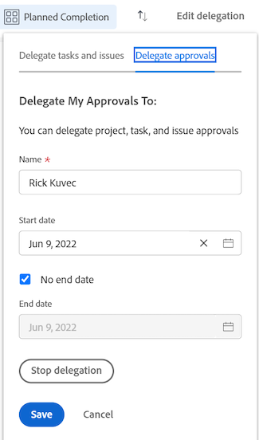

# Validierungsanfrage delegieren

Sie können die Arbeit, der Sie zugewiesen sind, während Sie nicht im Büro sind, vorübergehend delegieren. Sie können Aufgaben- und Problemzuweisungen delegieren oder Genehmigungsanfragen delegieren. In diesem Artikel wird beschrieben, wie Sie Genehmigungsanfragen delegieren. Informationen zum Delegieren von Aufgaben und Problemzuweisungen finden Sie unter [Verwalten der Aufgaben- und Problemzuweisung](../../manage-work/delegate-work/how-to-delegate-work.md).

Sie können die folgenden Arten von Genehmigungen delegieren, unabhängig davon, wie die Genehmigung Ihnen zugewiesen wurde (unabhängig davon, ob sie Ihnen direkt zugewiesen wurden, einem Team, dem Sie angehören, oder Ihrer beruflichen Rolle):

* Projektgenehmigungen
* Aufgabenvalidierungen
* Genehmigungen ausstellen

Sie können keine Zeitblatt-, Dokument- oder Testversandgenehmigungen delegieren.

>[!NOTE]
>
>Um sicherzustellen, dass keine Inkonsistenzen mit den Daten auftreten, die Sie für die Zuweisung Ihrer Genehmigungen planen, empfehlen wir, dass die Zeitzone Ihres Benutzerprofils mit der Ihres Zeitplans übereinstimmt. Weitere Informationen finden Sie in den folgenden Artikeln:
>
>* [Erstellen eines Zeitplans](../../administration-and-setup/set-up-workfront/configure-timesheets-schedules/create-schedules.md)
>* [Bearbeiten des Benutzerprofils](../../administration-and-setup/add-users/create-and-manage-users/edit-a-users-profile.md)
>

## Zugriffsanforderungen

Sie müssen über folgenden Zugriff verfügen, um die Schritte in diesem Artikel ausführen zu können:

<table style="table-layout:auto"> 
 <col> 
 </col> 
 <col> 
 </col> 
 <tbody> 
  <tr> 
   <td role="rowheader">
Adobe Workfront-Plan*
</td> 
   <td> 
Alle
 </td> 
  </tr> 
  <tr> 
   <td role="rowheader">
Adobe Workfront-Lizenz*
</td> 
   <td> 
Überprüfen oder höher
 </td> 
  </tr> 
 </tbody> 
</table>

&#42;Wenden Sie sich an Ihren Workfront-Administrator, um herauszufinden, welchen Plan oder welchen Lizenztyp Sie haben.

## Grundlegendes zum Benutzerzugriff für delegierte Genehmigungen

Während des festgelegten Genehmigungszeitraums hat der Benutzer, an den Sie eine Genehmigungsanfrage delegieren, die folgenden Möglichkeiten:

* Können bestehende Genehmigungsanfragen genehmigen oder ablehnen, wenn keine Entscheidung getroffen wurde
* Kann neue Validierungsanfragen, die in einem bestimmten Zeitraum empfangen wurden, genehmigen und ablehnen
* Ermöglicht Zugriff auf Objekte anzeigen, die auf die Genehmigung warten

  >[!NOTE]
  >
  > Der Adobe Workfront-Administrator kann den Zugriff auf bestimmte Objekttypen einschränken. Wenn ein Benutzer keinen Zugriff auf einen Objekttyp hat und eine Genehmigung dieses Typs an den Benutzer delegiert wird, hat der Benutzer keinen Zugriff auf Ansicht auf das Objekt. Der Benutzer kann jedoch weiterhin Genehmigungsanfragen von der Seite **Startseite** genehmigen oder ablehnen, wie unter [Arbeit validieren](../../review-and-approve-work/manage-approvals/approving-work.md) beschrieben.\
  >Beispielsweise gehört Benutzer A zu Gruppe A. Der Workfront-Administrator hat die Zugriffsrechte für Gruppe A eingeschränkt, sodass Benutzer dieser Gruppe Aufgaben in Workfront nicht anzeigen können. Wenn eine Aufgabengenehmigungsanforderung an Benutzer A delegiert wird, kann Benutzer A die Aufgabe, mit der die Genehmigung verknüpft ist, nicht anzeigen. Benutzer A kann die Genehmigungsanfrage jedoch auf der Startseite genehmigen oder ablehnen.

  Informationen dazu, wie der Workfront-Administrator den Zugriff auf Objekttypen in der Einrichtung beschränken kann, finden Sie unter  [Erstellen oder ändern Sie benutzerdefinierte Zugriffsebenen](../../administration-and-setup/add-users/configure-and-grant-access/create-modify-access-levels.md). 

Nachdem die Genehmigungsdelegierung beendet oder abgebrochen wurde, hat der Benutzer folgende Berechtigungen:

* Hat keinen Zugriff mehr auf die Genehmigung der Arbeit für Elemente, die genehmigt werden müssen
* Erhalten Sie weiterhin Zugriff auf Arbeitselemente anzeigen .\
  Benutzer, denen der Zugriff auf Objekte über eine Genehmigungsdelegation gewährt wurde, behalten den Zugriff auf die Option Anzeigen auch dann bei, wenn die Validierungsdelegation beendet oder zurückgerufen wird. Um den Zugriff auf alle Objekte anzeigen zu entfernen, auf die der Benutzer während der Zeit, in der die Genehmigungen delegiert wurden, Zugriff hatte, müssen Sie zum Objekt gehen und die Zugriffsrechte direkt vom Objekt entfernen.

## Delegieren von Genehmigungsanfragen im Startbereich

* [Delegieren Ihrer Genehmigungen an einen anderen Benutzer](#delegate-your-approvals-to-another-user)
* [Aktualisieren oder Anhalten einer Genehmigungsdelegierung](#update-or-stop-an-approval-delegation)
* [Delegierte Genehmigungen anzeigen](#view-delegated-approvals)

### Delegieren von Genehmigungen an einen anderen Benutzer {#delegate-your-approvals-to-another-user}

Sie können die folgenden Arten von Genehmigungen delegieren, unabhängig davon, wie die Genehmigung Ihnen zugewiesen wurde (unabhängig davon, ob sie Ihnen direkt zugewiesen wurden, einem Team, dem Sie angehören, oder Ihrer beruflichen Rolle):

* Projektgenehmigungen
* Aufgabenvalidierungen
* Genehmigungen ausstellen

Sie können keine Zeitblatt-, Dokument- oder Testversandgenehmigungen delegieren.

Beachten Sie beim Delegieren von Genehmigungen Folgendes:

* Wenn Sie Genehmigungen delegieren, werden alle Ihre Genehmigungen delegiert. Sie können keine individuellen Genehmigungsanfragen delegieren.
* Sie können Genehmigungen nur an einen Benutzer delegieren. Sie können Genehmigungen nicht gleichzeitig an mehrere Benutzer delegieren.\
  Alle Genehmigungen für alle Projekte, Aufgaben und Probleme werden an den Benutzer delegiert, den Sie bestimmen.
* Maximal 5 Benutzer können Genehmigungen gleichzeitig an denselben Benutzer delegieren. Mit anderen Worten: Ein einzelner Benutzer kann nicht für mehr als fünf Benutzer gleichzeitig als temporärer Genehmiger bestimmt werden.
* Die Aktivität bezüglich der Validierungen wird auf der Registerkarte Aktualisierungen angezeigt. Sie müssen Systemaktualisierungen anzeigen aktiviert haben. Sowohl der Benutzer, der die Validierung delegiert, als auch der Benutzer, dem Validierungen zugewiesen werden, erhalten eine E-Mail-Benachrichtigung zur Validierungsaktivität.

So delegieren Sie Genehmigungen an einen anderen Benutzer:

1. Klicken Sie oben links in Adobe Workfront auf das Symbol **Startseite**  .

   >[!NOTE]
   >
   >Ihr Workfront-Administrator kann die folgenden Änderungen am Startseiten-Symbol in Ihrer Umgebung vornehmen:
   >
   >* Ersetzen Sie sie durch ein Bild, das zur Veranschaulichung Ihrer Organisation angepasst wurde. In diesem Fall sieht das Symbol anders aus als in diesem Artikel.
   >* Ersetzen Sie die verknüpfte Seite durch eine andere Seite. Klicken Sie in diesem Fall auf das **Hauptmenü**  in der oberen rechten Ecke der Seite und klicken Sie dann auf **Startseite**.

   Oder

   Klicken Sie im linken Bereich auf das Symbol **Hauptmenü** > **Ihr Name** > **Ausschaltzeit** .

1. (Optional und bedingt) Klicken Sie im Startbereich auf das Dropdown-Menü **Filter** und dann auf **Genehmigungen**.

1. (Bedingt) Klicken Sie auf **Meine Genehmigungen delegieren**

   Oder

   Wenn Ihr System- oder Gruppenadministrator die Aufgabe und die Problemdelegierung aktiviert hat, klicken Sie auf **Delegieren** und dann auf **Delegieren von Genehmigungen**.

   

1. Geben Sie die folgenden Informationen im Abschnitt &quot;Meine Genehmigungen delegieren&quot;an:

   * **Name**: Beginnen Sie mit der Eingabe des Namens des Benutzers, an den Sie Genehmigungen delegieren möchten, und klicken Sie dann auf den Namen, wenn er im Dropdown-Menü angezeigt wird.
   * **Startdatum**: Wählen Sie das Datum aus, an dem die Weiterleitung der Validierungen beginnen soll. Die Weiterleitung beginnt um 12:00 Uhr des von Ihnen ausgewählten Datums.\
     Das Startdatum muss das aktuelle oder ein künftiges Datum sein.
   * **Enddatum**: Führen Sie einen der folgenden Schritte aus:

      * Wählen Sie das Datum aus, an dem die Weiterleitung der Validierungen beendet werden soll. Die Weiterleitung endet um 11:59 Uhr an dem von Ihnen ausgewählten Datum.
      * Wählen Sie **Kein Enddatum** aus, um Workfront so zu konfigurieren, dass Genehmigungen unbegrenzt delegiert werden.

1. Klicken Sie auf **Speichern**.

### Validierungsdelegationen aktualisieren oder stoppen {#update-or-stop-an-approval-delegation}

1. Klicken Sie oben links in Adobe Workfront auf das Symbol **Startseite**  .

   >[!NOTE]
   >
   >Ihr Workfront-Administrator kann die folgenden Änderungen am Startseiten-Symbol in Ihrer Umgebung vornehmen:
   >
   >* Ersetzen Sie sie durch ein Bild, das zur Veranschaulichung Ihrer Organisation angepasst wurde. In diesem Fall sieht das Symbol anders aus als in diesem Artikel.
   >* Ersetzen Sie die verknüpfte Seite durch eine andere Seite. Klicken Sie in diesem Fall auf das **Hauptmenü**  in der oberen rechten Ecke der Seite und klicken Sie dann auf **Startseite**.

1. Klicken Sie auf das Dropdown-Menü **Filter** und dann auf **Genehmigungen**.

1. (Bedingt) Klicken Sie auf **Delegation bearbeiten** .

   Oder

   Wenn Ihr System- oder Gruppenadministrator die Aufgabe aktiviert hat und die Zuweisung von Aufgaben ausgibt, klicken Sie auf **Delegation bearbeiten** und dann auf **Genehmigungen delegieren**.

1. (Bedingt) Führen Sie einen der folgenden Schritte aus:

   * Um die vorhandene Genehmigungsdelegierung zu aktualisieren: Ändern Sie die angezeigten Informationen und klicken Sie auf **Speichern**.

   * Um die vorhandene Zuweisung zu stoppen: Klicken Sie auf **Delegierung stoppen** und dann zur Bestätigung auf **Delegierung stoppen** .

     

### Delegierte Genehmigungen anzeigen {#view-delegated-approvals}

Sie können nur die folgenden Arten von Genehmigungsdelegationen in der Arbeitsliste anzeigen:

* Projektgenehmigungen
* Aufgabenvalidierungen
* Genehmigungen ausstellen

So zeigen Sie delegierte Genehmigungen an:

1. Klicken Sie oben links in Adobe Workfront auf das Symbol **Startseite**  .

   >[!NOTE]
   >
   >Ihr Workfront-Administrator kann die folgenden Änderungen am Startseiten-Symbol in Ihrer Umgebung vornehmen:
   >
   >* Ersetzen Sie sie durch ein Bild, das zur Veranschaulichung Ihrer Organisation angepasst wurde. In diesem Fall sieht das Symbol anders aus als in diesem Artikel.
   >* Ersetzen Sie die verknüpfte Seite durch eine andere Seite. Klicken Sie in diesem Fall auf das **Hauptmenü**  in der oberen rechten Ecke der Seite und klicken Sie dann auf **Startseite**.

1. Klicken Sie auf das Dropdown-Menü **Filter** und dann auf **Genehmigungen**.\
   Alle Genehmigungen werden standardmäßig in der Liste angezeigt, einschließlich der Ihnen zugewiesenen Genehmigungen und der Ihnen zugewiesenen Genehmigungen.

   
