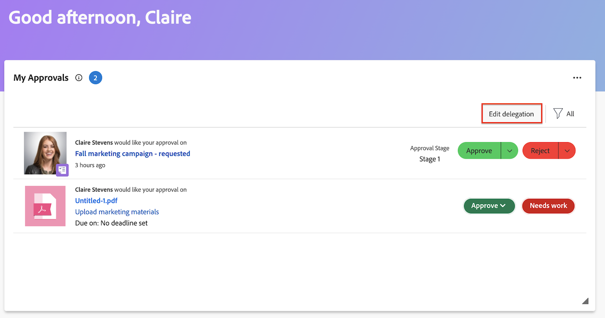

# Genehmigungsanforderung delegieren

Sie können die Ihnen zugewiesene Arbeit vorübergehend delegieren, während Sie abwesend sind. Sie können Aufgaben- und Problemzuweisungen oder Genehmigungsanfragen delegieren. In diesem Artikel wird beschrieben, wie Sie Genehmigungsanforderungen delegieren. Informationen zum Delegieren von Aufgaben- und Problemzuweisungen finden Sie unter [Delegieren von Aufgaben und Problemen](../../manage-work/delegate-work/how-to-delegate-work.md).

Sie können die folgenden Arten von Genehmigungen delegieren, unabhängig davon, wie die Genehmigung Ihnen zugewiesen wurde (unabhängig davon, ob sie direkt Ihnen, einem Team, dem Sie angehören, oder Ihrem Aufgabengebiet zugewiesen wurden):

* Projektgenehmigungen
* Aufgabengenehmigungen
* Genehmigungen erteilen

Sie können keine Genehmigungen für Arbeitszeittabellen, Dokumente oder Korrekturabzüge delegieren.

>[!NOTE]
>
>Um sicherzustellen, dass es nicht zu Inkonsistenzen mit den Daten kommt, die Sie für die Delegierung Ihrer Genehmigungen planen, empfehlen wir, dass die Zeitzone Ihres Benutzerprofils mit der Ihres Zeitplans übereinstimmt. Weitere Informationen finden Sie in den folgenden Artikeln:
>
>* [Zeitplan erstellen](../../administration-and-setup/set-up-workfront/configure-timesheets-schedules/create-schedules.md)
>* [Benutzerprofil bearbeiten](../../administration-and-setup/add-users/create-and-manage-users/edit-a-users-profile.md)
>

## Zugriffsanforderungen

+++ Erweitern Sie , um die Zugriffsanforderungen für die -Funktion in diesem Artikel anzuzeigen.

Sie müssen über folgenden Zugriff verfügen, um die Schritte in diesem Artikel ausführen zu können:

<table style="table-layout:auto"> 
 <col> 
 </col> 
 <col> 
 </col> 
 <tbody> 
  <tr> 
   <td role="rowheader">
Adobe Workfront-Plan*
</td> 
   <td> 
Beliebig
 </td> 
  </tr> 
  <tr> 
   <td role="rowheader">
Adobe Workfront-Lizenz*
</td> 
   <td> 
Überprüfen oder höher
 </td> 
  </tr> 
 </tbody> 
</table>

Wenden Sie sich an Ihren Workfront-Administrator, um zu erfahren, welchen Plan oder Lizenztyp Sie haben.

+++

## Grundlegendes zum Benutzerzugriff für delegierte Genehmigungen

Während des festgelegten Genehmigungszeitraums hat der Benutzer, an den Sie eine Genehmigungsanfrage delegieren, die folgenden Fähigkeiten:

* Kann vorhandene Genehmigungsanforderungen genehmigen oder ablehnen, wenn keine Entscheidung getroffen wurde
* Kann neue Genehmigungsanforderungen, die innerhalb eines bestimmten Zeitraums empfangen werden, genehmigen und ablehnen
* Hat Ansichtszugriff auf Objekte, die auf Genehmigung warten

  >[!NOTE]
  >
  > Der Adobe Workfront-Administrator kann den Zugriff von Benutzenden auf bestimmte Objekttypen einschränken. Wenn ein(e) Benutzende(r) keinen Zugriff auf einen Objekttyp hat und dem/r Benutzenden eine Genehmigung dieses Typs delegiert wird, hat der/die Benutzende keinen Lesezugriff auf das Objekt. Der Benutzer kann jedoch weiterhin Genehmigungsanfragen von der Seite **Startseite“ genehmigen oder**, wie unter &quot;[ Arbeit“ ](../../review-and-approve-work/manage-approvals/approving-work.md).\
  >Beispiel: Benutzer A gehört zu Gruppe A. Der Workfront-Administrator hat die Zugriffsrechte von Gruppe A eingeschränkt, sodass Benutzende in dieser Gruppe keine Aufgaben in Workfront sehen können. Wenn eine Aufgabengenehmigungsanfrage an einen Benutzer delegiert wird, kann Benutzer A die Aufgabe, mit der die Genehmigung verknüpft ist, nicht anzeigen. Benutzer A kann jedoch die Genehmigungsanfrage von der Startseite aus genehmigen oder ablehnen.

  Informationen dazu, wie der Workfront-Administrator den Zugriff auf Objekttypen in Setup beschränken kann, finden Sie unter  [Erstellen oder Ändern benutzerdefinierter Zugriffsebenen](../../administration-and-setup/add-users/configure-and-grant-access/create-modify-access-levels.md). 

Nachdem die Delegierung der Genehmigung gestoppt oder abgebrochen wurde, hat der Benutzer als genehmigende Person angegeben:

* hat keinen Zugriff mehr auf die Genehmigung von Arbeiten für Elemente, die eine Genehmigung erfordern
* Hat weiterhin Ansichtszugriff auf Arbeitselemente\
  Benutzende, denen über eine Genehmigungsdelegierung Ansichtszugriff auf Objekte gewährt wurde, behalten diesen Ansichtszugriff selbst dann, wenn die Genehmigungsdelegierung beendet oder zurückgerufen wird. Um den Ansichtszugriff auf alle Objekte zu entfernen, auf die der Benutzer während der Zeit, in der Genehmigungen delegiert wurden, Zugriff hatte, müssen Sie zum -Objekt gehen und Zugriffsrechte direkt aus dem -Objekt entfernen.

## Delegieren Ihrer Genehmigungen an einen anderen Benutzer {#delegate-your-approvals-to-another-user}

Sie können die folgenden Arten von Genehmigungen delegieren, unabhängig davon, wie die Genehmigung Ihnen zugewiesen wurde (unabhängig davon, ob sie direkt Ihnen, einem Team, dem Sie angehören, oder Ihrem Aufgabengebiet zugewiesen wurden):

* Projektgenehmigungen
* Aufgabengenehmigungen
* Genehmigungen erteilen

Sie können keine Genehmigungen für Arbeitszeittabellen, Dokumente oder Korrekturabzüge delegieren.

Beachten Sie beim Delegieren von Genehmigungen Folgendes:

* Wenn Sie Genehmigungen delegieren, werden alle Ihre Genehmigungen delegiert. Einzelne Genehmigungsanforderungen können nicht delegiert werden.
* Sie können Genehmigungen nur an einen Benutzer delegieren. Genehmigungen können nicht gleichzeitig an mehrere Benutzer delegiert werden.\
  Alle Genehmigungen für alle Projekte, Aufgaben und Probleme werden an den von Ihnen bestimmten Benutzer delegiert.
* Maximal 5 Benutzer können gleichzeitig Genehmigungen an denselben Benutzer delegieren. Mit anderen Worten: Ein einzelner Benutzer kann nicht als temporäre genehmigende Person für mehr als 5 Benutzer gleichzeitig benannt werden.
* Auf der Registerkarte Aktualisierungen wird eine Aktivität bezüglich Validierungen angezeigt. Sie müssen „Systemaktualisierungen anzeigen“ aktiviert haben. Sowohl der Benutzer, der die Genehmigung delegiert, als auch der Benutzer, an den die Genehmigungen delegiert werden, erhalten eine E-Mail-Benachrichtigung bezüglich der Genehmigungsaktivität.

### Delegieren von Genehmigungen aus dem Bereich Startseite

So delegieren Sie Genehmigungen an einen anderen Benutzer:

1. Klicken Sie oben rechts auf **[!UICONTROL Hauptmenü]**  und dann auf **[!UICONTROL Startseite]**.
1. (Bedingt) Klicken Sie auf **Anpassen**, um das Widget **Meine Genehmigungen** hinzuzufügen.
1. Gehen Sie zum Widget Meine Genehmigungen und klicken Sie auf **Meine Genehmigungen delegieren**.

   >[!NOTE]
   >
   >Workfront-Admins können die Delegierung von Genehmigungen über den Bereich „Setup“ deaktivieren. Wenn die Delegierung von Genehmigungen deaktiviert ist, wird die Schaltfläche Genehmigungen delegieren nicht angezeigt.

   

1. Geben Sie im Abschnitt „Meine Genehmigungen delegieren“ folgende Informationen an:

   * **Name**: Geben Sie den Namen des Benutzers ein, an den Sie Genehmigungen delegieren möchten, und klicken Sie auf den Namen, wenn er im Dropdown-Menü angezeigt wird.
   * **Startdatum**: Wählen Sie das Datum aus, an dem Genehmigungen weitergeleitet werden. Die Weiterleitung beginnt um 12 :00 Uhr an dem von Ihnen ausgewählten Datum.\
     Das Startdatum muss das aktuelle Datum oder ein Datum in der Zukunft sein.
   * **Enddatum**: Führen Sie einen der folgenden Schritte aus:
      * Wählen Sie das Datum aus, an dem Genehmigungen nicht mehr weitergeleitet werden sollen. Die Weiterleitung endet um :59 Uhr an dem von Ihnen ausgewählten Datum.
      * Wählen Sie **Kein Enddatum** aus, um Workfront so zu konfigurieren, dass Genehmigungen auf unbestimmte Zeit delegiert werden.

1. Klicken Sie auf **Speichern**.

### Delegieren von Genehmigungen von Ihrem Benutzerprofil

1. Klicken Sie auf das **Hauptmenü**-Symbol > **Ihr Name** > **Urlaub** im linken Bereich.
1. Klicken Sie **Genehmigungen delegieren**.

   >[!NOTE]
   >
   >Workfront-Admins können die Delegierung von Genehmigungen über den Bereich „Setup“ deaktivieren. Wenn die Delegierung von Genehmigungen deaktiviert ist, wird die Schaltfläche Genehmigungen delegieren nicht angezeigt.

1. Geben Sie im Abschnitt „Meine Genehmigungen delegieren“ folgende Informationen an:

   * **Name**: Geben Sie den Namen des Benutzers ein, an den Sie Genehmigungen delegieren möchten, und klicken Sie auf den Namen, wenn er im Dropdown-Menü angezeigt wird.
   * **Startdatum**: Wählen Sie das Datum aus, an dem Genehmigungen weitergeleitet werden. Die Weiterleitung beginnt um 12 :00 Uhr an dem von Ihnen ausgewählten Datum.\
     Das Startdatum muss das aktuelle Datum oder ein Datum in der Zukunft sein.
   * **Enddatum**: Führen Sie einen der folgenden Schritte aus:
      * Wählen Sie das Datum aus, an dem Genehmigungen nicht mehr weitergeleitet werden sollen. Die Weiterleitung endet um :59 Uhr an dem von Ihnen ausgewählten Datum.
      * Wählen Sie **Kein Enddatum** aus, um Workfront so zu konfigurieren, dass Genehmigungen auf unbestimmte Zeit delegiert werden.

## Aktualisieren oder Beenden einer Genehmigungsdelegierung {#update-or-stop-an-approval-delegation}

1. Klicken Sie oben rechts auf **[!UICONTROL Hauptmenü]**  und dann auf **[!UICONTROL Startseite]**.
1. (Bedingt) Klicken Sie auf **Anpassen**, um das Widget **Meine Genehmigungen** hinzuzufügen.

1. Gehen Sie zum Widget Meine Genehmigungen und klicken Sie dann auf **Delegierung bearbeiten**.
   
<!--
   Or

   If your system or group administrator enabled task and issue delegation, click **Edit delegation**, then click **Delegate approvals**.   -->

1. (Bedingt) Führen Sie einen der folgenden Schritte aus:

   * So aktualisieren Sie die vorhandene Genehmigungsdelegierung: Ändern Sie die angezeigten Informationen und klicken Sie dann auf **Speichern**.

   * So stoppen Sie die vorhandene Delegierung: Klicken Sie auf **Delegierung stoppen** und klicken Sie dann zur Bestätigung **Delegierung** Beenden“.

## Delegierte Genehmigungen anzeigen {#view-delegated-approvals}

Im Widget Meine Genehmigungen können Sie nur die folgenden Arten von Genehmigungsdelegierungen anzeigen:

* Projektgenehmigungen
* Aufgabengenehmigungen
* Genehmigungen erteilen

So zeigen Sie delegierte Genehmigungen an:

1. Klicken Sie oben rechts auf **[!UICONTROL Hauptmenü]**  und dann auf **[!UICONTROL Startseite]**.
1. (Bedingt) Klicken Sie auf **Anpassen**, um das Widget **Meine Genehmigungen** hinzuzufügen.
1. Klicken Sie im **Meine Genehmigungen** auf das Dropdown-Menü **Filter** und dann auf **Delegierte Genehmigungen**.\
   Alle an Sie delegierten Genehmigungen werden in der Liste angezeigt.
