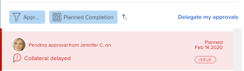

# Gesendete Genehmigungen zurückrufen

Sie können die folgenden Objekte, die zur Genehmigung eingereicht wurden, zurückrufen:

* Projekte
* Aufgaben
* Probleme
* Arbeitszeit- tabellen
* Dokumente
* Alle Anforderungen

## Zugriffsanforderungen

+++ Erweitern Sie , um die Zugriffsanforderungen für die -Funktion in diesem Artikel anzuzeigen.

Sie müssen über folgenden Zugriff verfügen, um die Schritte in diesem Artikel ausführen zu können:

<table style="table-layout:auto"> 
 <col> 
 <col> 
 <tbody> 
  <tr> 
   <td role="rowheader">Adobe Workfront-Plan*</td> 
   <td> 
Beliebig
 </td> 
  </tr> 
  <tr> 
   <td role="rowheader">Adobe Workfront-Lizenz*</td> 
   <td> 
Anfrage oder höher
 </td> 
  </tr> 
  <tr> 
   <td role="rowheader">Konfigurationen der Zugriffsebene*</td> 
   <td> 
Anzeigen oder Erhöhen des Zugriffs auf Projekte, Aufgaben, Probleme, Arbeitszeittabellen, Dokumente
 
Hinweis: Wenn Sie immer noch keinen Zugriff haben, fragen Sie Ihren Workfront-Administrator, ob er zusätzliche Einschränkungen in Ihrer Zugriffsebene festgelegt hat. Informationen dazu, wie Workfront-Admins Ihre Zugriffsebene ändern können, finden Sie unter <a href="../../administration-and-setup/add-users/configure-and-grant-access/create-modify-access-levels.md" class="MCXref xref">Erstellen oder Ändern benutzerdefinierter Zugriffsebenen</a>.
 </td> 
  </tr> 
  <tr> 
   <td role="rowheader">Objektberechtigungen</td> 
   <td> 
Zugriff auf das mit der Genehmigung verknüpfte Objekt anzeigen oder höher 
 
Informationen zum Anfordern zusätzlicher Zugriffsberechtigungen finden Sie unter <a href="../../workfront-basics/grant-and-request-access-to-objects/request-access.md" class="MCXref xref">Anfordern von Zugriffsberechtigungen für Objekte </a>.
 </td> 
  </tr> 
 </tbody> 
</table>

Wenden Sie sich an Ihren Workfront-Administrator, um herauszufinden, über welchen Plan, welchen Lizenztyp oder welchen Zugriff Sie verfügen.

+++

## Projekte

Wenn Sie eine Projektgenehmigung zurückrufen, kehrt das Projekt zu dem Status zurück, in dem es sich vor der Initiierung des Genehmigungsprozesses befand.

Wenn Sie eine Genehmigung zurückrufen, die mit dem Anfangsstatus des Projekts verknüpft ist, wird der Genehmigungsprozess umgangen und das Projekt verbleibt im Anfangsstatus.

>[!NOTE]
>
>Sie können den ersten Status eines Projekts oder einer Aufgabe mithilfe einer Vorlage mit einem Genehmigungsprozess verknüpfen. Weitere Informationen zum Hinzufügen von Genehmigungen zu Vorlagen finden Sie unter  [Projektvorlagen bearbeiten](../../manage-work/projects/create-and-manage-templates/edit-templates.md).

So rufen Sie eine von Ihnen gesendete Projektgenehmigung ab:

1. Klicken Sie auf **Startseite**-Symbol  in der linken oberen Ecke von Adobe Workfront.

   >[!NOTE]
   >
   >Ihr Workfront-Administrator kann die folgenden Änderungen am Startseiten-Symbol in Ihrer Umgebung vornehmen:
   >
   >* Ersetzen Sie sie durch ein Bild, das Ihre Organisation illustriert. In diesem Fall sieht das Symbol anders aus als in diesem Artikel gezeigt.
   >* Ersetzen Sie die damit verknüpfte Seite durch eine andere Seite. Klicken Sie in diesem Fall auf **Hauptmenü**  in der oberen rechten Ecke der Seite und dann auf **Startseite**.

1. Navigieren **im Bereich** Arbeitsliste“ zur Gruppierung **Genehmigungen, die ich** habe“.

1. Klicken Sie in **Arbeitsliste auf** Projekt“-Genehmigung.

   Dadurch wird das Projekt rechts neben der Arbeitsliste geöffnet.

   

1. Klicken **oben rechts** Bereich auf „Rückruf“.

## Aufgaben

Wenn Sie eine Aufgabengenehmigung zurückrufen, kehrt die Aufgabe zu dem Status zurück, in dem sie vor der Initiierung des Genehmigungsprozesses war.

Wenn Sie eine Genehmigung zurückrufen, die mit dem Anfangsstatus der Aufgabe verknüpft ist, wird der Genehmigungsprozess umgangen und die Aufgabe verbleibt im Anfangsstatus.

>[!NOTE]
>
>Sie können den ersten Status eines Projekts oder einer Aufgabe mithilfe einer Vorlage mit einem Genehmigungsprozess verknüpfen. Weitere Informationen zum Hinzufügen von Genehmigungen zu Vorlagen finden Sie unter [Projektvorlagen bearbeiten](../../manage-work/projects/create-and-manage-templates/edit-templates.md).

So rufen Sie eine von Ihnen gesendete Aufgabengenehmigung ab:

1. Klicken Sie auf **Startseite**-Symbol  in der linken oberen Ecke von Adobe Workfront.

   >[!NOTE]
   >
   >Ihr Workfront-Administrator kann die folgenden Änderungen am Startseiten-Symbol in Ihrer Umgebung vornehmen:
   >
   >* Ersetzen Sie sie durch ein Bild, das Ihre Organisation illustriert. In diesem Fall sieht das Symbol anders aus als in diesem Artikel gezeigt.
   >* Ersetzen Sie die damit verknüpfte Seite durch eine andere Seite. Klicken Sie in diesem Fall auf **Hauptmenü**  in der oberen rechten Ecke der Seite und dann auf **Startseite**.

1. Navigieren **im Bereich** Arbeitsliste“ zur Gruppierung **Genehmigungen, die ich** habe“.

1. Klicken Sie in **Arbeitsliste auf** Aufgabe“-Genehmigung.

   Dadurch wird die Aufgabe rechts neben der Arbeitsliste geöffnet.

   

1. Klicken **oben rechts** Bereich auf „Rückruf“.

## Probleme

Wenn Sie eine Problemgenehmigung zurückrufen, kehrt das Problem zu dem Status zurück, in dem es sich vor der Initiierung des Genehmigungsprozesses befand.

Wenn Sie sich an eine Genehmigung erinnern, die mit dem Anfangsstatus des Problems verknüpft ist, wird der Genehmigungsprozess umgangen und das Problem verbleibt im Anfangsstatus.

>[!NOTE]
>
>Sie können den ersten Status eines Problems mithilfe einer Vorlage mit einem Genehmigungsprozess verknüpfen. Weitere Informationen zum Erstellen einer Anfrage-Warteschlange finden Sie unter [Erstellen einer Anfrage-Warteschlange](../../manage-work/requests/create-and-manage-request-queues/create-request-queue.md).

1. Klicken Sie auf **Startseite**-Symbol  in der linken oberen Ecke von Adobe Workfront.

   >[!NOTE]
   >
   >Ihr Workfront-Administrator kann die folgenden Änderungen am Startseiten-Symbol in Ihrer Umgebung vornehmen:
   >
   >* Ersetzen Sie sie durch ein Bild, das Ihre Organisation illustriert. In diesem Fall sieht das Symbol anders aus als in diesem Artikel gezeigt.
   >* Ersetzen Sie die damit verknüpfte Seite durch eine andere Seite. Klicken Sie in diesem Fall auf **Hauptmenü**  in der oberen rechten Ecke der Seite und dann auf **Startseite**.

1. Navigieren **im Bereich** Arbeitsliste“ zur Gruppierung **Genehmigungen, die ich** habe“.

1. Klicken Sie auf **Problem**-Genehmigung in der Arbeitsliste.

   Dadurch wird das Problem rechts neben der Arbeitsliste geöffnet.

   

1. Klicken **oben rechts** Bereich auf „Rückruf“.

## Arbeitszeit- tabellen

Wenn Sie eine Arbeitszeittabellen-Genehmigung zurückrufen, kehrt die Arbeitszeittabelle zu dem Status zurück, in dem sie sich befand, bevor sie zur Genehmigung eingereicht wurde.

1. Klicken Sie auf **Startseite**-Symbol  in der linken oberen Ecke von Adobe Workfront.

   >[!NOTE]
   >
   >Ihr Workfront-Administrator kann die folgenden Änderungen am Startseiten-Symbol in Ihrer Umgebung vornehmen:
   >
   >* Ersetzen Sie sie durch ein Bild, das Ihre Organisation illustriert. In diesem Fall sieht das Symbol anders aus als in diesem Artikel gezeigt.
   >* Ersetzen Sie die damit verknüpfte Seite durch eine andere Seite. Klicken Sie in diesem Fall auf **Hauptmenü**  in der oberen rechten Ecke der Seite und dann auf **Startseite**.

1. Navigieren **im Bereich** Arbeitsliste“ zur Gruppierung **Genehmigungen, die ich** habe“.

1. Klicken Sie in **Arbeitsliste auf** Arbeitszeittabellen-Genehmigung“.

   Dadurch wird die Arbeitszeittabelle rechts neben der Arbeitsliste geöffnet.

   

1. Klicken **oben rechts** Bereich auf „Rückruf“.

## Dokumente

Um eine Dokumentengenehmigung zurückzurufen, müssen Sie einen oder alle Benutzer manuell aus der Genehmigung entfernen.

1. Klicken Sie auf **Startseite**-Symbol  in der linken oberen Ecke von Adobe Workfront.

   >[!NOTE]
   >
   >Ihr Workfront-Administrator kann die folgenden Änderungen am Startseiten-Symbol in Ihrer Umgebung vornehmen:
   >
   >* Ersetzen Sie sie durch ein Bild, das Ihre Organisation illustriert. In diesem Fall sieht das Symbol anders aus als in diesem Artikel gezeigt.
   >* Ersetzen Sie die damit verknüpfte Seite durch eine andere Seite. Klicken Sie in diesem Fall auf **Hauptmenü**  in der oberen rechten Ecke der Seite und dann auf **Startseite**.

1. Navigieren **im Bereich** Arbeitsliste“ zur Gruppierung **Genehmigungen, die ich** habe“.

1. Klicken Sie in **Arbeitsliste auf** Dokument“-Genehmigung.

   Dadurch wird das Dokument rechts neben der Arbeitsliste geöffnet.

   

1. Klicken **oben** im rechten Bedienfeld auf „Genehmigungen verwalten“. Dadurch wird das Feld Genehmigungen verwalten geöffnet.
1. Klicken Sie auf **Symbol** Entfernen“, das den Namen eines Benutzers im Feld Genehmigungen verwalten enthält. Entfernen Sie alle Benutzer, um die Dokumentgenehmigung vollständig zurückzurufen.

   

## Alle Anforderungen

1. Klicken Sie auf **Startseite**-Symbol  in der linken oberen Ecke von Adobe Workfront.

   >[!NOTE]
   >
   >Ihr Workfront-Administrator kann die folgenden Änderungen am Startseiten-Symbol in Ihrer Umgebung vornehmen:
   >
   >* Ersetzen Sie sie durch ein Bild, das Ihre Organisation illustriert. In diesem Fall sieht das Symbol anders aus als in diesem Artikel gezeigt.
   >* Ersetzen Sie die damit verknüpfte Seite durch eine andere Seite. Klicken Sie in diesem Fall auf **Hauptmenü**  in der oberen rechten Ecke der Seite und dann auf **Startseite**.

1. Navigieren **im Bereich** Arbeitsliste“ zur Gruppierung **Genehmigungen, die ich** habe“.

1. Klicken Sie in **Arbeitsliste auf** Zugriffsanforderung“.

   Dadurch wird die Zugriffsanfrage rechts neben der Arbeitsliste geöffnet.

   

1. Klicken **oben rechts** Bereich auf „Rückruf“.
