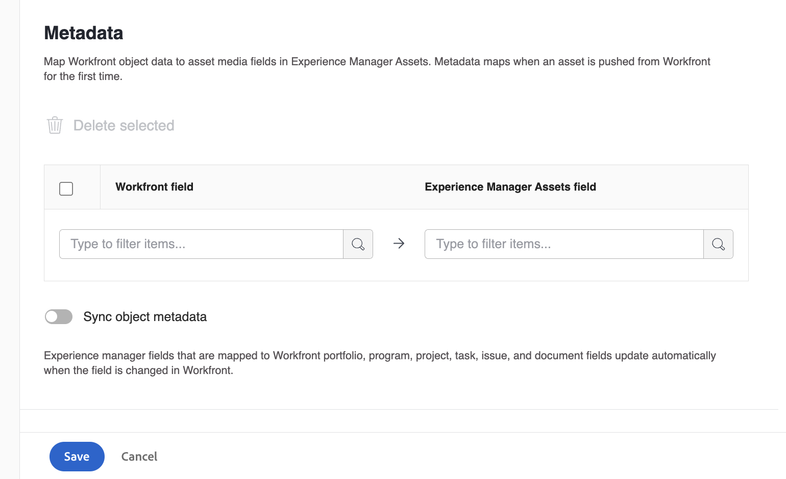

# Verwenden von Adobe Experience Manager mit Workfront und Adobe Cloud Storage

Sie können die [!DNL Experience Manager Assets]&#x200B; verwenden, um Ihre digitalen Assets zu verwalten und zu speichern, die den Überprüfungs- und Genehmigungszyklus durchlaufen haben. Durch diese Integration können Sie die Funktionen von Adobe Experience Manager, Frame.io und Workfront nutzen, um Ihr Content-Management und Ihre Zusammenarbeitsprozesse zu optimieren.

## Konfigurieren der Experience Manager Assets-Integration

Sie können Ihre Arbeit mit Ihren Inhalten in [!DNL Experience Manager Assets] verbinden&#x200B;:

* Pushen von Assets und Metadaten von [!DNL Adobe Workfront] nach [!DNL Experience Manager Assets]&#x200B;
* Anwendungsfälle für die Versionierung vereinfachen
* Nachverfolgen von Metadaten für Assets
* Synchronisieren von Projektmetadaten zwischen [!DNL Workfront] und [!DNL Experience Manager Assets]

>[!NOTE]
>
>Sie können auch mehrere [!DNL Experience Manager Assets]-Repositorys mit einer [!UICONTROL Workfront]-Umgebung oder mehrere [!DNL Workfront]-Umgebungen über Organisations-IDs hinweg mit einem [!DNL Experience Manager Assets]-Repository verbinden. Befolgen Sie die Konfigurationsanweisungen in diesem Artikel für jede Integration, die Sie einrichten möchten.

## Zugriffsanforderungen

+++ Erweitern, um die Zugriffsanforderungen für die in diesem Artikel beschriebene Funktionalität anzuzeigen.

<table>
  <tr>
   <td>Adobe Workfront-Paket
   </td>
   <td> 
Prime oder Ultimate

    
Workflow Ultimate

   </td>
  </tr>
    <tr>
   <td>Adobe Workfront-Lizenzen
   </td>
   <td>
  
So konfigurieren Sie die Integration:

   
Standard

   
Abo

So senden Sie Dokumente an Experience Manager Assets:

   
Mitwirkende oder höher

   
Anfragende oder höher

   </td>
  </tr>
  </tr>
    <tr>
   <td>Adobe Experience Manager-Lizenzen
   </td>
   <td>Standard
   </td>
  </tr>
  <tr>
   <td>Zusätzliche Produkte
   </td>
   <td>Sie müssen über [!DNL Experience Manager Assets as a Cloud Service] verfügen und als Benutzer zum Produkt hinzugefügt werden.
   </td>
  </tr>
   <tr>
   <td>Konfigurationen der Zugriffsebene
   </td>
   <td>Sie müssen [!DNL Workfront] sein.
   </td>
  </tr>
</table>

Weitere Details zu den Informationen in dieser Tabelle finden Sie unter [Zugriffsanforderungen in der Dokumentation zu Workfront](/help/quicksilver/administration-and-setup/add-users/access-levels-and-object-permissions/access-level-requirements-in-documentation.md).

+++

## Voraussetzungen

Bevor Sie beginnen,

* Sie müssen über [!DNL Workfront] und [!DNL Adobe Experience Manager Assets] verfügen, die mit einer Organisations-ID im [!DNL Adobe Admin Console] verknüpft sind. Weitere Informationen finden Sie unter [Unterschiede bei der plattformbasierten Administration ([!DNL Adobe Workfront]/[!DNL Adobe Business Platform])](/help/quicksilver/administration-and-setup/get-started-wf-administration/actions-in-admin-console.md).
* Ihre Workfront-Instanz muss den Adobe-Cloud-Speicher verwenden.

## Einrichten der Integrationsinformationen

{{step-1-to-setup}}

1. Wählen **[!UICONTROL im linken]** „Dokumente“ und dann **[!UICONTROL [!DNL Experience Manager]Integration]**.
1. Wählen **[!UICONTROL Integration [!DNL Experience Manager] hinzufügen]**.
1. Geben Sie im Feld **[!UICONTROL Name]** den Namen ein, den Benutzer sehen sollen, wenn sie mit dieser Integration in Workfront und Experience Manager Assets interagieren.
1. Im Feld **[!UICONTROL Navigations-URL]** füllt das System automatisch die Navigations-URL. Diese schreibgeschützte URL wird verwendet, um über das Hauptmenü eine Verknüpfung mit der [!DNL Experience Manager]-Instanz Ihrer Organisation [!UICONTROL  erstellen] um Schnellzugriff zu erhalten.
1. Wählen Sie ein Repository aus dem Dropdown-Menü **[!UICONTROL [!DNL Experience Manager]Assets]** Repository aus. Das System füllt automatisch alle [!DNL Experience Manager]-Repositorys, die mit der Organisations-ID verknüpft sind, der Ihr Benutzerprofil zugewiesen ist.
   

1. Klicken Sie **[!UICONTROL Speichern]** oder gehen Sie zum Abschnitt [Einrichten von Metadaten (Optional](#set-up-metadata-optional) in diesem Artikel.

   >[!IMPORTANT]
   >
   >Aufgrund der Komplexität der Integration können Sie das Repository nach dem Speichern der ersten Konfiguration nicht mehr ändern.

## Einrichten von Metadaten (optional)

Sie können [!DNL Workfront] Objektdaten Asset-Medienfeldern in [!DNL Experience Manager] Assets zuordnen.

>[!NOTE]
>
>Metadaten können nur in eine Richtung zugeordnet werden: von [!DNL Workfront] zu [!DNL Experience Manager]. Metadaten für Dokumente, die mit [!DNL Workfront] von [!DNL Experience Manager] verknüpft sind, können nicht an [!DNL Workfront] übertragen werden.

### Metadatenfelder konfigurieren

Bevor Sie mit der Zuordnung von Metadatenfeldern beginnen, müssen Sie Metadatenfelder sowohl in Workfront als auch in Experience Manager Assets konfigurieren.

So konfigurieren Sie Metadatenfelder:

1. Konfigurieren Sie ein Metadatenschema in [!DNL Experience Manager Assets], wie unter [Konfigurieren der Asset-Metadatenzuordnung zwischen Adobe  [!DNL Workfront]  und  [!DNL Experience Manager Assets]](https://experienceleague.adobe.com/en/docs/experience-manager-cloud-service/content/assets/integrations/configure-asset-metadata-mapping).

1. Konfigurieren von benutzerdefinierten Formularfeldern in Workfront. [!DNL Workfront] verfügt über viele integrierte benutzerdefinierte Felder, die Sie verwenden können. Sie können jedoch auch eigene benutzerdefinierte Felder erstellen, wie unter [Erstellen eines benutzerdefinierten Formulars](/help/quicksilver/administration-and-setup/customize-workfront/create-manage-custom-forms/form-designer/design-a-form/design-a-form.md) beschrieben.

+++ **Erweitern Sie , um weitere Informationen zu unterstützten Feldern von Workfront und Experience Manager Assets anzuzeigen** 

**Experience Manager Assets-Tags**

Sie können jedes von Workfront unterstützte Feld einem Tag in Experience Manager Assets zuordnen. Dazu müssen Sie sicherstellen, dass die Tag-Werte in Experience Manager Assets mit Workfront übereinstimmen.

* Tags- und Workfront-Feldwerte müssen in Schreibweise, Formatierung und Format exakt übereinstimmen.
* Workfront-Feldwerte, die Experience Manager Assets-Tags zugeordnet sind, müssen vollständig in Kleinbuchstaben geschrieben sein, auch wenn das Tag in Experience Manager Assets scheinbar Großbuchstaben enthält.
* Workfront-Feldwerte dürfen keine Leerzeichen enthalten.
* Der Feldwert in Workfront muss auch die Ordnerstruktur des Experience Manager Assets-Tags enthalten.
* Um mehrere einzeilige Textfelder Tags zuzuordnen, geben Sie eine kommagetrennte Liste der Tag-Werte in die Workfront-Seite der Metadatenzuordnung ein und `xcm:keywords` auf der Experience Manager Assets-Seite. Jeder Feldwert wird einem separaten Tag zugeordnet. Sie können ein berechnetes Feld verwenden, um mehrere Workfront-Felder in einem einzigen, durch Kommas getrennten Textfeld zu kombinieren.
* Sie können Werte aus Dropdown-, Optionsfeld- oder Kontrollkästchen-Feldern zuordnen, indem Sie eine kommagetrennte Liste der verfügbaren Werte in diesem Feld eingeben.

>[!INFO]
>
>**Beispiel**: Damit das Tag mit dem übereinstimmt, das in der Ordnerstruktur hier angezeigt wird, würde der Feldwert in Workfront `landscapes:trees/spruce`. Beachten Sie die Kleinbuchstaben im Workfront-Feldwert.
>
>Wenn Sie möchten, dass das Tag in der Tag-Struktur ganz links ist, muss ihm ein Doppelpunkt folgen. In diesem Beispiel würde der Feldwert in Workfront `landscapes:`, um die Zuordnung zum Tag „Querformat“ vorzunehmen.
>
>

Nachdem Sie die Tags in Experience Manager Assets erstellt haben, werden sie unter der Dropdown-Liste „Tags“ im Abschnitt „Metadaten“ angezeigt. Um ein Feld mit einem Tag zu verknüpfen, wählen Sie `xcm:keywords` in der Dropdown-Liste Experience Manager Assets-Feld im Bereich für die Metadatenzuordnung aus.

Weitere Informationen zu Tags in Experience Manager Assets, einschließlich der Erstellung und Verwaltung von Tags, finden Sie unter [Verwalten von Tags](https://experienceleague.adobe.com/en/docs/experience-manager-64/administering/contentmanagement/tags).

**Benutzerdefinierte Experience Manager Assets-Metadatenschemafelder**

Sie können sowohl integrierte als auch benutzerdefinierte Workfront-Felder benutzerdefinierten Metadatenschemafeldern in Experience Manager Assets zuordnen.

Benutzerdefinierte Metadatenfelder, die in Experience Manager Assets erstellt werden, sind im Bereich „Metadaten-Setup“ in einem eigenen Abschnitt organisiert.

<!-- 
link to documentation about creating schema - waiting on response from Anuj about best article to link to
-->

**Workfront-Felder**

Sie können sowohl integrierte als auch benutzerdefinierte Workfront-Felder Experience Manager Assets zuordnen. Die folgenden Feldwerte müssen sowohl in Groß- als auch in Kleinschreibung zwischen Workfront und Experience Manager Assets übereinstimmen:

* Dropdown-Felder
* Felder mit Mehrfachauswahl

>[!TIP]
>
> Um zu überprüfen, ob die Feldwerte genau übereinstimmen, gehen Sie zu
>
> * Setup > Benutzerdefinierte Forms in Workfront oder das Feld im -Objekt
> * Assets > Metadatenschemata in Experience Manager Assets

+++

### Zuordnen von Metadaten für Assets

Metadaten werden zugeordnet, wenn ein Asset zum ersten Mal aus [!DNL Workfront] gepusht wird. Dokumente mit den integrierten oder benutzerdefinierten Feldern werden beim ersten Versand eines Assets an [!DNL Experience Manager Assets] automatisch den angegebenen Feldern zugeordnet.

Zuordnen von Metadaten für Assets:

<!--
1. Select **[!UICONTROL Assets]** above the metadata table.
-->
1. Wählen Sie in der ]**&quot;**[!UICONTROL [!DNL Workfront]&quot; ein integriertes oder ein benutzerdefiniertes Workfront-Feld aus.

   >[!NOTE]
   >
   >Sie können ein einzelnes [!DNL Workfront] mehreren [!UICONTROL Experience Manager Assets-Feldern ]. Sie können nicht mehrere [!DNL Workfront] einem einzelnen [!DNL Experience Manager Assets] zuordnen.
   ><!--To map a Workfront field to an Experience Manager Assets tag, see -->

1. Suchen Sie im Feld [!DNL Experience Manager Assets] nach den vorausgefüllten Kategorien oder geben Sie mindestens zwei Buchstaben in das Suchfeld ein, um auf zusätzliche Kategorien zuzugreifen.
1. Wiederholen Sie die Schritte 2 und 3 nach Bedarf.
   
1. Klicken Sie [!UICONTROL **Speichern**] oder wechseln Sie zum Abschnitt [Synchronisierung von Objektmetadaten](#object-metadata-sync) in diesem Artikel.

### Synchronisierung von Objektmetadaten

[!DNL Experience Manager] Felder, die [!DNL Workfront] Portfolio-, Programm-, Projekt-, Aufgaben-, Problem- und Dokumentfeldern zugeordnet sind, werden automatisch aktualisiert, wenn das Feld in [!DNL Workfront] geändert wird.

Wenn diese Option aktiviert ist, zeigt jedes Asset, das auf Adobe Experience Manager gepusht wurde, auf der Seite Dokumentdetails in Workfront eine Echtzeitansicht der Adobe Experience Manager-Metadaten des Dokuments an.

1. Aktivieren Sie das Feld **[!UICONTROL Objektmetadaten synchronisieren]** und klicken Sie dann auf **Speichern**.

>[!IMPORTANT]
>
>Benutzer müssen über Schreibzugriff in [!DNL Experience Manager] für Assets verfügen, die sich im -Objekt befinden, damit die Metadaten bei der Aktualisierung synchronisiert werden können.

## Senden eines Dokuments an Experience Manager Assets oder Assets Essentials

Sie können Dokumente von Workfront an Experience Manager Assets oder Assets Essentials senden. Dokumente, die von Workfront hochgeladen und an Assets Essentials gesendet wurden, werden weiterhin für den gesamten Dokumentspeicher gezählt.

Assets, die über diese Integration an Experience Manager gesendet werden, haben eine Größenbeschränkung von **5 o TB**.

<!--In the Preview environment, Assets sent to Experience Manager through this integration have a size limit of **30 GB**.-->

Metadatenfelder werden zuerst zugeordnet, wenn Sie ein Asset von Workfront an Experience Manager Assets oder Assets Essentials senden. Alle Metadaten, die für die Zuordnung übergeordneter Objekte konfiguriert wurden, werden ebenfalls gesendet. Weitere Informationen zum Konfigurieren der Metadatenzuordnung finden Sie unter [Konfigurieren der Experience Manager Assets as a Cloud Service-Integration](/help/quicksilver/administration-and-setup/configure-integrations/configure-aacs-integration.md) oder [Konfigurieren der Experience Manager Assets Essentials-Integration](/help/quicksilver/documents/adobe-workfront-for-experience-manager-assets-essentials/setup-asset-essentials.md).

>[!INFO]
>
>**Beispiel** Wenn Sie zum ersten Mal ein an ein Projekt angehängtes Asset senden, werden die Metadaten Experience Manager Assets oder Assets Essentials sowie allen zugeordneten Metadaten von übergeordneten Objekten wie einem Portfolio und einem Programm zugeordnet.

### Senden eines Dokuments aus Workfront

Wenn ein(e) Benutzende(r) ein Dokument von Workfront an Experience Manager Assets oder Assets Essentials sendet, werden zugeordnete Metadaten entlang des Dokuments übertragen. Nachdem das Dokument gesendet wurde, werden Änderungen an den Metadaten des Dokuments in Workfront nicht in Assets oder Assets Essentials übernommen. Wenn ein zugeordnetes Feld in Workfront geändert wird, müssen Sie eine neue Version des Dokuments mit den aktualisierten Metadaten an Assets oder Assets Essentials senden.

Senden eines Dokuments:

1. Wechseln Sie zum Bereich **Dokumente** in Workfront und wählen Sie das Dokument aus, das Sie senden möchten.
1. Klicken Sie in der Leiste am unteren Bildschirmrand auf **Senden an**.

1. Wählen Sie die von Ihrem Administrator eingerichtete Experience Manager-Integration aus und klicken Sie dann auf **Senden**.

   >[!NOTE]
   >
   >Der Workfront-Administrator kann einen beliebigen Namen für diese Integration auswählen und darf daher Assets oder Assets Essentials nicht explizit erwähnen.

1. Wählen Sie aus, wohin das Asset gesendet werden soll, und klicken Sie dann auf **Ordner auswählen**.

## Verknüpfen von Inhalten aus Experience Manager Assets

So verknüpfen Sie Inhalte:

1. Wechseln Sie zum Workfront-Objekt, mit dem Sie Inhalte verknüpfen möchten.
1. Klicken Sie auf **Abschnitt** Dokumente“ im linken Bedienfeld.
1. Klicken Sie **rechts auf** Seite auf „Neu“ und dann auf **AEM-Dateien**, um ein einzelnes Asset zu verknüpfen.
   

1. Mit Content Advisor können Sie:

   <table style="table-layout:auto">
   <tbody>
      <tr>
         <td><strong>Suchen nach Assets mithilfe von KI-Suchen.</strong> Verwenden Sie eine KI-gestützte Suche, die Bedeutung und Absicht hinter Abfragen versteht und mehrere Sprachen, Rechtschreibfehler und Synonyme unterstützt.</td>
         <td>Weitere Informationen finden Sie unter <a href="https://experienceleague.adobe.com/en/docs/experience-manager-cloud-service/content/assets/manage/content-advisor-adobe-applications#content-advisor-ai-search">KI-Suchen für die intelligentere Asset-Erkennung</a>.</td>
      </tr>
      <tr>
         <td><strong>Anzeigen von Smart-Vorschlägen basierend auf Kontext und Absicht.</strong> Entdecken Sie Assets, die Ihren Inhaltsanforderungen entsprechen, indem Sie kontextabhängige Empfehlungen aus der Adobe-Hostanwendung verwenden.</td>
         <td>Weitere Informationen finden Sie unter <a href="https://experienceleague.adobe.com/en/docs/experience-manager-cloud-service/content/assets/manage/content-advisor-adobe-applications#smart-suggestions-content-advisor">Intelligente Vorschläge basierend auf Kontext und Absicht</a>.</td>
      </tr>
      <tr>
         <td><strong>Laden Sie eine Kampagnenbeschreibung hoch, um relevante Assets zu finden.</strong> Laden Sie ein Kurzdokument für PDF-, DOCX- oder TXT-Kampagnen hoch, damit Content Advisor es analysieren und relevante Assets empfehlen kann.</td>
         <td>Weitere Informationen finden Sie unter <a href="https://experienceleague.adobe.com/en/docs/experience-manager-cloud-service/content/assets/manage/content-advisor-adobe-applications#campaign-briefs-content-advisor">Kampagnenbeschreibungen zur Ermittlung relevanter Assets</a>.</td>
      </tr>
      <tr>
         <td><strong>Anzeigen und Auswählen von Dynamic Media-Asset-Ausgabedarstellungen.</strong> Durchsuchen Sie kanaloptimierte Ausgabedarstellungen, einschließlich Bildvorgaben, smartem Zuschneiden und Formattypen, und wenden Sie Dynamic Media-Modifikatoren an, um Anpassungen in Echtzeit in der Vorschau anzuzeigen.</td>
         <td>Weitere Informationen finden Sie unter <a href="https://experienceleague.adobe.com/en/docs/experience-manager-cloud-service/content/assets/manage/content-advisor-adobe-applications#dynamic-media-renditions-content-advisor">Für Dynamic Media-Assets verfügbare Ausgabedarstellungen</a>.</td>
      </tr>
      <tr>
         <td><strong>Anwenden von Dynamic Media-Modifikatoren auf Ausgabedarstellungen.</strong> Fügen Sie Modifikatoren hinzu, um Asset-Ausgabedarstellungen in Echtzeit umzuwandeln und eine Vorschau der Ergebnisse anzuzeigen, bevor Sie eine Ausgabedarstellung für Ihre Hostanwendung auswählen.</td>
         <td>Weitere Informationen finden Sie unter <a href="https://experienceleague.adobe.com/en/docs/experience-manager-cloud-service/content/assets/manage/content-advisor-adobe-applications#dynamic-media-renditions-content-advisor">Für Dynamic Media-Assets verfügbare Ausgabedarstellungen</a>.</td>
      </tr>
      <tr>
         <td><strong>Entdecken und Durchsuchen von Inhaltsfragmenten.</strong> Durchsuchen Sie Inhaltsfragmente, zeigen Sie Live-Miniaturansichten an, prüfen Sie den Status (Entwurf, Geändert oder Veröffentlicht) und prüfen Sie detaillierte Eigenschaften, Verweise und Varianten.</td>
         <td>Weitere Informationen finden Sie <a href="https://experienceleague.adobe.com/en/docs/experience-manager-cloud-service/content/assets/manage/content-advisor-adobe-applications#content-fragments-discovery-content-advisor">Erkennung von Inhaltsfragmenten</a>.</td>
      </tr>
      <tr>
         <td><strong>Zugriff auf Asset-Metadaten.</strong> Überprüfen Sie Asset-Eigenschaften wie Titel, Beschreibung, Format, Größe und andere Metadaten-Registerkarten (Produkt, Kampagne, Tags) entsprechend der Assets-Ansicht.</td>
         <td>Weitere Informationen finden Sie unter <a href="https://experienceleague.adobe.com/en/docs/experience-manager-cloud-service/content/assets/manage/content-advisor-adobe-applications#asset-metadata-content-advisor">Zugriff auf Asset-Metadaten, die der Assets-Ansicht entsprechen</a>.</td>
      </tr>
      <tr>
         <td><strong>Filtern von Assets mithilfe vordefinierter Filter.</strong> Verfeinern Sie die Asset-Ergebnisse mithilfe von Filtern wie Dateityp, Dateiformat, Asset-Status, Dateigröße, Bildbreite, Bildhöhe, Änderungsdatum und Erstellungsdatum.</td>
         <td>Weitere Informationen finden Sie unter <a href="https://experienceleague.adobe.com/en/docs/experience-manager-cloud-service/content/assets/manage/content-advisor-adobe-applications#filters-content-advisor">Zugriff auf Filter, die der Assets-Ansicht entsprechen</a>.</td>
      </tr>
      <tr>
         <td><strong>Speichern und Wiederverwenden von Suchvorgängen.</strong> Erstellen Sie gespeicherte Suchen, indem Sie einen Suchbegriff und Filteroptionen angeben und diese dann in Experience Manager Assets und anderen Adobe-Programmen wiederverwenden.</td>
         <td>Weitere Informationen finden Sie unter <a href="https://experienceleague.adobe.com/en/docs/experience-manager-cloud-service/content/assets/manage/content-advisor-adobe-applications#saved-searches-content-advisor">Zugreifen auf und Wiederverwenden von kürzlich durchgeführten und gespeicherten Suchen</a>.</td>
      </tr>
      <tr>
         <td><strong>Suchen nach Assets in und innerhalb von Sammlungen.</strong> Alle Sammlungen nach Assets oder Sammlungen durchsuchen oder die Suche auf eine bestimmte Sammlung beschränken.</td>
         <td>Weitere Informationen finden Sie unter <a href="https://experienceleague.adobe.com/en/docs/experience-manager-cloud-service/content/assets/manage/content-advisor-adobe-applications#search-collections-content-advisor">Suchen nach Assets in und innerhalb von Sammlungen</a>.</td>
      </tr>
   </tbody>
   </table>

   >[!NOTE]
   >
   >Empfohlene Inhalte in Content Advisor verwendet Daten aus den folgenden Elementen, um vorgeschlagene Inhalte in Workfront zu ermitteln:
   >
   >* Felder für Workfront-Objektnamen und -Beschreibungen
   >* Benutzerdefinierte Formularfelder, die als erforderlich markiert sind
   >* Daten aus angehängten Dokumenten

<!--
### Link a new version from Experience Manager Assets

You can pull new content over from Experience Manager Assets and add it to an existing asset as a new version. If the document is already linked and a new version is added in Experience Manager Assets, the new version appears automatically in Workfront.

To link a new version:

1. Go to the Workfront object where you want to link content.
1. Click the **Documents** section in the left panel.
1. Select the asset you want to replace with a new version. You can't create a new version of an asset in a linked folder.
1. Select **Add New** > **Version**, then select the Experience Manager integration your administrator set up.

   >[!NOTE]
   >
   >The Workfront administrator can choose any name for this integration, so it might not specifically mention Experience Manager Assets.

1. Select the content you want to link.
1. Click **Select**.
-->

<!--
## Link a folder from Experience Manager Assets

Permissions to view individual assets inside of a folder rely on Experience Manager Assets permissions.

To link a folder:

1. Go to the Workfront object where you want to link content.
1. Click the **Documents** section in the left panel.
1. Click **Assets** > **Files & Folders**.
1. Click the **Filter** icon, then in the **Asset Type** section, choose **Folders**.
1. Select the folder you want to link.
1. Click **Select**.
-->

## Zu beachten

* Überprüfungs- und Genehmigungs-Workflows werden für verknüpfte AEM-Assets nicht unterstützt.
* Metadatenfelder werden zuerst zugeordnet, wenn Sie ein Asset von Workfront an Experience Manager Assets senden. Wenn Ihr Workfront-Administrator die Synchronisierung von Objektmetadaten aktiviert hat, bleiben die Felder auf dem neuesten Stand, wenn sie in einer der Anwendungen geändert werden.

<!--
 not sure if this is in yet

### Send a new version

You can add a new version to a document you have previously uploaded to Workfront. For more information, see [Upload a new version of a document](/help/quicksilver/documents/managing-documents/upload-new-document-version.md). After the latest version is uploaded, you can send it to Assets Essentials. If a mapped field in Workfront has changed, the new version updates the metadata in Assets Essentials when it sends.

>[!IMPORTANT]
>
>Before you upload a new version to Workfront, we recommend renaming the file. If you upload a new version with the exact same file name as a previous version, only the most recent version can be downloaded from Workfront. All versions can be downloaded from Experience Manager Assets or Assets Essentials regardless of the file name. - is this accuate for ESM?

To send the most recent version:

1. Go to the **Documents** area in Workfront, and locate the document.
1. In the bar at the bottom of the screen, click **Send to**. 

1. Choose the Experience Manager integration your administrator set up, then click **Send**.

   >[!NOTE]
   >
   >The Workfront administrator can choose any name for this integration, so it might not specifically mention Assets or Assets Essentials.

1. Click **Save**. The new version saves in the same location as the previous version.
 
 -->