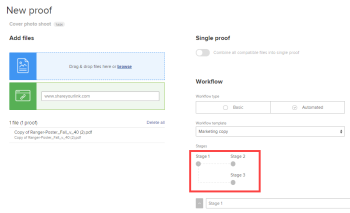

# Erstellen eines erweiterten Testversands mit einem automatisierten Workflow

<!-- Audited: 2/2024 -->

Ein automatisierter Workflow erleichtert die Verwaltung des Überprüfungsprozesses, wenn Ihr Prozess komplex ist oder wenn Sie regelmäßig Inhalte zur Überprüfung an dieselben Personen senden. Der Testversand wechselt von Phase zu Phase und Adobe Workfront benachrichtigt jeden Benutzer, wenn er an der Reihe ist, ihn zu überprüfen. Weitere Informationen zu automatisierten Workflows finden Sie unter [Überblick über den automatisierten Workflow](../../../review-and-approve-work/proofing/proofing-overview/automated-workflow.md).

## Zugriffsanforderungen

+++ Erweitern Sie , um die Zugriffsanforderungen für die Funktionalität in diesem Artikel anzuzeigen.

Sie müssen über folgenden Zugriff verfügen, um die Schritte in diesem Artikel ausführen zu können:

<table style="table-layout:auto"> 
 <col> 
 <col> 
 <tbody> 
  <tr> 
   <td role="rowheader">Adobe Workfront-Abo</td> 
   <td> 
Neu: Beliebig

Aktueller Plan: Pro oder höher

Veralteter Plan: Auswählen oder höher
 
Weitere Informationen zum Testen des Zugriffs mit den verschiedenen Plänen finden Sie unter <a href="/help/quicksilver/administration-and-setup/manage-workfront/configure-proofing/access-to-proofing-functionality.md" class="MCXref xref">Zugriff auf die Testfunktion in Workfront</a>.
 </td> 
  </tr> 
  <tr> 
   <td role="rowheader">Adobe Workfront-Lizenz</td> 
   <td> 
Neu: Standard

Aktueller Plan: Arbeit oder Plan
 
Veralteter Plan: Beliebig (Sie müssen die Testfunktion für den Benutzer aktiviert haben)
 </td> 
  </tr> 
  <tr> 
   <td role="rowheader">Proof-Berechtigungsprofil </td> 
   <td>Manager oder höher</td> 
  </tr> 
  <tr> 
   <td role="rowheader">Konfigurationen auf Zugriffsebene</td> 
   <td> 
Zugriff auf Dokumente bearbeiten
</td> 
  </tr> 
 </tbody> 
</table>

Weitere Informationen zu den Informationen in dieser Tabelle finden Sie unter [Zugriffsanforderungen in der Workfront-Dokumentation](/help/quicksilver/administration-and-setup/add-users/access-levels-and-object-permissions/access-level-requirements-in-documentation.md).

+++

## Erstellen eines erweiterten Testversands mit einem automatisierten Workflow

1. Wechseln Sie zum Projekt, zur Aufgabe oder zur Ausgabe, an der Sie den Testversand durchführen möchten, und klicken Sie dann auf die Registerkarte **Dokumente** .
1. Klicken Sie auf **Neu hinzufügen** > Testversand , laden Sie den Inhalt hoch und arbeiten Sie dann durch die unten aufgeführten Abschnitte.

   oder

   Bewegen Sie den Mauszeiger über ein vorhandenes Dokument, klicken Sie auf **Testversand erstellen** > **Erweiterter Testversand** und arbeiten Sie durch die folgenden Abschnitte.

## Testsendungen konfigurieren

1. Wählen Sie im Abschnitt Workflow-Typ die Option **Automated**.
1. (Optional) Wenn Sie eine Vorlage für einen automatisierten Workflow verwenden möchten, die Ihr Workfront-Administrator erstellt und für Sie freigegeben hat, klicken Sie auf **Vorlage hinzufügen**, wählen Sie die Vorlage im angezeigten Feld aus und klicken Sie dann auf **Vorlage hinzufügen**.

   >[!NOTE]
   >
   >Beachten Sie Folgendes, wenn Sie eine Vorlage für einen automatisierten Workflow verwenden:
   >   
   >* Die Einstellungen einer Automated Workflow-Vorlage bestimmen, was Sie mit dem automatisierten Workflow für einen Testversand tun können. Wenn beispielsweise die Schaltfläche Phase hinzufügen in der Vorlage deaktiviert ist, ist sie nicht sichtbar, wenn Sie mit den Einstellungen für den automatisierten Workflow für den Testversand arbeiten.
   >* Wenn eine Person in einer Vorlage für einen automatisierten Workflow zu einer Nutzung hinzugefügt, aber bereits als Validierer für den Testversand vorhanden ist, wird der Validierer durch Anwendung der Vorlage aus der Bühne entfernt. Wenn Sie keinen weiteren Validierer zur Bühne hinzufügen, werden Sie in einer Meldung aufgefordert, einen hinzuzufügen.
   >* Ihre Fähigkeit, eine Vorlage für einen automatisierten Workflow zu ändern, hängt von den vom Workfront-Administrator konfigurierten Vorlageneinstellungen ab, wie in beschrieben. Wenn die Möglichkeit zur Änderung der Vorlage deaktiviert ist, kann sie nur vom Inhaber der Vorlage geändert werden.

1. Konfigurieren Sie den ersten Schritt des automatisierten Workflows:

   1. (Optional) Wenn Sie einen Namen für die erste Phase erstellen möchten, klicken Sie auf **Phase 1** und geben Sie dann den Namen ein.
   1. Fügen Sie im Abschnitt **Empfänger** der Bühne Überprüfer hinzu.

      >[!NOTE]
      >
      >Beachten Sie beim Hinzufügen von Validierern zu einer Phase Folgendes:
      >   
      >* Sie können externe Benutzer zu einer Bühne mit einer E-Mail-Adresse hinzufügen.
      >* Nachdem Sie einen Benutzer zu einer Bühne hinzugefügt haben, können Sie die Einstellungen für diesen Benutzer im Testversand konfigurieren.
      >* Sie können Benutzer direkt in eine andere Bühne ziehen oder Benutzer auf eine Bühne im Diagramm **Phasen** ziehen. Um mehrere Benutzer auszuwählen, drücken Sie Umschalt+Strg (unter Windows) bzw. Umschalt+Befehl (unter Mac).
      >* Sie können einen Validierer nur einmal zu einem Testversand hinzufügen. Das bedeutet, dass Sie dieselbe Person nicht mehr als einer Testphase hinzufügen können.
      >* Prüfer, die nicht zu einer privaten Bühne hinzugefügt wurden, können diese Phase nicht auf dem Testversand oder den Kommentaren sehen, die in dieser Phase abgegeben wurden.
      >* Wenn ein Benutzer zu einer Phase hinzugefügt wird, erhält dieser Benutzer standardmäßig Zugriff auf den Testversand ab der Erstellung des Testversands. Ihr Workfront-Administrator kann den Zugriff auf den Testversand einschränken, bis der Workflow in die Phase gelangt, in der der Benutzer hinzugefügt wurde.

   1. Klicken Sie auf **Staging-Einstellungen**.
   1. Klicken Sie auf die Option **Phase aktivieren** , um anzugeben, wie die Bühne aktiviert werden soll.

      Im ersten Schritt können Sie nur **Bei der Erstellung des Testversands**, **An einem bestimmten Datum und zu einer bestimmten Uhrzeit** oder **Manuell** auswählen.

   1. (Bedingt) Wenn Sie im vorherigen Schritt &quot;**An einem bestimmten Datum und zu einer bestimmten Uhrzeit**&quot;ausgewählt haben, wählen Sie im angezeigten Feld **Aktivieren am** das Datum und die Uhrzeit aus, zu dem die Phase aktiviert werden soll.

   1. Verwenden Sie eine der folgenden Optionen, um die Phase weiter zu konfigurieren.

      <table style="table-layout:auto">
       <col>
       <col>
       <tbody>
        <tr>
         <td role="rowheader">Festlegen des Schrittzeitpunkts</td>
         <td>
Um einen Termin für die Phase festzulegen, klicken Sie auf eine Option in der Dropdownliste <strong>Deadline-Optionen</strong> . Führen Sie dann unter <strong>Deadline</strong> einen der folgenden Schritte aus:

          <ul>
           <li>Wenn Sie <strong>Bestimmtes Datum festlegen</strong> auswählen: Wählen Sie das gewünschte Datum und die gewünschte Uhrzeit für die Frist aus.</li>
           <li>Wenn Sie "<strong>Von der Staging-Aktivierungsdatum berechnen</strong>": Wählen Sie die Anzahl der Geschäftstage aus, die Sie zum Staging-Aktivierungsdatum hinzufügen möchten, um den Termin zu bestimmen.</li>
          </ul></td>
        </tr>
        <tr>
         <td role="rowheader">Bühne sperren</td>
         <td>Geben Sie an, wann die Bühne gesperrt werden kann. </td>
        </tr>
        <tr>
         <td role="rowheader">Übertragen der Rechte der primären Entscheidung an</td>
         <td>
Wählen Sie den Primären Entscheidungsträger auf der Bühne aus (der nur verfügbar ist, wenn Sie mindestens eine Person zur Bühne hinzufügen, die die Rolle "Genehmiger"oder höher besitzt). Wenn Sie einen Primären Entscheidungsträger auswählen, ist die Option <strong>Nur eine Entscheidung erforderlich</strong> in dieser Phase deaktiviert.
</td>
        </tr>
        <tr>
         <td role="rowheader">Nur eine Entscheidung für diese Phase anfordern</td>
         <td>Beendet den gesamten Überprüfungsprozess, wenn einer der Entscheidungsträger eine Entscheidung trifft.
Diese Option ist nicht verfügbar, wenn Sie einen Benutzer im Dropdown-Menü <strong>Primärer Entscheidungsträger</strong> ausgewählt haben.
</td>
        </tr>
        <tr>
         <td role="rowheader">Machen Sie diese Phase privat</td>
         <td>Ermöglicht nur den folgenden Personen die Anzeige von Kommentaren und Entscheidungen, die in dieser Phase getroffen wurden: Supervisoren, Workfront-Administratoren und Workfront Proof-Administratoren</td>
        </tr>
       </tbody>
      </table>

1. So fügen Sie eine weitere Phase hinzu und konfigurieren sie:

   1. Klicken Sie auf **Neue Phase**.
   1. (Optional) Wenn Sie einen Namen für die erste Phase erstellen möchten, klicken Sie auf **Phase 2** (oder **Phase 3**, **Phase 4** usw.) und geben Sie den Namen ein.

   1. Klicken Sie auf die **Phase aktivieren** und wählen Sie dann eine Option, um anzugeben, ob die Bühne automatisch oder manuell aktiviert wird.

      Zusätzlich zu den Optionen **Bei der Erstellung des Testversands**, **An einem bestimmten Datum und zu einer bestimmten Uhrzeit** oder **Manuell** können Sie eine Option auswählen, die von dem abhängt, was im vorherigen Schritt geschehen ist:

      

   1. Wenn Sie eine Option &quot;Phase aktivieren&quot;ausgewählt haben, die von den Vorgängen im vorherigen Schritt abhängig ist, konfigurieren Sie die Aktivierungseinstellung mit den angezeigten Optionen.

      Wenn Sie beispielsweise &quot;**Wenn sich der Status der vorherigen Phase ändert**&quot;ausgewählt haben, wählen Sie die &quot;**Vorherige Phase**&quot;aus und wählen Sie dann den Status im Feld &quot;**Status geändert zu**&quot;.

1. Wiederholen Sie den vorherigen Schritt nach Bedarf, um weitere Phasen hinzuzufügen.

   Wenn Sie dem automatisierten Workflow Bühnen hinzufügen, wird ein Diagramm auf dem Bildschirm angezeigt, um sie darzustellen:

   

1. Fahren Sie mit [E-Mail-Einstellungen für den Testversand konfigurieren](#configure-email-settings-for-the-proof) weiter unten.

## E-Mail-Einstellungen für den Testversand konfigurieren {#configure-email-settings-for-the-proof}

1. Wählen Sie im Abschnitt **E-Mail-Benachrichtigung** aus, ob Sie E-Mail-Benachrichtigungen und eine benutzerdefinierte Nachricht an die Benutzer senden möchten, die Sie zuvor in [Erstellen eines erweiterten Testversands mit einem automatisierten Workflow](#workflow) ausgewählt haben:

   <table>
      <tbody>
      <tr>
      <td>Empfänger über diesen Testversand informieren</td>
      <td>Wählen Sie diese Option, um eine E-Mail-Benachrichtigung an Benutzer zu senden. Wenn im Abschnitt <strong>Workflow</strong> die Option <strong>Grundlegende Freigabe</strong> ausgewählt ist, wird bei der Erstellung des Testversands eine E-Mail-Benachrichtigung gesendet. Wenn im Abschnitt <strong>Workflow</strong> die Option <strong>Automatisierter Workflow</strong> ausgewählt ist, wird eine E-Mail-Benachrichtigung gesendet, wenn der Testversand in die Phase des automatisierten Workflows gelangt, mit der der Benutzer verknüpft ist.</td>
      </tr>
      <tr>
      <td>Benutzerdefinierte Nachricht hinzufügen</td>
      <td>Wählen Sie diese Option aus, um eine benutzerdefinierte Nachricht in die Benachrichtigung einzuschließen. Sie können einen Betreff und einen Nachrichtentext angeben. Der Nachrichtentext kann Rich-Text-Formatierungen wie Fett, Aufzählungszeichen und Hyperlinks enthalten.</td>
      </tr>
      </tbody>
      </table>

1. Fahren Sie mit [Konfigurieren Sie die Testversandeinstellungen](#configure-proof-settings) weiter unten.

## Konfigurieren der Testversandeinstellungen {#configure-proof-settings}

1. Wählen Sie im Abschnitt **Testversandeinstellungen** eine der folgenden Optionen aus:

   <table style="table-layout:auto"> 
    <col> 
    <col> 
    <tbody> 
     <tr> 
      <td role="rowheader">Anmeldung erforderlich - Testversand kann nur für andere Benutzer freigegeben werden</td> 
      <td>Wenn diese Option deaktiviert ist (Standard), kann jeder mit der URL den Testversand anzeigen.  Wenn diese Option ausgewählt ist:
       <ul>
        <li>Nur Workfront Proof-Benutzer können den Testversand anzeigen.</li>
        <li>Benutzer können sich nur dann beim Testversand anmelden, wenn sie zum Testversand hinzugefügt wurden.</li>
        <li>Abonnements können nicht aktiviert werden.</li>
       </ul></td> 
     </tr> 
     <tr> 
      <td role="rowheader">Nur eine Entscheidung für diesen Testversand erforderlich</td> 
      <td>Wenn diese Option ausgewählt ist, wird die Überprüfung abgeschlossen, nachdem einer der Entscheidungsträger seine Entscheidung getroffen hat. Diese Option ist standardmäßig deaktiviert.</td> 
     </tr> 
     <tr> 
      <td role="rowheader">Entscheidungen müssen elektronisch signiert werden</td> 
      <td>Benutzer müssen ihren Benutzernamen und ihr Kennwort zum Zeitpunkt der Entscheidung über einen Testversand angeben.</td> 
     </tr> 
     <tr> 
      <td role="rowheader">Sperren des Testversands, wenn alle erforderlichen Entscheidungen getroffen werden</td> 
      <td>Wenn diese Einstellung aktiviert ist, wird der Testversandstatus gesperrt, nachdem alle Entscheidungen getroffen wurden. Der Status wird automatisch von entsperrt in gesperrt geändert, wenn der endgültige Genehmiger seine Entscheidung trifft. Diese Option ist standardmäßig deaktiviert.</td> 
     </tr> 
     <tr> 
      <td role="rowheader">Originaldatei herunterladen</td> 
      <td>Wenn diese Option aktiviert ist, können die validierungsverantwortlichen Benutzer die Originaldatei herunterladen, aus der der Testversand erstellt wurde. Wenn diese Option deaktiviert ist, ist das Symbol Herunterladen nicht mehr sichtbar. Diese Option ist standardmäßig aktiviert.</td> 
     </tr> 
     <tr> 
      <td role="rowheader">Freigeben des Testversands über eine öffentliche URL oder einen Einbettungscode</td> 
      <td>Wenn diese Option aktiviert ist, kann der Testversand über eine öffentliche URL oder einen Einbettungscode freigegeben werden.</td> 
     </tr> 
     <tr> 
      <td role="rowheader">Testversand über öffentliche URL oder Einbettungscode abonnieren</td> 
      <td>Wenn diese Option aktiviert ist, können Personen, die dem Testversand nicht explizit hinzugefügt wurden, den Testversand abonnieren. Die Person, die den Testversand abonniert, erhält die Rolle und E-Mail, die Sie in den folgenden Einstellungen definieren:
       <ul>
        <li><strong>Abonnentenrolle:</strong> Die Standardrolle für den Testversand, die allen Validierern zugewiesen ist, die den Testversand abonnieren.</li>
        <li><strong>E-Mail-Warnhinweiseinstellungen für Abonnenten:</strong> Der Standard-E-Mail-Warnhinweis, der allen Validierern zugewiesen wird, die den Testversand abonnieren.</li>
       </ul>

        <ul>
         <li><strong> Nachweis des Zugriffs über einen E-Mail-Link erforderlich:</strong> Konfigurieren Sie, ob der Abonnent eine E-Mail mit einem Link zum Testversand erhält. Sie können "<strong>Keine E-Mail</strong>"(für den Testversand ist kein E-Mail-Link erforderlich), "<strong>Nur E-Mail-Testversand</strong>"(Abonnenten erhalten einen Link zum Testversand per E-Mail ohne Überprüfung) oder "<strong>E-Mail-Benachrichtigung zur Validierung und zum Testversand</strong>"(Abonnenten erhalten per E-Mail einen Link und müssen auf den Link klicken, um einen Testversand anzuzeigen). Diese Option dient dazu, um sicherzustellen, dass die richtige E-Adresse angegeben wird , auf die sie Zugriff haben).</li>
        </ul>
<strong>Hinweis:</strong> Wenn die Testsendungen den automatisierten Workflow angehängt haben, generieren alle Abonnements Bestätigungs-E-Mails an die Testversand-Inhaber, sodass diese entscheiden können, zu welcher Stufe die Person hinzugefügt werden soll. 

</td> 
     </tr> 
    </tbody> 
   </table>

1. Klicken Sie auf **Testversand erstellen**.

   Workfront beginnt mit der Erstellung eines Testversands der ausgewählten Dokumente oder Websites. Je nach Dateigröße und Typ kann die Zeitverzögerung beim Hochladen von Dokumenten variieren. Seien Sie geduldig, da die Erzeugung größerer Dateien länger dauert. Sie können von der Seite weg navigieren und Workfront generiert weiterhin Ihre -Datei. Die maximale Größe für den Datei-Upload beträgt 4 GB.

1. Nachdem der Testversand erstellt wurde, klicken Sie auf **Testversand öffnen** , um den Testversand-Viewer zu starten.

   

   Benutzer, für die die Prüfung in ihrem Konto nicht aktiviert wurde, können das Dokument weiterhin anzeigen und Kommentare zum Testversand vornehmen .
