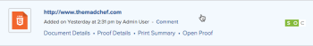

# Erstellen eines statischen Testversands für eine Website oder andere Webinhalte

Sie können einen neuen statischen Testversand oder eine neue Version eines vorhandenen statischen Testversands für Webinhalte erstellen. Webinhalte können Dinge wie Anzeigen mit Streaming-Videos, HTML-Animationen oder interaktiven Bannern enthalten, sie werden jedoch in mehrere Screenshots unterteilt, um statische Testsendungen zu ermöglichen.

Beachten Sie beim Erstellen von statischen Testsendungen für eine Website oder andere Webinhalte Folgendes:

## Zugriffsanforderungen

Sie müssen über folgenden Zugriff verfügen, um die Schritte in diesem Artikel ausführen zu können:

<table style="table-layout:auto"> 
 <col> 
 <col> 
 <tbody> 
  <tr> 
   <td role="rowheader">Adobe Workfront-Plan*</td> 
   <td> 
Aktueller Plan: Pro oder höher
 
oder
 
Veralteter Plan: Wählen Sie oder Premium
 
Weitere Informationen zum Testzugang für die verschiedenen Pläne finden Sie unter <a href="/help/quicksilver/administration-and-setup/manage-workfront/configure-proofing/access-to-proofing-functionality.md" class="MCXref xref">Zugriff auf die Testversandfunktion in Workfront</a>.
 </td> 
  </tr> 
  <tr> 
   <td role="rowheader">Adobe Workfront-Lizenz*</td> 
   <td> 
Aktueller Plan: Arbeit oder Plan
 
Veralteter Plan: Beliebig (Sie müssen die Testfunktion für den Benutzer aktiviert haben)
 </td> 
  </tr> 
  <tr> 
   <td role="rowheader">Proof-Berechtigungsprofil </td> 
   <td>Manager oder höher</td> 
  </tr> 
  <tr> 
   <td role="rowheader">Konfigurationen auf Zugriffsebene*</td> 
   <td> 
Zugriff auf Dokumente bearbeiten
 
Hinweis: Wenn Sie immer noch keinen Zugriff haben, fragen Sie Ihren Workfront-Administrator, ob er zusätzliche Zugriffsbeschränkungen für Ihre Zugriffsebene festlegt. Informationen dazu, wie ein Workfront-Administrator Ihre Zugriffsebene ändern kann, finden Sie unter <a href="../../../administration-and-setup/add-users/configure-and-grant-access/create-modify-access-levels.md" class="MCXref xref">Benutzerdefinierte Zugriffsebenen erstellen oder ändern</a>.
 </td> 
  </tr> 
 </tbody> 
</table>

&#42;Wenden Sie sich an Ihren Workfront- oder Workfront-Testversandadministrator, um zu erfahren, welchen Plan, welche Rolle oder welches Profil für die Testberechtigung Sie haben.

## Erstellen eines statischen Testversands für eine Website oder andere Webinhalte

Um einen statischen Testversand zu erstellen, muss die Website öffentlich zugänglich sein (nicht hinter einer Firewall) oder die Zulassungsliste Ihres Unternehmens muss die Workfront-Domäne enthalten. Workfront kann eine kennwortgeschützte Website nicht als statischen Testversand erfassen.

>[!TIP]
>
>Für interne Seiten, für die eine Autorisierung und kennwortgeschützte Seiten erforderlich sind, empfehlen wir interaktive Testsendungen anstelle statischer Testsendungen. Weitere Informationen finden Sie unter [Übersicht über interaktive Inhaltsanalysen](../../../review-and-approve-work/proofing/proofing-overview/interactive-content-proofs.md).

1. Gehen Sie zum Projekt, zur Aufgabe oder zur Ausgabe, in der Sie einen neuen Website-Testversand oder eine neue Version eines vorhandenen erstellen möchten.
1. Klicks **Dokumente** im linken Bereich .
1. (Bedingt) Wenn Sie einen neuen Testversand erstellen, klicken Sie auf **Neu hinzufügen** Klicken Sie auf **Testversand** im angezeigten Menü.
1. (Bedingt) Wenn Sie eine neue Version eines vorhandenen Testversands erstellen:

   1. Bewegen Sie den Mauszeiger über den URL-Testversand, für den Sie eine neue Version erstellen möchten, und wählen Sie ihn aus, indem Sie im hellblauen Hintergrund darauf klicken.

      

   1. Klicks **Neu hinzufügen** > **Version** > **Testversand**.

1. Geben Sie die URL der Website, die Sie testen möchten, im **Dateien hinzufügen** Bereich, und drücken Sie dann die **Eingabe**.

   >[!NOTE]
   >
   > Die URL darf maximal 1.000 Zeichen enthalten.

1. Klicken Sie auf die von Ihnen hinzugefügte URL.

   Optionen zum Konfigurieren des Website-Testversands werden angezeigt.

   

1. (Optional) Wenn Sie den Namen des Testversands aus der Website-URL in eine andere ändern möchten, geben Sie einen **Name des Testversands.**
1. Stellen Sie sicher **Screenshot &quot;Capture&quot;** ausgewählt ist und eine der folgenden Optionen verwendet:

   <table style="table-layout:auto"> 
    <col> 
    <col> 
    <tbody> 
     <tr> 
      <td role="rowheader"><strong>Screenshot-Auflösung</strong> </td> 
      <td> 
Passen Sie die Auflösung Ihres Inhalts an, wenn die Prüfer den Testversand anzeigen. So können sie sehen, wie er auf Geräten unterschiedlicher Größe wie Smartphones, Tablets und Monitoren angezeigt wird.
 
Wenn Sie mehrere Auflösungen auswählen, wird für jede ausgewählte Auflösung ein separater Testversand erstellt.
 
Hinweis: Wenn ein Validierer den Testversand kommentiert, enthält der Kommentar die Auflösung, die anzeigt, wann der Kommentar abgegeben wurde, damit andere Validierer wissen, welche Auflösung mit dem Kommentar verknüpft ist. 
 </td> 
     </tr> 
     <tr> 
      <td role="rowheader"><strong>Suchen nach Unterseiten</strong> </td> 
      <td> 
Erfassen Sie die Unterseiten der Website sowie deren Hauptseiten. Sie können auf Alle auswählen klicken, um alle Seiten einzuschließen, oder Sie können nur auf bestimmte Seiten klicken, die eingeschlossen werden sollen. Mit den Plus- und Minusschaltflächen können Sie die Unterseitenbereiche auf der Website erweitern und schließen.
 </td> 
     </tr> 
    </tbody> 
   </table>

   >[!IMPORTANT]
   >
   >Sie können die Screenshot-Einstellung &quot;Aufnahme&quot;für keine nachfolgenden Versionen des von Ihnen erstellten Testversands ändern.

1. Klicks **Fertig**.

   Wenn Sie in Schritt 8 mehrere Screenshot-Auflösungen ausgewählt haben, enthält die Liste eine Reihe von Screenshots für jede Auflösung. Sie können diese Screenshots als separate Testsendungen erstellen oder sie zu einem Testversand zusammenfassen (siehe ). Es wird empfohlen, diese zu kombinieren, insbesondere wenn Sie einen statischen Website-Testversand erstellen.

   >[!NOTE]
   >
   >Wenn Sie eine neue Version zu einem vorhandenen URL-Testversand hinzufügen, werden alle Optionen, die für den ursprünglichen Testversand oder die vorherige Version konfiguriert wurden, in dieser Version beibehalten.

1. Klicks **Testversand erstellen** , um einen einfachen Testversand ohne Überprüfungsprozess zu erstellen.\
   oder\
   Fahren Sie mit der Konfiguration eines erweiterten Testversands fort:

   * [Erstellen eines erweiterten Testversands mit einem einfachen Workflow](../../../review-and-approve-work/proofing/creating-proofs-within-workfront/configure-basic-proof-workflow.md)
   * [Erstellen eines erweiterten Testversands mit einem automatisierten Workflow](../../../review-and-approve-work/proofing/creating-proofs-within-workfront/create-automated-proof-workflow.md)
