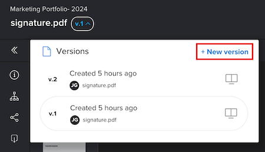

# Erstellen einer neuen Version eines Korrekturabzugs

<!-- Audited: 4/2025 -->

Das Verwalten des Feedbacks über mehrere Versionen oder Revisionen eines Arbeitsstücks kann eine Herausforderung sein. Adobe Workfront vereinfacht diesen Prozess, da Sie mehrere Versionen eines Korrekturabzugs erstellen und vergleichen können.

Beachten Sie beim Erstellen einer neuen Version eines Korrekturabzugs die folgenden Informationen:

* Sie können Benutzenden die Berechtigung erteilen, eine Version zu sehen, aber keine andere. Wenn Sie dagegen eine spätere Version für einen Benutzer freigeben, kann dieser Benutzer frühere Versionen nur sehen, wenn Sie zurückgehen und ihm Zugriff auf diese früheren Versionen gewähren.
* Sie müssen über Bearbeitungsrechte für den Korrekturabzug verfügen, um eine neue Version zu erstellen.

  Weitere Informationen finden Sie unter [Verwalten von Korrekturabzugsrollen in Workfront Proof](../../../workfront-proof/wp-work-proofsfiles/share-proofs-and-files/manage-proof-roles.md) und [Profile für Korrekturabzugsberechtigungen in Workfront Proof](../../../workfront-proof/wp-acct-admin/account-settings/proof-perm-profiles-in-wp.md).

  Informationen zur Freigabe von Korrekturabzugsversionen finden Sie unter  [Freigeben eines Korrekturabzugs in Workfront Proof](../../../workfront-proof/wp-work-proofsfiles/share-proofs-and-files/share-proof.md).

>[!IMPORTANT]
>
>Wenn ein Korrekturabzug in Adobe Workfront erstellt wird, müssen alle neuen Versionen für diesen Korrekturabzug auch in Workfront erstellt werden. Sie können keine neue Version eines Korrekturabzugs in Workfront Proof erstellen, wenn dieser Korrekturabzug in Workfront erstellt wurde.

## Zugriffsanforderungen

+++ Erweitern Sie , um die Zugriffsanforderungen für die -Funktion in diesem Artikel anzuzeigen.

<table style="table-layout:auto"> 
 <col> 
 <col> 
 <tbody> 
  <tr> 
   <td role="rowheader">Adobe Workfront-Paket</td> 
   <td> 
Beliebig
 </td> 
  </tr> 
  <tr> 
   <td role="rowheader">Adobe Workfront-Lizenz</td> 
   <td> 
Standard
 
   
Arbeit oder Plan

   </td> 
  </tr> 
  <tr> 
   <td role="rowheader">Proof-Berechtigungsprofil </td> 
   <td>Manager oder höher</td> 
  </tr> 
  <tr> 
   <td role="rowheader">Konfigurationen der Zugriffsebene</td> 
   <td> 
Zugriff auf Dokumente bearbeiten
 </td> 
  </tr> 
 </tbody> 
</table>

Weitere Informationen finden Sie unter [Zugriffsanforderungen in der Dokumentation zu Workfront](/help/quicksilver/administration-and-setup/add-users/access-levels-and-object-permissions/access-level-requirements-in-documentation.md).

+++

## Erstellen einer neuen Korrekturabzugsversion in Workfront

Es gibt mehrere Möglichkeiten, eine neue Korrekturabzugsversion in Workfront hochzuladen. Die standardmäßigen Korrekturabzugseinstellungen werden je nach ausgewählter Methode von der vorherigen Version übernommen oder nicht.

* **Beim Hochladen von Dokumenten automatisch Korrekturabzüge generieren**: Wenn Sie diese Einstellung in Ihrem Benutzerprofil aktiviert haben, werden die standardmäßigen Korrekturabzugseinstellungen nicht übernommen, wenn Sie eine neue Version per Drag-and-Drop verschieben.
* **Korrekturabzug erstellen > Einfach**: Wenn Sie diese Option auswählen, werden die standardmäßigen Korrekturabzugseinstellungen nicht von der vorherigen Version übernommen.
* **Neu hinzufügen > Version > Korrekturabzug**: Wenn Sie diese Option auswählen, werden die Standardeinstellungen für den Korrekturabzug von der vorherigen Version übernommen.
* **Korrekturabzug erstellen > Erweitert**: Wenn Sie diese Option auswählen, werden die Standardeinstellungen für den Korrekturabzug von der vorherigen Version übernommen.

Erstellen einer neuen Version eines Korrekturabzugs:

1. Öffnen Sie die Dokumentliste, die den Korrekturabzug enthält.
1. Ziehen Sie aus dem Dateisystem Ihres Computers eine neue Datei per Drag-and-Drop über den Korrekturabzug.

   Oder

   Wählen Sie die Zeile aus, in der der Korrekturabzug aufgeführt ist **klicken Sie auf „Neu hinzufügen** > **Version** und klicken Sie dann auf die Option, die Sie zum Hinzufügen der neuen Version des Korrekturabzugs verwenden möchten.

   

## Erstellen einer neuen Korrekturabzugsversion über die Proofing-Anzeige (nur Workfront Proof)

Wenn Sie die eigenständige Workfront Proof verwenden, können Sie eine neue Version eines Korrekturabzugs erstellen, der eine einzelne Datei oder ein Web-Capture enthält. 

>[!NOTE]
>
>Wenn für Ihr Konto ein Unternehmensabo erstellt wurde und Sie mehrere Dateien oder Web-Aufnahmen hochladen, werden diese automatisch in einer neuen Version kombiniert. Weitere Informationen finden [&#x200B; unter „Erstellen eines mehrseitigen &#x200B;](../../../review-and-approve-work/proofing/creating-proofs-within-workfront/create-multi-page-proof.md)&quot;.

So erstellen Sie eine neue Version eines Korrekturabzugs in Workfront Proof:

1. Öffnen Sie den Korrekturabzug.
1. Klicken Sie in der linken oberen Ecke auf das Dropdown-Menü **Version** und klicken Sie dann in **angezeigten Feld auf**+ Neue Version . Die neue Seite mit der Korrekturabzugsversion wird geöffnet.

   

1. Laden Sie im Abschnitt **Dateien hinzufügen** eine Datei als neue Korrekturabzugsversion hoch, indem Sie sie per Drag-and-Drop von Ihrem Computer ziehen oder indem Sie auf **Durchsuchen** klicken und eine Datei auswählen.

   Oder

   Erfassen Sie eine Web-Seite als neue Version des Korrekturabzugs, indem Sie eine URL eingeben.

   >[!NOTE]
   >
   >Drag-and-Drop ist nur bei Browsern verfügbar, die HTML5 vollständig unterstützen. Ausgeschlossen sind Internet Explorer 7 bis 9 und Safari.

1. (Optional) Wählen Sie den Titel des Korrekturabzugs aus und geben Sie einen neuen **Korrekturabzugsnamen** für die Version ein.

1. Nehmen Sie **Abschnitt „Workflow** eine der folgenden Änderungen vor, um Reviewer für diese Korrekturabzugsversion hinzuzufügen (diese ersetzt die Reviewer der vorherigen Version):

   * (Optional) Ändern Sie den **Inhaber** der Version in einen anderen Benutzer in Ihrem Konto.

     Weitere Informationen finden Sie unter [Profile für Korrekturabzugsberechtigungen in Workfront Proof](../../../workfront-proof/wp-acct-admin/account-settings/proof-perm-profiles-in-wp.md).

   * (Optional) Fügen Sie mithilfe des Felds **Kontaktnamen oder E-Mail-Adresse eingeben, um einen Empfänger**, Validierungsverantwortliche zur Version hinzu. Anschließend können Sie für jeden Empfänger eine **Rolle** Korrekturabzugs) und **E-Mail** Warnhinweistyp auswählen.

     Weitere Informationen finden Sie unter [Hinzufügen von Gruppen zu einem Korrekturabzug](../../../workfront-proof/wp-mnguserscontacts/groups/add-groups.md) und [Verwalten von Korrekturabzugsrollen in Workfront Proof](../../../workfront-proof/wp-work-proofsfiles/share-proofs-and-files/manage-proof-roles.md).

     >[!NOTE]
     >
     >Wenn die Erstellerin oder der Besitzer des Korrekturabzugs die E-Mail Korrekturabzug erstellt standardmäßig in den persönlichen Einstellungen deaktiviert hat, erhält sie bzw. er keine E-Mails mit Korrekturabzügen oder neuen Korrekturabzügen, selbst wenn das **Empfänger über diesen Korrekturabzug informieren** auf der Seite Neuer Korrekturabzug aktiviert ist. Weitere Informationen finden Sie unter [Konfigurieren der E-Mail-Benachrichtigungseinstellungen in Workfront Proof](../../../workfront-proof/wp-emailsntfctns/email-alerts/config-email-notification-settings-wp.md), [Die E-](../../../workfront-proof/wp-emailsntfctns/proof-notifications-and-reminders/proof-made-email.md) für Korrekturabzüge und [Neue Korrekturabzugs-E-Mail](../../../workfront-proof/wp-emailsntfctns/proof-notifications-and-reminders/new-proof-email.md).

   * (Optional) Legen Sie eine Frist für Korrekturabzüge fest.

   * (Optional und bedingt) Wählen Sie einen neuen primären Entscheidungsträger in der Dropdown **Liste „Übertragen von primären Entscheidungsrechten auf** aus.

   * (Optional) Aktivieren Sie das **Nur eine Entscheidung für dieses Stadium erforderlich**, um die Option zum Festlegen eines Benutzers als neuen primären Entscheidungsträger zu entfernen.

1. Wählen **im Abschnitt** E-Mail-Benachrichtigung“ eine der folgenden Einstellungen aus:

   * (Optional) **Empfänger über diesen Korrekturabzug informieren**: Wählen Sie diese Option, um die Validierungsverantwortlichen über die neue Version zu informieren. Ihre Auswahl wird im Abschnitt **Aktivität** der Seite **Korrekturabzugsdetails** protokolliert. Weitere Informationen finden Sie unter [Verwalten von Korrekturabzugsdetails in Workfront Proof](../../../workfront-proof/wp-work-proofsfiles/manage-your-work/manage-proof-details.md).

   * (Bedingt und optional) **Benutzerdefinierten Betreff und Nachricht hinzufügen**: Wählen Sie diese Option, um eine benutzerdefinierte Betreffzeile und Nachricht zur E-Mail-Benachrichtigung hinzuzufügen.

1. Wählen Sie **Abschnitt** Organisation“ eine der folgenden Einstellungen aus:

   * Wenden Sie ein oder mehrere Tags auf den Korrekturabzug an. Weitere Informationen finden Sie unter [Erstellen und Verwalten von Tags in Workfront Proof](../../../workfront-proof/wp-work-proofsfiles/organize-your-work/create-and-manage-tags.md).

   * Fügen Sie die Version einem Ordner hinzu. Der Ordner wird aus der vorherigen Version des Korrekturabzugs kopiert. Wenn Sie einen anderen Ordner auswählen, wird der gesamte Korrekturabzug, d. h. alle Versionen, verschoben. Weitere Informationen finden Sie unter [Ordner in Workfront Proof verwalten](../../../workfront-proof/wp-work-proofsfiles/organize-your-work/manage-folders.md).

   * Rechnungsadministratoren und -administratoren können auf der Registerkarte „Einstellungen“ für das gesamte Konto **Ordnerfeld**.

1. Wählen Sie **Abschnitt** Korrekturabzugseinstellungen“ eine der folgenden Einstellungen aus:

   * Benutzer zur Anmeldung auffordern, um den Korrekturabzug anzuzeigen.
   * Elektronische Signaturen für den Testversand verlangen (nur Enterprise-Plan).
   * Korrekturabzug bei allen Entscheidungen sperren
   * Herunterladen der Originaldatei zulassen.
   * Öffentliche Freigabe des Korrekturabzugs zulassen.
   * Das Abonnieren des Korrekturabzugs zulassen.

     Die in diesem Abschnitt vorgenommenen Auswahlen werden auf der Seite **Korrekturabzugsdetails** angezeigt (wo einige Felder bearbeitet werden können). Weitere Informationen finden Sie unter [Verwalten von Korrekturabzugsdetails in Workfront Proof](../../../workfront-proof/wp-work-proofsfiles/manage-your-work/manage-proof-details.md).

<!--
<h2 data-mc-conditions="QuicksilverOrClassic.Draft mode">Create a new version of a proof from the proofing viewer</h2>
-->

<!--

To create a new version from the proofing viewer

-->

<!--
<ol data-mc-conditions="QuicksilverOrClassic.Draft mode">
<li value="1">Open the proof.</li>
<li value="2"> 
Click the <strong>Version</strong> drop-down menu in the upper-left corner, then click <strong>+ New version</strong> in the box that appears.
 
On the <strong>New proof version of</strong> page that appears, you can see all the reviewers from the previous version, including their roles and email notification settings. You can easily edit the roles and notifications of existing reviewers or remove existing reviewers from the new version on this page.
 </li>
<li value="3"> 
Under <strong>Add files</strong>, upload a file as a new version of the proof by dragging and dropping from your computer or by clicking <strong>browse</strong> and selecting the file you want. You can type a&nbsp;<strong>Proof name</strong>&nbsp;for the version or leave this box blank to&nbsp;use the same filename with a version number added on the end.
 
Or 
 
Capture a web page as a new version of the proof by typing a URL
 <note type="note">
Drag and drop is available only with browsers that fully support HTML5. This excludes Internet Explorer 7 through 9 and Safari.
 
</note> </li>
<li value="4"> 
Under <strong>Workflow</strong>, make any of the following changes to specify the reviewers for this version of the proof.
 
Reviewers from the previous version are replaced by the reviewers you add.

<ul>
<li>Change the <strong>Owner</strong> of the version to another user in your account. For information about owner permissions, see <a href="../../../workfront-proof/wp-acct-admin/account-settings/proof-perm-profiles-in-wp.md" class="MCXref xref">Proof Permissions Profiles in Workfront Proof</a>.</li>
<li> 
Using the <strong>Type contact name or email address to add a recipient box</strong>, add reviewers to the version. You can specify a <strong>Proof role</strong> and an <strong>Email alerts</strong> type for each recipient.
 
For information about adding groups to the proof, see&nbsp;<a href="../../../workfront-proof/wp-mnguserscontacts/groups/add-groups.md" class="MCXref xref">Add Groups to a Proof</a>.&nbsp;For information about roles, see <a href="../../../workfront-proof/wp-work-proofsfiles/share-proofs-and-files/manage-proof-roles.md" class="MCXref xref">Manage Proof Roles in Workfront Proof</a>.
 <note type="note">
If the creator or owner of&nbsp;&nbsp;the proof has
<a href="../../../workfront-proof/wp-emailsntfctns/proof-notifications-and-reminders/proof-made-email.md" class="MCXref xref">The Proof Made email</a> disabled by default (in their personal settings), they won't receive any Proof made or New proof emails even if the Notify people by email box is checked on the New proof page. For information about email notifications, see
<a href="../../../workfront-proof/wp-emailsntfctns/email-alerts/config-email-notification-settings-wp.md" class="MCXref xref">Configure email notification settings in Workfront Proof</a>.&nbsp;See also
<a href="../../../workfront-proof/wp-emailsntfctns/proof-notifications-and-reminders/proof-made-email.md" class="MCXref xref">The Proof Made email</a> and
<a href="../../../workfront-proof/wp-emailsntfctns/proof-notifications-and-reminders/new-proof-email.md" class="MCXref xref">New proof email</a>.
 
</note> </li>
<li>Set a proof deadline for the version.</li>
<li>Hover over a reviewer's name to see any decisions he or she made on a previous version.</li>
</ul> </li>
<li value="5">Under <strong>Email notification</strong>, do any of the following:
<ul>
<li>Specify whether you want to notify the reviewers of the new version. Your selection will be logged in the Proof activity section on the Proof details page.</li>
<li>Add a custom subject and message.</li>
</ul></li>
<li value="6">Under Proof settings, make any of the changes below:
<ul>
<li>Require login on the proof</li>
<li>Require electronic signatures on the proof (Enterprise plan only)</li>
<li>Lock the proof when all decisions are made</li>
<li>Allow or block download of original file</li>
<li>Public sharing of the proof,&nbsp;including public sharing settings</li>
<li>Subscription to the proof The selections made in this section will be shown in the Proof details page.</li>
</ul></li>
</ol>
-->

## Über die Nachricht Neue Version

Wenn in der vorherigen Version des Korrekturabzugs ein benutzerdefinierter Betreff/eine benutzerdefinierte Nachricht enthalten war, wird sie/sie standardmäßig auf der Seite „Neue Version“ angezeigt. Sie haben folgende Möglichkeiten:

* Bearbeiten Sie den Betreff und die Nachricht.
* Deaktivieren Sie das Kontrollkästchen Personen per E-Mail benachrichtigen. Das bedeutet, dass keine E-Mail an Ihre Prüfer gesendet wird, um sie darüber zu informieren, dass sie eine neue Version zur Überprüfung haben.

  >[!NOTE]
  >
  >Dies wird durch keinen in Ihren persönlichen Einstellungen gespeicherten benutzerdefinierten Betreff/keine Nachricht beeinflusst.

Wenn Sie einen Standardbetreff und eine Standardnachricht in Ihren persönlichen Einstellungen gespeichert haben, bestimmt dies, welche Nachricht standardmäßig auf der Seite Neue Version angezeigt wird:

* Wenn Sie Ihre Prüfer mithilfe der Standard-E-Mail über die vorherige Korrekturabzugsversion benachrichtigt haben (z. B. ohne benutzerdefinierten Betreff/benutzerdefinierte Nachricht), wird Ihr standardmäßiger benutzerdefinierter Betreff/Ihre benutzerdefinierte Nachricht (Ihre persönlichen Einstellungen) auf der Seite Neue Version angezeigt. Sie können dann den benutzerdefinierten Betreff und die Nachricht bearbeiten oder das Kontrollkästchen Personen per E-Mail benachrichtigen deaktivieren. Ihren Validierungsverantwortlichen wird also keine E-Mail gesendet, um sie darüber zu informieren, dass sie eine neue Version zur Überprüfung haben.
* Wenn Sie Ihre Prüfer nicht über die vorherige Korrekturabzugsversion benachrichtigt haben (z. B. keine Standard- oder benutzerdefinierte E-Mail), enthält die Seite Neue Version standardmäßig keine Nachricht. Um Ihre Validierungsverantwortlichen über die neue Version zu informieren, klicken Sie auf den Link Nachricht senden , wodurch der Standardbetreff bzw. die Standardnachricht (gemäß Ihren persönlichen Einstellungen) angezeigt wird. Anschließend können Sie den benutzerdefinierten Betreff und die Nachricht nach Bedarf bearbeiten.

Wenn Sie in Ihren persönlichen Einstellungen keinen Standardbetreff und keine Standardnachricht gespeichert haben, wird Folgendes auf der Seite Neue Version angezeigt:

* Wenn Sie Ihre Prüfer mithilfe der Standard-E-Mail über die vorherige Korrekturabzugsversion benachrichtigt haben (z. B. ohne benutzerdefinierten Betreff/Nachricht), wird die Option Personen per E-Mail benachrichtigen auf der Seite Neue Version standardmäßig ausgewählt. Um eine benutzerdefinierte Nachricht hinzuzufügen, klicken Sie auf den Link.
* Wenn Sie Ihre Prüfer nicht über die vorherige Korrekturabzugsversion benachrichtigt haben (z. B. keine Standard- oder benutzerdefinierte E-Mail), enthält die Seite Neue Version standardmäßig keine Nachricht. Um Ihre Validierungsverantwortlichen über die neue Version zu informieren, klicken Sie auf den Link Nachricht senden . Sie können dann einen benutzerdefinierten Betreff und eine benutzerdefinierte Nachricht hinzufügen, indem Sie auf den Link Benutzerdefinierte Nachricht hinzufügen klicken.
