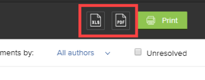

# Testversandzusammenfassung in Adobe Workfront drucken

Sie können eine Testversand-Zusammenfassung drucken, als PDF speichern oder als XLS-Datei oder PDF-Datei exportieren, die für Adobe Reader optimiert ist.

## Zugriffsanforderungen

+++ Erweitern Sie , um die Zugriffsanforderungen für die Funktionalität in diesem Artikel anzuzeigen.

Sie müssen über folgenden Zugriff verfügen, um die Schritte in diesem Artikel ausführen zu können:

<table style="table-layout:auto"> 
 <col> 
 <col> 
 <tbody> 
  <tr> 
   <td role="rowheader">Adobe Workfront-Plan*</td> 
   <td> 
Aktueller Plan: Pro oder höher
 
oder
 
Veralteter Plan: Wählen Sie oder Premium
 
Weitere Informationen zum Testen des Zugriffs mit den verschiedenen Plänen finden Sie unter <a href="/help/quicksilver/administration-and-setup/manage-workfront/configure-proofing/access-to-proofing-functionality.md" class="MCXref xref">Zugriff auf die Testfunktion in Workfront</a>.
 </td> 
  </tr> 
  <tr> 
   <td role="rowheader">Adobe Workfront-Lizenz*</td> 
   <td> 
Aktueller Plan: Arbeit oder Plan
 
Veralteter Plan: Beliebig (Sie müssen die Testfunktion für den Benutzer aktiviert haben)
 </td> 
  </tr> 
  <tr> 
   <td role="rowheader">Proof-Berechtigungsprofil </td> 
   <td>Manager oder höher</td> 
  </tr> 
  <tr> 
   <td role="rowheader">Konfigurationen auf Zugriffsebene*</td> 
   <td> 
Zugriff auf Dokumente bearbeiten
 
Hinweis: Wenn Sie immer noch keinen Zugriff haben, fragen Sie Ihren Workfront-Administrator, ob er zusätzliche Zugriffsbeschränkungen für Ihre Zugriffsebene festlegt. Informationen dazu, wie ein Workfront-Administrator Ihre Zugriffsebene ändern kann, finden Sie unter <a href="../../../administration-and-setup/add-users/configure-and-grant-access/create-modify-access-levels.md" class="MCXref xref">Benutzerdefinierte Zugriffsebenen erstellen oder ändern</a>.
 </td> 
  </tr> 
 </tbody> 
</table>

&#42;Wenden Sie sich an Ihren Workfront- oder Workfront Proof-Administrator, um zu erfahren, welchen Plan, welche Rolle oder welches Profil für die Testberechtigung Sie haben.

+++

## Testversand-Zusammenfassung drucken oder als PDF-Datei speichern

Sie können eine Testversand-Zusammenfassung direkt aus der Dokumentliste drucken.

>[!NOTE]
>
>Sie können nicht mehrere Testversand-Zusammenfassungen gleichzeitig aus der Dokumentliste drucken.

1. Halten Sie in der Dokumentliste, die den Testversand enthält, den Mauszeiger über die das Dokument enthaltende Zeile und klicken Sie dann auf **Zusammenfassung drucken** .

   

   Oder

   Klicken Sie beim Anzeigen des Testversands im Testversand-Viewer in der linken Symbolleiste auf das Symbol **Drucken**  . (Wenn die linke Symbolleiste nicht angezeigt wird, klicken Sie in der oberen linken Ecke des Testversand-Viewers auf das Menüsymbol  .)

1. Verwenden Sie eine der folgenden Optionen:

   <table style="table-layout:auto"> 
    <col> 
    <col> 
    <tbody> 
     <tr> 
      <td role="rowheader">Anzeigen</td> 
      <td> 
Geben Sie an, was Sie drucken möchten:
 
       <ul> 
        <li>Die <strong>aktuelle Version</strong> oder <strong>Alle Versionen</strong> des Testversands</li> 
        <li>Nur die <strong>Seiten mit Kommentaren</strong> oder <strong>Alle Seiten</strong></li> 
        <li>Nur die <strong>Seiten-Miniaturansichten</strong> (eine kleine Darstellung jeder Seite) oder <strong>Vollseiten</strong> (eine vollständige Darstellung des Testversands) </li> 
        
Hinweis: Um die Pin-Zahlen auf dem Markup in Ihrer gedruckten Ausgabe anzuzeigen, müssen Sie Vollseiten und nicht Seiten-Miniaturansichten auswählen. 
 
       </ul> </td> 
     </tr> 
     <tr> 
      <td role="rowheader">Sortieren von Kommentaren nach</td> 
      <td> 
(Nur verfügbar, wenn Sie die Option Seitenminiaturansichten oben ausgewählt haben) Geben Sie die Reihenfolge an, in der die Kommentare des Testversands gedruckt werden sollen:
 
       <ul> 
        <li><strong>Oldest</strong>: Vom ersten Kommentar zum letzten</li> 
        <li><strong>Latest</strong>: Vom letzten Kommentar zum ersten</li> 
        <li><strong>Seite</strong>: Nach Seite, von der ersten Seite zur letzten oder von der letzten Seite zur ersten</li> 
        <li><strong>Ersteller</strong>: Nach den Namen der Benutzer, die sie hinzugefügt haben, von A-Z oder Z-A</li> 
       </ul> 
Diese Optionen wirken sich nicht auf die Ausgabe aus, die Sie als XLS- oder PDF-Datei exportieren.
 </td> 
     </tr> 
     <tr> 
      <td role="rowheader">Filtern von Kommentaren nach</td> 
      <td> 
Sie können eine beliebige Kombination dieser Optionen verwenden, um nur bestimmte Kommentare in die Ausgabe einzuschließen, die Sie als XLS- oder PDF-Datei drucken oder exportieren:
 
       <ul> 
        <li>Von Ihnen ausgewählte Autoren (Standard)</li> 
        <li>Aktionen, die Sie auswählen</li> 
        <li>Status <strong>Unresolved</strong></li> 
       </ul> </td> 
     </tr> 
     <tr> 
      <td role="rowheader">Workflow</td> 
      <td> 
(Nur verfügbar, wenn der Testversand einen automatisierten Workflow aufweist) Sie können auf <strong>Diagramm anzeigen</strong> klicken, um ein Diagramm in die gedruckte Ausgabe einzuschließen, in dem die Phasen des Testversands und die auf jeder Stufe getroffenen Entscheidungen dargestellt werden. Im angezeigten Diagramm stellen die Farben die auf einer Bühne getroffenen Entscheidungen dar:
 
<strong>Grün</strong>: Genehmigt
 
<strong>Blau</strong>: Entscheidung ausstehend
 
<strong>Rot</strong>: Erforderliche Entscheidung für Änderungen
 
<strong>Gray</strong>: Noch nicht gestartet
 
<strong>Gelb</strong>: Genehmigt mit Änderungen
 </td> 
     </tr> 
    </tbody> 
   </table>

1. Klicken Sie auf **Drucken**.
1. Klicken Sie im rechten Bereich des angezeigten Fensters, wenn Sie die Zusammenfassung drucken möchten, auf das Menü **Ziel** und dann auf **Mehr anzeigen**. Klicken Sie in der angezeigten Liste auf den Drucker, den Sie verwenden möchten, und klicken Sie dann auf **Drucken**.

   Oder

   Wenn Sie die Zusammenfassung als PDF-Datei speichern möchten, klicken Sie auf das Menü **Ziel**, klicken Sie auf **Als PDF speichern** und dann auf **Speichern**.

## Testversand-Zusammenfassung als XLS oder PDF exportieren

Sie können eine Testversand-Zusammenfassung für statischen Inhalt als XLS-Datei oder als PDF-Datei exportieren. Der Testversand umfasst nur den Testversand-Inhalt.

1. Halten Sie in der Dokumentliste, die den Testversand enthält, den Mauszeiger über die das Dokument enthaltende Zeile und klicken Sie dann auf **Zusammenfassung drucken** .

   

1. Klicken Sie auf das XLS-Symbol oder PDF-Symbol oben rechts auf der Seite.

   

Wenn die exportierte Datei fertig ist, erhalten Sie eine E-Mail, aus der Sie die Datei herunterladen können.

Wenn Sie die Zusammenfassung als PDF-Datei exportiert haben, erscheinen im PDF-Reader Kommentare zum Testversand. Wenn einem Kommentar mehrere Markups zugeordnet sind, wird der Kommentar mehrmals in der Kommentarliste angezeigt (einmal pro Markup).
