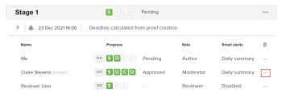

# Senden von E-Mail-Nachrichten an Prüfer im Rahmen eines Testversands

Während des Prüfungs- und Genehmigungsprozesses können Sie eine Nachricht an einen oder alle Prüfer eines Korrekturabzugs senden. Nachrichten sind eine einfache Möglichkeit, Prüfende daran zu erinnern, ihre Prüfung eines Korrekturabzugs abzuschließen oder andere Informationen im Zusammenhang mit dem Korrekturabzug bereitzustellen.

Sie können zwischen dem Versand einer allgemeinen Erinnerungs-E-Mail oder dem Versand einer benutzerdefinierten Nachricht an einen oder alle mit einem bestimmten Stadium verbundenen Benutzer wählen.

## Zugriffsanforderungen

+++ Erweitern Sie , um die Zugriffsanforderungen für die -Funktion in diesem Artikel anzuzeigen.

<table style="table-layout:auto"> 
 <col> 
 <col> 
 <tbody> 
  <tr> 
   <td role="rowheader">Adobe Workfront-Paket</td> 
   <td> 
Beliebig
 </td> 
  </tr> 
  <tr> 
   <td role="rowheader">Adobe Workfront-Lizenz</td> 
   <td>
   
Standard

   
Arbeit oder Plan

   </td> 
  </tr> 
  <tr> 
   <td role="rowheader">Proof-Berechtigungsprofil </td> 
   <td>Manager oder höher</td> 
  </tr> 
  <tr> 
   <td role="rowheader">Rolle des Korrekturabzugs</td> 
   <td>Autor oder Moderator</td> 
  </tr> 
  <tr> 
   <td role="rowheader">Konfigurationen der Zugriffsebene</td> 
   <td> 
Zugriff auf Dokumente bearbeiten
 </td> 
  </tr> 
 </tbody> 
</table>

Weitere Informationen finden Sie unter [Zugriffsanforderungen in der Dokumentation zu Workfront](/help/quicksilver/administration-and-setup/add-users/access-levels-and-object-permissions/access-level-requirements-in-documentation.md).

+++

## Senden von E-Mail-Nachrichten an Benutzer im Rahmen eines Testversands

1. Suchen Sie das Dokument für den Korrekturabzug, der die Benutzer enthält, die Sie benachrichtigen möchten.
1. Bewegen Sie den Mauszeiger über das Dokument und klicken Sie dann auf **Proofing-Workflow**.

   

1. Um eine Nachricht an alle Benutzer auf der Bühne zu senden, klicken Sie auf das **Mehr**-Menü auf der Bühne und wählen Sie **Nachricht an alle**.

   

1. Um eine Nachricht an einen einzelnen Benutzer zu senden, klicken Sie auf das Menü **Mehr** neben dem Benutzer und wählen Sie **Nachricht** aus.

   

1. Geben **im Abschnitt &quot;**&quot; die folgenden Informationen an:

   <table style="table-layout:auto"> 
    <col> 
    <col> 
    <tbody> 
     <tr> 
      <td role="rowheader">Personen per E-Mail benachrichtigen</td> 
      <td>Diese Option kann nicht deaktiviert werden. Alle Benutzer erhalten die Nachricht per E-Mail.</td> 
     </tr> 
     <tr> 
      <td role="rowheader">Benutzerdefinierte Nachricht verwerfen</td> 
      <td> 
Klicken Sie <strong>Benutzerdefinierte Nachricht verwerfen</strong>, wenn Sie nur den standardmäßigen E-Mail-Inhalt einbeziehen möchten.
 
Die standardmäßige Erinnerungs-E-Mail enthält die folgenden Informationen:
 
       <ul> 
        <li>Persönlicher Link zum Korrekturabzug/  des Korrekturabzugsbildes </li> 
        <li>Die folgenden Details des Korrekturabzugs: Name des Korrekturabzugs, Versionsnummer, Ordnername (falls zutreffend) und Liste der Prüfer und deren Fortschritt beim Korrekturabzug.</li> 
       </ul> </td> 
     </tr> 
     <tr> 
      <td role="rowheader">Betreff</td> 
      <td>Geben Sie einen Nachrichtenbetreff ein.</td> 
     </tr> 
     <tr> 
      <td role="rowheader">Nachricht</td> 
      <td>Geben Sie den Nachrichteninhalt ein.</td> 
     </tr> 
    </tbody> 
   </table>

1. Klicken Sie auf **Senden.**
