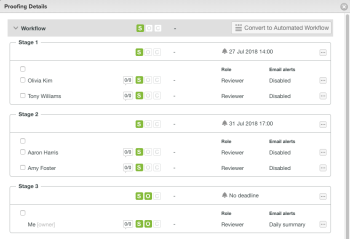

# Übersicht über automatisierte Workflow-Phasen

Testsendungen sind Zeitsegmente, in denen verschiedene Benutzer einen Testversand überprüfen. Wenn der Testversand von einer Phase zur nächsten wechselt, benachrichtigt Adobe Workfront die Prüfer, dass sie darüber informiert werden, wann sie daran arbeiten müssen.

Phasen treten in zwei verschiedenen Situationen auf:

* [Erstellen eines Testversands mit einem automatisierten Workflow](#create-a-proof-with-an-automated-workflow)
* [Zuweisen von Terminen für verschiedene Prüfer zu einem Testversand](#assign-deadlines-for-different-reviewers-on-a-proof)

## Erstellen eines Testversands mit einem automatisierten Workflow {#create-a-proof-with-an-automated-workflow}

Wenn Sie einem Testversand einen automatisierten Workflow hinzufügen, richten Sie die Phasen der Prüfungsarbeit ein, die Sie durchführen möchten.

Wenn Sie mit einem automatischen Workflow Testsendungen für einen Testversand einrichten:

* Sie können die Bühnen so konfigurieren, dass sie nacheinander oder gleichzeitig ausgeführt werden.
* Sie können einige Phasen so konfigurieren, dass sie erst nach Abschluss einer vorherigen Phase aktiv werden.
* Sie können einige Bühnen privat machen. Dies ist beispielsweise für eine Agentur nützlich, die einen Testversand überprüft, bevor er für einen Kunden freigegeben wird, und die resultierenden Kommentare nicht für den Kunden sichtbar machen möchte.

Anweisungen zum Erstellen von Testsendungen für einen Testversand mit einem automatisierten Workflow finden Sie unter [Erstellen eines erweiterten Testversands mit einem automatisierten Workflow](../../../review-and-approve-work/proofing/creating-proofs-within-workfront/create-automated-proof-workflow.md).

>[!NOTE]
>
>Wenn ein Benutzer in keiner Phase enthalten ist, aber Zugriff auf das Dokument hat und den Testversand öffnet, erstellt das System eine Phase mit dem Namen *Workfront*.
>
>Dem Benutzer, der den Testversand geöffnet hat, wird die unter Einrichtung > Überprüfen und Genehmigung > Rollen für Nicht-Empfänger zugewiesen, die einen Testversand öffnen.

## Zuweisen von Terminen für verschiedene Prüfer zu einem Testversand {#assign-deadlines-for-different-reviewers-on-a-proof}

Wenn Sie den Prüfern auf einem Testversand unterschiedliche Testfristen zuweisen, erstellt das System eine Phase für jeden Termin und gruppiert die Validierer für jeden Termin in der entsprechenden Phase. 

**Beispiel:** Beispiel: Wenn Sie einen Testversand mit vier Validierungsverantwortlichen erstellen:

* Für die Prüfer Olivia und Tony geben Sie einen Termin für 14:00 in ein paar Tagen an.
* Für Aaron und Amy legen Sie einen Termin für 17:00 Uhr ein paar Tage später fest.
* Sie legen keinen Termin für sich selbst fest.

Das System erstellt eine Phase für jede dieser drei &quot;Gruppen&quot;von Validierern:

Wenn Sie den Testversand für einen anderen Validierer freigeben und keinen Termin angeben, fügt Workfront den Benutzer zu Stufe 3 hinzu, für die kein Termin festgelegt wurde. 
