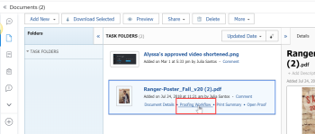
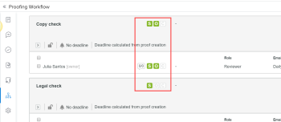

# Testversand-Fortschritt und -Status - Übersicht

Sie können Informationen darüber, wie ein Korrekturabzug im Überprüfungsprozess voranschreitet, und eine allgemeine Zusammenfassung des Entscheidungsstatus des Korrekturabzugs im Bereich Dokumente anzeigen.

## Übersicht über den Testversand

Der Korrekturabzug-Fortschritt gibt die Arbeit an, die an einem Korrekturabzug durchgeführt wurde, und zwar von dem Zeitpunkt, an dem Sie den Korrekturabzug an die Empfänger senden, bis zu dem Zeitpunkt, an dem sie eine Entscheidung über den Korrekturabzug treffen. Die Fortschrittssymbole S, O, C und D werden neben dem Namen des Korrekturabzugs angezeigt und geben Informationen zum Fortschritt des Korrekturabzugs an.

<table style="table-layout:auto"> 
 <col> 
 <col> 
 <thead> 
  <tr> 
   <td> 
<strong>Fortschrittssymbol</strong> 
 </td> 
   <td> 
<strong>Beschreibung</strong> 
 </td> 
  </tr> 
 </thead> 
 <tbody> 
  <tr> 
   <td> 
  
 
<strong>gesendet</strong> 
 </td> 
   <td> 
Der Testversand wurde an zugewiesene Empfänger gesendet.
 </td> 
  </tr> 
  <tr> 
   <td> 
<strong></strong> 
 
<strong>Geöffnet</strong> 
 </td> 
   <td> 
Alle zugewiesenen Empfänger öffnen die Seite mit den Details des Korrekturabzugs oder Testversands.
 </td> 
  </tr> 
  <tr> 
   <td> 
<strong></strong> 
 
<strong>Kommentare abgegeben</strong> 
 </td> 
   <td> 
Alle zugewiesenen Empfänger geben mindestens einen Kommentar zum Korrekturabzug ab.
 
Wenn dem Korrekturabzug keine Prüfer zugewiesen sind, wird <strong> Symbol „C</strong> nicht in der Fortschrittsleiste angezeigt.
 </td> 
  </tr> 
  <tr> 
   <td> 
  
 
<strong>Entscheidung getroffen</strong> 
 </td> 
   <td> 
Alle zugewiesenen Genehmiger treffen eine Entscheidung über den Korrekturabzug, alle zugewiesenen Genehmiger treffen eine Entscheidung über den Korrekturabzug, es sei denn, die Erstellerin des Korrekturabzugs gibt an, dass nur eine Entscheidung erforderlich ist.
 
Wenn für den Korrekturabzug keine genehmigenden Personen (Entscheidungsträger) vorgesehen sind, wird das Symbol <strong>D</strong> nicht in der Fortschrittsleiste angezeigt. 
 </td> 
  </tr> 
 </tbody> 
</table>

Die Fortschrittssymbole können in den folgenden Farben angezeigt werden, um bestimmte Informationen über den Fortschritt des Korrekturabzugs anzuzeigen:

* **Grün**: Abgeschlossen.
* **Weiß**: Nicht abgeschlossen.
* **Orange**: Nicht vollständig und die Frist beträgt weniger als 24 Stunden.
* **Rot**: Nicht vollständig und nach Fristablauf.

<!--
<h3 data-mc-conditions="QuicksilverOrClassic.Draft mode">Levels of proof progress</h3>
-->

<!--

Workfront Proof uses the progress icons to track a proof's progress at each of the following levels:

-->

<!--
  <li data-mc-conditions="QuicksilverOrClassic.Draft mode">For each reviewer, based on that person's activity on the proof.&nbsp;</li>
  -->

<!--
  <li data-mc-conditions="QuicksilverOrClassic.Draft mode">For each stage, based on the progress the reviewer on the stage who is most behind in the proofing process.&nbsp;To learn more about stages, see <a href="../../../review-and-approve-work/proofing/proofing-overview/stages.md" class="MCXref xref">Automated Workflow Stages overview</a>.</li>
  -->

<!--
  <li data-mc-conditions="QuicksilverOrClassic.Draft mode">For the proof, based on the progress of the stage (group of reviewers) who is the most behind in the proofing process.</li>
  -->

<!--

For an example of how Workfront Proof determines progress using the reviewer or stage that is most behind,&nbsp;suppose three reviewers on a proof need to make a&nbsp;decision. If two of them have made their&nbsp;decision&nbsp;but the third has not, the progress bar for the proof does not show&nbsp;the D in green because of the outstanding&nbsp;decision.

-->

<!--

If the Primary Decision Maker setting is selected on a proof and the primary decision maker submits a decision, the D in the proof progress bar turns&nbsp;green for all reviewers because no other decisions are required.

-->

<!--

Similarly, if the Only One Decision Required setting is selected on a proof and any reviewer submits a decision, the D in the proof progress bar turns&nbsp;green for all reviewers because no other decisions are required.

-->

## Übersicht über den Teststatus

Der Korrekturabzugsstatus zeigt den Status der Entscheidungen an, die für den Korrekturabzug erforderlich sind. Der Status des Testversands wird vom Teilnehmer mit dem „Worst Case“-Status gesteuert. Angenommen, es gibt drei Entscheidungen zum Korrekturabzug: zwei haben den Status **Akzeptiert** und eine den Status **Abgelehnt**. Die Worst-Case-Entscheidung **Abgelehnt** überlagert die anderen Entscheidungen, und der Gesamtstatus des Korrekturabzugs wird als **Abgelehnt** angezeigt. 

Die Standardstatusoptionen lauten wie folgt:

* Ausstehend
* Genehmigt
* Genehmigt mit Änderungen
* Erforderliche Änderungen
* Nicht relevant

Wenn benutzerdefinierte Entscheidungen in Ihrem Konto konfiguriert sind, spiegeln die Statusoptionen Ihre benutzerdefinierten Entscheidungseinstellungen wider.

<!--
<h2 data-mc-conditions="QuicksilverOrClassic.Draft mode">Viewing proof progress and status</h2>
-->

<!--

 You can view the progress and status of proofs for individual documents. 

-->

<!--
  <li data-mc-conditions="QuicksilverOrClassic.Draft mode"><a href="#view-proof-progress-and-status-for-a-document" class="MCXref xref">View proof progress and status&nbsp;for a document</a> </li>
  -->

<!--
  <li data-mc-conditions="QuicksilverOrClassic.Draft mode"><a href="#view-proof-approval-information-in-home" class="MCXref xref">View proof approval information&nbsp;in Home</a> </li>
  -->

<!--
<h3 data-mc-conditions="QuicksilverOrClassic.Draft mode" id="view-proof-progress-and-status-for-a-document">View proof progress and status&nbsp;for a document</h3>
-->

<!--
   <li value="1" data-mc-conditions="QuicksilverOrClassic.Draft mode">If a proof has not already been generated for the document in Adobe Workfront, generate it, as described in the articles.</li>
   -->

<!--
   <li value="2" data-mc-conditions="QuicksilverOrClassic.Draft mode">In the Documents area, under the proof's name, click <strong>Proof Details</strong>.</li>
   -->

<!--
   <li value="3" data-mc-conditions="QuicksilverOrClassic.Draft mode">In the <strong>Proofing Details</strong> box that appears, the proof's progress for each stage, then click <strong>Done</strong>.</li>
   -->

<!--
   
Under the proof's name, click <strong>Proofing Workflow</strong>.

   -->

<!--
   
 
   
   -->
<!--
   <MadCap:conditionalText data-mc-conditions="QuicksilverOrClassic.Draft mode">
   These screenshots will need to change with new terminology ("Review Workflow" for this one?)
   </MadCap:conditionalText>
     

   -->

<!--
   
In the Workflow information that appears, scroll down to see the proof's progress for each stage:

   -->

<!--
   
  

   -->

<!--
<h3 data-mc-conditions="QuicksilverOrClassic.Draft mode" id="view-proof-approval-information-in-home">View proof approval information&nbsp;in Home</h3>
-->

<!--

You can view information about proofs that you have submitted for approval. Proof approval information is displayed in the Home area only while the proof is pending approval.&nbsp;For information about how to view information about proof approvals in the Home area, see&nbsp;<a href="../../../review-and-approve-work/manage-approvals/view-approvals.md" class="MCXref xref">View approvals </a>.

-->
