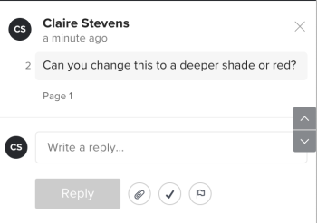

# Korrekturabzugskommentare auflösen

Sie können Kommentare als aufgelöst markieren, nachdem sie adressiert wurden. Sie können einen Kommentar, den Sie oder eine andere Überprüfende aufgelöst haben, erneut öffnen.

## Zugriffsanforderungen

+++ Erweitern Sie , um die Zugriffsanforderungen für die -Funktion in diesem Artikel anzuzeigen.

<table style="table-layout:auto"> 
 <col> 
 <col> 
 <tbody> 
  <tr> 
   <td role="rowheader">Adobe Workfront-Paket</td> 
   <td> 
Beliebig
 </td> 
  </tr> 
  <tr> 
   <td role="rowheader">Adobe Workfront-Lizenz</td> 
   <td> 
Beliebig
</td> 
  </tr> 
  <tr> 
   <td role="rowheader">Proof-Berechtigungsprofil</td> 
   <td>Manager oder höher</td> 
  </tr> 
  <tr> 
   <td role="rowheader">Rolle des Korrekturabzugs</td> 
   <td>Autor oder Moderator</td> 
  </tr> 
  <tr> 
   <td role="rowheader">Konfigurationen der Zugriffsebene</td> 
   <td> 
Zugriff auf Dokumente bearbeiten
 </td> 
  </tr> 
 </tbody> 
</table>

Weitere Informationen finden Sie unter [Zugriffsanforderungen in der Dokumentation zu Workfront](/help/quicksilver/administration-and-setup/add-users/access-levels-and-object-permissions/access-level-requirements-in-documentation.md).

+++

## Einen Kommentar auflösen

1. Gehen Sie zu dem Projekt, der Aufgabe oder dem Problem, das/das das Dokument enthält, und wählen Sie dann **Dokumente**.
1. Suchen Sie den benötigten Korrekturabzug und klicken Sie dann auf **Korrekturabzug öffnen**.

1. (Bedingt) Wenn der Kommentarbereich nicht geöffnet ist, klicken **oben rechts auf** Kommentare anzeigen“.
1. Kommentar auswählen.
1. Klicken Sie auf das Häkchensymbol in der rechten unteren Ecke des Kommentars. Ein grünes Häkchen wird in der oberen linken Ecke des Kommentars angezeigt und eine Kennzeichnung „Thread aufgelöst“ und eine Meldung werden darunter angezeigt. Der Benutzer, der den Kommentar gesendet hat, erhält eine E-Mail-Benachrichtigung, dass der Kommentar aufgelöst wurde.

   

## Erneutes Öffnen eines aufgelösten Kommentars

1. Gehen Sie zu dem Projekt, der Aufgabe oder dem Problem, das/das das Dokument enthält, und wählen Sie dann **Dokumente**.
1. Suchen Sie den benötigten Korrekturabzug und klicken Sie dann auf **Korrekturabzug öffnen**.

1. (Bedingt) Wenn der Kommentarbereich nicht geöffnet ist, klicken **oben rechts auf** Kommentare anzeigen“.
1. Kommentar auswählen.
1. Klicken Sie auf das grüne Häkchen in der rechten unteren Ecke des Kommentars (rechts neben der Schaltfläche **Antworten**). Das Häkchen in der oberen linken Ecke des Kommentars verschwindet und eine Beschriftung „Thread wieder geöffnet“ und eine Nachricht werden darunter angezeigt. Der Benutzer, der den Kommentar gesendet hat, erhält eine E-Mail-Benachrichtigung, dass der Kommentar erneut geöffnet wurde.

   
