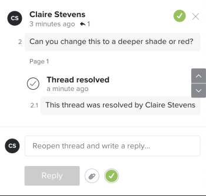

# Kommentare zum Testversand auflösen

Sie können Kommentare markieren, die nach der Bearbeitung aufgelöst wurden. Sie können einen Kommentar, den Sie oder ein anderer Validierer aufgelöst haben, erneut öffnen.

## Zugriffsanforderungen

Sie müssen über folgenden Zugriff verfügen, um die Schritte in diesem Artikel ausführen zu können:

<table style="table-layout:auto"> 
 <col> 
 <col> 
 <tbody> 
  <tr> 
   <td role="rowheader">Adobe Workfront-Plan*</td> 
   <td> 
Aktueller Plan: Pro oder höher
 
oder
 
Veralteter Plan: Wählen Sie oder Premium
 
Weitere Informationen zum Testen des Zugriffs mit den verschiedenen Plänen finden Sie unter <a href="/help/quicksilver/administration-and-setup/manage-workfront/configure-proofing/access-to-proofing-functionality.md" class="MCXref xref">Zugriff auf die Testfunktion in Workfront</a>.
 </td> 
  </tr> 
  <tr> 
   <td role="rowheader">Adobe Workfront-Lizenz*</td> 
   <td> 
Aktueller Plan: Arbeit oder Plan
 
Veralteter Plan: Beliebig (Sie müssen die Testfunktion für den Benutzer aktiviert haben)
 </td> 
  </tr> 
  <tr> 
   <td role="rowheader">Proof-Berechtigungsprofil </td> 
   <td>Manager oder höher</td> 
  </tr> 
  <tr> 
   <td role="rowheader">Proof role</td> 
   <td>Autor oder Moderator</td> 
  </tr> 
  <tr> 
   <td role="rowheader">Konfigurationen auf Zugriffsebene*</td> 
   <td> 
Zugriff auf Dokumente bearbeiten
 
Weitere Informationen zum Anfordern von zusätzlichem Zugriff finden Sie unter <a href="../../../../workfront-basics/grant-and-request-access-to-objects/request-access.md" class="MCXref xref">Anfordern des Zugriffs auf Objekte </a>.
 </td> 
  </tr> 
 </tbody> 
</table>

&#42;Wenden Sie sich an Ihren Workfront- oder Workfront Proof-Administrator, um zu erfahren, welchen Plan, welche Rolle oder welches Profil für die Testberechtigung Sie haben.

## Kommentar auflösen

1. Wechseln Sie zum Projekt, zur Aufgabe oder zum Problem, das/das das Dokument enthält, und wählen Sie dann **Dokumente** aus.
1. Suchen Sie den gewünschten Testversand und klicken Sie dann auf **Testversand öffnen**.

1. (Bedingt) Wenn der Kommentarbereich nicht geöffnet ist, klicken Sie oben rechts auf **Kommentare anzeigen** .
1. Wählen Sie den Kommentar aus.
1. Klicken Sie auf das Häkchen-Symbol in der rechten unteren Ecke des Kommentars. In der linken oberen Ecke des Kommentars wird ein grünes Häkchen angezeigt und unter dem Titel &quot;Durch Thread aufgelöst&quot;wird eine Meldung angezeigt. Der Benutzer, der den Kommentar gesendet hat, erhält eine E-Mail-Benachrichtigung, dass der Kommentar aufgelöst wurde.

   

## Aufgelösten Kommentar erneut öffnen

1. Wechseln Sie zum Projekt, zur Aufgabe oder zum Problem, das/das das Dokument enthält, und wählen Sie dann **Dokumente** aus.
1. Suchen Sie den gewünschten Testversand und klicken Sie dann auf **Testversand öffnen**.

1. (Bedingt) Wenn der Kommentarbereich nicht geöffnet ist, klicken Sie oben rechts auf **Kommentare anzeigen** .
1. Wählen Sie den Kommentar aus.
1. Klicken Sie auf das grüne Häkchensymbol in der rechten unteren Ecke des Kommentars (rechts neben der Schaltfläche **Antworten** ). Das Häkchen in der linken oberen Ecke des Kommentars verschwindet und darunter wird die Bezeichnung &quot;Thread reopened&quot; und eine Meldung angezeigt. Der Benutzer, der den Kommentar gesendet hat, erhält eine E-Mail-Benachrichtigung, dass der Kommentar erneut geöffnet wurde.

   
