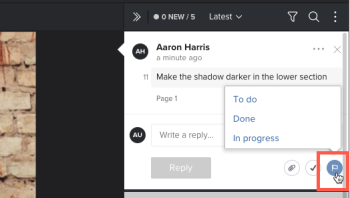

# Verwenden von Aktionen für Testversand-Kommentare

Sie können Aktionen verwenden, um zu verfolgen, was bei jedem Kommentar-Thread auf einem Testversand passieren muss. Eine Aktion ist ein Begriff oder eine Wortgruppe wie &quot;Aufgaben&quot;, &quot;Fertig&quot;oder &quot;Gestartet&quot;, die bzw. die Ihr Adobe Workfront-Administrator im System für Ihre Organisation konfiguriert. Überprüfer können einem Kommentar eine Aktion hinzufügen, um Informationen darüber bereitzustellen, was getan wurde oder was als Antwort auf den Kommentar noch getan werden muss.

Informationen dazu, wie Ihr Workfront-Administrator Aktionen aktiviert und konfiguriert, finden Sie unter .

## Zugriffsanforderungen

+++ Erweitern Sie , um die Zugriffsanforderungen für die Funktionalität in diesem Artikel anzuzeigen.

Sie müssen über folgenden Zugriff verfügen, um die Schritte in diesem Artikel ausführen zu können:

<table style="table-layout:auto"> 
 <col> 
 <col> 
 <tbody> 
  <tr> 
   <td role="rowheader">Adobe Workfront-Plan*</td> 
   <td> 
Aktueller Plan: Pro oder höher
 
oder
 
Veralteter Plan: Wählen Sie oder Premium
 
Weitere Informationen zum Testen des Zugriffs mit den verschiedenen Plänen finden Sie unter <a href="/help/quicksilver/administration-and-setup/manage-workfront/configure-proofing/access-to-proofing-functionality.md" class="MCXref xref">Zugriff auf die Testfunktion in Workfront</a>.
 </td> 
  </tr> 
  <tr> 
   <td role="rowheader">Adobe Workfront-Lizenz*</td> 
   <td> 
Aktueller Plan: Arbeit oder Plan
 
Veralteter Plan: Beliebig (Sie müssen die Testfunktion für den Benutzer aktiviert haben)
 </td> 
  </tr> 
  <tr> 
   <td role="rowheader">Proof-Berechtigungsprofil </td> 
   <td>Manager oder höher</td> 
  </tr> 
  <tr> 
   <td role="rowheader">Rolle des Korrekturabzugs</td> 
   <td>Autor oder Moderator</td> 
  </tr> 
  <tr> 
   <td role="rowheader">Konfigurationen auf Zugriffsebene*</td> 
   <td> 
Zugriff auf Dokumente bearbeiten
 
Weitere Informationen zum Anfordern von zusätzlichem Zugriff finden Sie unter <a href="../../../../workfront-basics/grant-and-request-access-to-objects/request-access.md" class="MCXref xref">Anfordern des Zugriffs auf Objekte </a>.
 </td> 
  </tr> 
 </tbody> 
</table>

&#42;Wenden Sie sich an Ihren Workfront- oder Workfront Proof-Administrator, um zu erfahren, welchen Plan, welche Rolle oder welches Profil für die Testberechtigung Sie haben.

+++

## Verwenden von Aktionen für Kommentare

So wenden Sie eine Aktion auf einen vorhandenen Kommentar im Testversand-Viewer an:

1. Wechseln Sie zum Projekt, zur Aufgabe oder zum Problem, das/das das Dokument enthält, und wählen Sie dann **Dokumente** aus.
1. Suchen Sie den gewünschten Testversand und klicken Sie dann auf **Testversand öffnen**.

1. Führen Sie einen der folgenden Schritte aus:

   * Klicken Sie auf das Flag-Symbol in der rechten unteren Ecke des Kommentars und klicken Sie dann im Dropdown-Menü auf die gewünschte Aktion.

     

   * Klicken Sie auf das Symbol **Mehr** (drei horizontale Punkte auf den Kommentar) und dann im unteren Bereich des angezeigten Dropdownmenüs auf die gewünschte Aktion.

     

1. (Optional) Wenn Sie Ihre Meinung ändern, können Sie einen der folgenden Schritte ausführen:

   * Klicken Sie erneut auf das Flag-Symbol oder das Symbol **Mehr** und dann auf **Aktion entfernen**.

   * Wiederholen Sie Schritt 1, um eine andere Aktion anzuwenden.

>[!TIP]
>
>Sie können Kommentare nach einer bestimmten Aktion filtern. Weitere Informationen finden Sie unter [Kommentare zum Suchen, Filtern und Sortieren nach Testversand](../../../../review-and-approve-work/proofing/reviewing-proofs-within-workfront/comment-on-a-proof/search-filter-sort-comments.md).
