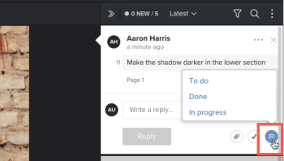

# Verwenden von Aktionen für Kommentare zu Korrekturabzügen

Sie können Aktionen verwenden, um zu verfolgen, was in jedem Kommentar-Thread in einem Korrekturabzug passieren muss. Eine Aktion ist ein Wort oder eine Wortgruppe wie „Aufgaben“, „Erledigt“ oder „In Bearbeitung“, das bzw. die von Ihrem Adobe Workfront-Administrator im System für Ihr Unternehmen konfiguriert wird. Reviewer können einem Kommentar eine Aktion hinzufügen, um Informationen darüber bereitzustellen, was getan wurde oder was als Reaktion auf den Kommentar noch getan werden muss.

Weitere Informationen dazu, wie Workfront-Admins Aktionen aktivieren und konfigurieren, finden Sie unter .

## Zugriffsanforderungen

+++ Erweitern, um die Zugriffsanforderungen für die in diesem Artikel beschriebene Funktionalität anzuzeigen.

<table style="table-layout:auto"> 
 <col> 
 <col> 
 <tbody> 
  <tr> 
   <td role="rowheader">Adobe Workfront-Paket</td> 
   <td> 
Beliebig
 </td> 
  </tr> 
  <tr> 
   <td role="rowheader">Adobe Workfront-Lizenz</td> 
   <td> 
Beliebig
</td> 
  </tr> 
  <tr> 
   <td role="rowheader">Korrekturabzug-Berechtigungsprofil </td> 
   <td>Manager oder höher</td> 
  </tr> 
  <tr> 
   <td role="rowheader">Rolle des Korrekturabzugs</td> 
   <td>Autor oder Moderator</td> 
  </tr> 
  <tr> 
   <td role="rowheader">Konfigurationen der Zugriffsebene</td> 
   <td> 
Zugriffrecht „Bearbeiten“ für Dokumente
 </td> 
  </tr> 
 </tbody> 
</table>

Weitere Informationen finden Sie unter [Zugriffsanforderungen](/help/quicksilver/administration-and-setup/add-users/access-levels-and-object-permissions/access-level-requirements-in-documentation.md) in der Dokumentation zu Workfront.

+++

## Aktionen für Kommentare verwenden

So wenden Sie eine Aktion auf einen vorhandenen Kommentar im Proofing Viewer an:

1. Gehen Sie zu dem Projekt, der Aufgabe oder dem Problem, das/das das Dokument enthält, und wählen Sie dann **Dokumente**.
1. Suchen Sie den benötigten Korrekturabzug und klicken Sie dann auf **Korrekturabzug öffnen**.

1. Führen Sie einen der folgenden Schritte aus:

   * Klicken Sie unten rechts im Kommentar auf das Flag-Symbol und dann im Dropdown-Menü auf die gewünschte Aktion.

     

   * Klicken Sie auf das **Mehr**-Symbol (drei horizontale Punkte auf dem Kommentar) und klicken Sie dann im unteren Bereich des angezeigten Dropdown-Menüs auf die gewünschte Aktion.

     

1. (Optional) Wenn Sie Ihre Meinung ändern, können Sie einen der folgenden Schritte ausführen:

   * Klicken Sie erneut auf das Flag-Symbol oder das **Mehr**-Symbol und dann auf **Aktion entfernen**.

   * Wiederholen Sie Schritt 1, um eine andere Aktion anzuwenden.

>[!TIP]
>
>Sie können Kommentare nach einer bestimmten Aktion filtern. Weitere Informationen finden Sie unter [Suchen, Filtern und Sortieren von Korrekturabzugskommentaren](../../../../review-and-approve-work/proofing/reviewing-proofs-within-workfront/comment-on-a-proof/search-filter-sort-comments.md).
