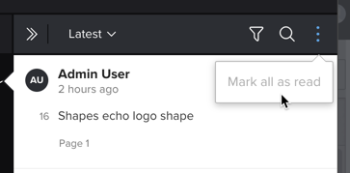

# Kommentare zu Korrekturabzügen anzeigen und beantworten

Sie können Korrekturabzugskommentare anderer Prüfer anzeigen und darauf antworten.

## Zugriffsanforderungen

+++ Erweitern Sie , um die Zugriffsanforderungen für die -Funktion in diesem Artikel anzuzeigen.

Sie müssen über folgenden Zugriff verfügen, um die Schritte in diesem Artikel ausführen zu können:

<table style="table-layout:auto"> 
 <col> 
 <col> 
 <tbody> 
  <tr> 
   <td role="rowheader">Adobe Workfront-Plan*</td> 
   <td> 
Aktueller Plan: Pro oder höher
 
oder
 
Legacy-Plan: Auswählen oder Premium
 
Weitere Informationen zum Proofing-Zugriff für die verschiedenen Pläne finden Sie unter <a href="/help/quicksilver/administration-and-setup/manage-workfront/configure-proofing/access-to-proofing-functionality.md" class="MCXref xref">Zugriff auf die Proofing-Funktionalität in Workfront</a>.
 </td> 
  </tr> 
  <tr> 
   <td role="rowheader">Adobe Workfront-Lizenz*</td> 
   <td> 
Aktueller Plan: Arbeits- oder Plan
 
Legacy-Plan: Beliebig (Proofing muss für den Benutzer aktiviert sein)
 </td> 
  </tr> 
  <tr> 
   <td role="rowheader">Proof-Berechtigungsprofil </td> 
   <td>Manager oder höher</td> 
  </tr> 
  <tr> 
   <td role="rowheader">Konfigurationen der Zugriffsebene*</td> 
   <td> 
Zugriff auf Dokumente bearbeiten
 
Informationen zum Anfordern zusätzlicher Zugriffsberechtigungen finden Sie unter <a href="../../../../workfront-basics/grant-and-request-access-to-objects/request-access.md" class="MCXref xref">Anfordern von Zugriffsberechtigungen für Objekte </a>.
 </td> 
  </tr> 
 </tbody> 
</table>

&#42;Wenden Sie sich an Ihren Workfront- oder Workfront Proof-Administrator, um herauszufinden, über welchen Plan, welche Rolle oder welches Proof-Berechtigungsprofil Sie verfügen.

+++

## Anzeigen von Kommentaren im Proofing Viewer

Jeder Kommentar zeigt die folgenden Informationen an:

* Name des Benutzers, der den Kommentar abgegeben hat
* Die Seitenzahl der Seite, auf der der Kommentar abgegeben wurde (bei statischen Korrekturabzügen mit mehr als einer Seite)
* Die Bildnummer oder der Bereich des Materials, in dem der Kommentar gemacht wurde (in Videobeweisen)

  Wenn der Kommentar, den Sie anzeigen, auf eine Reihe von Videomaterial angewendet wurde, können Sie auf die Schaltfläche „Abspielen“ klicken, um die Reihe zu überprüfen.

* Im Kommentar enthaltener Text
* Alle Anlagen, die zum Kommentar hochgeladen wurden

So zeigen Sie Kommentare im Proofing Viewer an:

1. Gehen Sie zu dem Projekt, der Aufgabe oder dem Problem, das/das das Dokument enthält, und wählen Sie dann **Dokumente**.
1. Suchen Sie den benötigten Korrekturabzug und klicken Sie dann auf **Korrekturabzug öffnen**.

1. (Bedingt) Wenn der Kommentarbereich nicht geöffnet ist, klicken **oben rechts auf** Kommentare anzeigen“.
1. Klicken Sie auf einen beliebigen Kommentar, um die Kommentarzeichen für den Korrekturabzug anzuzeigen.
1.  oder
1.  Bewegen Sie in einem Videobeweis den Mauszeiger über den Punkt in der Zeitleiste, an dem ein Kommentar abgegeben wurde, und klicken Sie dann auf die nummerierte Sprechblase, die angezeigt wird.
1. 

1. (Optional) Um die Größe der Kommentarliste anzupassen, bewegen Sie den Mauszeiger über den linken Rand des Kommentarbereichs (nicht über den Kommentar, der derzeit geöffnet ist), bis sich der Mauszeiger für die horizontale Größenanpassung ändert, und ziehen Sie dann den Rand an die gewünschte Position.
1. 

## Kommentare zu Korrekturabzügen auf der Registerkarte Aktualisierungen anzeigen

In Workfront können Sie Korrekturabzugskommentare anzeigen, ohne die Korrekturabzugsansicht zu starten.

1. Gehen Sie zu dem Projekt, der Aufgabe oder dem Problem, das/das das Dokument enthält, und wählen Sie dann **Dokumente**.
1. Klicken Sie auf die Zeile mit dem Dokument und dann auf **Zusammenfassung** Symbol  rechts auf der Seite.\
   Die Kommentare werden im Abschnitt Aktualisierungen der Dokumentzusammenfassung angezeigt.

## Alle Kommentare als gelesen markieren

Als Prüfer eines Korrekturabzugs können Sie schnell alle Kommentare als gelesen markieren.

1. Gehen Sie zu dem Projekt, der Aufgabe oder dem Problem, das/das das Dokument enthält, und wählen Sie dann **Dokumente**.
1. Suchen Sie den benötigten Korrekturabzug und klicken Sie dann auf **Korrekturabzug öffnen**.

1. (Bedingt) Wenn der Kommentarbereich nicht geöffnet ist, klicken **oben rechts auf** Kommentare anzeigen“.

1. Klicken Sie über der Kommentarliste auf das Symbol **Mehr** und dann auf **Alle als gelesen markieren**.

1. 

## Antworten auf Korrekturabzugskommentare von der Korrekturabzugsansicht

1. Gehen Sie zu dem Projekt, der Aufgabe oder dem Problem, das/das das Dokument enthält, und wählen Sie dann **Dokumente**.
1. Suchen Sie den benötigten Korrekturabzug und klicken Sie dann auf **Korrekturabzug öffnen**.

1. (Bedingt) Wenn der Kommentarbereich nicht geöffnet ist, klicken **oben rechts auf** Kommentare anzeigen“.
1. Klicken Sie auf einen beliebigen Kommentar, um die Kommentarzeichen für den Korrekturabzug anzuzeigen.

   >[!TIP]
   >
   >Verwenden Sie die Schaltflächen **Vorheriger** und **Nächster Kommentar** am rechten Bildschirmrand, um durch Kommentare zu navigieren.

1. Geben Sie Ihre Antwort in das Feld **Antwort hinzufügen** ein.
1. (Optional) Um eine andere validierungsverantwortliche Person über Ihre Antwort zu benachrichtigen, geben Sie in das Kommentarfeld @ ein und geben Sie dann den Namen oder die E-Mail-Adresse des Benutzers ein. Weitere Informationen finden Sie unter [Taggen von Benutzern zum Freigeben eines Korrekturabzugs](../../../../review-and-approve-work/proofing/reviewing-proofs-within-workfront/comment-on-a-proof/tag-users-to-share-proof.md).
1. (Optional) Um eine Datei zu einem Kommentar hinzuzufügen, führen Sie einen der folgenden Schritte aus:

   * Klicken Sie auf das Papierklammersymbol, navigieren Sie zur hochzuladenden Datei und wählen Sie diese aus.
   * Ziehen Sie eine Datei aus einer Position auf Ihrem Computer und legen Sie sie im Kommentarbereich ab.

1. Klicken Sie **Antworten**.
