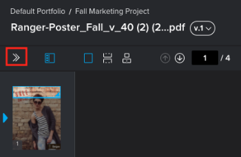

# Benachrichtigungen für Testversandkommentare und -entscheidungen verwalten

Bei der Arbeit an einem Testversand, sei es als Adobe Workfront-Benutzer oder als externer Mitarbeiter, können Sie angeben, welche E-Mail-Benachrichtigungen Sie zu Kommentaren und Entscheidungen bezüglich des Testversands erhalten möchten. Weitere Informationen finden Sie unter [Benachrichtigungen über Testversandkommentare und Entscheidungen - Überblick](../../../review-and-approve-work/proofing/proofing-overview/notifications-proof-comments-decisions.md).

>[!NOTE]
>
>Diese Benachrichtigungen unterscheiden sich von den E-Mail-Warnungen, die Sie über den Fluss eines Testversands zwischen Validierungsverantwortlichen erhalten können. Sie unterscheiden sich auch von den E-Mail-Warnhinweiseinstellungen, die Sie in Workfront konfigurieren können. 

## Zugriffsanforderungen

Sie müssen über folgenden Zugriff verfügen, um die Schritte in diesem Artikel ausführen zu können:

<table style="table-layout:auto"> 
 <col> 
 <col> 
 <tbody> 
  <tr> 
   <td role="rowheader">Adobe Workfront-Plan*</td> 
   <td> 
Aktueller Plan: Pro oder höher
 
oder
 
Veralteter Plan: Select oder Premium
 
Weitere Informationen zum Testzugang für die verschiedenen Pläne finden Sie unter <a href="/help/quicksilver/administration-and-setup/manage-workfront/configure-proofing/access-to-proofing-functionality.md" class="MCXref xref">Zugriff auf die Testversandfunktion in Workfront</a>.
 </td> 
  </tr> 
  <tr> 
   <td role="rowheader">Adobe Workfront-Lizenz*</td> 
   <td> 
Aktueller Plan: Arbeit oder Plan
 
Veralteter Plan: Beliebig (Sie müssen die Testversandfunktion für den Benutzer aktiviert haben)
 </td> 
  </tr> 
  <tr> 
   <td role="rowheader">Proof-Berechtigungsprofil </td> 
   <td>Manager oder höher</td> 
  </tr> 
  <tr> 
   <td role="rowheader">Konfigurationen auf Zugriffsebene*</td> 
   <td> 
Zugriff auf Dokumente bearbeiten
 
Informationen zum Anfordern von zusätzlichem Zugriff finden Sie unter <a href="../../../workfront-basics/grant-and-request-access-to-objects/request-access.md" class="MCXref xref">Zugriff auf Objekte anfordern </a>.
 </td> 
  </tr> 
 </tbody> 
</table>

&#42;Wenden Sie sich an Ihren Workfront- oder Workfront-Testversandadministrator, um zu erfahren, welchen Plan, welche Rolle oder welches Profil für die Testberechtigung Sie haben.

## Benachrichtigungen für Testversandkommentare und -entscheidungen verwalten

1. Öffnen Sie den Testversand, für den Sie Benachrichtigungen konfigurieren möchten, die Sie erhalten.
1. Wenn die linke Symbolleiste nicht angezeigt wird, klicken Sie auf die Schaltfläche **Menü** Symbol oben links im Viewer für die Web-Proofing.

   

1. Klicken Sie in der linken Symbolleiste auf die **Einstellungen** Symbol. 

1. under **E-Mail-Benachrichtigungen senden zu** klicken Sie auf die gewünschte Einstellung für den Testversand.

   Die ausgewählte Einstellung bleibt nur für den geöffneten Testversand aktiv.

   Der Systemstandard lautet **Tägliche Zusammenfassung**. Wenn Sie oder Ihre Validierer keine anderen Änderungen vornehmen, haben alle Testsendungen diese Einstellung.

   <table style="table-layout:auto"> 
    <col> 
    <col> 
    <tbody> 
     <tr> 
      <td role="rowheader">Alle Aktivitäten</td> 
      <td>Jede Aktivität im Testversand, z. B. ein neuer Kommentar, eine neue Antwort oder eine neue Entscheidung, wird dem Validierer per E-Mail zugestellt. 
Dies ist eine großartige Option für die Person, die den Testversand verwaltet, da sie die Aktivität so sehen kann, wie sie ausgeführt wird. Benutzer erhalten keine E-Mail-Warnung zu ihrer eigenen Aktivität (z. B. Kommentare, Antworten und getroffene Entscheidungen).
</td> 
     </tr> 
     <tr> 
      <td role="rowheader">Antworten auf meine Kommentare</td> 
      <td>Eine E-Mail wird nur dann an den Validierer gesendet, wenn jemand explizit auf seinen Kommentar antwortet (dabei werden eigene Antworten auf eigene Kommentare ausgeschlossen). Das bedeutet, dass der Validierer nicht benachrichtigt wird, wenn jemand, der den Testversand durchführt, einen neuen Kommentar abgibt.
Diese Einstellung wird Ihren Kunden empfohlen, den Testversand durchzuführen, damit sie über keine weiteren Kommentare zum Testversand informiert und nur über Antworten auf ihre eigenen Kommentare informiert werden.

validierungsverantwortliche Benutzer mit dieser E-Mail-Warnungseinstellung werden zwar nicht über andere neue Kommentare benachrichtigt, können aber dennoch alle Kommentare zum Testversand im Testversand-Viewer anzeigen. 

Weitere Informationen finden Sie unter <a href="../../../review-and-approve-work/proofing/reviewing-proofs-within-workfront/comment-on-a-proof/view-proof-comments.md" class="MCXref xref">Kommentare zum Testversand anzeigen und beantworten</a>.
</td> 
     </tr> 
     <tr> 
      <td role="rowheader">Entscheidungen</td> 
      <td>Eine E-Mail wird nur dann an den Validierer gesendet, wenn jemand eine Entscheidung trifft. 
Diese E-Mail-Warnung kann für die Person nützlich sein, die den Validierungsprozess verwaltet (z. B. einen Projektmanager), da sie es der Person, die den Validierungsprozess verwaltet, ermöglicht, den Fortschritt des Testversands zu überwachen und zu sehen, welche Benutzer ihre Entscheidung getroffen haben. 

Sie werden nicht über Ihre eigene Entscheidung informiert, es sei denn, Sie wählen beim Senden Ihrer Entscheidung eine E-Mail-Bestätigungsoption aus.
</td> 
     </tr> 
     <tr> 
      <td role="rowheader">Endgültige Entscheidung</td> 
      <td>Eine E-Mail wird gesendet, wenn die endgültige Entscheidung über den Testversand getroffen wird (wenn der letzte Validierer des Testversands seine Entscheidung getroffen hat). 
Dieser Warnhinweis wird oft vom Designer verwendet, da der Designer nicht an der eigentlichen Reviewdiskussion teilnehmen muss. Wenn die endgültige Entscheidung getroffen wird, wird der Designer benachrichtigt und kann dann alle notwendigen Änderungen vornehmen. 

Dieser Warnhinweis kann auch für einen Abteilungsleiter nützlich sein, der nur benachrichtigt werden muss, wenn der Überprüfungsprozess abgeschlossen ist.
</td> 
     </tr> 
     <tr> 
      <td role="rowheader">Stündliche Zusammenfassung</td> 
      <td>Der Validierer erhält stündlich eine E-Mail mit einer Zusammenfassung aller Kommentare, Antworten und Entscheidungen, die in der letzten Stunde getroffen wurden. 
Die E-Mail wird nur gesendet, wenn neben Ihrer eigenen Aktivität innerhalb der letzten Stunde stattgefunden hat. Wenn keine Aktivität von anderen Benutzern vorhanden ist, wird keine E-Mail gesendet. 

Mit diesem Warnhinweis können Sie einen Überblick über das Projekt erhalten. 

Ein Anwendungsbeispiel für diese Zusammenfassung ist ein Senior Reviewer, der einen Überblick über das Projekt benötigt, aber nicht sofort über alle Aktivitäten auf dem Testversand benachrichtigt werden muss.
</td> 
     </tr> 
     <tr> 
      <td role="rowheader">Tägliche Zusammenfassung</td> 
      <td>(Standardeinstellung): Täglich wird eine E-Mail mit allen aufgelisteten Kommentaren, Antworten und Entscheidungen gesendet. Eine E-Mail wird nur an Tagen gesendet, an denen neben Ihrer eigenen Aktivität Aktivitäten vorhanden sind. 
Mit diesem Warnhinweis können Sie eine Zusammenfassung des Projekts anzeigen, ohne über den gesamten Tag hinweg durch mehrere Aktualisierungen überlastet zu sein. 

Ein Anwendungsbeispiel für diese Zusammenfassung ist ein Abteilungsleiter, der den Gesamtfortschritt des Projekts überwachen möchte. 
</td> 
     </tr> 
     <tr> 
      <td role="rowheader">Keine E-Mail</td> 
      <td>Es werden keine E-Mail-Warnungen gesendet. 
Diese Einstellung ist nützlich für eine Person, die einem Testversand nur zu Referenzzwecken hinzugefügt wird und über keine Änderungen benachrichtigt werden muss.

Notiz: 
Mit dieser Option werden nur E-Mail-Warnungen deaktiviert, die Sie zu Testkommentaren und -entscheidungen erhalten können. Die E-Mail-Warnungen, die Sie über den Fluss eines Testversands erhalten können, wie z. B. die E-Mail "Neuer Testversand"oder "Später Testversand", werden nicht deaktiviert. Weitere Informationen zu E-Mail-Warnungen bezüglich des Testversands finden Sie in den folgenden Artikeln: 

        <ul>
         <li><a href="../../../workfront-proof/wp-emailsntfctns/proof-notifications-and-reminders/new-proof-email.md" class="MCXref xref">Neue Testversand-E-Mail</a></li>
         <li><a href="../../../workfront-proof/wp-emailsntfctns/proof-notifications-and-reminders/new-version-email.md" class="MCXref xref">E-Mail zur neuen Version</a></li>
         <li><a href="../../../workfront-proof/wp-emailsntfctns/proof-notifications-and-reminders/late-proof-email.md" class="MCXref xref">Verspätete Testversand-E-Mail</a></li>
         <li><a href="../../../workfront-proof/wp-emailsntfctns/proof-notifications-and-reminders/proof-made-email.md" class="MCXref xref">Die E-Mail zum Testversand</a></li>
        </ul>
</td> 
     </tr> 
    </tbody> 
   </table>
