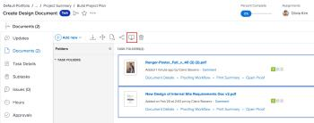

# Korrekturabzüge vergleichen

Mit der Korrekturabzugsanzeige können Sie zwei verschiedene Korrekturabzüge oder zwei Versionen desselben Korrekturabzugs vergleichen.

## Zugriffsanforderungen

+++ Erweitern, um die Zugriffsanforderungen für die in diesem Artikel beschriebene Funktionalität anzuzeigen.

<table style="table-layout:auto"> 
 <col> 
 <col> 
 <tbody> 
  <tr> 
   <td role="rowheader">Adobe Workfront-Paket</td> 
   <td> 
Beliebig
 </td> 
  </tr> 
  <tr> 
   <td role="rowheader">Adobe Workfront-Lizenz</td> 
   <td> 
Beliebig
 </td> 
  </tr> 
  <tr> 
   <td role="rowheader">Rolle des Korrekturabzugs </td> 
   <td>Prüfer, Prüfer und genehmigende Person, Autor, Moderator</td> 
  </tr> 
  <tr> 
   <td role="rowheader">Korrekturabzug-Berechtigungsprofil </td> 
   <td>Manager oder höher</td> 
  </tr> 
  <tr> 
   <td role="rowheader">Konfigurationen der Zugriffsebene</td> 
   <td> 
Zugriffrecht „Bearbeiten“ für Dokumente
 </td> 
  </tr> 
 </tbody> 
</table>

Weitere Informationen finden Sie unter [Zugriffsanforderungen](/help/quicksilver/administration-and-setup/add-users/access-levels-and-object-permissions/access-level-requirements-in-documentation.md) in der Dokumentation zu Workfront.

+++

## Vergleichen von zwei verschiedenen Korrekturabzügen

Sie können zwei Korrekturabzüge in einer einzigen Dokumentliste vergleichen, z. B. auf der Registerkarte Dokumente in einem Projekt, einer Aufgabe, einem Problem, einem Portfolio oder im Hauptbereich Dokumente .

1. Navigieren Sie zur Dokumentliste, die die beiden geprüften Dokumente enthält, die Sie vergleichen möchten.
1. Wählen Sie das erste zu vergleichende Dokument aus, halten Sie dann die Befehlstaste (Mac) oder die Strg-Taste (Windows) gedrückt und wählen Sie das zweite zu vergleichende Dokument aus.

   >[!NOTE]
   >
   >Für jedes Dokument, das Sie zum Vergleich auswählen, muss bereits ein Korrekturabzug generiert werden.

1. Klicken Sie **Korrekturabzüge vergleichen**.

   <!--
   
If this button is not visible, ensure that two proofed documents are selected.

   -->

   

   Beide Korrekturabzüge werden in der Korrekturabzugsansicht nebeneinander angezeigt. Sie können jedes Dokument überprüfen und vergleichen.

   Separate Breadcrumbs über jedem Korrekturabzug ermöglichen es Ihnen, das mit dem Korrekturabzug verknüpfte Arbeitselement anzuzeigen und zu ihm zu wechseln:

   

   Informationen zu den Tools, mit denen Sie die beiden Korrekturabzüge vergleichen können, finden Sie unter [Verwenden der Tools zum Vergleichen](../../../../workfront-proof/wp-work-proofsfiles/review-proofs-wpv/compare-proofs.md#using-compare-tools) in [Testsendungen im Proofing Viewer vergleichen](../../../../workfront-proof/wp-work-proofsfiles/review-proofs-wpv/compare-proofs.md).

## Vergleichen von zwei Versionen desselben Korrekturabzugs

Informationen zum Vergleichen von zwei Versionen desselben Korrekturabzugs finden Sie unter [Korrekturabzugsversionen vergleichen](../../../../workfront-proof/wp-work-proofsfiles/review-proofs-wpv/compare-proofs.md#comparing-proof-versions) in [Korrekturabzüge im Korrekturabzugsansicht vergleichen](../../../../workfront-proof/wp-work-proofsfiles/review-proofs-wpv/compare-proofs.md).
