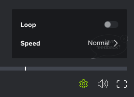

# Aktivieren der Schleife in einem Video-Korrekturabzug

Sie können das Video so konfigurieren, dass es fortlaufend wiederholt wird (die Wiedergabe des Videos beginnt nach Abschluss). 

## Zugriffsanforderungen

+++ Erweitern, um die Zugriffsanforderungen für die in diesem Artikel beschriebene Funktionalität anzuzeigen.

<table style="table-layout:auto"> 
 <col> 
 <col> 
 <tbody> 
  <tr> 
   <td role="rowheader">Adobe Workfront-Paket</td> 
   <td> 
Beliebig
 </td> 
  </tr> 
  <tr> 
   <td role="rowheader">Adobe Workfront-Lizenz</td> 
   <td> 
Beliebig
 </td> 
  </tr> 
  <tr> 
   <td role="rowheader">Rolle des Korrekturabzugs </td> 
   <td>Prüfer, Prüfer und genehmigende Person, Autor, Moderator</td> 
  </tr> 
  <tr> 
   <td role="rowheader">Korrekturabzug-Berechtigungsprofil </td> 
   <td>Manager oder höher</td> 
  </tr> 
  <tr> 
   <td role="rowheader">Konfigurationen der Zugriffsebene</td> 
   <td> 
Zugriffrecht „Bearbeiten“ für Dokumente
 </td> 
  </tr> 
 </tbody> 
</table>

Weitere Informationen finden Sie unter [Zugriffsanforderungen](/help/quicksilver/administration-and-setup/add-users/access-levels-and-object-permissions/access-level-requirements-in-documentation.md) in der Dokumentation zu Workfront.

+++

## Aktivieren der Schleife in einem Video-Korrekturabzug

1. Gehen Sie zu dem Projekt, der Aufgabe oder dem Problem, das/das das Dokument enthält, und wählen Sie dann **Dokumente**.
1. Suchen Sie den benötigten Korrekturabzug und klicken Sie dann auf **Korrekturabzug öffnen**.

1. Klicken Sie in der rechten unteren Ecke der Korrekturabzugsansicht auf das Symbol **Einstellungen**.

   

1. Aktivieren Sie die Option **Schleife**.
