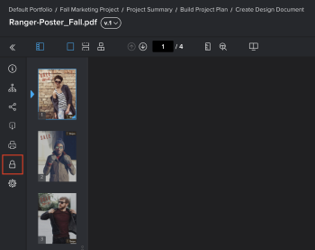

# Sperren oder Entsperren eines Korrekturabzugs

Sie können einen Korrekturabzug jederzeit im Überprüfungsprozess manuell sperren und entsperren.

## Zugriffsanforderungen

+++ Erweitern, um die Zugriffsanforderungen für die in diesem Artikel beschriebene Funktionalität anzuzeigen.

<table style="table-layout:auto"> 
 <col> 
 <col> 
 <tbody> 
  <tr> 
   <td role="rowheader">Adobe Workfront-Paket</td> 
   <td> 
Beliebig
 </td> 
  </tr> 
  <tr> 
   <td role="rowheader">Adobe Workfront-Lizenz</td> 
   <td> 
Beliebig
</td> 
  </tr> 
  <tr> 
   <td role="rowheader">Rolle des Korrekturabzugs</td> 
   <td>Inhaber oder Moderator</td> 
  </tr> 
  <tr> 
   <td role="rowheader">Korrekturabzug-Berechtigungsprofil </td> 
   <td>Verantwortlicher oder Administrator</td> 
  </tr> 
 </tbody> 
</table>

Weitere Informationen finden Sie unter [Zugriffsanforderungen](/help/quicksilver/administration-and-setup/add-users/access-levels-and-object-permissions/access-level-requirements-in-documentation.md) in der Dokumentation zu Workfront.

+++

## Korrekturabzug sperren

Sie können einen Korrekturabzug manuell sperren, um zu verhindern, dass Prüfer Kommentare eingeben oder zulassen. Dies unterscheidet sich vom Sperren eines Korrekturabzugs.

Korrekturabzug sperren:

1. Navigieren Sie zur Dokumentliste, die den Korrekturabzug enthält, den Sie öffnen möchten.
1. Bewegen Sie den Mauszeiger über das Dokument und klicken Sie dann auf den **Korrekturabzug öffnen**-Link, der angezeigt wird.

   ODER

   Wenn Sie einen Korrekturabzug für eine frühere Version des Dokuments öffnen möchten, klicken Sie auf das Symbol Mehr  für diese Version in der Zusammenfassung und dann auf **Korrekturabzug öffnen**.

   Weitere Informationen zur Zusammenfassung finden Sie unter [Zusammenfassung für Dokumente - Übersicht](../../../../documents/managing-documents/summary-for-documents.md).

1. Klicken Sie im linken Bedienfeld auf das Symbol **Sperren** (.

   

## Korrekturabzug entsperren

Das Entsperren eines Korrekturabzugs ist nützlich, wenn Überprüfende Kommentare zu einer früheren Version eines Korrekturabzugs hinzufügen müssen. (Eine frühere Version ist immer gesperrt, bis der Korrekturabzugsbesitzer sie manuell entsperrt.) Wenn die Reviewer mit dem Hinzufügen von Kommentaren zur vorherigen Version fertig sind, können Sie sie erneut sperren. Informationen zum Anzeigen einer früheren Version eines Korrekturabzugs finden Sie unter [Anzeigen früherer Korrekturabzugsversionen im Web-Korrekturabzugsansicht](../../../../workfront-proof/wp-work-proofsfiles/review-proofs-wpv/view-previous-proof-versions.md).

So entsperren Sie einen Korrekturabzug:

1. Bewegen Sie den Mauszeiger über das Dokument und klicken Sie dann auf den **Korrekturabzug öffnen**-Link, der angezeigt wird.

   ODER

   Wenn Sie einen Korrekturabzug für eine frühere Version des Dokuments öffnen möchten, klicken Sie auf das Symbol Mehr  für diese Version in der Zusammenfassung und dann auf **Korrekturabzug öffnen**.

   Weitere Informationen zur Zusammenfassung finden Sie unter [Zusammenfassung für Dokumente - Übersicht](../../../../documents/managing-documents/summary-for-documents.md).

1. Klicken Sie im linken Bedienfeld auf das Symbol **Entsperren**  und klicken Sie dann auf **Ja, Entsperren**.

   
