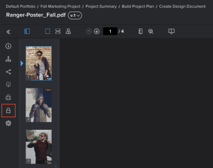

# Korrekturabzug sperren oder entsperren

Sie können einen Korrekturabzug jederzeit im Überprüfungsprozess manuell sperren und entsperren.

## Zugriffsanforderungen

+++ Erweitern Sie , um die Zugriffsanforderungen für die -Funktion in diesem Artikel anzuzeigen.

Sie müssen über folgenden Zugriff verfügen, um die Schritte in diesem Artikel ausführen zu können:

<table style="table-layout:auto"> 
 <col> 
 <col> 
 <tbody> 
  <tr> 
   <td role="rowheader">Adobe Workfront-Plan*</td> 
   <td> 
Aktueller Plan: Pro oder höher
 
oder
 
Legacy-Plan: Premium
 
Weitere Informationen zum Proofing-Zugriff für die verschiedenen Pläne finden Sie unter <a href="/help/quicksilver/administration-and-setup/manage-workfront/configure-proofing/access-to-proofing-functionality.md" class="MCXref xref">Zugriff auf die Proofing-Funktionalität in Workfront</a>.
 </td> 
  </tr> 
  <tr> 
   <td role="rowheader">Adobe Workfront-Lizenz*</td> 
   <td> 
Aktueller Plan: Arbeits- oder Plan
 
Legacy-Plan: Beliebig (Proofing muss für den Benutzer aktiviert sein)
 </td> 
  </tr> 
  <tr> 
   <td role="rowheader">Rolle des Korrekturabzugs</td> 
   <td>Inhaber oder Moderator</td> 
  </tr> 
  <tr> 
   <td role="rowheader">Proof-Berechtigungsprofil </td> 
   <td>Verantwortlicher oder Administrator</td> 
  </tr> 
 </tbody> 
</table>

&#42;Wenden Sie sich an Ihren Workfront- oder Workfront Proof-Administrator, um herauszufinden, über welchen Plan, welche Rolle oder welches Proof-Berechtigungsprofil Sie verfügen.

+++

## Korrekturabzug sperren

Sie können einen Korrekturabzug manuell sperren, um zu verhindern, dass Prüfer Kommentare eingeben oder zulassen. Dies unterscheidet sich vom Sperren eines Korrekturabzugs.

Korrekturabzug sperren:

1. Navigieren Sie zur Dokumentliste, die den Korrekturabzug enthält, den Sie öffnen möchten.
1. Bewegen Sie den Mauszeiger über das Dokument und klicken Sie dann auf den **Korrekturabzug öffnen**-Link, der angezeigt wird.

   Oder

   Wenn Sie einen Korrekturabzug für eine frühere Version des Dokuments öffnen möchten, klicken Sie auf das Symbol Mehr  für diese Version in der Zusammenfassung und dann auf **Korrekturabzug öffnen**.

   Weitere Informationen zur Zusammenfassung finden Sie unter [Zusammenfassung für Dokumente - Übersicht](../../../../documents/managing-documents/summary-for-documents.md).

1. Klicken Sie im linken Bedienfeld auf das Symbol **Sperren** .

   

## Korrekturabzug entsperren

Das Entsperren eines Korrekturabzugs ist nützlich, wenn Überprüfende Kommentare zu einer früheren Version eines Korrekturabzugs hinzufügen müssen. (Eine frühere Version ist immer gesperrt, bis der Korrekturabzugsbesitzer sie manuell entsperrt.) Wenn die Reviewer mit dem Hinzufügen von Kommentaren zur vorherigen Version fertig sind, können Sie sie erneut sperren. Informationen zum Anzeigen einer früheren Version eines Korrekturabzugs finden Sie unter [Anzeigen früherer Korrekturabzugsversionen im Web-Korrekturabzugsansicht](../../../../workfront-proof/wp-work-proofsfiles/review-proofs-wpv/view-previous-proof-versions.md).

So entsperren Sie einen Korrekturabzug:

1. Bewegen Sie den Mauszeiger über das Dokument und klicken Sie dann auf den **Korrekturabzug öffnen**-Link, der angezeigt wird.

   Oder

   Wenn Sie einen Korrekturabzug für eine frühere Version des Dokuments öffnen möchten, klicken Sie auf das Symbol Mehr  für diese Version in der Zusammenfassung und dann auf **Korrekturabzug öffnen**.

   Weitere Informationen zur Zusammenfassung finden Sie unter [Zusammenfassung für Dokumente - Übersicht](../../../../documents/managing-documents/summary-for-documents.md).

1. Klicken Sie im linken Bedienfeld auf das **Entsperren**-Symbol  und dann auf **Ja, Entsperren**.

   
