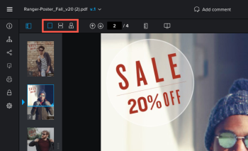

# Inhalt in einem Testversand anzeigen

## Zugriffsanforderungen

Sie müssen über folgenden Zugriff verfügen, um die Schritte in diesem Artikel ausführen zu können:

<table style="table-layout:auto"> 
 <col> 
 <col> 
 <tbody> 
  <tr> 
   <td role="rowheader">Adobe Workfront-Plan*</td> 
   <td> 
Aktueller Plan: Pro oder höher
 
oder
 
Veralteter Plan: Wählen Sie oder Premium
 
Weitere Informationen zum Testen des Zugriffs mit den verschiedenen Plänen finden Sie unter <a href="/help/quicksilver/administration-and-setup/manage-workfront/configure-proofing/access-to-proofing-functionality.md" class="MCXref xref">Zugriff auf die Testfunktion in Workfront</a>.
 </td> 
  </tr> 
  <tr> 
   <td role="rowheader">Adobe Workfront-Lizenz*</td> 
   <td> 
Aktueller Plan: Arbeit oder Plan
 
Veralteter Plan: Beliebig (Sie müssen die Testfunktion für den Benutzer aktiviert haben)
 </td> 
  </tr> 
  <tr> 
   <td role="rowheader">Proof-Berechtigungsprofil </td> 
   <td>Manager oder höher</td> 
  </tr> 
  <tr> 
   <td role="rowheader">Konfigurationen auf Zugriffsebene*</td> 
   <td> 
Zugriff auf Dokumente bearbeiten
 
Weitere Informationen zum Anfordern von zusätzlichem Zugriff finden Sie unter <a href="../../../../workfront-basics/grant-and-request-access-to-objects/request-access.md" class="MCXref xref">Anfordern des Zugriffs auf Objekte </a>.
 </td> 
  </tr> 
 </tbody> 
</table>

&#42;Wenden Sie sich an Ihren Workfront- oder Workfront Proof-Administrator, um zu erfahren, welchen Plan, welche Rolle oder welches Profil für die Testberechtigung Sie haben.

## Ansicht Ihres Testversands ändern

Sie können einen statischen Testversand anzeigen, der mehrere Seiten in einer einzigen Ansicht, in einer weiteren Ansicht oder in einer Zeitschriftenansicht enthält.

1. Wechseln Sie zum Projekt, zur Aufgabe oder zum Problem, das/das das Dokument enthält, und wählen Sie dann **Dokumente** aus.
1. Suchen Sie den gewünschten Testversand und klicken Sie dann auf **Testversand öffnen**.

1. Suchen Sie im linken oberen Bereich des Testversand-Viewers die Anzeigeoptionen.\
   

1. Klicken Sie auf eine der folgenden Optionen:

   <table style="table-layout:auto"> 
    <col> 
    <col> 
    <tbody> 
     <tr> 
      <td role="rowheader">Einzelansicht</td> 
      <td>Zeigt jeweils nur eine Seite an. Klicken Sie auf die Miniaturansicht der Seite, die Sie anzeigen möchten, oder drücken Sie die Pfeiltasten Links und Rechts , um zwischen den Seiten zu navigieren. </td> 
     </tr> 
     <tr> 
      <td role="rowheader">Kontinuierliche Ansicht</td> 
      <td>Zeigt alle Seiten in einer gestapelten Ansicht an. Klicken Sie auf die Miniaturansicht der Seite, die Sie anzeigen möchten, oder drücken Sie die Nach-links- und Nach-rechts-Taste, um alle Seiten in einer fortlaufenden Ansicht nach oben oder unten zu scrollen. </td> 
     </tr> 
     <tr> 
      <td role="rowheader">Magazine-Ansicht</td> 
      <td>Zeigt alle Seiten in einer einzigen Zeitschriftenansicht an (nebeneinander und gestapelt). Klicken Sie auf die Miniaturansicht der Seite, die Sie anzeigen möchten, oder drücken Sie die Nach-links- und Nach-rechts-Taste, um zwischen allen Seiten zu blättern. </td> 
     </tr> 
    </tbody> 
   </table>

## Verwenden von Miniaturansichten

Das Bedienfeld &quot;Miniaturansichten&quot;wird links im Testversand-Viewer angezeigt. Sie können den Bereich für Miniaturansichten verwenden, um durch den Testversand zu navigieren. Miniaturansichten sind besonders nützlich, wenn ein Testversand mehrere Seiten enthält.

* [Bedienfeld &quot;Miniaturansichten ausblenden und anzeigen&quot;](#hide-and-display-the-thumbnails-panel)
* [Zoomen und Schwenken in der Miniaturansicht](#zoom-and-pan-in-the-thumbnail-view)

### Ausblenden und Anzeigen des Miniaturansichtsbereichs {#hide-and-display-the-thumbnails-panel}

Das Bedienfeld &quot;Miniaturansichten&quot;wird standardmäßig angezeigt. Sie können die Größe des Bedienfelds ausblenden oder anpassen.

1. Wechseln Sie zum Projekt, zur Aufgabe oder zum Problem, das/das das Dokument enthält, und wählen Sie dann **Dokumente** aus.
1. Suchen Sie den gewünschten Testversand und klicken Sie dann auf **Testversand öffnen**.

1. Klicken Sie auf das Symbol **Miniatur** in der oberen linken Ecke des Testversand-Viewers.\
   

1. (Optional) Klicken Sie erneut auf das Symbol Miniaturansicht , um das Bedienfeld &quot;Miniaturansichten&quot;anzuzeigen.

   >[!TIP]
   >
   >Sie können den Mauszeiger über den rechten Rand des Miniaturansichtsbereichs bewegen, um die Größe des Bedienfelds zu ändern.

### Zoomen und Schwenken in der Miniaturansicht {#zoom-and-pan-in-the-thumbnail-view}

Der Zoombereich im Bereich &quot;Miniaturansichten&quot;zeigt den Bereich des Testversands an, den Sie gerade anzeigen. Sie können den Zoom innerhalb des Miniaturansichtsbereichs anpassen oder den Bereich schwenken, um einen anderen Teil des Testversands anzuzeigen.

So zoomen und schwenken Sie in der Miniaturansicht:

1. Wechseln Sie zum Projekt, zur Aufgabe oder zum Problem, das/das das Dokument enthält, und wählen Sie dann **Dokumente** aus.
1. Suchen Sie den gewünschten Testversand und klicken Sie dann auf **Testversand öffnen**.

1. Suchen Sie den aktuellen Zoombereich im Bereich &quot;Miniaturansichten&quot;.\
   Der Zoombereich wird als blauer Rahmen um die Ränder der Miniaturansicht angezeigt.

   

1. Um die Größe des Zoombereichs anzupassen, ziehen Sie die untere rechte Ecke des Zoombereichs, bis es die gewünschte Größe ist.
1. Um den Zoombereich in einen anderen Teil des Testversands zu verschieben, ziehen Sie den Zoombereich, bis er den Teil des Testversands abdeckt, den Sie anzeigen möchten.

## Testversand drehen

Sie können den Testversand im Testversand-Viewer drehen. Wenn Sie einen Testversand mit mehreren Seiten drehen, werden alle Seiten gleichzeitig gedreht.

1. Wechseln Sie zum Projekt, zur Aufgabe oder zum Problem, das/das das Dokument enthält, und wählen Sie dann **Dokumente** aus.
1. Suchen Sie den gewünschten Testversand und klicken Sie dann auf **Testversand öffnen**.

1. Klicken Sie unten im Testversand-Viewer auf das Symbol **Drehen** .

   

   Der Testversand wird jedes Mal, wenn Sie auf das Symbol **Drehen** klicken, um 90 Grad gedreht.

## Testversand zoomen und schwenken

Sie können den Zoom-Prozentsatz beim Anzeigen des Testversands anpassen. Wenn Sie einen Testversand mit einem größeren Zoom-Prozentsatz anzeigen, können Sie mit der Option Schwenken den Cursor zu verschiedenen Bereichen des Testversands navigieren.

1. Wechseln Sie zum Projekt, zur Aufgabe oder zum Problem, das/das das Dokument enthält, und wählen Sie dann **Dokumente** aus.
1. Suchen Sie den gewünschten Testversand und klicken Sie dann auf **Testversand öffnen**.

1. Führen Sie einen der folgenden Schritte aus, um den Zoom-Prozentsatz des Testversands anzupassen:

   * Klicken Sie auf das Symbol &quot;**Zoom**&quot;. Klicken Sie dann auf den Testversand, um den Testversand auf einer höheren Zoomebene anzuzeigen, oder ziehen Sie einen Bereich des Testversands, um nur diesen Bereich anzuzeigen.

     

   * Klicken Sie auf den aktuellen Zoom-Prozentsatz, klicken Sie auf einen neuen Zoom-Prozentsatz oder klicken Sie auf **An Breite anpassen**, **An Höhe anpassen** oder auf **An Seite anpassen**.

     

   * Klicken Sie auf die Symbole **Plus** oder **Minus** , um den Zoomprozentsatz zu erhöhen oder zu verringern.

     

1. Wenn Sie auf einen bestimmten Bereich des Videotests schwenken müssen, klicken Sie auf das Symbol **Schwenken** und ziehen Sie dann den Testversand nach Bedarf.

   

   >[!TIP]
   >
   >Um zwischen den Tools für Zoom und Schwenken zu wechseln, halten Sie die Leertaste gedrückt, wenn Sie das Zoom-Symbol zum Schwenken verwenden.
