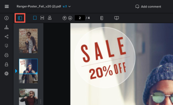

# Anzeigen von Inhalten in einem Korrekturabzug

Mit der Proofing-Anzeige können Sie Dateien in Workfront anzeigen und markieren.

>[!NOTE]
>
>Wenn sich Ihre Workfront-Instanz im einheitlichen Erlebnis befindet, wird die Proofing Viewer-Ansicht in einer neuen Registerkarte geöffnet.

## Zugriffsanforderungen

+++ Erweitern Sie , um die Zugriffsanforderungen für die -Funktion in diesem Artikel anzuzeigen.

Sie müssen über folgenden Zugriff verfügen, um die Schritte in diesem Artikel ausführen zu können:

<table style="table-layout:auto"> 
 <col> 
 <col> 
 <tbody> 
  <tr> 
   <td role="rowheader">Adobe Workfront-Plan*</td> 
   <td> 
Aktueller Plan: Pro oder höher
 
oder
 
Legacy-Plan: Auswählen oder Premium
 
Weitere Informationen zum Proofing-Zugriff für die verschiedenen Pläne finden Sie unter <a href="/help/quicksilver/administration-and-setup/manage-workfront/configure-proofing/access-to-proofing-functionality.md" class="MCXref xref">Zugriff auf die Proofing-Funktionalität in Workfront</a>.
 </td> 
  </tr> 
  <tr> 
   <td role="rowheader">Adobe Workfront-Lizenz*</td> 
   <td> 
Aktueller Plan: Arbeits- oder Plan
 
Legacy-Plan: Beliebig (Proofing muss für den Benutzer aktiviert sein)
 </td> 
  </tr> 
  <tr> 
   <td role="rowheader">Proof-Berechtigungsprofil </td> 
   <td>Manager oder höher</td> 
  </tr> 
  <tr> 
   <td role="rowheader">Konfigurationen der Zugriffsebene*</td> 
   <td> 
Zugriff auf Dokumente bearbeiten
 
Informationen zum Anfordern zusätzlicher Zugriffsberechtigungen finden Sie unter <a href="../../../../workfront-basics/grant-and-request-access-to-objects/request-access.md" class="MCXref xref">Anfordern von Zugriffsberechtigungen für Objekte </a>.
 </td> 
  </tr> 
 </tbody> 
</table>

&#42;Wenden Sie sich an Ihren Workfront- oder Workfront Proof-Administrator, um herauszufinden, über welchen Plan, welche Rolle oder welches Proof-Berechtigungsprofil Sie verfügen.

+++

## Ändern der Ansicht des Korrekturabzugs

Sie können einen statischen Korrekturabzug, der mehrere Seiten enthält, in einer Ansicht, in einer fortlaufenden Ansicht oder in einer Magazinansicht anzeigen.

1. Gehen Sie zu dem Projekt, der Aufgabe oder dem Problem, das/das das Dokument enthält, und wählen Sie dann **Dokumente**.
1. Suchen Sie den benötigten Korrekturabzug und klicken Sie dann auf **Korrekturabzug öffnen**.

1. Suchen Sie oben links in der Proofing Viewer-Ansicht die Anzeigeoptionen.\
   

1. Klicken Sie auf eine der folgenden Optionen:

   <table style="table-layout:auto"> 
    <col> 
    <col> 
    <tbody> 
     <tr> 
      <td role="rowheader">Einzelansicht</td> 
      <td>Zeigt jeweils nur eine Seite an. Klicken Sie auf die Miniaturansicht der Seite, die Sie anzeigen möchten, oder drücken Sie die Pfeiltasten nach links und rechts, um zwischen den Seiten zu navigieren. </td> 
     </tr> 
     <tr> 
      <td role="rowheader">Fortlaufende Ansicht</td> 
      <td>Zeigt alle Seiten in einer einzigen, gestapelten Ansicht an. Klicken Sie auf die Miniaturansicht der Seite, die Sie anzeigen möchten, oder drücken Sie die Pfeiltasten nach links und rechts, um in einer fortlaufenden Ansicht auf allen Seiten nach oben oder unten zu scrollen. </td> 
     </tr> 
     <tr> 
      <td role="rowheader">Magazinansicht</td> 
      <td>Zeigt alle Seiten in einer einzigen Magazinansicht an (nebeneinander und gestapelt). Klicken Sie auf die Miniaturansicht der Seite, die Sie anzeigen möchten, oder drücken Sie die Nach-links- und Nach-rechts-Tasten, um zwischen allen Seiten zu scrollen. </td> 
     </tr> 
    </tbody> 
   </table>

## Verwenden von Miniaturansichten

Das Bedienfeld „Miniaturen“ wird auf der linken Seite der Korrekturabzugsansicht angezeigt. Sie können den Bereich Miniaturen verwenden, um durch den gesamten Korrekturabzug zu navigieren. Miniaturansichten sind besonders dann nützlich, wenn ein Korrekturabzug mehrere Seiten enthält.

* [Ausblenden und Anzeigen des Bedienfelds „Miniaturen“](#hide-and-display-the-thumbnails-panel)
* [Zoomen und Schwenken in der Miniaturansicht](#zoom-and-pan-in-the-thumbnail-view)

### Miniaturansichten aus- und einblenden {#hide-and-display-the-thumbnails-panel}

Das Bedienfeld „Miniaturen“ wird standardmäßig angezeigt. Sie können die Größe des Bedienfelds ausblenden oder anpassen.

1. Gehen Sie zu dem Projekt, der Aufgabe oder dem Problem, das/das das Dokument enthält, und wählen Sie dann **Dokumente**.
1. Suchen Sie den benötigten Korrekturabzug und klicken Sie dann auf **Korrekturabzug öffnen**.

1. Klicken Sie auf **Miniaturansicht** in der oberen linken Ecke der Korrekturabzugsansicht.\
   

1. (Optional) Klicken Sie erneut auf das Symbol Miniaturansicht , um den Bereich „Miniaturansichten“ anzuzeigen.

   >[!TIP]
   >
   >Sie können den Mauszeiger über den rechten Rand des Bedienfelds Miniaturen bewegen, um die Größe des Bedienfelds zu ändern.

### Zoomen und Schwenken in der Miniaturansicht {#zoom-and-pan-in-the-thumbnail-view}

Der Zoombereich im Bedienfeld Miniaturen zeigt den Bereich des Korrekturabzugs an, den Sie derzeit anzeigen. Sie können den Zoom im Bereich der Miniatur anpassen oder den Bereich schwenken, um einen anderen Teil des Korrekturabzugs anzuzeigen.

So zoomen und schwenken Sie in der Miniaturansicht:

1. Gehen Sie zu dem Projekt, der Aufgabe oder dem Problem, das/das das Dokument enthält, und wählen Sie dann **Dokumente**.
1. Suchen Sie den benötigten Korrekturabzug und klicken Sie dann auf **Korrekturabzug öffnen**.

1. Suchen Sie den aktuellen Zoombereich im Miniaturansichten-Bedienfeld.\
   Der Zoombereich wird als blauer Rahmen um die Ränder der Miniatur angezeigt.

   

1. Um die Größe des Zoombereichs anzupassen, ziehen Sie die untere rechte Ecke des Zoombereichs, bis er die gewünschte Größe aufweist.
1. Um den Zoombereich in einen anderen Teil des Korrekturabzugs zu verschieben, ziehen Sie den Zoombereich, bis er den Teil des Korrekturabzugs abdeckt, den Sie anzeigen möchten.

## Drehen von Korrekturabzügen

Sie können den Korrekturabzug im Proofing Viewer drehen. Wenn Sie einen Korrekturabzug mit mehreren Seiten drehen, werden alle Seiten gleichzeitig gedreht.

1. Gehen Sie zu dem Projekt, der Aufgabe oder dem Problem, das/das das Dokument enthält, und wählen Sie dann **Dokumente**.
1. Suchen Sie den benötigten Korrekturabzug und klicken Sie dann auf **Korrekturabzug öffnen**.

1. Klicken Sie **das Symbol** Drehen“ unten in der Korrekturabzugsansicht.

   

   Der Korrekturabzug wird jedes Mal um 90 Grad gedreht, wenn Sie auf das Symbol &quot;**&quot;**.

## Zoomen und Schwenken eines Korrekturabzugs

Sie können den Zoom-Prozentsatz beim Anzeigen des Korrekturabzugs anpassen. Wenn Sie einen Korrekturabzug mit einem größeren Zoomprozentsatz anzeigen, können Sie mit der Option Schwenken mit dem Cursor zu verschiedenen Bereichen des Korrekturabzugs navigieren.

1. Gehen Sie zu dem Projekt, der Aufgabe oder dem Problem, das/das das Dokument enthält, und wählen Sie dann **Dokumente**.
1. Suchen Sie den benötigten Korrekturabzug und klicken Sie dann auf **Korrekturabzug öffnen**.

1. Führen Sie einen der folgenden Schritte aus, um den Zoom-Prozentsatz des Korrekturabzugs anzupassen:

   * Klicken Sie auf **Zoom**-Symbol und dann entweder auf den Korrekturabzug, um ihn mit einer höheren Zoomstufe anzuzeigen, oder ziehen Sie den Korrekturabzug über einen Bereich des Korrekturabzugs, um nur diesen Bereich anzuzeigen.

     

   * Klicken Sie auf den aktuellen Zoom-Prozentsatz, dann auf einen neuen Zoom-Prozentsatz oder klicken Sie **An Breite anpassen**, **An Höhe anpassen** oder **An Seite anpassen**.

     

   * Klicken Sie auf **Plus** oder **Minus**-Symbole, um den Zoom-Prozentsatz zu erhöhen oder zu verringern.

     

1. Wenn Sie einen bestimmten Bereich des Videonachweises auswählen möchten, klicken Sie auf das Symbol **Schwenken** und ziehen Sie den Korrekturabzug nach Bedarf.

   

   >[!TIP]
   >
   >Um einfach zwischen dem Zoom- und Schwenk-Werkzeug zu wechseln, halten Sie die Leertaste gedrückt, wenn Sie das Zoom-Symbol zum Schwenken verwenden.
