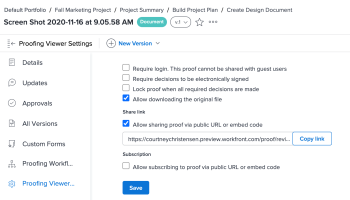

# Freigabe des Korrekturabzugs über öffentliche URL oder Einbettungs-Code deaktivieren

Sie können die Möglichkeit deaktivieren, einen Korrekturabzug für eine öffentliche URL freizugeben oder Code auf Korrekturabzugsbasis oder für einzelne Benutzer einzubetten.

## Zugriffsanforderungen

+++ Erweitern Sie , um die Zugriffsanforderungen für die -Funktion in diesem Artikel anzuzeigen.

Sie müssen über folgenden Zugriff verfügen, um die Schritte in diesem Artikel ausführen zu können:

<table style="table-layout:auto"> 
 <col> 
 <col> 
 <tbody> 
  <tr> 
   <td role="rowheader">Adobe Workfront-Plan*</td> 
   <td> 
Aktueller Plan: Pro oder höher
 
oder
 
Legacy-Plan: Auswählen oder Premium
 
Weitere Informationen zum Proofing-Zugriff für die verschiedenen Pläne finden Sie unter <a href="/help/quicksilver/administration-and-setup/manage-workfront/configure-proofing/access-to-proofing-functionality.md" class="MCXref xref">Zugriff auf die Proofing-Funktionalität in Workfront</a>.
 </td> 
  </tr> 
  <tr> 
   <td role="rowheader">Adobe Workfront-Lizenz*</td> 
   <td> 
Aktueller Plan: Arbeits- oder Plan
 
Legacy-Plan: Beliebig (Proofing muss für den Benutzer aktiviert sein)
 </td> 
  </tr> 
  <tr> 
   <td role="rowheader">Konfigurationen der Zugriffsebene*</td> 
   <td> 
Zugriff auf Dokumente bearbeiten
 
Informationen zum Anfordern zusätzlicher Zugriffsberechtigungen finden Sie unter <a href="../../../workfront-basics/grant-and-request-access-to-objects/request-access.md" class="MCXref xref">Anfordern von Zugriffsberechtigungen für Objekte </a>.
 </td> 
  </tr> 
 </tbody> 
</table>

&#42;Wenden Sie sich an Ihren Workfront- oder Workfront Proof-Administrator, um herauszufinden, über welchen Plan, welche Rolle oder welches Proof-Berechtigungsprofil Sie verfügen.

+++

## Pro Korrekturabzug deaktivieren

Sie müssen der Eigentümer oder Ersteller des Korrekturabzugs sein oder über die Rolle Autor oder Moderator des Korrekturabzugs verfügen.

1. Klicken Sie in dem Projekt, das den Korrekturabzug enthält **im** Bereich auf „Dokumente“.
1. Bewegen Sie den Mauszeiger über den Korrekturabzug und wählen Sie **Dokumentdetails** aus.
1. Klicken Sie im linken Bedienfeld auf **Einstellungen für Proofing Viewer** und deaktivieren Sie dann das Kontrollkästchen **Freigabe von Korrekturabzug über öffentliche URL oder Einbettungs-Code**.

   

1. Klicken Sie auf **Speichern**.

## Pro Benutzer deaktivieren

Sie können die Einstellung Öffentlicher Korrekturabzug für einzelne Benutzende in Ihrer Workfront-Instanz deaktivieren. Sie müssen über ein Profil mit Korrekturabzugsberechtigung oder Administrator verfügen, um diese Änderung vorzunehmen.

1. Klicken Sie auf **Hauptmenü**-Symbol  in der rechten oberen Ecke von Adobe Workfront und dann auf **Proofing**.
1. Klicken Sie **oben** auf „Kontoeinstellungen“.
1. Klicken Sie auf **Registerkarte** Benutzer“ und dann auf den Namen eines Benutzers.
1. Deaktivieren Sie im Abschnitt **Standardeinstellungen für** Korrekturabzug **das Kontrollkästchen Öffentliche Freigabe**.

   
