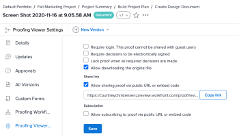

# Deaktivieren der Freigabe des Korrekturabzugs über öffentliche URL oder eingebetteten Code

Sie können die Möglichkeit deaktivieren, einen Korrekturabzug für eine öffentliche URL freizugeben oder Code auf Korrekturabzugsbasis oder für einzelne Benutzer einzubetten.

## Pro Korrekturabzug deaktivieren

Sie müssen der Eigentümer oder Ersteller des Korrekturabzugs sein oder über die Rolle Autor oder Moderator des Korrekturabzugs verfügen.

1. Klicken Sie in dem Projekt, das den Korrekturabzug enthält **im** Bereich auf „Dokumente“.
1. Bewegen Sie den Mauszeiger über den Korrekturabzug und wählen Sie **Dokumentdetails** aus.
1. Klicken Sie im linken Bedienfeld auf **Einstellungen für Proofing Viewer** und deaktivieren Sie dann das Kontrollkästchen **Freigabe von Korrekturabzug über öffentliche URL oder Einbettungs-Code**.

   

1. Klicken Sie auf **Speichern**.

## Pro Benutzer deaktivieren

Sie können die Einstellung Öffentlicher Korrekturabzug für einzelne Benutzende in Ihrer Workfront-Instanz deaktivieren. Sie müssen über ein Profil mit Korrekturabzugsberechtigung oder Administrator verfügen, um diese Änderung vorzunehmen.

1. Klicken Sie auf **Hauptmenü**-Symbol  in der rechten oberen Ecke von Adobe Workfront und dann auf **Proofing**.
1. Klicken Sie **oben** auf „Kontoeinstellungen“.
1. Klicken Sie auf **Registerkarte** Benutzer“ und dann auf den Namen eines Benutzers.
1. Deaktivieren Sie im Abschnitt **Standardeinstellungen für** Korrekturabzug **das Kontrollkästchen Öffentliche Freigabe**.

   
