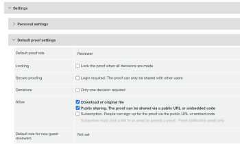

# Freigabe über öffentliche URL oder Einbettungscode deaktivieren

Sie können die Möglichkeit deaktivieren, einen Testversand mit einer öffentlichen URL oder einem Einbettungscode auf Testbasis oder für einzelne Benutzer freizugeben.

## Zugriffsanforderungen

+++ Erweitern Sie , um die Zugriffsanforderungen für die Funktionalität in diesem Artikel anzuzeigen.

Sie müssen über folgenden Zugriff verfügen, um die Schritte in diesem Artikel ausführen zu können:

<table style="table-layout:auto"> 
 <col> 
 <col> 
 <tbody> 
  <tr> 
   <td role="rowheader">Adobe Workfront-Plan*</td> 
   <td> 
Aktueller Plan: Pro oder höher
 
oder
 
Veralteter Plan: Wählen Sie oder Premium
 
Weitere Informationen zum Testen des Zugriffs mit den verschiedenen Plänen finden Sie unter <a href="/help/quicksilver/administration-and-setup/manage-workfront/configure-proofing/access-to-proofing-functionality.md" class="MCXref xref">Zugriff auf die Testfunktion in Workfront</a>.
 </td> 
  </tr> 
  <tr> 
   <td role="rowheader">Adobe Workfront-Lizenz*</td> 
   <td> 
Aktueller Plan: Arbeit oder Plan
 
Veralteter Plan: Beliebig (Sie müssen die Testfunktion für den Benutzer aktiviert haben)
 </td> 
  </tr> 
  <tr> 
   <td role="rowheader">Konfigurationen auf Zugriffsebene*</td> 
   <td> 
Zugriff auf Dokumente bearbeiten
 
Weitere Informationen zum Anfordern von zusätzlichem Zugriff finden Sie unter <a href="../../../workfront-basics/grant-and-request-access-to-objects/request-access.md" class="MCXref xref">Anfordern des Zugriffs auf Objekte </a>.
 </td> 
  </tr> 
 </tbody> 
</table>

&#42;Wenden Sie sich an Ihren Workfront- oder Workfront Proof-Administrator, um zu erfahren, welchen Plan, welche Rolle oder welches Profil für die Testberechtigung Sie haben.

+++

## Pro Testversand deaktivieren

Sie müssen Eigentümer oder Ersteller des Testversands sein oder die Rolle Autor oder Moderator-Testversand haben.

1. Klicken Sie im Projekt, das den Testversand enthält, im linken Bereich auf **Dokumente** .
1. Bewegen Sie den Mauszeiger über den Testversand und wählen Sie **Dokumentdetails** aus.
1. Klicken Sie im linken Bereich auf **Testversand-Viewer-Einstellungen** und deaktivieren Sie dann das Kontrollkästchen **Freigabe über öffentliche URL oder Einbettungscode zulassen** .

   

1. Klicken Sie auf **Speichern**.

## Pro Benutzer deaktivieren

Sie können die Einstellung Öffentlichen Testversand für einzelne Benutzer in Ihrer Workfront-Instanz deaktivieren. Sie müssen über ein Profil für die Berechtigung zum Testen von Administratoren verfügen, um diese Änderung vornehmen zu können.

1. Klicken Sie auf das Symbol **Hauptmenü** oben rechts in Adobe Workfront und dann auf **Testversand**.
1. Klicken Sie oben rechts auf **Kontoeinstellungen**.
1. Klicken Sie auf die Registerkarte **Benutzer** und dann auf den Namen eines Benutzers.
1. Deaktivieren Sie im Abschnitt **Standardmäßige Testversand-Einstellungen** das Kontrollkästchen **Öffentliche Freigabe** .

   
