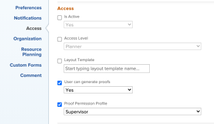

# Massenbearbeitung des Feldes „Proof-Berechtigungsprofil“

## Zugriffsanforderungen

+++ Erweitern, um die Zugriffsanforderungen für die in diesem Artikel beschriebene Funktionalität anzuzeigen.

<table style="table-layout:auto"> 
 <col> 
 <col> 
 <tbody> 
  <tr> 
   <td role="rowheader">Adobe Workfront-Paket</td> 
   <td> 
Beliebig
 </td> 
  </tr> 
  <tr> 
   <td role="rowheader">Adobe Workfront-Lizenz</td> 
   <td> 
Sie müssen ein Workfront-Administrator oder ein Gruppenadministrator sein.
 </td> 
  </tr> 
  <tr> 
   <td role="rowheader">Korrekturabzug-Berechtigungsprofil </td> 
   <td>Administrator</td> 
  </tr> 
  <tr> 
   <td role="rowheader">Konfigurationen der Zugriffsebene</td> 
   <td> 
Zugriffrecht „Bearbeiten“ für Dokumente
</td> 
  </tr> 
 </tbody> 
</table>

Weitere Informationen finden Sie unter [Zugriffsanforderungen](/help/quicksilver/administration-and-setup/add-users/access-levels-and-object-permissions/access-level-requirements-in-documentation.md) in der Dokumentation zu Workfront.

+++

## Massenbearbeitung des Feldes „Proof-Berechtigungsprofil“

{{step-1-to-users}}

1. Benutzer sortieren nach **Zugriffsebene**. Es wird empfohlen, einen Batch nach Zugriffsebene zu bearbeiten, um sicherzustellen, **das Feld** Profil für Korrekturabzugsberechtigungen“ angezeigt wird.

1. Aktivieren Sie das Kontrollkästchen neben den Benutzern, die Sie auf derselben Zugriffsebene auswählen möchten. Das Feld Proof-Berechtigungsprofil ist nur für Worker-Zugriffsebenen und höher verfügbar.
1. Klicken **oben** der Liste auf „Bearbeiten“.
1. Suchen Sie im **Zugriff** das Dropdown-Menü **Profil für Korrekturabzugsberechtigungen** und treffen Sie Ihre Auswahl.

   >[!NOTE]
   >
   >Abhängig von Ihrem Workfront-Plan müssen Sie möglicherweise das Kontrollkästchen **Benutzer kann Korrekturabzüge generieren** aktivieren, damit das Menü **Profil für Korrekturabzugsberechtigungen** angezeigt wird.

   

1. Klicken Sie auf **Änderungen speichern**.
