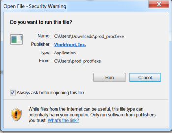

# Verstehen des Desktop Proofing Viewer

<!--Audited: 12/2023-->

Der Desktop Proofing Viewer, der hauptsächlich für das Proofing interaktiver Inhalte entwickelt wurde, ist eine Anwendung, die auf Ihrem lokalen Computer installiert werden muss.

## Systemanforderungen

Diese Anwendung wird von den folgenden Betriebssystemen unterstützt:

* Windows 7 und höher, 32 Bit und 64 Bit
* Mac OS X 10.9 und höher, 64-Bit

{{latest-version}}

## Zugriffsanforderungen

+++ Erweitern, um die Zugriffsanforderungen für die in diesem Artikel beschriebene Funktionalität anzuzeigen.

<table style="table-layout:auto"> 
 <col> 
 <col> 
 <tbody> 
  <tr> 
   <td role="rowheader">Adobe Workfront-Paket</td> 
   <td> 
Beliebig
</td> 
  </tr> 
  <tr> 
   <td role="rowheader">Adobe Workfront-Lizenz</td> 
   <td> 
Beliebig
</td> 
  </tr> 
 </tbody> 
</table>

Weitere Details zu den Informationen in dieser Tabelle finden Sie unter [Zugriffsanforderungen in der Dokumentation zu Workfront](/help/quicksilver/administration-and-setup/add-users/access-levels-and-object-permissions/access-level-requirements-in-documentation.md).

+++

## Installieren des Desktop Proofing Viewers auf Mac

Wenn Ihr Adobe Workfront-Administrator oder Workfront Proof-Administrator die App auf Ihre Workstation heruntergeladen und den Desktop Proofing Viewer als Standard-Viewer für interaktive Korrekturabzüge konfiguriert hat, können Sie die Installation abschließen, indem Sie einfach einen interaktiven Korrekturabzug im Bereich Dokumente öffnen.

Wenn dies nicht der Fall ist, können Sie die folgenden Schritte ausführen.

1. Führen Sie einen der folgenden Schritte aus, um die App herunterzuladen:

   * Wenn Sie die Produktionsumgebung verwenden, klicken Sie auf [Mac-Produktions-Download für den Desktop Proofing Viewer.](https://app.proofhq.com/desktopviewer/mac)
   * Wenn Sie die Vorschau-Umgebung verwenden, klicken Sie auf [Mac-Vorschau-Download für den Desktop Proofing Viewer.](https://assets.preview.proofhq.com/nativeviewer/desktop_viewer/Workfront+Proof+Preview-2.1.44.pkg)

1. Öffnen Sie die soeben heruntergeladene Datei, um die Installation zu starten.
1. Klicken Sie im angezeigten Installationsfenster auf **Fortfahren** und dann auf **Installieren**.

   

1. Öffnen Sie einen interaktiven Korrekturabzug im Bereich Dokumente .

>[!NOTE]
>
>Wenn der Desktop Proofing Viewer nicht gestartet wird, wenn Sie einen interaktiven Korrekturabzug öffnen, bedeutet dies wahrscheinlich, dass Ihr Workfront- oder Workfront Proof-Administrator den Desktop Proofing Viewer als Standard-Viewer für interaktive Korrekturabzüge konfigurieren muss, wie in [Benutzereinstellungen für das Öffnen nicht interaktiver Korrekturabzüge im Desktop Proofing Viewer](../../../workfront-proof/wp-work-proofsfiles/review-proofs-dpv/destop-proofing-viewer.md#user-setting-for-opening-non-interactive-proofs-in-the-desktop-proofing-viewer) beschrieben.

## Installieren des Desktop Proofing Viewers unter Windows

Wenn Ihr Workfront- oder Workfront Proof-Administrator die App auf Ihre Workstation heruntergeladen und den Desktop Proofing Viewer als Standard-Viewer für interaktive Korrekturabzüge konfiguriert hat, können Sie die Installation abschließen, indem Sie einfach einen interaktiven Korrekturabzug im Bereich Dokumente öffnen.

>[!TIP]
>
>Sie können die Befehlszeile verwenden, um den Desktop Proofing Viewer zu installieren, indem Sie `Workfront Proof Setup 2.1.34.exe" /S` ausführen

1. Führen Sie einen der folgenden Schritte aus, um die App herunterzuladen:

   * Klicken Sie in der Produktionsumgebung auf [Windows-Produktions-Download für den Desktop Proofing Viewer.](https://app.proofhq.com/desktopviewer/windows)
   * Klicken Sie in der Vorschau-Umgebung auf [Windows-Vorschau für den Desktop Proofing Viewer](https://assets.preview.proofhq.com/nativeviewer/desktop_viewer/Workfront+Proof+Preview+Setup+2.1.44.exe)

1. Öffnen Sie die soeben heruntergeladene Datei, um die Installation zu starten.
1. Öffnen Sie im angezeigten Installationsfenster die soeben heruntergeladene Datei, um die Installation zu starten.

   

1. Klicken Sie im angezeigten Warnfeld auf **Ausführen**. Der Desktop Proofing Viewer wird automatisch installiert und ausgeführt.
1. (Bedingt) Wenn Sie die Anwendung über Internet Explorer installieren, aktualisieren Sie die Startseite im Browser, nachdem die Anwendung installiert wurde.
1. Öffnen Sie einen interaktiven Korrekturabzug im Bereich Dokumente .

Nachdem der Desktop Proofing Viewer installiert wurde, werden alle interaktiven Korrekturabzüge im Desktop Proofing Viewer geöffnet. Wenn der Desktop Proofing Viewer nicht gestartet wird, wenn Sie einen interaktiven Korrekturabzug öffnen, bedeutet dies wahrscheinlich, dass Ihr Workfront- oder Workfront Proof-Administrator den Desktop Proofing Viewer als Standard-Viewer für interaktive Korrekturabzüge konfigurieren muss, wie in [Benutzereinstellungen für das Öffnen nicht interaktiver Korrekturabzüge im Desktop Proofing Viewer](../../../workfront-proof/wp-work-proofsfiles/review-proofs-dpv/destop-proofing-viewer.md#user-setting-for-launching-non-interactive-proofs) beschrieben.
