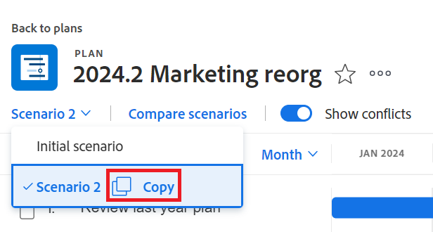
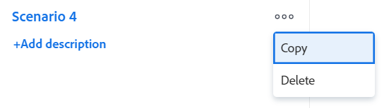

# Planszenarien in der [!DNL Scenario Planner] erstellen und vergleichen

<!--Audited: 07/2024-->

Wenn Sie die langfristige Strategie Ihres Unternehmens planen, gibt es viele Informationen, die Sie vielleicht nicht zu Beginn haben oder an die Sie denken. Es braucht Zeit und Experimente, um zu einer endgültigen Strategie zu gelangen, die Ihre Stakeholder akzeptieren können. Die Durchführung einer „Was-wäre-wenn“-Analyse zur Erstellung mehrerer Szenarien für Ihren Plan kann Ihnen dabei helfen, potenzielle Umstände genau vorherzusagen und zu bewerten und letztendlich den bestmöglichen Plan zu entwickeln.

## Zugriffsanforderungen

+++ Erweitern Sie , um die Zugriffsanforderungen für die -Funktion in diesem Artikel anzuzeigen.

<table style="table-layout:auto"> 
 <col> 
 <col> 
 <tbody> 
  <tr> 
   <td> 
[!DNL Adobe Workfront] Plan*
 </td> 
   <td> <ul></li>
   <li>
Neu: Ultimate 
</li>
   
Der Szenario-Planer ist für die neuen Workfront Select- oder Workfront Prime-Pläne nicht verfügbar. 

   <li>
Aktuell: [!UICONTROL Business] oder höher
</ul>
   </td> 
  </tr> 
  <tr> 
   <td> 
[!DNL Adobe Workfront] Lizenz*
 </td> 
   <td> 
Neu: Licht oder höher
 
   
Aktuell: [!UICONTROL Überprüfen] oder höher
 </td> 
  </tr> 
  <tr> 
   <td>Produkt* </td> 
   <td> <ul><li>
Für die neuen Workfront-Pläne:

 Adobe Workfront</li>

   <li>
Für die aktuellen Workfront-Pläne: 

   
Adobe Workfront
 
Adobe Workfront-Szenarioplaner
</li></ul>

Weitere Informationen finden Sie unter <a href="../scenario-planner/access-needed-to-use-sp.md" class="MCXref xref">Zugriff erforderlich, um die [!DNL Scenario Planner]</a> verwenden zu können. 
 </td> 
  </tr> 
  <tr data-mc-conditions=""> 
   <td>Zugriffsebene </td> 
   <td> 
[!UICONTROL Bearbeiten] Zugriff auf [!DNL Scenario Planner]
 </td> 
  </tr> 
  <tr data-mc-conditions=""> 
   <td> 
Objektberechtigungen 
 </td> 
   <td> 
[!UICONTROL Manage]-Berechtigungen für einen Plan
 
Informationen zum Anfordern zusätzlichen Zugriffs auf einen Plan finden Sie unter <a href="../scenario-planner/request-access-to-plan.md" class="MCXref xref">Anfordern des Zugriffs auf einen Plan im [!DNL Scenario Planner]</a>.
 </td> 
  </tr> 
 </tbody> 
</table>

*Weitere Informationen finden Sie unter [Dokumentation zu Zugriffsanforderungen für Workfront](/help/quicksilver/administration-and-setup/add-users/access-levels-and-object-permissions/access-level-requirements-in-documentation.md).

+++

## Erstellen von Szenarien

Ein Szenario ist eine Kopie eines Plans. Sie können so viele Szenarien erstellen, wie Sie benötigen. Es wird jedoch empfohlen, die Anzahl der Szenarien auf ein Minimum zu beschränken, damit Sie sie einfach vergleichen können.

{{step1-to-scenario-planner}}

1. Erstellen Sie einen Plan oder klicken Sie auf den Namen eines vorhandenen Plans.

   Informationen zum Erstellen von Plänen finden Sie unter [Erstellen und Bearbeiten von Plänen in der [!DNL Scenario Planner]](../scenario-planner/create-and-edit-plans.md).

   Der erste von Ihnen erstellte Plan wird automatisch als &quot;[!UICONTROL &#x200B; Szenario“ &#x200B;].

1. Klicken Sie auf den Abwärtspfeil neben einem vorhandenen Szenario und dann auf das Symbol **[!UICONTROL Kopieren]**.

   

   Dadurch wird ein neues Szenario mit denselben Informationen wie das kopierte Szenario erstellt. Sie erhält automatisch den Namen &quot;[!UICONTROL Szenario 2]&quot;, wenn es sich um das zweite Szenario Ihres Plans handelt, &quot;[!UICONTROL Szenario 3]&quot;, wenn es das dritte ist usw. Sie können Ihre Szenarien nicht umbenennen. Die Anzahl der Kopien, die Sie erstellen können, ist unbegrenzt.

   <!--
   <MadCap:conditionalText data-mc-conditions="QuicksilverOrClassic.Draft mode">
   (NOTE:this might change)
   </MadCap:conditionalText>
   -->

1. Aktualisieren Sie Ihr neues Szenario auf eine der folgenden Arten:

   * Initiativen erstellen, aktualisieren oder löschen

     >[!TIP]
     >
     >Wenn Sie eine Initiative in einem Szenario löschen, wird sie nur aus dem ausgewählten Szenario und nicht aus allen Szenarien entfernt.

     Informationen zum Erstellen von Initiativen finden Sie unter [Erstellen und Bearbeiten von Initiativen im [!DNL Scenario Planner]](../scenario-planner/create-and-edit-initiatives.md).

   * Aktualisieren der Prioritäten Ihrer Initiativen
   * Personen- oder Budgetinformationen anpassen
   * Überprüfung und Anpassung von Initiativkonflikten in Ihrem Szenario

     Informationen zum Beheben von Konflikten finden Sie unter [Beheben von Initiativkonflikten in der [!DNL Scenario Planner]](../scenario-planner/resolve-conflicts-in-sp.md).

1. Klicken Sie **[!UICONTROL Plan speichern]** um Ihre Änderungen zu speichern.

## Szenarios vergleichen

Nachdem Sie Ihre Szenarien erstellt haben, können Sie sie vergleichen, um das beste für Ihr Unternehmen zu finden.

1. Wechseln Sie zu dem Plan, für den Sie Szenarien vergleichen möchten.
1. Klicken Sie **[!UICONTROL Szenarien vergleichen]**. Die Szenario-Vergleichsseite wird angezeigt.

   Alle vorhandenen Szenarien für den Plan werden nebeneinander im Kartenformat angezeigt. Das anfängliche Szenario wird immer zuerst aufgeführt und ist statisch.

   

1. (Optional) Scrollen Sie nach rechts, um alle Szenariokarten anzuzeigen.

   Die folgenden Informationen werden auf einer Szenariokarte angezeigt:

   <table style="table-layout:auto"> 
    <col> 
    <col> 
    <tbody> 
     <tr> 
      <td>Name des Szenarios</td> 
      <td> 
Ein automatisch von Workfront generierter Name, der nicht bearbeitet werden kann. Beispiel: "[!UICONTROL Initial scenario]", "[!UICONTROL Scenario 2]" usw. 
 </td> 
     </tr> 
     <tr> 
      <td>Szenariobeschreibung</td> 
      <td>Ein manueller Eintrag, in dem Sie Besonderheiten des Szenarios beschreiben können. </td> 
     </tr> 
     <tr> 
      <td>Verfügbare Aufgabengebiete</td> 
      <td>Die Anzahl der Aufgabengebiete, die aus dem Budget des Plans für die Laufzeit des Plans verfügbar sind. </td> 
     </tr> 
     <tr> 
      <td>Erforderliche Aufgabengebiete</td> 
      <td>Die Anzahl der erforderlichen Aufgabengebiete, basierend auf Ihren Initiativen. </td> 
     </tr> 
     <tr> 
      <td>Budget</td> 
      <td>Das in diesem Szenario für den Plan definierte Gesamtbudget. Budgetinformationen zu Plänen finden Sie unter <a href="../scenario-planner/plans-overview.md" class="MCXref xref">Pläne - Übersicht im [!DNL Scenario Planner]</a>. </td> 
     </tr> 
     <tr> 
      <td>Kosten</td> 
      <td>Die Kosten im Zusammenhang mit den Initiativen in dem Szenario. Informationen zu den Kosten finden Sie <a href="../scenario-planner/initiatives-overview.md" class="MCXref xref">Übersicht über Initiativen im [!DNL Scenario Planner]</a>. </td> 
     </tr> 
     <tr> 
      <td>Nutzung</td> 
      <td>Der [!UICONTROL Budgetauslastung]-Prozentsatz für den Plan in diesem Szenario. Weitere Informationen zum Prozentsatz der [!UICONTROL Budgetauslastung] finden Sie unter <a href="../scenario-planner/plans-overview.md" class="MCXref xref">Pläne - Übersicht im [!DNL Scenario Planner]</a>. </td> 
     </tr> 
     <tr> 
      <td>Nettowert</td> 
      <td>Der [!UICONTROL Nettowert] des Plans in diesem Szenario. Informationen zum [!UICONTROL Net Value] eines Plans finden Sie unter <a href="../scenario-planner/plans-overview.md" class="MCXref xref">Pläne - Übersicht im [!DNL Scenario Planner]</a>. </td> 
     </tr> 
     <tr> 
      <td>Initiativen</td> 
      <td>Die Anzahl der Initiativen für den Plan in diesem Szenario.</td> 
     </tr> 
     <tr> 
      <td>Konflikt</td> 
      <td>Die Anzahl der Initiativen, die im Plan für dieses Szenario Konflikte jeder Art anzeigen. Informationen zu Initiativen und Konflikten finden Sie unter <a href="../scenario-planner/resolve-conflicts-in-sp.md" class="MCXref xref">Beheben von Initiativkonflikten im [!DNL Scenario Planner]</a>. </td> 
     </tr> 
    </tbody> 
   </table>

   >[!NOTE]
   >
   >Wenn die Informationen zwischen dem ursprünglichen Szenario und zusätzlichen Szenarien unterschiedlich sind, wird neben dem geänderten Wert ein Aufwärts- oder Abwärtspfeil angezeigt, um eine Steigerung oder Abnahme dieses Werts im Vergleich zum ursprünglichen Szenario anzuzeigen.
   >
   >
   >
   >
   >Beispielsweise können sich das Budget, die Anzahl der Aufgabengebiete und die Anzahl der Initiativen von einem Szenario zum anderen ändern.

1. Klicken Sie auf den Namen eines Szenarios, um darauf zuzugreifen und Änderungen vorzunehmen.

   Weitere Informationen finden Sie im Abschnitt [Szenarien erstellen](#create-scenarios) in diesem Artikel.

1. Klicken Sie **[!UICONTROL Beschreibung hinzufügen]**, um eine Beschreibung für das Szenario hinzuzufügen

   Oder

   Klicken Sie auf das Beschreibungsfeld, um es zu aktualisieren, und klicken Sie dann auf eine beliebige Stelle auf dem Bildschirm, um Ihre Änderungen zu speichern.

1. (Optional) Klicken Sie auf das **[!UICONTROL Mehr]** Menü , um das Szenario **[!UICONTROL Kopieren]** oder **[!UICONTROL Löschen]**.

   

   Wenn Sie ein Szenario kopieren, wird es automatisch auf der Kartenseite angezeigt und gemäß diesem Muster umbenannt: &quot;[!UICONTROL Szenario] `<next number in order>`.“

1. (Bedingt) Wenn Sie auf **[!UICONTROL Löschen]** geklickt haben, klicken Sie zur Bestätigung **[!UICONTROL Ja,]**.

   Gelöschte Szenarien können nicht wiederhergestellt werden.

   Informationen zum Löschen von Szenarien finden Sie unter [Löschen von Plänen in der [!DNL Scenario Planner]](../scenario-planner/delete-plans.md).

1. Klicken Sie **[!UICONTROL Plan speichern]**, um Ihre Szenarien und Ihren Plan zu speichern.
