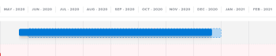
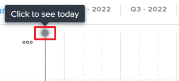
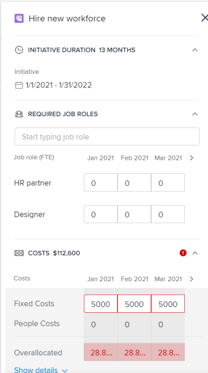

<?xml version="1.0" encoding="UTF-8"?>
<xliff xmlns="urn:oasis:names:tc:xliff:document:1.2" xmlns:okp="okapi-framework:xliff-extensions" xmlns:its="http://www.w3.org/2005/11/its" xmlns:itsxlf="http://www.w3.org/ns/its-xliff/" version="1.2" its:version="2.0">
<file original="help/quicksilver/scenario-planner/create-and-edit-initiatives.md.mdsc" source-language="en-US" target-language="en-XX" datatype="x-text/markdown">
<body>
<trans-unit id="tu1" restype="x-YAML_METADATA_HEADER_VALUE" xml:space="preserve">
<source xml:lang="en-US">Create and Edit Initiatives in the Scenario Planner</source>
<target xml:lang="en-XX">Erstellen und Bearbeiten von Initiativen im Szenario-Planer</target>
</trans-unit>
<trans-unit id="tu2" restype="x-YAML_METADATA_HEADER_VALUE" xml:space="preserve">
<source xml:lang="en-US">When using the Adobe Workfront Scenario Planner, you can create initiatives in a plan that you created or that was shared with you. By creating initiatives you can show how smaller organizational units contribute to the completion of the plan. For example, if your organization has a plan for the next three years to expand into a new market, you can create initiatives within this plan for each department to estimate each department's need for people and budget to accomplish this plan.</source>
<target xml:lang="en-XX">Wenn Sie den Adobe Workfront-Szenarioplaner verwenden, können Sie Initiativen in einem Plan erstellen, den Sie erstellt haben oder der für Sie freigegeben wurde. Durch die Erstellung von Initiativen können Sie zeigen, wie kleinere Organisationseinheiten zur Fertigstellung des Plans beitragen. Wenn Ihr Unternehmen beispielsweise einen Plan für die nächsten drei Jahre hat, um in einen neuen Markt zu expandieren, können Sie in diesem Plan für jede Abteilung Initiativen erstellen, um den Bedarf jeder Abteilung an Mitarbeitern und Budgets zur Umsetzung dieses Plans zu schätzen.</target>
</trans-unit>
<trans-unit id="tu3" xml:space="preserve">
<source xml:lang="en-US">Create and edit initiatives in the <ph id="1" ctype="x-regxph" equiv-text="[!DNL Scenario Planner]">[!DNL Scenario Planner]</ph></source>
<target xml:lang="en-XX">Erstellen und Bearbeiten von Initiativen im <ph id="1" ctype="x-regxph" equiv-text="[!DNL Scenario Planner]">[!DNL Scenario Planner]</ph></target>
</trans-unit>
<trans-unit id="tu4" xml:space="preserve">
<source xml:lang="en-US">When using the <ph id="1" ctype="x-regxph" equiv-text="[!UICONTROL ">[!UICONTROL </ph>Adobe Workfront Scenario Planner<ph id="2" ctype="x-LINK_REF">]</ph>, you can create initiatives in a plan that you created or that was shared with you. By creating initiatives you can show how smaller organizational units contribute to the completion of the plan. For example, if your organization has a plan for the next three years to expand into a new market, you can create initiatives within this plan for each department to estimate each department's need for people and budget to accomplish this plan.</source>
<target xml:lang="en-XX">Wenn Sie den <ph id="1" ctype="x-regxph" equiv-text="[!UICONTROL ">[!UICONTROL </ph>Adobe Workfront-Szenarioplaner<ph id="2" ctype="x-LINK_REF">]</ph> verwenden, können Sie Initiativen in einem Plan erstellen, den Sie erstellt haben oder der für Sie freigegeben wurde. Durch die Erstellung von Initiativen können Sie zeigen, wie kleinere Organisationseinheiten zur Fertigstellung des Plans beitragen. Wenn Ihr Unternehmen beispielsweise einen Plan für die nächsten drei Jahre hat, um in einen neuen Markt zu expandieren, können Sie in diesem Plan für jede Abteilung Initiativen erstellen, um den Bedarf jeder Abteilung an Mitarbeitern und Budgets zur Umsetzung dieses Plans zu schätzen.</target>
</trans-unit>
<trans-unit id="tu5" xml:space="preserve">
<source xml:lang="en-US">Access requirements</source>
<target xml:lang="en-XX">Zugriffsanforderungen</target>
</trans-unit>
<trans-unit id="tu6" xml:space="preserve">
<source xml:lang="en-US">Expand to view access requirements for the functionality in this article.</source>
<target xml:lang="en-XX">Erweitern, um die Zugriffsanforderungen für die in diesem Artikel beschriebene Funktionalität anzuzeigen.</target>
</trans-unit>
<group id="sd1_ssf1" resname="sub-filter:sd1">
<trans-unit id="sd1_sf1_tu1" resname="sd1_2" restype="x-td" xml:space="preserve">
<source xml:lang="en-US"> </source>
<target xml:lang="en-XX"> </target>
</trans-unit>
<trans-unit id="sd1_sf1_tu2" resname="sd1_3" restype="x-paragraph" xml:space="preserve">
<source xml:lang="en-US">package</source>
<target xml:lang="en-XX">Packstück</target>
</trans-unit>
<trans-unit id="sd1_sf1_tu3" resname="sd1_7" restype="x-td" xml:space="preserve">
<source xml:lang="en-US"> 
   </source>
<target xml:lang="en-XX"> 
   </target>
</trans-unit>
<trans-unit id="sd1_sf1_tu4" resname="sd1_8" restype="x-paragraph" xml:space="preserve">
<source xml:lang="en-US">Workfront Ultimate</source>
<target xml:lang="en-XX">Workfront Ultimate</target>
</trans-unit>
<trans-unit id="sd1_sf1_tu5" resname="sd1_10" restype="x-paragraph" xml:space="preserve">
<source xml:lang="en-US">NOTE</source>
<target xml:lang="en-XX">NOTIZ</target>
</trans-unit>
<trans-unit id="sd1_sf1_tu6" resname="sd1_12" restype="x-paragraph" xml:space="preserve">
<source xml:lang="en-US">Speak with your Workfront representative if you have a different Workfront package.</source>
<target xml:lang="en-XX">Wenden Sie sich an Ihren Workfront-Support-Mitarbeiter, wenn Sie ein anderes Workfront-Paket haben.</target>
</trans-unit>
<trans-unit id="sd1_sf1_tu7" resname="sd1_16" restype="x-td" xml:space="preserve">
<source xml:lang="en-US"> </source>
<target xml:lang="en-XX"> </target>
</trans-unit>
<trans-unit id="sd1_sf1_tu8" resname="sd1_17" restype="x-paragraph" xml:space="preserve">
<source xml:lang="en-US">license</source>
<target xml:lang="en-XX">Lizenz</target>
</trans-unit>
<trans-unit id="sd1_sf1_tu9" resname="sd1_21" restype="x-td" xml:space="preserve">
<source xml:lang="en-US"> </source>
<target xml:lang="en-XX"> </target>
</trans-unit>
<trans-unit id="sd1_sf1_tu10" resname="sd1_22" restype="x-paragraph" xml:space="preserve">
<source xml:lang="en-US">[!UICONTROL Light] or higher</source>
<target xml:lang="en-XX">[!UICONTROL light] oder höher</target>
</trans-unit>
<trans-unit id="sd1_sf1_tu11" resname="sd1_24" restype="x-paragraph" xml:space="preserve">
<source xml:lang="en-US">[!UICONTROL Review] or higher</source>
<target xml:lang="en-XX">[!UICONTROL Überprüfung] oder höher</target>
</trans-unit>
<trans-unit id="sd1_sf1_tu12" resname="sd1_28" restype="x-td" xml:space="preserve">
<source xml:lang="en-US">Access level configurations</source>
<target xml:lang="en-XX">Konfigurationen der Zugriffsebene</target>
</trans-unit>
<trans-unit id="sd1_sf1_tu13" resname="sd1_30" restype="x-td" xml:space="preserve">
<source xml:lang="en-US"> </source>
<target xml:lang="en-XX"> </target>
</trans-unit>
<trans-unit id="sd1_sf1_tu14" resname="sd1_31" restype="x-paragraph" xml:space="preserve">
<source xml:lang="en-US">[!UICONTROL Edit] access to the</source>
<target xml:lang="en-XX">[!UICONTROL Bearbeiten] Zugriff auf</target>
</trans-unit>
<trans-unit id="sd1_sf1_tu15" resname="sd1_35" restype="x-td" xml:space="preserve">
<source xml:lang="en-US"> </source>
<target xml:lang="en-XX"> </target>
</trans-unit>
<trans-unit id="sd1_sf1_tu16" resname="sd1_36" restype="x-paragraph" xml:space="preserve">
<source xml:lang="en-US">Object permissions </source>
<target xml:lang="en-XX">Objektberechtigungen </target>
</trans-unit>
<trans-unit id="sd1_sf1_tu17" resname="sd1_40" restype="x-td" xml:space="preserve">
<source xml:lang="en-US"> </source>
<target xml:lang="en-XX"> </target>
</trans-unit>
<trans-unit id="sd1_sf1_tu18" resname="sd1_41" restype="x-paragraph" xml:space="preserve">
<source xml:lang="en-US">[!UICONTROL Manage] permissions to a plan</source>
<target xml:lang="en-XX">[!UICONTROL Manage]-Berechtigungen für einen Plan</target>
</trans-unit>
</group>
<trans-unit id="tu7" xml:space="preserve">
<source xml:lang="en-US">For more information about access to the Scenario Planner, see <ph id="1" ctype="x-LINK">[</ph>Access needed to use the<ph id="2" ctype="x-regxph" equiv-text=" [!DNL Scenario Planner]"> [!DNL Scenario Planner]](../scenario-planner/access-needed-to-use-sp.md)</ph>.</source>
<target xml:lang="en-XX">Weitere Informationen zum Zugriff auf den Szenario-Planer finden Sie unter <ph id="1" ctype="x-LINK">[</ph>Zugriff für die Verwendung des erforderlich<ph id="2" ctype="x-regxph" equiv-text=" [!DNL Scenario Planner]"> [!DNL Scenario Planner]](../scenario-planner/access-needed-to-use-sp.md)</ph>.</target>
</trans-unit>
<trans-unit id="tu8" xml:space="preserve">
<source xml:lang="en-US">For information about Workfront access requirements, see <ph id="1" ctype="x-LINK">[</ph>Access requirements to Workfront documentation<ph id="2" ctype="x-LINK">](/help/quicksilver/administration-and-setup/add-users/access-levels-and-object-permissions/access-level-requirements-in-documentation.md)</ph>.</source>
<target xml:lang="en-XX">Informationen zu den Zugriffsanforderungen für Workfront finden Sie unter <ph id="1" ctype="x-LINK">[</ph>Zugriffsanforderungen für Workfront-Dokumentation<ph id="2" ctype="x-LINK">](/help/quicksilver/administration-and-setup/add-users/access-levels-and-object-permissions/access-level-requirements-in-documentation.md)</ph>.</target>
</trans-unit>
<trans-unit id="tu9" xml:space="preserve">
<source xml:lang="en-US">Prerequisites</source>
<target xml:lang="en-XX">Voraussetzungen</target>
</trans-unit>
<trans-unit id="tu10" xml:space="preserve">
<source xml:lang="en-US">You must create a plan or another user must share a plan with you before you can create an initiative inside that plan. For information about creating plans, see <ph id="1" ctype="x-LINK">[</ph>Create and edit plans in the<ph id="2" ctype="x-regxph" equiv-text=" [!DNL Scenario Planner]"> [!DNL Scenario Planner]](../scenario-planner/create-and-edit-plans.md)</ph>.</source>
<target xml:lang="en-XX">Sie müssen einen Plan erstellen, oder ein anderer Benutzer muss einen Plan mit Ihnen teilen, bevor Sie eine Initiative innerhalb dieses Plans erstellen können. Informationen zum Erstellen von Plänen finden Sie unter <ph id="1" ctype="x-LINK">[</ph>Erstellen und Bearbeiten von Plänen in der<ph id="2" ctype="x-regxph" equiv-text=" [!DNL Scenario Planner]"> [!DNL Scenario Planner]](../scenario-planner/create-and-edit-plans.md)</ph>.</target>
</trans-unit>
<trans-unit id="tu11" xml:space="preserve">
<source xml:lang="en-US">For more information about what initiatives are, see <ph id="1" ctype="x-LINK">[</ph>Initiatives overview in the<ph id="2" ctype="x-regxph" equiv-text=" [!DNL Scenario Planner]"> [!DNL Scenario Planner]](../scenario-planner/initiatives-overview.md)</ph>.</source>
<target xml:lang="en-XX">Weitere Informationen zu Initiativen finden Sie unter <ph id="1" ctype="x-LINK">[</ph>Initiativen - Übersicht in der<ph id="2" ctype="x-regxph" equiv-text=" [!DNL Scenario Planner]"> [!DNL Scenario Planner]](../scenario-planner/initiatives-overview.md)</ph>.</target>
</trans-unit>
<trans-unit id="tu12" xml:space="preserve">
<source xml:lang="en-US">Create initiatives</source>
<target xml:lang="en-XX">Initiativen erstellen</target>
</trans-unit>
<trans-unit id="tu13" xml:space="preserve">
<source xml:lang="en-US">You can create initiatives in the following ways:</source>
<target xml:lang="en-XX">Sie können Initiativen wie folgt erstellen:</target>
</trans-unit>
<trans-unit id="tu14" xml:space="preserve">
<source xml:lang="en-US">From scratch.</source>
<target xml:lang="en-XX">Von Grund auf.</target>
</trans-unit>
<trans-unit id="tu15" xml:space="preserve">
<source xml:lang="en-US">By importing projects into a plan</source>
<target xml:lang="en-XX">Durch Importieren von Projekten in einen Plan</target>
</trans-unit>
<trans-unit id="tu16" xml:space="preserve">
<source xml:lang="en-US">For information about importing projects as initiatives in a plan, see <ph id="1" ctype="x-LINK">[</ph>Import projects to plans in the<ph id="2" ctype="x-regxph" equiv-text=" [!DNL Scenario Planner]"> [!DNL Scenario Planner]](../scenario-planner/import-projects-to-plans.md)</ph>.</source>
<target xml:lang="en-XX">Informationen zum Importieren von Projekten als Initiativen in einen Plan finden Sie unter <ph id="1" ctype="x-LINK">[</ph>Projekte in Pläne importieren in der<ph id="2" ctype="x-regxph" equiv-text=" [!DNL Scenario Planner]"> [!DNL Scenario Planner]](../scenario-planner/import-projects-to-plans.md)</ph>.</target>
</trans-unit>
<trans-unit id="tu17" xml:space="preserve">
<source xml:lang="en-US">By copying existing initiatives.</source>
<target xml:lang="en-XX">Durch Kopieren bestehender Initiativen.</target>
</trans-unit>
<trans-unit id="tu18" xml:space="preserve">
<source xml:lang="en-US">For information about copying initiatives, see <ph id="1" ctype="x-LINK">[</ph>Copy initiatives in the<ph id="2" ctype="x-regxph" equiv-text=" [!DNL Scenario Planner]"> [!DNL Scenario Planner]](../scenario-planner/copy-initiatives.md)</ph>.</source>
<target xml:lang="en-XX">Informationen zum Kopieren von Initiativen finden Sie unter <ph id="1" ctype="x-LINK">[</ph>Kopieren von Initiativen in der<ph id="2" ctype="x-regxph" equiv-text=" [!DNL Scenario Planner]"> [!DNL Scenario Planner]](../scenario-planner/copy-initiatives.md)</ph>.</target>
</trans-unit>
<trans-unit id="tu19" xml:space="preserve">
<source xml:lang="en-US">To create initiatives from scratch:</source>
<target xml:lang="en-XX">So erstellen Sie Initiativen von Grund auf:</target>
</trans-unit>
<trans-unit id="tu20" xml:space="preserve">
<source xml:lang="en-US"><ph id="1" ctype="x-SNIPPET">{{step1-to-scenario-planner}}</ph></source>
<target xml:lang="en-XX"><ph id="1" ctype="x-SNIPPET">{{step1-to-scenario-planner}}</ph></target>
</trans-unit>
<trans-unit id="tu21" xml:space="preserve">
<source xml:lang="en-US">Click the name of the plan for which you want to create an initiative.</source>
<target xml:lang="en-XX">Klicken Sie auf den Namen des Plans, für den Sie eine Initiative erstellen möchten.</target>
</trans-unit>
<trans-unit id="tu22" xml:space="preserve">
<source xml:lang="en-US">Click the <ph id="1" ctype="x-STRONG_EMPHASIS">**</ph>+ icon<ph id="2" ctype="x-STRONG_EMPHASIS">**</ph> to the left of <ph id="3" ctype="x-STRONG_EMPHASIS">**[!UICONTROL </ph>New initiative<ph id="5" ctype="x-LINK_REF">]**</ph></source>
<target xml:lang="en-XX">Klicken Sie links neben <ph id="1" ctype="x-STRONG_EMPHASIS">**</ph> Initiative <ph id="2" ctype="x-STRONG_EMPHASIS">**</ph> das Symbol <ph id="3" ctype="x-STRONG_EMPHASIS">**[!UICONTROL </ph>+ <ph id="5" ctype="x-LINK_REF">]**</ph></target>
</trans-unit>
<trans-unit id="tu23" xml:space="preserve">
<source xml:lang="en-US">Or</source>
<target xml:lang="en-XX">ODER</target>
</trans-unit>
<trans-unit id="tu24" xml:space="preserve">
<source xml:lang="en-US">Click the <ph id="1" ctype="x-STRONG_EMPHASIS">**[!UICONTROL </ph>New initiative<ph id="3" ctype="x-LINK_REF">]**</ph> drop-down menu and select either <ph id="5" ctype="x-STRONG_EMPHASIS">**[!UICONTROL </ph>New initiative<ph id="7" ctype="x-LINK_REF">]**</ph> or <ph id="9" ctype="x-STRONG_EMPHASIS">**[!UICONTROL </ph>Import Projects<ph id="11" ctype="x-LINK_REF">]</ph>.<ph id="12" ctype="x-STRONG_EMPHASIS">**</ph></source>
<target xml:lang="en-XX">Klicken Sie auf das <ph id="1" ctype="x-STRONG_EMPHASIS">**[!UICONTROL </ph>Neue Initiative<ph id="3" ctype="x-LINK_REF">]**</ph> Dropdown-Menü und wählen Sie entweder <ph id="5" ctype="x-STRONG_EMPHASIS">**[!UICONTROL </ph>Neue Initiative<ph id="7" ctype="x-LINK_REF">]**</ph> oder <ph id="9" ctype="x-STRONG_EMPHASIS">**[!UICONTROL </ph>Projekte importieren<ph id="11" ctype="x-LINK_REF">]</ph>.<ph id="12" ctype="x-STRONG_EMPHASIS">**</ph></target>
</trans-unit>
<trans-unit id="tu25" xml:space="preserve">
<source xml:lang="en-US">Type a name for your initiative in the <ph id="1" ctype="x-STRONG_EMPHASIS">**[!UICONTROL </ph>Untitled Initiative<ph id="3" ctype="x-LINK_REF">]**</ph> field, then press Enter or click anywhere else on the page.</source>
<target xml:lang="en-XX">Geben Sie einen Namen für Ihre Initiative im Feld <ph id="1" ctype="x-STRONG_EMPHASIS">**[!UICONTROL </ph>Nicht benannte Initiative<ph id="3" ctype="x-LINK_REF">]**</ph> ein und drücken Sie dann die Eingabetaste, oder klicken Sie auf eine beliebige andere Stelle auf der Seite.</target>
</trans-unit>
<trans-unit id="tu26" xml:space="preserve">
<source xml:lang="en-US">The initiative displays on the timeline of the plan, as a blue bar. By default, the duration of an initiative is one month and it always starts on the first month of the plan.</source>
<target xml:lang="en-XX">Die Initiative wird in der Zeitleiste des Plans in einem blauen Balken angezeigt. Standardmäßig beträgt die Dauer einer Initiative einen Monat und beginnt immer im ersten Monat des Plans.</target>
</trans-unit>
<trans-unit id="tu27" xml:space="preserve">
<source xml:lang="en-US">(Optional) Drag the separation bar between the left panel and the timeline to resize the left panel.</source>
<target xml:lang="en-XX">(Optional) Ziehen Sie die Trennleiste zwischen dem linken Bedienfeld und der Zeitleiste, um die Größe des linken Bedienfelds zu ändern.</target>
</trans-unit>
<trans-unit id="tu28" xml:space="preserve">
<source xml:lang="en-US">(Optional) Drag the end of the initiative bar to extend its duration to more than one month and release it where you want the end month of the initiative to be.</source>
<target xml:lang="en-XX">(Optional) Ziehen Sie das Ende der Initiativleiste, um ihre Dauer auf mehr als einen Monat zu verlängern, und geben Sie sie an die Stelle frei, an der der Endmonat der Initiative sein soll.</target>
</trans-unit>
<trans-unit id="tu29" xml:space="preserve">
<source xml:lang="en-US">(Optional and conditional) If the duration of the initiative is shorter than that of the plan, drag and drop the initiative bar in a different position on the timeline of the plan, to move it to another time frame.</source>
<target xml:lang="en-XX">(Optional und bedingt) Wenn die Dauer der Initiative kürzer als die des Plans ist, ziehen Sie die Initiativleiste per Drag-and-Drop an eine andere Position auf der Zeitleiste des Plans, um sie in einen anderen Zeitrahmen zu verschieben.</target>
</trans-unit>
<trans-unit id="tu30" xml:space="preserve">
<source xml:lang="en-US"><ph id="1" ctype="x-IMAGE"></ph></source>
<target xml:lang="en-XX"><ph id="1" ctype="x-IMAGE"></ph></target>
</trans-unit>
<trans-unit id="tu31" xml:space="preserve">
<source xml:lang="en-US"><ph id="1" ctype="x-regxph" equiv-text="[!IMPORTANT">[!IMPORTANT]</ph></source>
<target xml:lang="en-XX"><ph id="1" ctype="x-regxph" equiv-text="[!IMPORTANT">[!IMPORTANT]</ph></target>
</trans-unit>
<trans-unit id="tu32" xml:space="preserve">
<source xml:lang="en-US">You can only select a duration in months. The duration of an initiative that you create from scratch can never exceed the Duration of the plan.</source>
<target xml:lang="en-XX">Sie können nur eine Dauer in Monaten auswählen. Die Dauer einer von Ihnen neu erstellten Initiative darf nie die Dauer des Plans überschreiten.</target>
</trans-unit>
<trans-unit id="tu33" xml:space="preserve">
<source xml:lang="en-US">(Optional) From the <ph id="1" ctype="x-STRONG_EMPHASIS">**[!UICONTROL </ph>Month<ph id="3" ctype="x-LINK_REF">]**</ph> drop-down menu, select one of the following options to change the timeline of the plan:</source>
<target xml:lang="en-XX">(Optional) Wählen Sie aus <ph id="1" ctype="x-STRONG_EMPHASIS">**[!UICONTROL </ph> Dropdown<ph id="3" ctype="x-LINK_REF">]**</ph>Menü „Monat“ eine der folgenden Optionen aus, um die Zeitleiste des Plans zu ändern:</target>
</trans-unit>
<trans-unit id="tu34" restype="x-TABLECELL_TEXT" xml:space="preserve">
<source xml:lang="en-US">Drop-down menu option</source>
<target xml:lang="en-XX">Dropdown-Menüoption</target>
</trans-unit>
<trans-unit id="tu35" restype="x-TABLECELL_TEXT" xml:space="preserve">
<source xml:lang="en-US">Description</source>
<target xml:lang="en-XX">Beschreibung</target>
</trans-unit>
<trans-unit id="tu36" restype="x-TABLECELL_TEXT" xml:space="preserve">
<source xml:lang="en-US"><ph id="1" ctype="x-regxph" equiv-text="[!UICONTROL ">[!UICONTROL </ph>Month<ph id="2" ctype="x-LINK_REF">]</ph></source>
<target xml:lang="en-XX"><ph id="1" ctype="x-regxph" equiv-text="[!UICONTROL ">[!UICONTROL </ph>Month<ph id="2" ctype="x-LINK_REF">]</ph></target>
</trans-unit>
<trans-unit id="tu37" restype="x-TABLECELL_TEXT" xml:space="preserve">
<source xml:lang="en-US">Displays the timeline by month. This is the default option for a one-year plan.</source>
<target xml:lang="en-XX">Zeigt die Zeitleiste nach Monat an. Dies ist die Standardoption für einen Ein-Jahres-Plan.</target>
</trans-unit>
<trans-unit id="tu38" restype="x-TABLECELL_TEXT" xml:space="preserve">
<source xml:lang="en-US"><ph id="1" ctype="x-regxph" equiv-text="[!UICONTROL ">[!UICONTROL </ph>Quarter<ph id="2" ctype="x-LINK_REF">]</ph></source>
<target xml:lang="en-XX"><ph id="1" ctype="x-regxph" equiv-text="[!UICONTROL ">[!UICONTROL </ph>Quartal<ph id="2" ctype="x-LINK_REF">]</ph></target>
</trans-unit>
<trans-unit id="tu39" restype="x-TABLECELL_TEXT" xml:space="preserve">
<source xml:lang="en-US">Displays the timeline by quarter. This option is available only when the <ph id="1" ctype="x-regxph" equiv-text="[!UICONTROL ">[!UICONTROL </ph>Duration<ph id="2" ctype="x-LINK_REF">]</ph> of the plan is 3 or 5 years. This is the default option for a 3-year plan.</source>
<target xml:lang="en-XX">Zeigt die Zeitleiste nach Quartal an. Diese Option ist nur verfügbar, wenn <ph id="1" ctype="x-regxph" equiv-text="[!UICONTROL ">[!UICONTROL </ph>Laufzeit<ph id="2" ctype="x-LINK_REF">]</ph> des Plans 3 oder 5 Jahre beträgt. Dies ist die Standardoption für einen 3-Jahres-Plan.</target>
</trans-unit>
<trans-unit id="tu40" restype="x-TABLECELL_TEXT" xml:space="preserve">
<source xml:lang="en-US"><ph id="1" ctype="x-regxph" equiv-text="[!UICONTROL ">[!UICONTROL </ph>Year<ph id="2" ctype="x-LINK_REF">]</ph></source>
<target xml:lang="en-XX"><ph id="1" ctype="x-regxph" equiv-text="[!UICONTROL ">[!UICONTROL </ph>Year<ph id="2" ctype="x-LINK_REF">]</ph></target>
</trans-unit>
<trans-unit id="tu41" restype="x-TABLECELL_TEXT" xml:space="preserve">
<source xml:lang="en-US">Displays the timeline by year. This option is available only when the <ph id="1" ctype="x-regxph" equiv-text="[!UICONTROL ">[!UICONTROL </ph>Duration<ph id="2" ctype="x-LINK_REF">]</ph> of the plan is 5 years. This is the default option for a 5-year plan.</source>
<target xml:lang="en-XX">Zeigt die Zeitleiste nach Jahr an. Diese Option ist nur verfügbar, wenn <ph id="1" ctype="x-regxph" equiv-text="[!UICONTROL ">[!UICONTROL </ph>Laufzeit<ph id="2" ctype="x-LINK_REF">]</ph> des Plans 5 Jahre beträgt. Dies ist die Standardoption für einen 5-Jahres-Plan.</target>
</trans-unit>
<trans-unit id="tu42" xml:space="preserve">
<source xml:lang="en-US">(Optional) Scroll from left to right to see the entire duration of the initiative.</source>
<target xml:lang="en-XX">(Optional) Scrollen Sie von links nach rechts, um die gesamte Dauer der Initiative anzuzeigen.</target>
</trans-unit>
<trans-unit id="tu43" xml:space="preserve">
<source xml:lang="en-US">(Optional) Click the <ph id="1" ctype="x-STRONG_EMPHASIS">**[!UICONTROL </ph>Today<ph id="3" ctype="x-LINK_REF">]**</ph> indicator line to come back to the current date.</source>
<target xml:lang="en-XX">(Optional) Klicken Sie auf die <ph id="1" ctype="x-STRONG_EMPHASIS">**[!UICONTROL </ph>Heute<ph id="3" ctype="x-LINK_REF">]**</ph>, um zum aktuellen Datum zurückzukehren.</target>
</trans-unit>
<trans-unit id="tu44" xml:space="preserve">
<source xml:lang="en-US"><ph id="1" ctype="x-IMAGE"></ph></source>
<target xml:lang="en-XX"><ph id="1" ctype="x-IMAGE"></ph></target>
</trans-unit>
<trans-unit id="tu45" xml:space="preserve">
<source xml:lang="en-US"><ph id="1" ctype="x-regxph" equiv-text="[!TIP">[!TIP]</ph></source>
<target xml:lang="en-XX"><ph id="1" ctype="x-regxph" equiv-text="[!TIP">[!TIP]</ph></target>
</trans-unit>
<trans-unit id="tu46" xml:space="preserve">
<source xml:lang="en-US">If your plan is in the future or in the past and does not include the current date, the Today indicator does not display.</source>
<target xml:lang="en-XX">Wenn Ihr Plan in der Zukunft oder in der Vergangenheit liegt und das aktuelle Datum nicht enthält, wird der Indikator Heute nicht angezeigt.</target>
</trans-unit>
<trans-unit id="tu47" xml:space="preserve">
<source xml:lang="en-US">Click the bar of an initiative. The initiative details panel opens on the right.</source>
<target xml:lang="en-XX">Klicken Sie auf den Balken einer Initiative. Das Bedienfeld mit den Details der Initiative wird auf der rechten Seite geöffnet.</target>
</trans-unit>
<trans-unit id="tu48" xml:space="preserve">
<source xml:lang="en-US"><ph id="1" ctype="x-IMAGE"></ph></source>
<target xml:lang="en-XX"><ph id="1" ctype="x-IMAGE"></ph></target>
</trans-unit>
<trans-unit id="tu49" xml:space="preserve">
<source xml:lang="en-US">Specify or review the following information:</source>
<target xml:lang="en-XX">Geben Sie die folgenden Informationen an oder überprüfen Sie sie:</target>
</trans-unit>
<group id="sd1_ssf2" resname="sub-filter:sd1">
<trans-unit id="sd1_sf2_tu1" resname="sd1_2" restype="x-td" xml:space="preserve">
<source xml:lang="en-US">Initiative Duration</source>
<target xml:lang="en-XX">Dauer der Initiative</target>
</trans-unit>
<trans-unit id="sd1_sf2_tu2" resname="sd1_4" restype="x-td" xml:space="preserve">
<source xml:lang="en-US">The duration of the initiative in months. </source>
<target xml:lang="en-XX">Die Dauer der Initiative in Monaten. </target>
</trans-unit>
<trans-unit id="sd1_sf2_tu3" resname="sd1_6" restype="x-td" xml:space="preserve">
<source xml:lang="en-US">Start and End Dates</source>
<target xml:lang="en-XX">Start- und Enddatum</target>
</trans-unit>
<trans-unit id="sd1_sf2_tu4" resname="sd1_8" restype="x-td" xml:space="preserve">
<source xml:lang="en-US">The start and end dates of the initiative.</source>
<target xml:lang="en-XX">Start- und Enddatum der Initiative</target>
</trans-unit>
<trans-unit id="sd1_sf2_tu5" resname="sd1_10" restype="x-td" xml:space="preserve">
<source xml:lang="en-US">Required Job Roles Section </source>
<target xml:lang="en-XX">Erforderliche Aufgabengebiete </target>
</trans-unit>
<trans-unit id="sd1_sf2_tu6" resname="sd1_12" restype="x-td" xml:space="preserve">
<source xml:lang="en-US"> </source>
<target xml:lang="en-XX"> </target>
</trans-unit>
<trans-unit id="sd1_sf2_tu7" resname="sd1_13" restype="x-paragraph" xml:space="preserve">
<source xml:lang="en-US">Click the <bpt id="1" ctype="x-strong">&lt;strong></bpt>[!UICONTROL Start typing job role]<ept id="1">&lt;/strong></ept> field and select a role from the list or start typing the name of a<bpt id="2" ctype="x-span">&lt;span></bpt>n active<ept id="2">&lt;/span></ept> job role. </source>
<target xml:lang="en-XX">Klicken Sie auf das Feld <bpt id="1" ctype="x-strong">&lt;strong></bpt>[!UICONTROL Start typing job role]<ept id="1">&lt;/strong></ept> und wählen Sie eine Rolle aus der Liste aus oder beginnen Sie mit der Eingabe des Namens <bpt id="2" ctype="x-span">&lt;span></bpt> aktiven <ept id="2">&lt;/span></ept>. </target>
</trans-unit>
<trans-unit id="sd1_sf2_tu8" resname="sd1_15" restype="x-paragraph" xml:space="preserve">
<source xml:lang="en-US"><bpt id="1" ctype="x-span">&lt;span></bpt>Depending on whether the plan is set up to use FTEs or hours,<ept id="1">&lt;/span></ept> add the number of job roles needed for this initiative in FTE <bpt id="2" ctype="x-span">&lt;span>&lt;span></bpt>or hours<ept id="2">&lt;/span>&lt;/span></ept><bpt id="4" ctype="x-span">&lt;span></bpt> for each month in the initiative<ept id="4">&lt;/span></ept>. <bpt id="5" ctype="x-span">&lt;span></bpt>The first three months of the initiative display by default.<ept id="5">&lt;/span></ept></source>
<target xml:lang="en-XX"><bpt id="1" ctype="x-span">&lt;span></bpt>Je nachdem, ob der Plan für die Verwendung von FTEs oder Stunden eingerichtet wurde, <ept id="1">&lt;/span></ept> die Anzahl der für diese Initiative benötigten Aufgabengebiete für jeden <ept id="2">&lt;/span>&lt;/span></ept><bpt id="4" ctype="x-span">&lt;span></bpt> in FTE  Stunden pro Monat in die Initiative aufgenommen. <bpt id="5" ctype="x-span">&lt;span></bpt>Die ersten drei Monate der Initiative werden standardmäßig angezeigt.<ept id="5">&lt;/span></ept></target>
</trans-unit>
<trans-unit id="sd1_sf2_tu9" resname="sd1_17" restype="x-paragraph" xml:space="preserve">
<source xml:lang="en-US"><bpt id="1" ctype="x-span">&lt;span></bpt>Updating the job role information for the initiative also updates the Required job role information for the plan.<ept id="1">&lt;/span></ept> </source>
<target xml:lang="en-XX"><bpt id="1" ctype="x-span">&lt;span></bpt>Beim Aktualisieren der Aufgabengebiet-Informationen für die Initiative werden auch die erforderlichen Aufgabengebiet-Informationen für den Plan aktualisiert.<ept id="1">&lt;/span></ept> </target>
</trans-unit>
<trans-unit id="sd1_sf2_tu10" resname="sd1_19" restype="x-paragraph" xml:space="preserve">
<source xml:lang="en-US">For information about setting up the plan to use FTE or hours, see <bpt id="1" ctype="link">&lt;a href="../scenario-planner/create-and-edit-plans.md" class="MCXref xref"></bpt>Create and edit plans in the <ept id="1">[!DNL Scenario Planner]&lt;/a></ept>. </source>
<target xml:lang="en-XX">Informationen zum Einrichten des Plans für die Verwendung von FTE oder Stunden finden Sie unter <bpt id="1" ctype="link">&lt;a href="../scenario-planner/create-and-edit-plans.md" class="MCXref xref"></bpt>Erstellen und Bearbeiten von Plänen in der <ept id="1">[!DNL Scenario Planner]&lt;/a></ept>. </target>
</trans-unit>
<trans-unit id="sd1_sf2_tu11" resname="sd1_21" restype="x-paragraph" xml:space="preserve">
<source xml:lang="en-US">IMPORTANT</source>
<target xml:lang="en-XX">WICHTIG</target>
</trans-unit>
<trans-unit id="sd1_sf2_tu12" resname="sd1_23" restype="x-paragraph" xml:space="preserve">
<source xml:lang="en-US">For all calculations in the <ph id="1" ctype="x-regxph" equiv-text="[!DNL Scenario Planner]">[!DNL Scenario Planner]</ph>, <ph id="2" ctype="x-regxph" equiv-text="[!DNL Workfront]">[!DNL Workfront]</ph> uses the following value: 1 FTE = 8 Hours. </source>
<target xml:lang="en-XX">Für alle Berechnungen in der <ph id="1" ctype="x-regxph" equiv-text="[!DNL Scenario Planner]">[!DNL Scenario Planner]</ph> verwendet <ph id="2" ctype="x-regxph" equiv-text="[!DNL Workfront]">[!DNL Workfront]</ph> den folgenden Wert: 1 FTE = 8 Stunden. </target>
</trans-unit>
</group>
<group id="sd1_ssf3" resname="sub-filter:sd1">
<trans-unit id="sd1_sf3_tu1" resname="sd1_1" restype="x-paragraph" xml:space="preserve">
<source xml:lang="en-US">TIP</source>
<target xml:lang="en-XX">TIPP</target>
</trans-unit>
</group>
<group id="sd1_ssf4" resname="sub-filter:sd1">
<trans-unit id="sd1_sf4_tu1" resname="sd1_2" restype="x-li" xml:space="preserve">
<source xml:lang="en-US"> </source>
<target xml:lang="en-XX"> </target>
</trans-unit>
<trans-unit id="sd1_sf4_tu2" resname="sd1_3" restype="x-paragraph" xml:space="preserve">
<source xml:lang="en-US"><bpt id="1" ctype="x-span">&lt;span></bpt>Use the [!UICONTROL Tab] key to move to the next month.<ept id="1">&lt;/span></ept> </source>
<target xml:lang="en-XX"><bpt id="1" ctype="x-span">&lt;span></bpt>Verwenden Sie die [!UICONTROL Tab]-Taste, um zum nächsten Monat zu wechseln.<ept id="1">&lt;/span></ept> </target>
</trans-unit>
<trans-unit id="sd1_sf4_tu3" resname="sd1_7" restype="x-li" xml:space="preserve">
<source xml:lang="en-US"> </source>
<target xml:lang="en-XX"> </target>
</trans-unit>
<trans-unit id="sd1_sf4_tu4" resname="sd1_8" restype="x-paragraph" xml:space="preserve">
<source xml:lang="en-US"> All <bpt id="1" ctype="x-span">&lt;span></bpt>active<ept id="1">&lt;/span></ept> job roles in the system are listed when you click this field. </source>
<target xml:lang="en-XX"> Wenn <bpt id="1" ctype="x-span">&lt;span></bpt> auf dieses Feld klicken, werden alle <ept id="1">&lt;/span></ept>aktiven) Aufgabengebiete im System aufgelistet. </target>
</trans-unit>
<trans-unit id="sd1_sf4_tu5" resname="sd1_12" restype="x-li" xml:space="preserve">
<source xml:lang="en-US"> </source>
<target xml:lang="en-XX"> </target>
</trans-unit>
<trans-unit id="sd1_sf4_tu6" resname="sd1_13" restype="x-paragraph" xml:space="preserve">
<source xml:lang="en-US">The job roles that have already been added to the Available job roles of the plan display first. For information about adding available job roles to a plan, see <bpt id="1" ctype="link">&lt;a href="../scenario-planner/create-and-edit-plans.md" class="MCXref xref"></bpt>Create and edit plans in the Scenario Planner<ept id="1">&lt;/a></ept>. </source>
<target xml:lang="en-XX">Die Aufgabengebiete, die den verfügbaren Aufgabengebieten des Plans bereits hinzugefügt wurden, werden zuerst angezeigt. Informationen zum Hinzufügen verfügbarer Aufgabengebiete zu einem Plan finden Sie unter <bpt id="1" ctype="link">&lt;a href="../scenario-planner/create-and-edit-plans.md" class="MCXref xref"></bpt>Erstellen und Bearbeiten von Plänen im Szenario-Planer<ept id="1">&lt;/a></ept>. </target>
</trans-unit>
<trans-unit id="sd1_sf4_tu7" resname="sd1_17" restype="x-li" xml:space="preserve">
<source xml:lang="en-US"> </source>
<target xml:lang="en-XX"> </target>
</trans-unit>
<trans-unit id="sd1_sf4_tu8" resname="sd1_18" restype="x-paragraph" xml:space="preserve">
<source xml:lang="en-US">considers that a full-time equivalent is 160 hours for a month.</source>
<target xml:lang="en-XX">geht davon aus, dass ein Vollzeitäquivalent 160 Stunden für einen Monat beträgt.</target>
</trans-unit>
<trans-unit id="sd1_sf4_tu9" resname="sd1_20" restype="x-paragraph" xml:space="preserve">
<source xml:lang="en-US">For all calculations in the Scenario Planner, Workfront uses the following value: 1 FTE = 8 Hours. </source>
<target xml:lang="en-XX">Für alle Berechnungen im Szenario-Planer verwendet Workfront den folgenden Wert: 1 FTE = 8 Stunden. </target>
</trans-unit>
<trans-unit id="sd1_sf4_tu10" resname="sd1_23" restype="x-paragraph" xml:space="preserve">
<source xml:lang="en-US">You can enter a number lower than 1 FTE or decimal numbers for FTE <bpt id="1" ctype="x-span">&lt;span></bpt>or<ept id="1">&lt;/span></ept> <bpt id="2" ctype="x-span">&lt;span></bpt>hours<ept id="2">&lt;/span></ept>. For example, a 0.5 Consultant job role would mean that a consultant would dedicate half of his FTE (typically, 4 hours, where 8 hours is 1 FTE) to working on this initiative. </source>
<target xml:lang="en-XX">Sie können eine Zahl eingeben, die kleiner als 1 FTE oder Dezimalzahlen für FTE <bpt id="1" ctype="x-span">&lt;span></bpt>oder<ept id="1">&lt;/span></ept> <bpt id="2" ctype="x-span">&lt;span></bpt>Stunden<ept id="2">&lt;/span></ept> ist. Ein Aufgabengebiet von 0,5 Consultant würde beispielsweise bedeuten, dass ein Consultant die Hälfte seines FTE (in der Regel 4 Stunden, wobei 8 Stunden 1 FTE sind) für die Arbeit an dieser Initiative aufwenden würde. </target>
</trans-unit>
<trans-unit id="sd1_sf4_tu11" resname="sd1_25" restype="x-td" xml:space="preserve">
<source xml:lang="en-US">Costs section</source>
<target xml:lang="en-XX">Kostenabschnitt</target>
</trans-unit>
<trans-unit id="sd1_sf4_tu12" resname="sd1_27" restype="x-td" xml:space="preserve">
<source xml:lang="en-US"> </source>
<target xml:lang="en-XX"> </target>
</trans-unit>
<trans-unit id="sd1_sf4_tu13" resname="sd1_28" restype="x-paragraph" xml:space="preserve">
<source xml:lang="en-US">The total costs of the initiative display to the right of the [!UICONTROL Costs] section. <ph id="1" ctype="x-regxph" equiv-text="[!DNL Workfront]">[!DNL Workfront]</ph> calculates an initiative's costs using the following formula:</source>
<target xml:lang="en-XX">Die Gesamtkosten der Initiative werden rechts neben dem Abschnitt [!UICONTROL Kosten] angezeigt. <ph id="1" ctype="x-regxph" equiv-text="[!DNL Workfront]">[!DNL Workfront]</ph> berechnet die Kosten einer Initiative anhand der folgenden Formel:</target>
</trans-unit>
<trans-unit id="sd1_sf4_tu14" resname="sd1_30" restype="x-paragraph" xml:space="preserve">
<source xml:lang="en-US"></source>
<target xml:lang="en-XX"></target>
</trans-unit>
<trans-unit id="sd1_sf4_tu15" resname="sd1_34" restype="x-td" xml:space="preserve">
<source xml:lang="en-US"> </source>
<target xml:lang="en-XX"> </target>
</trans-unit>
<trans-unit id="sd1_sf4_tu16" resname="sd1_35" restype="x-paragraph" xml:space="preserve">
<source xml:lang="en-US">In the <bpt id="1" ctype="x-strong">&lt;strong></bpt>[!UICONTROL Fixed Costs]<ept id="1">&lt;/strong></ept> field, manually enter a rough estimate amount of what you believe it will cost to complete this initiative. This should not include costs associated with the job roles estimated for the initiative.</source>
<target xml:lang="en-XX">Geben Sie im Feld <bpt id="1" ctype="x-strong">&lt;strong></bpt>[!UICONTROL Festkosten]<ept id="1">&lt;/strong></ept> manuell einen groben Schätzwert der Kosten ein, die Ihrer Meinung nach bei dieser Initiative anfallen werden. Darin sollten nicht die Kosten enthalten sein, die mit den für die Initiative veranschlagten Aufgabengebieten verbunden sind.</target>
</trans-unit>
<trans-unit id="sd1_sf4_tu17" resname="sd1_37" restype="x-paragraph" xml:space="preserve">
<source xml:lang="en-US"><bpt id="1" ctype="x-span">&lt;span></bpt>Enter an amount for each month of the initiative by moving from one month to the next as you use the Tab key.<ept id="1">&lt;/span></ept> </source>
<target xml:lang="en-XX"><bpt id="1" ctype="x-span">&lt;span></bpt>Geben Sie einen Betrag für jeden Monat der Initiative ein, indem Sie mit der Tabulatortaste von einem Monat zum nächsten wechseln.<ept id="1">&lt;/span></ept> </target>
</trans-unit>
<trans-unit id="sd1_sf4_tu18" resname="sd1_41" restype="x-td" xml:space="preserve">
<source xml:lang="en-US"> 
       </source>
<target xml:lang="en-XX"> 
       </target>
</trans-unit>
<trans-unit id="sd1_sf4_tu19" resname="sd1_43" restype="x-paragraph" xml:space="preserve">
<source xml:lang="en-US">Depending on whether the plan is set up to use FTEs or hours, [!UICONTROL Workfront] uses the following formulas to calculate [!UICONTROL People Cost]:</source>
<target xml:lang="en-XX">Je nachdem, ob der Plan für die Verwendung von FTEs oder Stunden eingerichtet ist, verwendet [!UICONTROL Workfront] die folgenden Formeln zur Berechnung der [!UICONTROL Personalkosten]:</target>
</trans-unit>
<trans-unit id="sd1_sf4_tu20" resname="sd1_45" restype="x-li" xml:space="preserve">
<source xml:lang="en-US"> </source>
<target xml:lang="en-XX"> </target>
</trans-unit>
<trans-unit id="sd1_sf4_tu21" resname="sd1_46" restype="x-paragraph" xml:space="preserve">
<source xml:lang="en-US">When using FTEs: </source>
<target xml:lang="en-XX">Bei Verwendung von FTEs: </target>
</trans-unit>
<trans-unit id="sd1_sf4_tu22" resname="sd1_48" restype="x-paragraph" xml:space="preserve">
<source xml:lang="en-US">, where 160 is the total number of working hours in a month.</source>
<target xml:lang="en-XX">, wobei 160 der Gesamtzahl der Arbeitsstunden in einem Monat entspricht.</target>
</trans-unit>
<trans-unit id="sd1_sf4_tu23" resname="sd1_52" restype="x-li" xml:space="preserve">
<source xml:lang="en-US"> </source>
<target xml:lang="en-XX"> </target>
</trans-unit>
<trans-unit id="sd1_sf4_tu24" resname="sd1_53" restype="x-paragraph" xml:space="preserve">
<source xml:lang="en-US">When using hours: </source>
<target xml:lang="en-XX">Bei Verwendung von Stunden: </target>
</trans-unit>
<trans-unit id="sd1_sf4_tu25" resname="sd1_55" restype="x-paragraph" xml:space="preserve">
<source xml:lang="en-US"></source>
<target xml:lang="en-XX"></target>
</trans-unit>
<trans-unit id="sd1_sf4_tu26" resname="sd1_57" restype="x-paragraph" xml:space="preserve">
<source xml:lang="en-US">For information about setting up the plan to use hours or FTE, see <bpt id="1" ctype="link">&lt;a href="../scenario-planner/create-and-edit-plans.md" class="MCXref xref"></bpt>Create and edit plans in the Scenario Planner<ept id="1">&lt;/a></ept>.</source>
<target xml:lang="en-XX">Informationen zum Einrichten des Plans für die Verwendung von Stunden oder FTE finden Sie unter <bpt id="1" ctype="link">&lt;a href="../scenario-planner/create-and-edit-plans.md" class="MCXref xref"></bpt>Erstellen und Bearbeiten von Plänen im Szenario-Planer<ept id="1">&lt;/a></ept>.</target>
</trans-unit>
<trans-unit id="sd1_sf4_tu27" resname="sd1_61" restype="x-paragraph" xml:space="preserve">
<source xml:lang="en-US">People costs are calculated in the base currency selected in your Exchange Rates preferences. For information about Exchange Rates, see <bpt id="1" ctype="link">&lt;a href="../administration-and-setup/manage-workfront/exchange-rates/set-up-exchange-rates.md" class="MCXref xref"></bpt>Set up exchange rates<ept id="1">&lt;/a></ept>.</source>
<target xml:lang="en-XX">Die Personalkosten werden in der Basiswährung berechnet, die Sie in Ihren Wechselkurseinstellungen ausgewählt haben. Weitere Informationen zu Wechselkursen finden Sie unter <bpt id="1" ctype="link">&lt;a href="../administration-and-setup/manage-workfront/exchange-rates/set-up-exchange-rates.md" class="MCXref xref"></bpt>Einrichten von Wechselkursen<ept id="1">&lt;/a></ept>.</target>
</trans-unit>
<trans-unit id="sd1_sf4_tu28" resname="sd1_63" restype="x-paragraph" xml:space="preserve">
<source xml:lang="en-US">Updating the cost information for an initiative also updates the [!UICONTROL Costs] area for the plan. </source>
<target xml:lang="en-XX">Durch die Aktualisierung der Kosteninformationen für eine Initiative wird auch der Bereich [!UICONTROL Kosten] für den Plan aktualisiert. </target>
</trans-unit>
<trans-unit id="sd1_sf4_tu29" resname="sd1_67" restype="x-td" xml:space="preserve">
<source xml:lang="en-US"> </source>
<target xml:lang="en-XX"> </target>
</trans-unit>
<trans-unit id="sd1_sf4_tu30" resname="sd1_68" restype="x-paragraph" xml:space="preserve">
<source xml:lang="en-US">After you defined the required job role and cost values for your initiative and you modify the duration of the initiative, one the following scenarios may occur:</source>
<target xml:lang="en-XX">Nachdem Sie das erforderliche Aufgabengebiet und die Kostenwerte für Ihre Initiative definiert haben und die Dauer der Initiative geändert haben, kann eines der folgenden Szenarien eintreten:</target>
</trans-unit>
<trans-unit id="sd1_sf4_tu31" resname="sd1_70" restype="x-li" xml:space="preserve">
<source xml:lang="en-US"> </source>
<target xml:lang="en-XX"> </target>
</trans-unit>
<trans-unit id="sd1_sf4_tu32" resname="sd1_71" restype="x-paragraph" xml:space="preserve">
<source xml:lang="en-US">If you shorten the initiative, <ph id="1" ctype="x-regxph" equiv-text="[!DNL Workfront]">[!DNL Workfront]</ph> removes the Required amount of resources and the costs associated with the time removed from the Plan. The job roles remain on the plan, but they have no Required FTE or <bpt id="2" ctype="x-span">&lt;span data-mc-edit-date="2021-04-19T13:46:01.5004065-04:00" data-mc-editor="alinawilson" data-mc-comment="drafted, yellow" data-mc-initials="AL" data-mc-creator="alinawilson" data-mc-create-date="2021-04-19T13:45:58.7938344-04:00"></bpt>hours<ept id="2">&lt;/span></ept>. The Available resources for the plan and the Budget remain unchanged.<ph id="3" ctype="x-br">&lt;br></ph>For updating information on the plan, see <bpt id="4" ctype="link">&lt;a href="../scenario-planner/create-and-edit-plans.md" class="MCXref xref"></bpt>Create and edit plans in the <ept id="4">[!DNL Scenario Planner]&lt;/a></ept>. </source>
<target xml:lang="en-XX">Wenn Sie die Initiative verkürzen, werden <ph id="1" ctype="x-regxph" equiv-text="[!DNL Workfront]">[!DNL Workfront]</ph> die erforderliche Menge an Ressourcen und die Kosten, die mit der aus dem Plan entfernten Zeit verbunden sind, entfernt. Die Aufgabengebiete bleiben im Plan, verfügen jedoch über keine erforderlichen FTEs oder <bpt id="2" ctype="x-span">&lt;span data-mc-edit-date="2021-04-19T13:46:01.5004065-04:00" data-mc-editor="alinawilson" data-mc-comment="drafted, yellow" data-mc-initials="AL" data-mc-creator="alinawilson" data-mc-create-date="2021-04-19T13:45:58.7938344-04:00"></bpt>Stunden<ept id="2">&lt;/span></ept>. Die für den Plan und den Haushaltsplan verfügbaren Mittel bleiben unverändert.<ph id="3" ctype="x-br">&lt;br></ph>Informationen zum Aktualisieren des Plans finden Sie unter <bpt id="4" ctype="link">&lt;a href="../scenario-planner/create-and-edit-plans.md" class="MCXref xref"></bpt>Erstellen und Bearbeiten von Plänen im <ept id="4">[!DNL Scenario Planner]&lt;/a></ept>. </target>
</trans-unit>
<trans-unit id="sd1_sf4_tu33" resname="sd1_75" restype="x-li" xml:space="preserve">
<source xml:lang="en-US"> </source>
<target xml:lang="en-XX"> </target>
</trans-unit>
<trans-unit id="sd1_sf4_tu34" resname="sd1_76" restype="x-paragraph" xml:space="preserve">
<source xml:lang="en-US">If you make the initiative longer, you must specify the amount of job roles and costs for the newly added months on the initiative. </source>
<target xml:lang="en-XX">Wenn Sie die Initiative verlängern, müssen Sie die Anzahl der Aufgabengebiete und Kosten für die neu hinzugefügten Monate auf der Initiative angeben. </target>
</trans-unit>
<trans-unit id="sd1_sf4_tu35" resname="sd1_82" restype="x-td" xml:space="preserve">
<source xml:lang="en-US">section</source>
<target xml:lang="en-XX">Abschnitt</target>
</trans-unit>
<trans-unit id="sd1_sf4_tu36" resname="sd1_84" restype="x-td" xml:space="preserve">
<source xml:lang="en-US">In the <ph id="1" ctype="x-strong">&lt;strong>[!DNL Net Value]&lt;/strong></ph> section, manually enter a rough estimate amount in the <bpt id="3" ctype="x-strong">&lt;strong></bpt>[!UICONTROL Planned Benefit]<ept id="3">&lt;/strong></ept> field. This is what you believe the benefit of achieving this initiative will be. </source>
<target xml:lang="en-XX">Geben Sie im Abschnitt <ph id="1" ctype="x-strong">&lt;strong>[!DNL Net Value]&lt;/strong></ph> manuell einen groben Schätzwert in das Feld <bpt id="3" ctype="x-strong">&lt;strong></bpt>[!UICONTROL Geplanter Nutzen]<ept id="3">&lt;/strong></ept> ein. Das ist es, was Ihrer Meinung nach der Nutzen dieser Initiative sein wird. </target>
</trans-unit>
</group>
<trans-unit id="tu50" xml:space="preserve">
<source xml:lang="en-US"><ph id="1" ctype="x-regxph" equiv-text="[!NOTE">[!NOTE]</ph></source>
<target xml:lang="en-XX"><ph id="1" ctype="x-regxph" equiv-text="[!NOTE">[!NOTE]</ph></target>
</trans-unit>
<trans-unit id="tu51" xml:space="preserve">
<source xml:lang="en-US">If you have already defined the number of job roles and the budget for your plan and the number of job role and the costs of the initiative you are editing and of all the initiatives above it and they all exceed the amounts you specified for the plan, <ph id="1" ctype="x-regxph" equiv-text="[!DNL Workfront]">[!DNL Workfront]</ph> might find that you do have not have enough resources to finish the initiative. <ph id="2" ctype="x-regxph" equiv-text="[!DNL Workfront]">[!DNL Workfront]</ph> marks this as a conflict when trying to achieve this initiative and it displays it as a red bar. All the initiatives that follow the conflicted initiative display in a red background. You might need to adjust some of the needs of your initiatives starting with the first one that has insufficient resources. For information about adjusting conflicting initiatives, see <ph id="3" ctype="x-LINK">[</ph>Resolve initiative conflicts in the<ph id="4" ctype="x-regxph" equiv-text=" [!DNL Scenario Planner]"> [!DNL Scenario Planner]](../scenario-planner/resolve-conflicts-in-sp.md)</ph>.</source>
<target xml:lang="en-XX">Wenn Sie bereits die Anzahl der Aufgabengebiete und das Budget für Ihren Plan sowie die Anzahl der Aufgabengebiete und die Kosten für die Initiative, die Sie bearbeiten, sowie für alle darüber liegenden Initiativen definiert haben und diese die für den Plan angegebenen Beträge überschreiten, haben <ph id="1" ctype="x-regxph" equiv-text="[!DNL Workfront]">[!DNL Workfront]</ph> möglicherweise nicht genügend Ressourcen, um die Initiative abzuschließen. <ph id="2" ctype="x-regxph" equiv-text="[!DNL Workfront]">[!DNL Workfront]</ph> kennzeichnet dies als Konflikt beim Versuch, diese Initiative zu erreichen, und zeigt sie als roten Balken an. Alle Initiativen, die auf die konfliktbehaftete Initiative folgen, werden in einem roten Hintergrund angezeigt. Möglicherweise müssen Sie einige Anforderungen Ihrer Initiativen anpassen, beginnend mit der ersten Initiative, die nicht über ausreichende Ressourcen verfügt. Informationen zum Anpassen widersprüchlicher Initiativen finden Sie unter <ph id="3" ctype="x-LINK">[</ph>Beheben von Initiativkonflikten im<ph id="4" ctype="x-regxph" equiv-text=" [!DNL Scenario Planner]"> [!DNL Scenario Planner]](../scenario-planner/resolve-conflicts-in-sp.md)</ph>.</target>
</trans-unit>
<trans-unit id="tu52" xml:space="preserve">
<source xml:lang="en-US">(Optional) Hover over the name of a job role, then click the <ph id="1" ctype="x-STRONG_EMPHASIS">**[!UICONTROL </ph>trash can icon<ph id="3" ctype="x-LINK_REF">]**</ph> <ph id="5" ctype="x-IMAGE"></ph> to remove it from the initiative.</source>
<target xml:lang="en-XX">(Optional) Bewegen Sie den Mauszeiger über den Namen eines Aufgabengebiets und klicken Sie dann auf das <ph id="1" ctype="x-STRONG_EMPHASIS">**[!UICONTROL </ph>Papierkorbsymbol<ph id="3" ctype="x-LINK_REF">]**</ph> <ph id="5" ctype="x-IMAGE"></ph>, um es aus der Initiative zu entfernen.</target>
</trans-unit>
<trans-unit id="tu53" xml:space="preserve">
<source xml:lang="en-US">(Conditional) If you made changes to the initiative, click <ph id="1" ctype="x-STRONG_EMPHASIS">**[!UICONTROL </ph>Apply<ph id="3" ctype="x-LINK_REF">]**</ph>.</source>
<target xml:lang="en-XX">(Bedingt) Wenn Sie Änderungen an der Initiative vorgenommen haben, klicken Sie auf <ph id="1" ctype="x-STRONG_EMPHASIS">**[!UICONTROL </ph>Übernehmen<ph id="3" ctype="x-LINK_REF">]**</ph>.</target>
</trans-unit>
<trans-unit id="tu54" xml:space="preserve">
<source xml:lang="en-US">(Conditional) If you made no changes, click the <ph id="1" ctype="x-STRONG_EMPHASIS">**</ph>X<ph id="2" ctype="x-STRONG_EMPHASIS">**</ph> icon in the upper-right of the initiative details panel to close it.</source>
<target xml:lang="en-XX">(Bedingt) Wenn Sie keine Änderungen vorgenommen haben, klicken Sie auf das <ph id="1" ctype="x-STRONG_EMPHASIS">**</ph>X<ph id="2" ctype="x-STRONG_EMPHASIS">**</ph>-Symbol oben rechts im Bedienfeld „Initiativdetails“, um es zu schließen.</target>
</trans-unit>
<trans-unit id="tu55" xml:space="preserve">
<source xml:lang="en-US">(Optional) Update the priority of your initiatives.</source>
<target xml:lang="en-XX">(Optional) Aktualisieren Sie die Priorität Ihrer Initiativen.</target>
</trans-unit>
<trans-unit id="tu56" xml:space="preserve">
<source xml:lang="en-US">For information about prioritizing initiatives, see <ph id="1" ctype="x-LINK">[</ph>Update initiative priorities in the Scenario Planner<ph id="2" ctype="x-LINK">](../scenario-planner/prioritize-initiatives.md)</ph>.</source>
<target xml:lang="en-XX">Informationen zur Priorisierung von Initiativen finden Sie <ph id="1" ctype="x-LINK">[</ph>Aktualisieren von Initiativprioritäten im Szenario-Planer<ph id="2" ctype="x-LINK">](../scenario-planner/prioritize-initiatives.md)</ph>.</target>
</trans-unit>
<trans-unit id="tu57" xml:space="preserve">
<source xml:lang="en-US"><ph id="1" ctype="x-regxph" equiv-text="[!TIP">[!TIP]</ph></source>
<target xml:lang="en-XX"><ph id="1" ctype="x-regxph" equiv-text="[!TIP">[!TIP]</ph></target>
</trans-unit>
<trans-unit id="tu58" xml:space="preserve">
<source xml:lang="en-US">Initiatives listed first in the list have a higher priority and get resources before the initiatives listed lower in the list.</source>
<target xml:lang="en-XX">Initiativen, die zuerst in der Liste aufgeführt werden, haben eine höhere Priorität und erhalten Ressourcen, bevor die Initiativen, die weiter unten in der Liste aufgeführt werden.</target>
</trans-unit>
<trans-unit id="tu59" xml:space="preserve">
<source xml:lang="en-US">Click <ph id="1" ctype="x-STRONG_EMPHASIS">**[!UICONTROL </ph>Save plan<ph id="3" ctype="x-LINK_REF">]**</ph>.</source>
<target xml:lang="en-XX">Klicken Sie <ph id="1" ctype="x-STRONG_EMPHASIS">**[!UICONTROL </ph>Plan speichern<ph id="3" ctype="x-LINK_REF">]**</ph>.</target>
</trans-unit>
<trans-unit id="tu60" xml:space="preserve">
<source xml:lang="en-US">The initiative is now included in your plan.</source>
<target xml:lang="en-XX">Die Initiative ist jetzt in Ihrem Plan enthalten.</target>
</trans-unit>
<trans-unit id="tu61" xml:space="preserve">
<source xml:lang="en-US">For information about deleting initiatives from a plan, see <ph id="1" ctype="x-LINK">[</ph>Delete initiatives in the<ph id="2" ctype="x-regxph" equiv-text=" [!DNL Scenario Planner]"> [!DNL Scenario Planner]](../scenario-planner/delete-initiatives.md)</ph>.</source>
<target xml:lang="en-XX">Informationen zum Löschen von Initiativen aus einem Plan finden Sie unter <ph id="1" ctype="x-LINK">[</ph>Löschen von Initiativen in der<ph id="2" ctype="x-regxph" equiv-text=" [!DNL Scenario Planner]"> [!DNL Scenario Planner]](../scenario-planner/delete-initiatives.md)</ph>.</target>
</trans-unit>
</body>
</file>
</xliff>