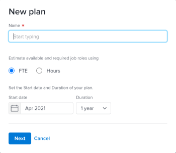
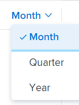

# Erstellen und Bearbeiten von Plänen in der [!DNL Scenario Planner]

Sie können Pläne im Rahmen der Verwendung der [!DNL Workfront Scenario Planner] erstellen, wenn Sie die übergeordnete Strategie Ihres Unternehmens priorisieren. Weitere Informationen zu Plänen finden Sie unter [Pläne - Übersicht im [!DNL Scenario Planner]](../scenario-planner/plans-overview.md).

<!--

(NOTE: talk about:

- Show people conflicts >> this impacts the conflicts calculation for initiatives>> link to the conflicts article

- explain what hovering over the green upward-pointing arrow does, with screen shot)

-->

## Zugriffsanforderungen

+++ Erweitern Sie , um die Zugriffsanforderungen für die -Funktion in diesem Artikel anzuzeigen.

<table style="table-layout:auto"> 
 <col> 
 <col> 
 <tbody> 
  <tr> 
   <td> 
[!DNL Adobe Workfront] Plan*
 </td> 
   <td> <ul></li>
   <li>
Neu: Ultimate 
</li>
   
Der Szenario-Planer ist für die neuen Workfront Select- oder Workfront Prime-Pläne nicht verfügbar. 

   <li>
Aktuell: [!UICONTROL Business] oder höher
</ul>
   </td> 
  </tr> 
  <tr> 
   <td> 
[!DNL Adobe Workfront] Lizenz*
 </td> 
   <td> 
Neu: Licht oder höher
 
   
Aktuell: [!UICONTROL Überprüfen] oder höher
 </td> 
  </tr> 
  <tr> 
   <td>Produkt* </td> 
   <td> <ul><li>
Für die neuen Workfront-Pläne:

 Adobe Workfront</li>

   <li>
Für die aktuellen Workfront-Pläne: 

   
Adobe Workfront
 
Adobe Workfront-Szenarioplaner
</li></ul>

Weitere Informationen finden Sie unter <a href="../scenario-planner/access-needed-to-use-sp.md" class="MCXref xref">Zugriff erforderlich, um die [!DNL Scenario Planner]</a> verwenden zu können. 
 </td> 
  </tr> 
  <tr data-mc-conditions=""> 
   <td>Zugriffsebene </td> 
   <td> 
[!UICONTROL Bearbeiten] Zugriff auf [!DNL Scenario Planner]
 </td> 
  </tr> 
  <tr data-mc-conditions=""> 
   <td> 
Objektberechtigungen 
 </td> 
   <td> 
[!UICONTROL Manage]-Berechtigungen für einen Plan
 
Informationen zum Anfordern zusätzlichen Zugriffs auf einen Plan finden Sie unter <a href="../scenario-planner/request-access-to-plan.md" class="MCXref xref">Anfordern des Zugriffs auf einen Plan im [!DNL Scenario Planner]</a>.
 </td> 
  </tr> 
 </tbody> 
</table>

*Weitere Informationen finden Sie unter [Dokumentation zu Zugriffsanforderungen für Workfront](/help/quicksilver/administration-and-setup/add-users/access-levels-and-object-permissions/access-level-requirements-in-documentation.md).

+++

## Erstellen oder Bearbeiten von Plänen

Sie können einen Plan von Grund auf neu erstellen oder einen vorhandenen Plan bearbeiten, der für Sie freigegeben wurde.

>[!NOTE]
>
>Nachdem Sie einen Plan erstellt haben, werden Sie als Planersteller und -besitzer betrachtet. Wenn ein Benutzer deaktiviert wird, hat der Plan keinen Eigentümer und ist für niemanden sichtbar, es sei denn, er wurde zuvor für einen Link freigegeben.

Dieser Artikel beschreibt, wie Sie einen Plan von Grund auf neu erstellen oder einen vorhandenen Plan bearbeiten können.

Alle Überlegungen zu Plänen, einschließlich der für einen Plan verfügbaren Informationen, finden Sie unter [Übersicht über Pläne in der [!DNL Scenario Planner]](../scenario-planner/plans-overview.md).

Informationen zum Löschen von Plänen finden Sie unter [Löschen von Plänen in der [!DNL Scenario Planner]](../scenario-planner/delete-plans.md).

So erstellen oder bearbeiten Sie einen Plan:

{{step1-to-scenario-planner}}

Eine Liste der vorhandenen Pläne, die Sie erstellt haben, wird im [!DNL Workfront Scenario Planner] angezeigt.

1. (Optional) Klicken Sie auf **[!UICONTROL Filter]**-Symbol  in der oberen rechten Ecke der Liste „Plan“ und wählen Sie eine der folgenden Optionen aus:

   | Filter | Beschreibung |
   |---|---|
   | [!UICONTROL Alle] | Zeigt alle Pläne an, die Sie erstellt haben oder die für Sie freigegeben wurden. |
   | [!UICONTROL Meine Pläne] | Zeigt von Ihnen erstellte Pläne an. |
   | [!UICONTROL Für mich freigegeben] | Zeigt für Sie freigegebene Pläne an. |

   

1. (Optional) Klicken Sie auf das Symbol **[!UICONTROL Suche]** , um ein Keyword einzugeben und schnell einen Plan in der Liste zu finden.

1. Klicken Sie auf den Namen eines vorhandenen Plans, um ihn zu bearbeiten, und fahren Sie mit Schritt 7 fort.

   <!--
   
(NOTE: is the step still accurate) 

   -->

   Oder

   Klicken Sie **[!UICONTROL oben]** auf „Neuer Plan“, um einen Plan zu erstellen und mit Schritt 5 fortzufahren.

   <!--
   
(NOTE: is the step still accurate)

   -->

   

   Das Feld [!UICONTROL Neuer Plan] wird angezeigt.

   

1. (Bedingt) Geben Sie beim Erstellen eines neuen Plans die folgenden Informationen an:

   <table style="table-layout:auto"> 
    <col> 
    <col> 
    <tbody> 
     <tr> 
      <td role="rowheader">[!UICONTROL Name]</td> 
      <td>Geben Sie einen Namen für den Plan ein. Dies ist ein Pflichtfeld.</td> 
     </tr> 
     <tr> 
      <td role="rowheader" colspan="2"> 
Wichtig: Sie können die folgenden Auswahlen nach dem Erstellen und Speichern des Plans nicht mehr ändern. 
 </td> 
     </tr> 
     <tr data-mc-conditions=""> 
      <td role="rowheader">FTE ([!UICONTROL Vollzeitäquivalent]) oder [!UICONTROL Stunden] </td> 
      <td> 
Wählen Sie eine der folgenden Optionen aus, um anzugeben, wie Sie die Aufgabengebiet-Informationen für diesen Plan schätzen möchten: 
 
       <ul> 
      <li> 
<strong>FTE</strong>. Dies ist der  
 
      
<b>WICHTIG</b>
  
      
Für alle Berechnungen in der [!DNL Scenario Planner] verwendet [!DNL Workfront] den folgenden Wert: 1 FTE = 8 Stunden. 
 </li> 
      <li> 
<strong>[!UICONTROL Hours]</strong> 
 </li> 
       </ul> 
<b>WICHTIG</b>

   Die hier ausgewählte Option bestimmt, wie Aufgabengebiet-Informationen für den Plan, die Szenarien des Plans und die Initiativen angezeigt werden
 </td>
   </tr> 
     <tr> 
      <td role="rowheader">[!UICONTROL Startdatum]</td> 
      <td> 
Wählen Sie den Monat und das Jahr aus, in dem der Plan beginnen soll. In diesem Feld können Sie nur Monate auswählen. [!DNL Workfront] wird davon ausgegangen, dass das Startdatum des Plans der erste Tag des ausgewählten Monats und das Enddatum der letzte Tag des Monatsendes in seiner Dauer ist. 
 </td> 
     </tr> 
     <tr> 
      <td role="rowheader">[!UICONTROL Dauer]</td> 
      <td> 
Wählen Sie aus dem Dropdown-Menü eine der folgenden Zeitspannen aus:
 
       <ul> 
        <li>1 Jahr. Dies ist die Standarddauer. </li> 
        <li>3 Jahre</li> 
        <li> 
5 Jahre
 </li> 
       </ul> </td> 
     </tr> 
    </tbody> 
   </table>

<!--for table above - how FTE is calcualted: NOTE: snippet below: this is per Ani; it does NOT look at the system FTE.) 
-->

1. (Bedingt) Klicken Sie auf **[!UICONTROL Weiter]**.

   Die Zeitleiste des Plans wird als &quot;**[!UICONTROL Szenario“]**.

   Weitere Informationen zum Erstellen zusätzlicher Szenarien finden Sie unter [Erstellen und Vergleichen von Planszenarien in der [!DNL Scenario Planner]](../scenario-planner/create-and-compare-scenarios-for-a-plan.md).

1. (Optional) Wählen Sie aus dem Dropdown-Menü Zeitleiste eine der Optionen in der folgenden Tabelle aus, um die Ansicht der Zeitleiste des Plans zu ändern.

   

   | Dropdown-Menüoption | Beschreibung |
   |---|---|
   | [!UICONTROL Monat] | Zeigt die Zeitleiste nach Monat an. Dies ist die Standard- und einzige Option für einen Ein-Jahres-Plan. |
   | [!UICONTROL Quartal] | Zeigt die Zeitleiste nach Quartal an. Diese Option ist nur verfügbar, wenn [!UICONTROL Laufzeit] des Plans 3 oder 5 Jahre beträgt. Dies ist die Standardoption für einen 3-Jahres-Plan. |
   | [!UICONTROL Jahr] | Zeigt die Zeitleiste nach Jahr an. Diese Option ist nur verfügbar, wenn [!UICONTROL Laufzeit] des Plans 5 Jahre beträgt. Dies ist die Standardoption für einen 5-Jahres-Plan. |

1. (Optional) Scrollen Sie von links nach rechts, um die gesamte Laufzeit des Plans anzuzeigen.
1. (Optional) Klicken Sie auf die **[!UICONTROL Heute]**, um zum aktuellen Tag zurückzukehren.

   

1. Klicken Sie auf **[!UICONTROL Feld „Aufgabengebiete]** in der Kopfzeile des Plans, um Aufgabengebiete hinzuzufügen, die für die Ausführung des Plans verfügbar sein werden.

   Die Details des Felds [!UICONTROL Aufgabengebiete] werden angezeigt.

   >[!TIP]
   >
   >Die Rollenzuordnungseinheit (FTE oder Stunden), die [!DNL Workfront] für diesen Plan verwendet, wird im Titel des Felds in Klammern angezeigt.

   

1. Klicken Sie auf **[!UICONTROL Feld „Aufgabengebiet eingeben]** und wählen Sie eine Funktion aus der Liste aus oder geben Sie den Namen eines aktiven Aufgabengebiets ein.

   Wenn Sie auf dieses Feld klicken, werden alle aktiven Aufgabengebiete im System aufgelistet.

   Dadurch wird das Aufgabengebiet zur Spalte Aufgabengebiet hinzugefügt.

1. Aktualisieren oder überprüfen Sie die folgenden Informationen für das Aufgabengebiet:

   <table style="table-layout:auto"> 
    <col> 
    <col> 
    <tbody> 
     <tr> 
      <td role="rowheader"> 
[!UICONTROL Max. verfügbar] (für FTE) 
 
oder 
 
[!UICONTROL Insgesamt verfügbar] (für Stunden) 
 </td> 
      <td> 
Geben Sie abhängig davon, ob Sie Stunden oder VZÄ für Ihren Plan  haben, die Anzahl der Aufgabengebiets-VZÄ ( Stunden) , die für die Ausführung der Arbeit am Plan in den folgenden Feldern verfügbar sind: 
 
       <ul> 
        <li> 
<strong>[!UICONTROL Insgesamt verfügbar]</strong> (für Stunden): Geben Sie die Gesamtanzahl der Stunden für alle Monate während der Dauer des Szenarios an. Standardmäßig teilt [!DNL Workfront] die verfügbare Gesamtzahl gleichmäßig auf alle Monate in der Dauer des Szenarios auf. 
 
Example: </b>"><b>Beispiel: </b>Wenn Sie für eine Designer 1200 Stunden eingeben, bedeutet dies, dass die Designer für jeden Monat während der Laufzeit des Plans für 100 Stunden verfügbar ist, wenn die Laufzeit des Plans [!UICONTROL Duration] 1 Jahr beträgt. 
 </li> 
        <li> 
<b>[!UICONTROL Max. verfügbar]</b> (für VZÄ): Geben Sie die Anzahl der VZÄ an, die das Aufgabengebiet für jeden Monat während der Laufzeit des Plans verfügbar ist. Standardmäßig weist <strong>Workfront</strong> die Zahl [!UICONTROL Max Available] jedem Monat während der Laufzeit des Szenarios zu.
 
Example: </b>"><b>Beispiel: </b>Wenn Sie 1 VZÄ für einen Berater eingeben, bedeutet dies, dass der Berater für 1 VZÄ pro Monat während der Laufzeit des Plans zur Verfügung steht. 
 
Sie können eine Zahl eingeben, die kleiner als 1 FTE ist. 
 
Example: </b>"><b>Beispiel: </b>Ein Berater-Aufgabengebiet von 0,5 würde bedeuten, dass ein Berater die Hälfte seines FTE (in der Regel 4 Stunden, wobei 8 Stunden 1 FTE sind) für die Arbeit an diesem Plan aufwenden würde. Für alle Berechnungen im Szenario-Planer verwendet Workfront den folgenden Wert: 1 FTE = 8 Stunden. 
 </li> 
       </ul> </td> 
     </tr> 
     <tr> 
      <td role="rowheader"> 
[!UICONTROL Max. erforderlich] (für FTE)
 
oder 
 
[!UICONTROL Insgesamt erforderlich] (für Stunden) 
 </td> 
      <td> 
Je nachdem, ob Sie Stunden oder VZÄ für Ihren Plan verwendet haben, überprüfen  die Anzahl der VZÄ für Aufgabengebiete oder Stunden die erforderlich sind, um die Initiativen im Szenario abzuschließen. Überprüfen Sie die folgenden Felder:
 
       <ul> 
        <li> 
<strong>[!UICONTROL Gesamt erforderlich]</strong> (für Stunden): Die Gesamtzahl der für alle Monate während der Laufzeit des Plans erforderlichen Stunden.
 </li> 
        <li> 
<strong>[!UICONTROL Max. erforderlich]</strong> (für VZÄ): Die maximale Anzahl von VZÄ, die für einen der Monate während der Laufzeit des Plans erforderlich sind. 
 </li> 
       </ul> 
Tipp: Die maximale Anzahl der VZÄ oder die Gesamtanzahl der Stunden die für dieses Aufgabengebiet erforderlich sind, wird angezeigt, nachdem Sie mit dem Hinzufügen von Initiativen begonnen haben. Informationen zum Hinzufügen von Initiativen zu einem Plan finden Sie unter <a href="../scenario-planner/create-and-edit-initiatives.md" class="MCXref xref">Erstellen und Bearbeiten von Initiativen im [!DNL Scenario Planner]</a>.
 </td> 
     </tr> <!--
      <tr data-mc-conditions="QuicksilverOrClassic.Draft mode"> 
       <td role="rowheader">[!UICONTROL Avg utilization]</td> 
       <td> 
(NOTE: this field was removed in 21.2 - May 2021) 
 
[!DNL Workfront] calculates the average utilization for each job role using the job role FTEs associated with initiatives (required) and the job role FTEs associated with the plan (available). 
 
 [!DNL Workfront] calculates the job role utilization percentage for a plan using the following formula: 
 
<code>Job role utilization percentage = Sum [(Required job roles for each month of the plan *100)/ (Available job roles for each month of the plan)] / Number of months in the Duration of the plan</code> 
 
        
Example: </b>"> <b>Example: </b> 
         
For example, if you have a plan with a duration of 12 months and an initiative with the duration of 2 months, where you use 1 Designer for your initiative (required job role) and there are 2 Designers available on the plan (available), the Utilization percentage for the Designer job role is calculated as follows:
 
         
<code>Designer utilization percentage = [(1/2 + 1/2) * 100] / 12 = 100 / 12 = 8.3%</code> 
 
        
 
As you add job roles to the plan and indicate the Available amount for each one, the [!UICONTROL Utilization] value for each role also updates and [!DNL Workfront] calculates a utilization percentage for the plan. For information about how [!DNL Workfront] calculates the Job Role Utilization for a plan, see <a href="../scenario-planner/plans-overview.md" class="MCXref xref">Plans overview in the [!DNL Scenario Planner]</a>. 
 
Tip: The Utilization percentage is rounded and has one decimal. 
 </td> 
      </tr>
     --> 
     <tr> 
      <td role="rowheader">[!UICONTROL Stundensatz]</td> 
      <td> 
Dies ist der Satz von [!UICONTROL Cost Hour] für das Aufgabengebiet. Der Stundensatz wird in der Währung Ihres Systems angezeigt. Informationen zum Einrichten von Wechselkursen für Ihr System finden Sie unter <a href="../administration-and-setup/manage-workfront/exchange-rates/set-up-exchange-rates.md" class="MCXref xref">Einrichten von Wechselkursen</a>.
 </td> 
     </tr> 
    </tbody> 
   </table>

1. (Optional) Bewegen Sie den Mauszeiger über den Namen eines Aufgabengebiets oder klicken Sie auf die Registerkarte, nachdem Sie die Rolleninformationen aktualisiert haben, und klicken Sie dann auf das **[!UICONTROL Papierkorbsymbol]** , um es aus dem Plan zu entfernen.
1. Klicken Sie **[!UICONTROL Aufgabengebiet-Verteilung]**.

   Das Bedienfeld „Verteilung des Aufgabengebiets“ wird für alle Monate während der Laufzeit des Szenarios angezeigt.

   

1. Geben Sie den Namen eines Aufgabengebiets ein, um es dem Plan hinzuzufügen, im Feld **[!UICONTROL Beginnen Sie mit der Eingabe des Aufgabengebiets]** und klicken Sie dann auf die Eingabetaste , wenn es in der Liste angezeigt wird. Dadurch wird das Aufgabengebiet zur Spalte [!UICONTROL Aufgabengebiet] hinzugefügt.
1. Aktualisieren oder überprüfen Sie die folgenden Informationen für jeden Monat des Szenarios:

   <table style="table-layout:auto"> 
    <col> 
    <col> 
    <tbody> 
     <tr> 
      <td role="rowheader">[!UICONTROL Aufgabengebiete] (FTE oder Stunden)</td> 
      <td>Sowohl das für das Szenario verfügbare Aufgabengebiet als auch die für die Initiativen im Szenario erforderlichen Aufgabengebiete werden im Bedienfeld Verteilung des Aufgabengebiets angezeigt. Es gibt einen Hinweis darauf, ob die Schätzungen der Aufgabengebiete in FTEs oder Stunden in der Spaltenüberschrift enthalten sind. </td> 
     </tr> 
     <tr> 
      <td role="rowheader"> 
[!UICONTROL Available] (max. &lt;number of FTEs&gt;) 
 
       
 
        
oder
 
        
[!UICONTROL Available] (total &lt;number of hours&gt;) 
 
       
 </td> 
      <td> 
Je nachdem, ob Sie Stunden oder VZÄ für Ihren Plan verwenden, überprüfen oder aktualisieren , die monatliche Anzahl der für das Szenario verfügbaren VZÄ für Aufgabengebiete oder ) in den folgenden Feldern:
 
       <ul> 
        <li> 
<strong>[!UICONTROL Available] (max &lt;number of FTEs&gt;)</strong>: Die Zahl in Klammern zeigt die maximale Anzahl der für einen der Monate für das Szenario verfügbaren Rollen an. Überprüfen oder aktualisieren Sie die Anzahl der VZÄ für jeden Monat des Szenarios. Durch eine Änderung der monatlichen Zuordnung kann sich die Anzahl der VZÄ in Klammern ändern. 
 </li> 
        <li> 
<strong>[!UICONTROL Available] (total &lt;number of hours&gt;)</strong>: Die Zahl in Klammern zeigt die Gesamtzahl der verfügbaren Stunden für alle Monate im Szenario an. Überprüfen oder aktualisieren Sie die Anzahl der Stunden für jeden Monat des Szenarios. Durch die Änderung der monatlichen Zuordnung wird die Anzahl der Stunden in Klammern aktualisiert. 
 </li> 
       </ul> 
Eine andere Möglichkeit, Aufgabengebietskonflikte zwischen Initiativen im Szenario zu lösen, besteht darin, die monatlichen Aufgabengebietszuweisungen manuell zu aktualisieren. 
 
Tipp:   
Um die monatliche Rollenverfügbarkeit für mehrere Monate zu aktualisieren, geben Sie die Anzahl der Stunden oder FTEs in das Feld [!UICONTROL Available] eines Monats ein und ziehen Sie dann die Ecke des Felds über die angrenzenden Monate, um denselben Wert für jeden Monat zu kopieren. Legen Sie sie ab, um alle Monate zu aktualisieren. 
 
  
 
 </td> 
     </tr> 
     <tr> 
      <td role="rowheader"> 
[!UICONTROL Erforderlich] (max. &lt;Zahl&gt;)
 
       
 
        
oder
 
        
[!UICONTROL Erforderlich] (insgesamt &lt;number&gt;)
 
       
 </td> 
      <td> 
Je nachdem, ob Sie für Ihren Plan Stunden oder VZÄ verwendet haben,  Sie die monatliche Anzahl der für das Szenario erforderlichen Aufgabengebiets-VZÄ oder Stunden in den folgenden Feldern: 
 
       <ul> 
        <li> 
<strong>[!UICONTROL Erforderlich] (Max. &lt;Anzahl VZÄ&gt;)</strong>: Die Zahl in Klammern zeigt die maximale Anzahl von Rollen an, die für einen der Monate für das Szenario erforderlich sind. 
 </li> 
        <li> 
<strong>[!UICONTROL Erforderlich] (Gesamtstundenzahl&gt;)</strong>: Die Zahl in Klammern gibt die Gesamtstundenzahl an, die für alle Monate im Szenario erforderlich ist. 
 </li> 
       </ul> 
Tipp: Sie können die erforderliche Anzahl von VZÄ ( Stunden)  Aufgabengebiet nicht ändern. Diese Zahl wird für das Szenario ausgefüllt, nachdem Sie mit dem Hinzufügen von Initiativen und deren Aufgabengebiet-Anforderungen begonnen haben. 
 </td> 
     </tr> 
     <tr> 
      <td role="rowheader">[!UICONTROL Unterschied]</td> 
      <td> 
       
 
        
Die monatliche Differenz zwischen den erforderlichen und den verfügbaren Aufgabengebieten für das Szenario. [!DNL Workfront] berechnet die Differenz für jedes Aufgabengebiet für jeden Monat anhand der folgenden Formel:
 
        
<code>Monthly role difference = Monthly required roles - Monthly available roles</code> (in VZÄ oder Stunden) 
 
        
Tipp: Wenn die Differenz eine negative Zahl anzeigt, sind für das Szenario mehr Aufgabengebiete erforderlich, als im Plan verfügbar sind. Ihre Ressourcen sind überlastet. 
 
       
 </td> 
     </tr> 
     <tr> 
      <td role="rowheader">[!UICONTROL -Auslastung] %</td> 
      <td> 
       
 
        
Der Prozentsatz der Nutzung zeigt an, wie viele der verfügbaren Aufgabengebiete tatsächlich für die Initiativen im Szenario verwendet (oder erforderlich) werden. 
 
        
[!DNL Workfront] Berechnet die Auslastung pro Aufgabengebiet und Monat nach folgender Formel: 
 
        
<code>Monthly role utilization % = Monthly required roles / Monthly available roles * 100</code> 
 
        
Der Auslastungsprozentsatz kann je nach Zuordnung der Ressourcen in den folgenden Farben angezeigt werden:
 
        <ul> 
         <li> 
<b>Grün</b>: Die verfügbare und erforderliche Anzahl von Aufgabengebieten stimmen überein. Die Ressourcen sind vollständig zugewiesen und der Auslastungsprozentsatz liegt bei 100 %. 
 </li> 
         <li> 
<b>Rot</b>: Es gibt mehr erforderliche Aufgabengebiete, als im Plan verfügbar sind. Die Ressourcen sind überlastet und der Auslastungsprozentsatz liegt über 100 %.
 </li> 
         <li> 
<b>Blau</b>: Es sind mehr Aufgabengebiete verfügbar als erforderlich. Die Ressourcen sind nicht ausgelastet, und der Auslastungsprozentsatz liegt unter 100 %. 
 </li> 
        </ul> 
       
 
  
 </td> 
     </tr> 
    </tbody> 
   </table>

1. Klicken Sie auf **[!UICONTROL Anwenden]**, um die Verteilung der monatlichen Aufgabengebiete zu speichern

   Oder

   Klicken Sie **[!UICONTROL Abbrechen]**, um die Aufgabengebiet-Verteilerliste zu schließen und zum Szenario zurückzukehren.

1. Klicken Sie auf **[!UICONTROL Finanzen]** in der Kopfzeile des Plans, um das Budget für diesen Plan hinzuzufügen.

   Die Details des Feldes [!UICONTROL Finanzen] werden angezeigt.

   >[!TIP]
   >
   >Die Währung, die [!DNL Workfront] für diesen Plan verwendet, wird im Titel des Felds in Klammern angezeigt.

1. Geben Sie das **[!UICONTROL Jahresbudget]** an.

   >[!NOTE]
   >
   >Wenn Ihr Plan mehrere Jahre umfasst, müssen Sie für jedes Jahr einen Budgetbetrag angeben.

1. Drücken Sie die Eingabetaste, um das jährliche Budget zu speichern, und dann [!UICONTROL Tab], um zum folgenden Jahr zu wechseln.

   Das jährliche Budget wird automatisch zu gleichen Teilen auf jeden Monat des ausgewählten Jahres verteilt.

1. Klicken Sie **[!UICONTROL Erweitert]**, um die monatliche Budgetverteilung anzuzeigen. Die Jahres- und Monatsbudgets sind stets gerundete Zahlen. Wenn der Budgetbetrag aufgrund von Dezimalstellen nicht gleichmäßig auf alle Monate innerhalb eines Jahres verteilt werden kann, wird unter der jährlichen Budgetverteilung ein Indikator **[!UICONTROL Verbleibend]** angezeigt.

   

1. Passen Sie die monatlichen Budgets manuell an, um die Überschreitungen zu vermeiden.

   Wenn die Summe aller monatlichen Budgetbeträge größer ist als das Jahresbudget, wird unter der jährlichen Budgetverteilung ein Warnindikator **[!UICONTROL Überschreitung]** angezeigt. Passen Sie die monatlichen Budgetbeträge manuell an, bis sie dem verfügbaren Budget für den Plan entsprechen oder darunter liegen.

   

1. Deaktivieren Sie die Einstellung **[!UICONTROL Personalkosten einbeziehen]**, um Kosten im Zusammenhang mit Aufgabengebieten von der Anrechnung auf die Gesamtkosten des Plans auszuschließen. Fixkosten werden immer auf die Gesamtkosten des Plans angerechnet. Diese Einstellung ist standardmäßig aktiviert und wirkt sich auf alle Szenarien im Plan aus.
1. Klicken Sie auf eine beliebige Stelle außerhalb des Felds [!UICONTROL Finanzen], um es zu schließen. Die eingegebenen Informationen werden automatisch gespeichert.

   Sie können jetzt damit beginnen, die Initiativen für den Plan zu erstellen und Szenarien hinzuzufügen.

1. (Empfohlen) Klicken Sie auf **[!UICONTROL Neue Initiative]**, um eine neue Initiative hinzuzufügen.

   <!--
   
(NOTE: Should this include information on how to create scenarios - see also information about scenarios in Manage Plans?)

   -->

   Informationen zum Hinzufügen von Initiativen finden Sie im Artikel [Erstellen und Bearbeiten von Initiativen in der [!DNL Scenario Planner]](../scenario-planner/create-and-edit-initiatives.md).

1. (Optional) Erstellen Sie eine Kopie des vorhandenen Szenarios, um ein neues Szenario desselben Plans zu erstellen. Weitere Informationen zum Erstellen und Verwenden mehrerer Szenarien finden Sie unter [Erstellen und Vergleichen von Planszenarien in der [!DNL Scenario Planner]](../scenario-planner/create-and-compare-scenarios-for-a-plan.md).
1. Klicken Sie **[!UICONTROL Plan speichern]**.

   Ihr Plan wird erstellt oder aktualisiert.

1. (Optional) Klicken Sie auf **[!UICONTROL Favoritensymbol]**  rechts neben dem Plannamen, um den Plan zu Ihrer Favoritenliste hinzuzufügen.

1. (Optional) Kopieren Sie die URL des Plans und senden Sie sie an jeden anderen Benutzer, der sie möglicherweise überprüfen oder aktualisieren muss. Sie müssen mindestens [!UICONTROL Ansicht] Zugriff auf ihrer Zugriffsebene haben, um den Plan anzeigen zu können. Sie müssen über [!UICONTROL Bearbeiten]-Zugriff verfügen, um sie zu bearbeiten. Wenn sie Finanzinformationen zum Plan, wie Budgets, Kosten und Informationen zu den Aufgabengebieten, überprüfen müssen, müssen sie auch in ihrer Zugriffsebene Zugriff auf [!UICONTROL Finanzdaten] haben. Weitere Informationen über den Zugriff, der für den [!DNL Scenario Planner] erforderlich ist, finden Sie unter [Zugriff erforderlich für die Verwendung des  [!DNL Scenario Planner]](../scenario-planner/access-needed-to-use-sp.md).
