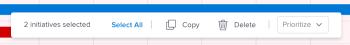

# Initiativen im [!DNL Scenario Planner] löschen

Sie können Initiativen in einem von Ihnen erstellten Plan oder in einem Plan löschen, den jemand für Sie freigegeben hat. Sie können gelöschte Initiativen nicht wiederherstellen.

## Zugriffsanforderungen

+++ Erweitern Sie , um die Zugriffsanforderungen für die -Funktion in diesem Artikel anzuzeigen. 

<table style="table-layout:auto"> 
 <col> 
 <col> 
 <tbody> 
  <tr> 
   <td> 
[!DNL Adobe Workfront] Packstück
 </td> 
   <td> 
   
Workfront Ultimate

<b>NOTIZ</b>

Wenden Sie sich an Ihren Workfront-Support-Mitarbeiter, wenn Sie ein anderes Workfront-Paket haben.

   </td> 
  </tr> 
  <tr> 
   <td> 
[!DNL Adobe Workfront] Lizenz
 </td> 
   <td> 
[!UICONTROL light] oder höher
 
   
[!UICONTROL Überprüfung] oder höher
 </td> 
  </tr> 
    <tr> 
   <td>Konfigurationen der Zugriffsebene</td> 
   <td> 
[!UICONTROL Bearbeiten] Zugriff auf [!DNL Scenario Planner]
 </td> 
  </tr> 
  <tr> 
   <td> 
Objektberechtigungen 
 </td> 
   <td> 
[!UICONTROL Manage]-Berechtigungen für einen Plan
 </td> 
  </tr> 
 </tbody> 
</table>

Weitere Informationen zum Zugriff auf den Szenario-Planer finden Sie unter [Zugriff für die Verwendung des erforderlich [!DNL Scenario Planner]](../scenario-planner/access-needed-to-use-sp.md).

Informationen zu den Zugriffsanforderungen für Workfront finden Sie unter [Zugriffsanforderungen für Workfront-Dokumentation](/help/quicksilver/administration-and-setup/add-users/access-levels-and-object-permissions/access-level-requirements-in-documentation.md).

+++

<!--Old:

<table style="table-layout:auto"> 
 <col> 
 <col> 
 <tbody> 
  <tr> 
   <td> 
[!DNL Adobe Workfront] plan*
 </td> 
   <td> <ul></li>
   <li>
New: Ultimate 
</li>
   
The Scenario Planner is not available for the new Workfront Select or Workfront Prime plans. 

   <li>
Current: [!UICONTROL Business] or higher
</ul>
   </td> 
  </tr> 
  <tr> 
   <td> 
[!DNL Adobe Workfront] license*
 </td> 
   <td> 
New: Light or higher
 
   
Current: [!UICONTROL Review] or higher
 </td> 
  </tr> 
  <tr> 
   <td>Product* </td> 
   <td> <ul><li>
For the new Workfront plans:

 Adobe Workfront</li>

   <li>
For the current Workfront plans: 

   
Adobe Workfront
 
Adobe Workfront Scenario Planner
</li></ul>
   
   
For more information, see <a href="../scenario-planner/access-needed-to-use-sp.md" class="MCXref xref">Access needed to use the [!DNL Scenario Planner]</a>. 
 </td> 
  </tr> 
  <tr data-mc-conditions=""> 
   <td>Access level </td> 
   <td> 
[!UICONTROL Edit] access to the [!DNL Scenario Planner]
 </td> 
  </tr> 
  <tr data-mc-conditions=""> 
   <td> 
Object permissions 
 </td> 
   <td> 
[!UICONTROL Manage] permissions to a plan
 
For information on requesting additional access to a plan, see <a href="../scenario-planner/request-access-to-plan.md" class="MCXref xref">Request access to a plan in the [!DNL Scenario Planner]</a>.
 </td> 
  </tr> 
 </tbody> 
</table>

*For information, see [Access requirements to Workfront documentation](/help/quicksilver/administration-and-setup/add-users/access-levels-and-object-permissions/access-level-requirements-in-documentation.md). -->

## Initiativen löschen

Beachten Sie beim Löschen von Initiativen Folgendes:

* Durch das Löschen einer Initiative werden die erforderliche Anzahl von Aufgabengebieten und die mit der Initiative verbundenen Kosteninformationen aus dem Plan entfernt.
* Beim Löschen einer Initiative, die durch den Import eines Projekts erstellt wurde, wird das mit der Initiative verknüpfte Projekt nicht gelöscht.
* Das Löschen einer Initiative, die mindestens einmal in einem Projekt veröffentlicht wurde, führt zu Folgendem:

   * Die Initiative wird aus dem Szenario gelöscht, der [!DNL Scenario Planner] Bereich verbleibt jedoch im Abschnitt [!UICONTROL Projektdetails].
   * Wenn die Initiative, die Sie löschen, die einzige veröffentlichte Initiative im Szenario ist, wird der Indikator, dass der Plan veröffentlicht wurde, ebenfalls entfernt.

     Informationen zur Veröffentlichung von Initiativen in Projekten finden Sie unter [Aktualisieren oder Erstellen von Projekten durch Veröffentlichung von Initiativen in der [!DNL Scenario Planner]](../scenario-planner/publish-scenarios-update-projects.md).

     Informationen zum Erstellen von Initiativen durch Importieren von Projekten finden Sie [Projekte in Pläne importieren in der [!DNL Scenario Planner]](../scenario-planner/import-projects-to-plans.md) .

Sie können jeweils nur eine Initiative löschen oder mehrere Initiativen gleichzeitig löschen.

* [Löschen Sie eine Initiative](#delete-one-initiative)
* [Initiativen stapelweise löschen](#delete-initiatives-in-bulk)

### Eine Initiative löschen {#delete-one-initiative}

{{step1-to-scenario-planner}}

Eine Liste mit Plänen wird angezeigt.

1. Klicken Sie auf den Namen eines Plans, um ihn zu öffnen, und suchen Sie dann die Initiative, die Sie löschen möchten.
1. Führen Sie einen der folgenden Schritte aus:

   * Klicken Sie auf das **[!UICONTROL Mehr]** Menü  rechts neben dem Namen der Initiative und klicken Sie dann auf **[!UICONTROL Löschen]** > **[!UICONTROL Ja, löschen]**.

   * Aktivieren Sie das Kästchen links von der Initiative und klicken Sie dann im unverankerten **[!UICONTROL , das unten im Plan angezeigt wird, auf]** Löschen und dann auf **[!UICONTROL Ja, löschen]**.

   Die Initiative und ihre Aufgabengebiete sowie Kosteninformationen werden aus dem Plan gelöscht.

1. Klicken Sie **[!UICONTROL Plan speichern]** um Ihre Änderungen zu speichern.

### Initiativen stapelweise löschen {#delete-initiatives-in-bulk}

{{step1-to-scenario-planner}}

Eine Liste mit Plänen wird angezeigt.

1. Klicken Sie auf den Namen eines Plans, um ihn zu öffnen, und suchen Sie dann die Initiative, die Sie löschen möchten.
1. Markieren Sie die Kästchen links neben den Initiativen, die Sie löschen möchten, und klicken Sie dann im unten im Plan angezeigten **[!UICONTROL auf]** Löschen und anschließend auf **[!UICONTROL Ja, löschen]**.

   

   Die Initiativen und ihre Aufgabengebiete sowie Kosteninformationen werden aus dem Plan gelöscht.

1. Klicken Sie **[!UICONTROL Plan speichern]** um Ihre Änderungen zu speichern.
