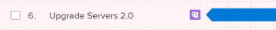

# Importieren von Projekten in Pläne in der [!DNL Scenario Planner]

Sie können vorhandene Projekte in einen Plan importieren. Die importierten Projekte werden in Initiativen umgewandelt, und Sie können sie innerhalb des Plans so verwalten, wie Sie eine neue Initiative durchführen würden. Das ursprüngliche Projekt bleibt mit der neuen Initiative verbunden.

<!--

(NOTE: add information about what happens when you import projects and where the info from projects show up;

- the hours/ FTE come from WorkPerDay

- if a task has a Duration of 0, the FTE should be 0 for that asignee but it should still come across) 

-->

## Zugriffsanforderungen

Sie müssen über Folgendes verfügen:

<table style="table-layout:auto"> 
 <col> 
 <col> 
 <tbody> 
  <tr> 
   <td> 
[!DNL Adobe Workfront]<b> plan*</b> 
 </td> 
   <td>[!UICONTROL Business] oder höher</td> 
  </tr> 
  <tr> 
   <td> 
[!DNL Adobe Workfront]<b> license*</b> 
 </td> 
   <td> 
[!UICONTROL Review] oder höher
 </td> 
  </tr> 
  <tr> 
   <td><b>Produkt</b> </td> 
   <td> 
Sie müssen eine zusätzliche Lizenz für die [!DNL Adobe Workfront Scenario Planner] erwerben, um auf die in diesem Artikel beschriebene Funktion zugreifen zu können.
 
Informationen zum Abrufen des [!DNL Workfront Scenario Planner] finden Sie unter <a href="../scenario-planner/access-needed-to-use-sp.md" class="MCXref xref">Für die Verwendung des [!DNL Scenario Planner]</a> benötigten Zugriffs. 
 </td> 
  </tr> 
  <tr data-mc-conditions=""> 
   <td><strong>Konfigurationen auf Zugriffsebene*</strong> </td> 
   <td> 
Zugriff auf [!UICONTROL Bearbeiten] oder höher auf die [!DNL Scenario Planner]
 
Hinweis: Wenn Sie immer noch keinen Zugriff haben, fragen Sie Ihren [!DNL Workfront] -Administrator, ob er zusätzliche Zugriffsbeschränkungen für Ihre Zugriffsebene festlegt. Informationen dazu, wie ein [!DNL Workfront] -Administrator Ihre Zugriffsebene ändern kann, finden Sie unter <a href="../administration-and-setup/add-users/configure-and-grant-access/create-modify-access-levels.md" class="MCXref xref">Benutzerdefinierte Zugriffsebenen erstellen oder ändern</a>.
 </td> 
  </tr> 
  <tr data-mc-conditions=""> 
   <td> 
<strong>Objektberechtigungen</strong> 
 </td> 
   <td> 
[!UICONTROL Berechtigungen für einen Plan verwalten
 
Weitere Informationen zum Anfordern von zusätzlichem Zugriff auf einen Plan finden Sie unter <a href="../scenario-planner/request-access-to-plan.md" class="MCXref xref">Anfordern des Zugriffs auf einen Plan im Szenario-Planer</a>.
 </td> 
  </tr> 
 </tbody> 
</table>

&#42;Wenden Sie sich an Ihren [!DNL Workfront] -Administrator, um zu erfahren, welchen Plan, welchen Lizenztyp oder welchen Zugriff Sie haben.

## Überlegungen zum Import von Projekten in Pläne als neue Initiativen

* Sie müssen Projekte erstellen, bevor Sie sie als neue Initiativen in einen Plan importieren können.

  <!--
  
(NOTE: no caveats for project statuses yet, mentioned in the import steps as a tip) 

  -->

* Sie müssen über mindestens [!UICONTROL Anzeigen] -Berechtigungen für die Projekte verfügen, um sie als neue Initiative in einen Plan importieren zu können.
* Sie können dasselbe Projekt in mehrere Pläne importieren.
* Für die Projekte, die Sie importieren möchten, müssen Daten im Zeitrahmen Ihres Plans enthalten sein. Sie können keine Projekte mit einem [!UICONTROL geplanten Abschlussdatum] vor dem Beginn des Plans oder einem [!UICONTROL geplanten Startdatum] nach dem Ende des Plans importieren.
* Sie können nicht mehr als 100 Projekte gleichzeitig importieren.
* Einige Projektinformationen werden ebenfalls in den Plan importiert und werden zu Initiativinformationen. Informationen dazu, welche Projektinformationen in den Plan importiert werden und zu Initiativinformationen werden, finden Sie im Abschnitt [In den Plan importierte Projektinformationen](#project-information-imported-into-the-plan) in diesem Artikel.
* Änderungen an den verknüpften Projekten wirken sich nicht auf die Initiativen des Plans aus.
* Änderungen an den Initiativen im Plan wirken sich nicht automatisch auf die verknüpften Projekte aus. Änderungen der Initiative wirken sich nur dann auf die verknüpften Projekte aus, wenn Sie die Initiative aus dem Plan veröffentlichen. Informationen dazu, wie Veröffentlichungsinitiativen sich auf die verknüpften Projekte auswirken, finden Sie unter [Aktualisieren oder Erstellen von Projekten durch Veröffentlichen von Initiativen in der [!DNL Scenario Planner]](../scenario-planner/publish-scenarios-update-projects.md).
* Wenn Sie eine durch Importieren eines Projekts erstellte Initiative löschen, wird das Projekt nicht gelöscht.
* Durch das Löschen eines mit einer Initiative verknüpften Projekts wird die Initiative nicht gelöscht.

## Importierte Projektinformationen in den Plan {#project-information-imported-into-the-plan}

Wenn Sie ein Projekt in einen Plan importieren, werden auch einige Projektinformationen in den Plan importiert und zu Initiativinformationen. Die folgende Tabelle zeigt, aus welchen Projektinformationen beim Importieren eines Projekts in einen Plan Initiativinformationen werden:

<!--

(NOTE: add what happens if you import a 5 year project to a 1 year plan - how does this display?) 

-->

<table style="table-layout:auto"> 
 <col> 
 <col> 
 <tbody> 
  <tr> 
   <td>Projektinformationen</td> 
   <td>Initiativinformationen </td> 
  </tr> 
  <tr> 
   <td>Projektname</td> 
   <td>Name der Initiative</td> 
  </tr> 
  <tr> 
   <td>Geplante Projektdaten</td> 
   <td> 
Start- und Endmonate der Initiative.
 
Beginnt oder endet ein Projekt in der Mitte eines Monats, werden die importierten Daten auf einen ganzen Monat im Plan erweitert. Wenn beispielsweise die geplanten Projektdaten der 20. März bis 5. Mai 2020 sind, dann sind die Daten der importierten Initiative März bis Mai 2020.
 
Wenn das geplante Start- oder Abschlussdatum über die Dauer des Plans hinausgeht, gibt es einen visuellen Hinweis darauf, dass die importierte Initiative vor oder nach dem Plan beginnt. 
 </td> 
  </tr> 
  <tr> 
   <td>Aufgabenrollen, die Aufgaben und Problemen zugewiesen sind</td> 
   <td> 
Projektrollen. 
 
Hinweis:   
Wenn ein Benutzer während der Laufzeit des Projekts die Rollen ändert, hängen die importierten Rollen vom Status der Zuweisung beim Import des Projekts ab. Die folgenden Szenarien existieren:
 
     <ul> 
      <li> 
Wenn ein Benutzer, der einer Aufgabe oder einem Problem zugewiesen wurde, seine Rolle geändert hat, nachdem er seine Zuweisung als [!UICONTROL Fertig] markiert hat, importiert [!DNL Workfront] die Rolle, die der Benutzer erfüllt hat, bevor er die Zuweisung als [!UICONTROL Fertig] markiert hat.
 </li> 
      <li> 
Wenn ein Benutzer, der einer Aufgabe oder einem Problem zugewiesen wurde, während der Laufzeit des Projekts die Rolle geändert hat, aber seine Zuweisung zu der Aufgabe oder dem Problem beim Importieren des Projekts nicht als [!UICONTROL Fertig] markiert ist, importiert [!DNL Workfront] nur die aktuelle Rolle des zugewiesenen Benutzers. 
 </li> 
     </ul> 
Weitere Informationen zum Status einer Zuweisung finden Sie unter "Zuweisungsstatus"im <a href="../workfront-basics/navigate-workfront/workfront-navigation/workfront-terminology-glossary.md" class="MCXref xref">Glossar der Adobe [!DNL Workfront]-Terminologie</a>. 
 
 </td> 
  </tr> 
  <tr> 
   <td>Projekt [!UICONTROL Geplante Stunden] im Zusammenhang mit Stellenrollen, die Aufgaben oder Problemen zugewiesen sind</td> 
   <td> 
Je nachdem, ob der Plan für die Verwendung von FTEs oder Stunden eingerichtet ist, werden die [!UICONTROL Planeten Stunden] aus den Aufgaben im Projekt entweder [!UICONTROL Erforderliche FTEs]  oder [!UICONTROL Erforderliche Stunden] im Plan. 
 
Informationen zum Einrichten eines Plans zur Verwendung von FTEs oder Stunden finden Sie unter <a href="../scenario-planner/create-and-edit-plans.md" class="MCXref xref">Erstellen und Bearbeiten von Plänen in der [!DNL Scenario Planner]</a>. 
 
Beachten Sie Folgendes:
 
    <ul> 
     <li> 
[!DNL Workfront] verwendet die Auftragsrollen, die Aufgaben und Problemen zugewiesen sind, oder die Auftragsrollen, mit denen die Benutzer, die Aufgaben oder Problemen zugewiesen sind, im Projekt verknüpft sind, und überträgt sie als "Erforderliche Auftragsrollen"in die neue Initiative. 
 </li> 
     <li> 
Wenn der Plan für die Verwendung von FTEs eingerichtet ist, werden die Planstunden, die den Aufgaben und Problemen des Projekts zugeordnet sind, zunächst in eine FTE umgewandelt. Diese FTE wird dann der Aufgabe der Initiative übertragen. Geplante Stunden sind in [!DNL Workfront] gleichermaßen verteilt. Wenn eine Aufgabe oder ein Problem mehrere Monate in Anspruch nimmt, wird der Betrag der geplanten Stunden für jeden Monat während der Dauer der Initiative in monatliche VZÄ umgerechnet und auf jeden Monat der Initiative übertragen.
 
Example: </b>"><b>Beispiel: </b>Wenn beispielsweise eine Aufgabe im September einer Auftragsrolle für 80 geplante Stunden zugewiesen ist, zeigt die importierte Auftragsrolle für die Initiative im September 0,5 FTE an. 
 </li> 
     <li> 
[!DNL Workfront] berechnet anhand der folgenden Formel die FTE der mit der Initiative verknüpften Aufgaben "Erforderlicher Auftrag":
 
<code>Required Job Role FTE (initiative) = Job Role assignment Planned Hours (</code><code>from tasks and issues on the project)/ 160</code> 
 
Tipp: Der [!DNL Scenario Planner] geht davon aus, dass ein Monat 160 Arbeitsstunden enthält.
 
Wenn beispielsweise ein Projekt eine Dauer von 1200 Minuten hat und eine Arbeitsplatzrolle im Projekt mit 600 Minuten geplanter Stunden verknüpft ist, beträgt die VZÄ 0,5. Beim Import des Projekts beträgt die "Erforderliche Auftragsrolle" für die neu geschaffene Initiative 0,5 für jeden Monat der Initiative. 
 </li> 
     <li>Wenn einer Aufgabe im Projekt eine berufliche Rolle zugewiesen wird, deren geplante Arbeitszeit null ist, ist die erforderliche FTE für die Stellenrolle der Initiative standardmäßig null. <!--
       <MadCap:conditionalText data-mc-conditions="QuicksilverOrClassic.Draft mode">
         (NOTE: this used to be 1, not zero in Production) 
       </MadCap:conditionalText>
      --></li> 
     <li>Wenn einer Aufgabe im Projekt eine Stellenrolle mit einer null [!UICONTROL Dauer] zugewiesen wird, ist die erforderliche FTE oder Stunden für die Stellenrolle der Initiative standardmäßig null, selbst wenn die Aufgabe über geplante Stunden verfügt. </li> 
    </ul> </td> 
  </tr> 
 </tbody> 
</table>

## Projekte in einen Plan importieren

>[!IMPORTANT]
>
>Nach dem Import von Projekten in einen Plan werden sie zu Initiativen für den Plan. Obwohl die beiden Elemente verknüpft sind, existieren sie als unabhängige Entitäten und beeinflussen sich bei der Aktualisierung nicht automatisch gegenseitig.
>
>Folgendes tritt auf:
>
>* Änderungen am Projekt wirken sich nicht auf die Initiative aus, nachdem Sie das Projekt in den Plan importiert haben. Diese Änderungen umfassen Änderungen an den Zuordnungen von Stellenrollen.
>
>  <!--
>  
(NOTE: this might change if projects will ever affect initiatives automatically) 
>
>  -->
>
>* Änderungen an der Initiative wirken sich nur dann auf die Informationen im Bereich [!DNL Scenario Planner] des Projekts aus, wenn Sie die Initiative im entsprechenden Projekt veröffentlichen. Andernfalls haben sie keine Auswirkungen auf die [!UICONTROL geplanten Stunden] -Informationen für die Aufgaben und Probleme des Projekts.
>
>  Informationen dazu, wie Veröffentlichungsinitiativen sich auf die verknüpften Projekte auswirken, finden Sie unter [Aktualisieren oder Erstellen von Projekten durch Veröffentlichen von Initiativen im Szenario-Planer](../scenario-planner/publish-scenarios-update-projects.md).
>

1. Klicken Sie auf das **[!UICONTROL Hauptmenü]**  in der oberen rechten Ecke von [!DNL Workfront] und dann auf [!DNL Scenarios], um auf den [!DNL Scenario Planner] zuzugreifen.

1. Klicken Sie auf den Namen eines Plans, aus dem Sie Projekte importieren möchten.
1. Klicken Sie auf **[!UICONTROL Neue Initiative]** und dann auf **[!UICONTROL Projekte importieren]**.

   Das Feld [!UICONTROL Projekte importieren] wird angezeigt. Projekte mit Datumsangaben im Zeitrahmen Ihres Plans werden in einer Liste angezeigt.

   

   >[!TIP]
   >
   >Projekte mit einem beliebigen Status werden in der Liste angezeigt.

   <!--
   
(NOTE: the status of the projects in the import projects UI might change; right now it's ALL statuses)

   -->

1. (Optional) Klicken Sie auf das Symbol **[!UICONTROL Filter]**  und wählen Sie einen verfügbaren Filter aus der Liste aus, um die Anzahl der Projekte auf Ihrer Liste zu reduzieren. Standardmäßig wird die Projektliste durch den aktuell ausgewählten Projektfilter des Benutzers in einer Projektliste gefiltert.

1. (Optional) Klicken Sie auf das Symbol **[!UICONTROL Suchen]**  und fügen Sie einen Suchbegriff hinzu, der in einem beliebigen Feld auf dem Bildschirm angezeigt wird. Die Elemente, die das Suchwort enthalten, werden automatisch in der Liste angezeigt und alle Elemente werden ausgeblendet.

1. (Bedingt) Klicken Sie auf das Symbol **[!UICONTROL X]** , um die Suche zu entfernen und alle Projekte anzuzeigen.
1. Wählen Sie bis zu 100 Projekte aus und klicken Sie auf **[!UICONTROL Importieren]**.

   Die Projekte werden als neue Initiativen importiert.

   Beachten Sie Folgendes:

   * Das Projektsymbol  wird rechts neben dem Namen der Initiative angezeigt.
   * Überschreitet die Zeitleiste des Projekts die Dauer des Plans, endet der Balken der Initiative mit einem deutlichen Rand auf der linken Seite (wenn das Startdatum vor dem Datum des Plans liegt) oder auf der rechten Seite (wenn das Enddatum nach dem Datum des Plans liegt).

     

   * Die Anzahl der Monate und der Stellenrollen wurde aktualisiert und entspricht nun denen des Projekts.

   >[!TIP]
   >
   >Die mit den Stellenrollen verbundenen Kosten werden auf der Ebene der Initiative aktualisiert und nicht aus dem Projekt importiert.

1. Klicken Sie auf die Leiste, die die neue Initiative darstellt, um den Bereich für die Details der Initiative auf der rechten Seite zu öffnen.

   

   Überprüfen Sie im Bereich **[!UICONTROL Initialisierungsdauer]** die folgenden Informationen:

   <table style="table-layout:auto"> 
    <col> 
    <col> 
    <tbody> 
     <tr> 
      <td role="rowheader">[!UICONTROL Projektdauer]</td> 
      <td>Dies ist die Dauer der Initiative in Monaten. </td> 
     </tr> 
     <tr> 
      <td role="rowheader">[!UICONTROL Initiative]</td> 
      <td>Start- und Enddatum der Initiative. </td> 
     </tr> 
     <tr> 
      <td role="rowheader">[!UICONTROL Projekt]</td> 
      <td> 
Das [!UICONTROL geplante Startdatum] und das [!UICONTROL Abschlussdatum] des verknüpften Projekts.
 
Tipp: Wenn die Informationen zum [!UICONTROL Projekt] fehlen, wurde das Projekt gelöscht.
 </td> 
     </tr> 
    </tbody> 
   </table>

1. Bearbeiten Sie den Namen der Initiative. Standardmäßig stimmt sie mit dem Namen des Projekts überein.
1. (Optional) Führen Sie einen der folgenden Schritte aus:

   * Aktualisieren von Vorgangsrollen im Abschnitt **[!UICONTROL Erforderliche Vorgangsrollen]**
   * Aktualisieren der **[!UICONTROL Festkosten]** im Abschnitt **[!UICONTROL Kosten]**

   * Klicken Sie auf **[!UICONTROL Verfügbare Auftragsrollen aktualisieren]** oder **[!UICONTROL Verfügbares Budget aktualisieren]** , um Konflikte zwischen der neuen Initiative und anderen Initiativen im Plan zu lösen.

1. (Bedingt) Klicken Sie auf **[!UICONTROL Anwenden]** , um Änderungen an Ihrer Initiative zu speichern.
1. Klicken Sie auf **[!UICONTROL Plan speichern]** , um die Änderungen an Ihrem Plan zu speichern.
1. (Optional) Um die Änderungen, die Sie an der Initiative vornehmen, wieder in das Projekt zu aktualisieren, aus dem sie importiert wurde, veröffentlichen Sie das Projekt aus dem Plan. Informationen zu Veröffentlichungsplänen finden Sie unter [Aktualisieren oder Erstellen von Projekten durch Veröffentlichen von Initiativen in der [!DNL Scenario Planner]](../scenario-planner/publish-scenarios-update-projects.md).
1. (Optional) Klicken Sie auf das Projektsymbol, um auf das verknüpfte Projekt zuzugreifen.

   
