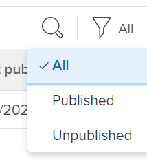

# Aktualisieren oder Erstellen von Projekten durch Veröffentlichung von Initiativen im [!DNL Scenario Planner]

Das Veröffentlichen eines Szenarios aus der [!DNL Adobe Workfront Scenario Planner] führt zu Folgendem:

* Erstellt Projekte aus den Initiativen für das Szenario und verknüpft sie miteinander.
* Aktualisiert Projekte, die bereits mit Initiativen des Szenarios verknüpft sind, mit Informationen aus der verknüpften Initiative. Projekte können auch mit Initiativen verknüpft werden, wenn Sie sie in einen Plan importieren. Weitere Informationen finden Sie unter [Projekte in Pläne importieren im [!DNL Scenario Planner]](../scenario-planner/import-projects-to-plans.md)

## Zugriffsanforderungen

+++ Erweitern Sie , um die Zugriffsanforderungen für die -Funktion in diesem Artikel anzuzeigen.

<table style="table-layout:auto"> 
 <col> 
 <col> 
 <tbody> 
  <tr> 
   <td> 
[!DNL Adobe Workfront] Plan*
 </td> 
   <td> <ul></li>
   <li>
Neu: Ultimate 
</li>
   
Der Szenario-Planer ist für die neuen Workfront Select- oder Workfront Prime-Pläne nicht verfügbar. 

   <li>
Aktuell: [!UICONTROL Business] oder höher
</ul>
   </td> 
  </tr> 
  <tr> 
   <td> 
[!DNL Adobe Workfront] Lizenz*
 </td> 
   <td> 
Neu: Licht oder höher
 
   
Aktuell: [!UICONTROL Überprüfen] oder höher
 </td> 
  </tr> 
  <tr> 
   <td>Produkt* </td> 
   <td> <ul><li>
Für die neuen Workfront-Pläne:

 Adobe Workfront</li>

   <li>
Für die aktuellen Workfront-Pläne: 

   
Adobe Workfront
 
Adobe Workfront-Szenarioplaner
</li></ul>

Weitere Informationen finden Sie unter <a href="../scenario-planner/access-needed-to-use-sp.md" class="MCXref xref">Zugriff erforderlich, um die [!DNL Scenario Planner]</a> verwenden zu können. 
 </td> 
  </tr> 
  <tr data-mc-conditions=""> 
   <td>Zugriffsebene </td> 
   <td> 
[!UICONTROL Bearbeiten]-Zugriff für die [!DNL Scenario Planner] und [!UICONTROL Projekte]
</td> 
  </tr> 
  <tr data-mc-conditions=""> 
   <td> 
Objektberechtigungen 
 </td> 
   <td>  <ul> 
     <li>[!UICONTROL Manage]-Berechtigungen für den Plan </li> 
     <li>[!UICONTROL Manage]-Berechtigungen für veröffentlichte Projekte</li> 
    </ul> 
Informationen zum Anfordern zusätzlichen Zugriffs auf einen Plan finden Sie unter <a href="../scenario-planner/request-access-to-plan.md" class="MCXref xref">Anfordern des Zugriffs auf einen Plan im [!DNL Scenario Planner]</a>.
 </td> 
  </tr> 
 </tbody> 
</table>

*Weitere Informationen finden Sie unter [Dokumentation zu Zugriffsanforderungen für Workfront](/help/quicksilver/administration-and-setup/add-users/access-levels-and-object-permissions/access-level-requirements-in-documentation.md).

+++

## Voraussetzungen

Bevor Sie beginnen:

* Sie müssen einen Plan erstellen und speichern, bevor Sie Initiativen daraus veröffentlichen können.
* Die Einstellung Benutzern erlauben, Projekte ohne Vorlage zu erstellen muss im Bereich Projektvoreinstellungen von Setup aktiviert sein. Weitere Informationen finden [&#x200B; unter „Systemweite Projektvoreinstellungen konfigurieren](/help/quicksilver/administration-and-setup/set-up-workfront/configure-system-defaults/set-project-preferences.md).

## Überlegungen zur Veröffentlichung von Initiativen in Projekten

* Sie können nur ein Szenario aus einem Plan veröffentlichen.
* Eine Initiative kann nur mit einem Projekt verknüpft werden.
* Ein Projekt kann mit mehreren Initiativen verknüpft werden, wenn die Initiativen unterschiedlichen Plänen angehören.

  >[!TIP]
  >
  >Wenn ein Projekt in mehreren Plänen vorhanden ist und Sie aus allen Plänen Informationen im Projekt veröffentlichen, überschreibt die neueste Veröffentlichung die vorhandenen [!DNL Scenario Planner] zum Projekt.

* Wenn Initiativen im Plan durch den Import von Projekten in den Plan erstellt wurden, werden bei der Veröffentlichung der Initiative auch die verknüpften Projekte mit Informationen zur Initiative aktualisiert.

  >[!TIP]
  >
  >Sie können dasselbe Projekt in mehrere Pläne importieren. Die Veröffentlichung kann Initiativinformationen zu einem Projekt überschreiben, das mit mehreren Initiativen verknüpft ist.

  Informationen zum Erstellen von Initiativen durch Importieren von Projekten [&#x200B; Sie unter „Projekte in Pläne importieren“ im  [!DNL Scenario Planner]](../scenario-planner/import-projects-to-plans.md).

* Alle am Projekt vorgenommenen Änderungen werden nicht auf die verknüpfte Initiative übertragen.

## Initiativen veröffentlichen

>[!IMPORTANT]
>
>Wenn Sie Änderungen an Initiativen im Plan vornehmen, einschließlich Konflikte lösen, müssen Sie die Initiative erneut veröffentlichen, damit die neuen Informationen im Projekt sichtbar werden. Diese Informationen werden nur dann zu den mit den Initiativen verknüpften Projekten angezeigt, wenn Sie die entsprechende Initiative veröffentlichen. Informationen zum Beheben von Konflikten zwischen Initiativen finden Sie unter [Beheben von Initiativkonflikten in der [!DNL Scenario Planner]](../scenario-planner/resolve-conflicts-in-sp.md)

{{step1-to-scenario-planner}}

1. (Optional und bedingt) Wenn Sie aus einem vorhandenen Plan veröffentlichen möchten, klicken Sie auf das **[!UICONTROL Filter]**-Symbol  in der oberen rechten Ecke des Plans und wählen Sie eine der folgenden Optionen aus:

   <table style="table-layout:auto"> 
    <col> 
    <col> 
    <tbody> 
     <tr> 
      <td role="rowheader">[!UICONTROL ALL]</td> 
      <td>Zeigt alle Pläne an, deren Inhaber Sie sind oder die für Sie freigegeben wurden. Dies ist der Standardwert. </td> 
     </tr> 
     <tr> 
      <td role="rowheader">[!UICONTROL Meine Pläne]</td> 
      <td>Zeigt von Ihnen erstellte Pläne an.</td> 
     </tr> 
     <tr> 
      <td role="rowheader">[!UICONTROL für mich freigegeben]</td> 
      <td> 
Zeigt Pläne an, die Sie nicht erstellt, aber für Sie freigegeben haben.
 
Wichtig: Sie müssen über [!UICONTROL Manage]-Berechtigungen für Pläne verfügen, die für Sie freigegeben wurden, um sie veröffentlichen zu können. 
 </td> 
     </tr> 
    </tbody> 
   </table>

   

1. (Optional) Klicken Sie auf das **[!UICONTROL Suchen]**-Symbol  und geben Sie den Namen eines Plans ein, um ihn schnell in der Liste zu finden.
1. (Bedingt) Um aus einem neuen Plan zu veröffentlichen, erstellen Sie einen Plan.

   Weitere Informationen zum Erstellen von Plänen finden Sie [Erstellen und Bearbeiten von Plänen in der [!DNL Scenario Planner]](../scenario-planner/create-and-edit-plans.md) .

1. (Optional) Klicken Sie auf den Namen eines vorhandenen Plans und erstellen Sie neue Szenarien für den Plan.

   Informationen zum Erstellen von Szenarien für einen Plan finden Sie unter [Erstellen und Vergleichen von Planszenarien in der [!DNL Scenario Planner]](../scenario-planner/create-and-compare-scenarios-for-a-plan.md).

1. (Optional) Aktualisieren Sie die Initiativen eines bestehenden oder eines neuen Plans oder erstellen Sie neue.

   Informationen zum Erstellen von Initiativen finden Sie unter [Erstellen und Bearbeiten von Initiativen im [!DNL Scenario Planner]](../scenario-planner/create-and-edit-initiatives.md).

1. Klicken Sie **[!UICONTROL Plan speichern]**.
1. Wählen Sie das Szenario, das Sie veröffentlichen möchten, aus dem Dropdown-Menü **[!UICONTROL Anfangsszenario]** und klicken Sie dann oben rechts auf **[!UICONTROL Zum Veröffentlichen]** .

   Oder

   Klicken Sie auf **[!UICONTROL Szenarien vergleichen]**, bewegen Sie den Mauszeiger über die Szenariokarte, von der aus Sie veröffentlichen möchten, und klicken Sie dann auf **[!UICONTROL Zum Veröffentlichen wechseln]** .

   Die Seite [!UICONTROL Initiativen veröffentlichen] wird mit einer Liste aller Initiativen im Szenario angezeigt. Wenn eine der Initiativen zuvor veröffentlicht wurde, wird das Projektsymbol  nach ihrem Namen und dem **[!UICONTROL Letzte Veröffentlichung]** in der Liste angezeigt.

   >[!TIP]
   >
   >Initiativen, die durch den Import von Projekten erstellt wurden, zeigen auch das Projektsymbol  rechts neben ihrem Namen an

   

1. (Optional und bedingt) Wenn Sie aus einem vorhandenen Plan veröffentlichen möchten, klicken Sie auf das **[!UICONTROL Filter]**-Symbol  in der oberen rechten Ecke des Plans und wählen Sie eine der folgenden Optionen aus:

   <table style="table-layout:auto"> 
    <col> 
    <col> 
    <tbody> 
     <tr> 
      <td role="rowheader">[!UICONTROL ALL]</td> 
      <td>Zeigt alle Initiativen des ausgewählten Szenarios an. </td> 
     </tr> 
     <tr> 
      <td role="rowheader">[!UICONTROL veröffentlicht]</td> 
      <td>Zeigt Initiativen an, die Sie oder ein anderer Benutzer zuvor veröffentlicht haben. </td> 
     </tr> 
     <tr> 
      <td role="rowheader">[!UICONTROL Veröffentlichung aufgehoben]</td> 
      <td> 
Zeigt nicht veröffentlichte Initiativen an. 
 </td> 
     </tr> 
    </tbody> 
   </table>

   

1. (Optional) Klicken Sie auf das **[!UICONTROL Suchen]**-Symbol  und geben Sie den Namen einer Initiative ein, um sie schnell in der Liste zu finden.
1. Wählen Sie eine oder mehrere Initiativen aus, um diese zu veröffentlichen und Projekte zu erstellen oder zu aktualisieren, und klicken Sie dann auf **[!UICONTROL Initiativen veröffentlichen]**.

   Dadurch wird aus jeder ausgewählten Initiative ein neues Projekt erstellt oder die vorhandenen verbundenen Projekte werden aktualisiert, wenn die veröffentlichten Initiativen bereits mit einem Projekt verknüpft waren.

   >[!TIP]
   >
   >Neue Projekte tragen denselben Namen wie die veröffentlichten Initiativen.

1. (Bedingt) Führen Sie einen der folgenden Schritte aus:

   * Wenn Sie eine Initiative veröffentlicht haben, klicken Sie auf **[!UICONTROL Verknüpftes Projekt anzeigen]**, um das von der Initiative erstellte oder aktualisierte Projekt zu öffnen.
   * Wenn Sie mehr als eine Initiative veröffentlicht haben, klicken Sie auf **[!UICONTROL Verknüpfte Projekte anzeigen]**, um eine Liste der in Initiativen veröffentlichten Projekte zu öffnen. [!DNL Workfront] wendet standardmäßig den Filter Projekte [!DNL Scenario Planner] auf die Liste der Projekte an. Die zuletzt veröffentlichten Projekte werden oben in der Liste angezeigt.

     

1. Gehen Sie zu den folgenden Bereichen, um Informationen über die Initiative zum Projekt anzuzeigen:

   * **Der Abschnitt [!UICONTROL Updates]**: Eine Aktualisierung wird veröffentlicht, um anzugeben, dass das Projekt von der Initiative erstellt oder aktualisiert wurde. Die Aktualisierung enthält den Namen der Initiative, die das Projekt erstellt oder aktualisiert hat, und den verknüpften Namen des Plans, der die Initiative enthält. Sie können auf den Namen des Plans in der Aktualisierung klicken, um den Plan in der [!DNL Scenario Planner] zu öffnen.

     

   * **Der [!UICONTROL Überblick] im Abschnitt [!UICONTROL Projektdetails]**: In diesem Bereich wird ein neuer [!DNL Scenario Planner]-Abschnitt erstellt, der Informationen aus der verknüpften Initiative enthält.

     

     Die folgenden Informationen zur Initiative werden im [!DNL Scenario Planner] Bereich des Abschnitts [!UICONTROL Projektdetails] veröffentlicht:

     <table style="table-layout:auto"> 
      <col> 
      <col> 
      <tbody> 
       <tr> 
        <td role="rowheader">[!UICONTROL Initiative Duration] </td> 
        <td>Die Dauer der entsprechenden Initiative, wenn das Projekt mit einer Initiative verknüpft ist. Dieses Feld kann nicht bearbeitet werden. </td> 
       </tr> 
       <tr> 
        <td role="rowheader">[!UICONTROL Datum der letzten Veröffentlichung] </td> 
        <td>Das Datum, an dem das Projekt zuletzt von einer entsprechenden Initiative veröffentlicht wurde. </td> 
       </tr> 
       <tr> 
        <td role="rowheader">[!UICONTROL Initiative Startdatum] </td> 
        <td>Der erste Tag des Startmonats der Initiative, wenn das Projekt mit einer Initiative verknüpft ist. </td> 
       </tr> 
       <tr> 
        <td role="rowheader">[!UICONTROL Enddatum der-Initiative] </td> 
        <td>Der letzte Tag des Endmonats der Initiative, an dem das Projekt mit einer Initiative verknüpft ist.  </td> 
       </tr> 
       <tr> 
        <td role="rowheader">Aufgabengebiete der [!UICONTROL Initiative in FTEs und Stunden] </td> 
        <td> 
Informationen zu den zugehörigen Aufgabengebieten und deren Zeitplänen für die Initiative. Dazu gehören:
 
         <ul> 
          <li>Name des Aufgabengebiets</li> 
          <li>Anzahl VZÄ</li> 
          <li> 
Anzahl der Stunden für alle VZÄ
 
Sie können die Anzahl der für Ihren Plan oder Ihre Initiative erforderlichen Aufgabengebiete mithilfe von Stunden oder VZÄ schätzen.
 
Weitere Informationen finden Sie unter <a href="../scenario-planner/create-and-edit-plans.md" class="MCXref xref">Pläne im Szenario-Planer erstellen und bearbeiten</a>. 
 </li> 
         </ul> 
      
<b>TIPP</b>

     Wenn die Anzahl der Aufgabengebiete für jeden Monat in der Initiative unterschiedlich ist, wird in diesem Feld die maximale Anzahl der für die Initiative erforderlichen Aufgabengebiete angezeigt. Wenn Sie beispielsweise 1 Berater für Januar und 2 für Februar benötigen, zeigt die Spalte 2FTE und die entsprechende Anzahl von Stunden für 2 FTE für alle Monate an.
 </td>
     </tr> 
      </tbody> 
     </table>

     >[!NOTE]
     >
     >Alle Benutzer mit [!UICONTROL Ansicht]-Zugriff auf das Projekt können den [!DNL Scenario Planner] Abschnitt im Bereich [!UICONTROL Übersicht] sehen. Sie können mithilfe einer Layout-Vorlage steuern, ob dieser Bereich im [!UICONTROL Details] angezeigt werden soll. Wenn Benutzenden keine Layout-Vorlage zugeordnet ist, wird dieser Bereich standardmäßig angezeigt.
     >
     >   
     >   
     >   * Informationen zum Hinzufügen oder Entfernen von Bereichen im Abschnitt [!UICONTROL Details] mithilfe einer Layout-Vorlage finden Sie unter [Anpassen der Ansicht [!UICONTROL Details] mithilfe einer Layout-Vorlage](../administration-and-setup/customize-workfront/use-layout-templates/customize-details-view-layout-template.md).
     >   * Weitere Informationen zum Anzeigen von Informationen im Bereich [!UICONTROL Übersicht] des [!UICONTROL Projektdetails] finden Sie [[!UICONTROL Verwalten] Informationen im Bereich [!UICONTROL Übersicht] des Projekts](../manage-work/projects/manage-projects/understand-project-overview-area.md).
     >   
     >

   * **Bedienfeld [!UICONTROL Rollenzuweisung] im [!UICONTROL Workload-] oder der Aufgabenliste des Projekts**: Informationen zur Rollenzuweisung für die Initiative werden in diesem Bereich zusätzlich zu den Rollenzuweisungen für das Projekt ausgefüllt.

     Weitere Informationen finden Sie unter [Übersicht über die Abstimmung der Ressourcenzuweisungen zwischen Projekten und Initiativen](../scenario-planner/overview-reconcile-allocations-between-projects-initiatives.md).

     

     Änderungen an den Daten oder Ressourcen des Projekts wirken sich nicht auf die entsprechende Initiative oder einen der Projektbereiche aus, die Informationen zur Initiative enthalten.

   * **Der [!UICONTROL Ressourcenbudgetierung] Bereich des [!UICONTROL Business Case] des Projekts**: Eine neue Option zum Verwalten von Projektressourcen mithilfe [!DNL Scenario Planner] Informationen wird im [!UICONTROL Ressourcen-Budgetierung] Bereich des [!UICONTROL Business Case] des Projekts hinzugefügt.

     Weitere Informationen finden Sie unter [Budgetressourcen im [!UICONTROL Business Case] mit dem [!DNL Scenario Planner]](../manage-work/projects/define-a-business-case/budget-resources-in-business-case-use-scenario-planner.md).

     

1. (Optional) Überprüfen Sie die folgenden Informationen in der [!DNL Scenario Planner], nachdem Sie ein Szenario veröffentlicht haben:

   * Das veröffentlichte Szenario wird das erste Szenario, nachdem Sie Initiativen daraus veröffentlicht haben.
   * Sie können aus keinem anderen Szenario veröffentlichen, nachdem Sie ein Szenario mindestens einmal veröffentlicht haben.
   * Die Option [!UICONTROL Zur Veröffentlichung wechseln] wird aus allen anderen Szenarien entfernt, nachdem mindestens eine Initiative aus einem Szenario veröffentlicht wurde.
   * Neben den Projektsymbolen der veröffentlichten Initiativen wird ein grüner Indikator im Plan angezeigt.

     

   * Oben im Szenario wird ein grüner Indikator „Veröffentlicht“ und auf der Szenariokarte angezeigt. Das Feld Veröffentlicht wird auf der Szenariokarte ausgefüllt und zeigt die Anzahl der Initiativen im Szenario an, die veröffentlicht wurden.

     

     >[!TIP]
     >
     >Wenn alle in den Initiativen des Szenarios veröffentlichten Projekte gelöscht werden, wird der Hinweis, dass das Szenario veröffentlicht wurde, entfernt. Weitere Informationen finden Sie unter [Projekte löschen](../manage-work/projects/manage-projects/delete-projects.md).

1. (Optional) Aktualisieren Sie die Informationen zur Initiative und wiederholen Sie den oben beschriebenen Prozess, um die Initiative erneut zu veröffentlichen und die Informationen zur Initiative zum verknüpften Projekt zu aktualisieren.

   Informationen zur Bearbeitung von Initiativen finden Sie unter [Erstellen und Bearbeiten von Initiativen im [!DNL Scenario Planner]](../scenario-planner/create-and-edit-initiatives.md).

