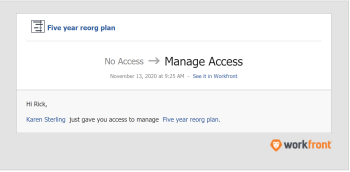

# Anfordern von Zugriff auf einen Plan im [!DNL Scenario Planner]

Sie können Zugriff auf einen Plan in der [!DNL Adobe Workfront Scenario Planner] anfordern, wenn der Link zum Plan für Sie freigegeben wurde.

## Zugriffsanforderungen

+++ Erweitern Sie , um die Zugriffsanforderungen für die -Funktion in diesem Artikel anzuzeigen.

<table style="table-layout:auto"> 
 <col> 
 <col> 
 <tbody> 
  <tr> 
   <td> 
[!DNL Adobe Workfront] Plan*
 </td> 
   <td> <ul></li>
   <li>
Neu: Ultimate 
</li>
   
Der Szenario-Planer ist für die neuen Workfront Select- oder Workfront Prime-Pläne nicht verfügbar. 

   <li>
Aktuell: [!UICONTROL Business] oder höher
</ul>
   </td> 
  </tr> 
  <tr> 
   <td> 
[!DNL Adobe Workfront] Lizenz*
 </td> 
   <td> 
Neu: Licht oder höher
 
   
Aktuell: [!UICONTROL Überprüfen] oder höher
 </td> 
  </tr> 
  <tr> 
   <td>Produkt* </td> 
   <td> <ul><li>
Für die neuen Workfront-Pläne:

 Adobe Workfront</li>

   <li>
Für die aktuellen Workfront-Pläne: 

   
Adobe Workfront
 
Adobe Workfront-Szenarioplaner
</li></ul>

Weitere Informationen finden Sie unter <a href="../scenario-planner/access-needed-to-use-sp.md" class="MCXref xref">Zugriff erforderlich, um die [!DNL Scenario Planner]</a> verwenden zu können. 
 </td> 
  </tr> 
  <tr data-mc-conditions=""> 
   <td>Zugriffsebene </td> 
   <td>  
Zugriff auf [!UICONTROL View] oder höher [!DNL Scenario Planner]
  </td> 
  </tr>
 </tbody> 
</table>

*Weitere Informationen finden Sie unter [Dokumentation zu Zugriffsanforderungen für Workfront](/help/quicksilver/administration-and-setup/add-users/access-levels-and-object-permissions/access-level-requirements-in-documentation.md).

+++

## Voraussetzungen

Bevor Sie Zugriff auf einen Plan in der [!DNL Scenario Planner] anfordern können, müssen Sie über Folgendes verfügen:

* Ein Link zum Plan.

>[!NOTE]
>
>Wenn Sie keine Zugriffsebenen-Rechte für den [!DNL Scenario Planner] haben und versuchen, über einen Link auf einen Plan zuzugreifen, können Sie keinen Zugriff auf den Plan anfordern. Stattdessen wird ein Bildschirm angezeigt, in dem Sie aufgefordert werden, sich an den [!DNL Workfront]-Administrator zu wenden.

## Anfordern von Zugriff auf Pläne im [!DNL Workfront Scenario Planner]

Wenn Sie noch nicht über die erforderlichen Berechtigungen für einen Plan verfügen und über einen für Sie freigegebenen Link dorthin navigieren, wird ein Bildschirm angezeigt, in dem Sie darüber informiert werden, dass Sie nicht über die erforderlichen Berechtigungen zum Anzeigen des Plans verfügen. Sie werden aufgefordert, die Berechtigungen vom Planersteller anzufordern.

>[!TIP]
>
>Sie können nur Berechtigungen vom Eigentümer oder Ersteller eines Plans anfordern. Sie können keine Berechtigungen von anderen Benutzern anfordern, die auch Zugriff auf den Plan haben.

So fordern Sie Berechtigungen an:

1. Klicken Sie auf einen Link zu einem Plan.

   

1. Geben Sie **[!UICONTROL Dropdown-Menü „Zugriff anfordern]**&quot; an, welche Berechtigungsstufe Sie gewähren möchten. Wählen Sie aus den folgenden Optionen aus:

   * [!UICONTROL Anzeigen]
   * [!UICONTROL Verwalten]

   Sie können keine Berechtigung anfordern, die höher ist als Ihre Zugriffsebene auf die [!DNL Scenario Planner]. Sie können beispielsweise keine [!UICONTROL Verwalten] anfordern, wenn Sie Lesezugriff auf die [!DNL Scenario Planner] haben.

   Weitere Informationen zu den verschiedenen Berechtigungsebenen finden Sie unter [Freigeben eines Plans in der [!DNL Scenario Planner]](../scenario-planner/share-a-plan.md).

   Informationen dazu, wie Workfront-Admins den Zugriff auf die [!DNL Scenario Planner] verwalten können, finden Sie unter [Zugriff auf gewähren [!DNL Scenario Planner]](../administration-and-setup/add-users/configure-and-grant-access/grant-access-sp.md).

1. (Optional) Geben Sie einen Kommentar oder eine Anfrage in das Feld **[!UICONTROL Kommentar hinterlassen]** ein und klicken Sie dann auf **[!UICONTROL Zugriff anfordern]**.

   Folgendes geschieht:

   * [!DNL Workfront] sendet eine E-Mail-Benachrichtigung an den Planbesitzer, wo er die angeforderten Berechtigungen erteilen kann.\
     

   * Nachdem der Planeigentümer die angeforderten Berechtigungen erteilt hat, erhalten Sie eine E-Mail, dass die Berechtigungen erteilt wurden, wenn Ihr [!DNL Workfront]-Administrator die Benachrichtigung Objektfreigabe für Benutzer in Ihrem System aktiviert hat und Sie die E-Mail-Benachrichtigung [!UICONTROL Jemand gibt ein Objekt für mich frei] in Ihrem Profil aktivieren.

     

   * Sie können auch Berechtigungen für Pläne aus dem Bereich [!UICONTROL Startseite] und aus der [!DNL Workfront]-Mobile-App erteilen.

   Informationen zum Aktivieren von Systembenachrichtigungen finden Sie [Konfigurieren von Ereignisbenachrichtigungen für alle Personen im System](../administration-and-setup/manage-workfront/emails/configure-event-notifications-for-everyone-in-the-system.md).

   Informationen zur Aktivierung von Benachrichtigungen in Ihrem Profil finden Sie unter [Benachrichtigungen: Verschiedene Informationen](../workfront-basics/using-notifications/notifications-misc-information.md).
