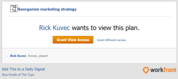

# Anfordern des Zugriffs auf einen Plan in der [!DNL Scenario Planner]

Sie können den Zugriff auf einen Plan in der [!DNL Adobe Workfront Scenario Planner] anfordern, wenn der Link zum Plan für Sie freigegeben ist.

## Zugriffsanforderungen

+++ Erweitern Sie , um die Zugriffsanforderungen für die Funktionalität in diesem Artikel anzuzeigen.

<table style="table-layout:auto"> 
 <col> 
 <col> 
 <tbody> 
  <tr> 
   <td> 
[!DNL Adobe Workfront] plan*
 </td> 
   <td> <ul></li>
   <li>
Neu: Ultimate 
</li>
   
Der Szenario-Planer ist für die neuen Workfront Select- oder Workfront Prime-Pläne nicht verfügbar. 

   <li>
Aktuell: [!UICONTROL Business] oder höher
</ul>
   </td> 
  </tr> 
  <tr> 
   <td> 
[!DNL Adobe Workfront] license*
 </td> 
   <td> 
Neu: Licht oder höher
 
   
Aktuell: [!UICONTROL Review] oder höher
 </td> 
  </tr> 
  <tr> 
   <td>Produkt* </td> 
   <td> <ul><li>
Für die neuen Workfront-Pläne:

 Adobe Workfront</li>

   <li>
Für die aktuellen Workfront-Pläne: 

   
Adobe Workfront
 
Adobe Workfront-Szenario-Planer
</li></ul>

Weitere Informationen finden Sie unter <a href="../scenario-planner/access-needed-to-use-sp.md" class="MCXref xref">Für die Verwendung des [!DNL Scenario Planner]</a> erforderlichen Zugriff. 
 </td> 
  </tr> 
  <tr data-mc-conditions=""> 
   <td>Zugriffsebene </td> 
   <td>  
[!UICONTROL Ansicht] oder höher Zugriff auf die [!DNL Scenario Planner]
  </td> 
  </tr>
 </tbody> 
</table>

*Weitere Informationen finden Sie unter [Zugriffsanforderungen für die Workfront-Dokumentation](/help/quicksilver/administration-and-setup/add-users/access-levels-and-object-permissions/access-level-requirements-in-documentation.md).

+++

## Voraussetzungen

Bevor Sie den Zugriff auf einen Plan im [!DNL Scenario Planner] anfordern können, müssen Sie über Folgendes verfügen:

* Ein Link zum Plan.

>[!NOTE]
>
>Wenn Sie keine Zugriffsberechtigung für die [!DNL Scenario Planner] haben und versuchen, über einen Link auf einen Plan zuzugreifen, können Sie keinen Zugriff auf den Plan anfordern. Stattdessen wird ein Bildschirm angezeigt, auf dem Sie informiert werden, dass Sie den Administrator [!DNL Workfront] kontaktieren müssen.

## Anfordern des Zugriffs auf Pläne in der [!DNL Workfront Scenario Planner]

Wenn Sie noch keine Berechtigungen für einen Plan haben und von einem für Sie freigegebenen Link zu ihm navigieren, wird ein Bildschirm angezeigt, auf dem Sie darüber informiert werden, dass Sie nicht über die Berechtigung zum Anzeigen des Plans verfügen. Sie werden aufgefordert, vom Planersteller Berechtigungen anzufordern.

>[!TIP]
>
>Sie können nur Berechtigungen vom Eigentümer oder Ersteller eines Plans anfordern. Sie können keine Berechtigungen von anderen Benutzern anfordern, die auch Zugriff auf den Plan haben.

So fordern Sie Berechtigungen an:

1. Klicken Sie auf einen Link zu einem Plan.

   

1. Geben Sie im Dropdown-Menü **[!UICONTROL Zugriff auf]** anfordern an, welche Berechtigungen gewährt werden sollen. Wählen Sie aus den folgenden Optionen aus:

   * [!UICONTROL Anzeigen]
   * [!UICONTROL Verwalten]

   Sie können keine Berechtigung anfordern, die höher ist als Ihre Zugriffsstufe auf die [!DNL Scenario Planner]. Beispielsweise können Sie keine [!UICONTROL Verwalten] -Berechtigungen anfordern, wenn Sie Zugriff auf Ansicht auf [!DNL Scenario Planner] haben.

   Informationen zu den verschiedenen Berechtigungsstufen finden Sie unter [Plan in der freigeben [!DNL Scenario Planner]](../scenario-planner/share-a-plan.md).

   Informationen dazu, wie ein Workfront-Administrator den Zugriff auf den Ordner &quot;[!DNL Scenario Planner]&quot;verwalten kann, finden Sie unter [Gewähren des Zugriffs auf &quot; [!DNL Scenario Planner]](../administration-and-setup/add-users/configure-and-grant-access/grant-access-sp.md)&quot;.

1. (Optional) Geben Sie einen Kommentar oder eine Anforderung in das Feld **[!UICONTROL Kommentar hinterlassen]** ein und klicken Sie dann auf **[!UICONTROL Zugriff anfordern]**.

   Folgendes geschieht:

   * [!DNL Workfront] sendet eine E-Mail-Benachrichtigung an den Planinhaber, wo er die angeforderten Berechtigungen erteilen kann.\
     

   * Nachdem der Planeigentümer die angeforderten Berechtigungen erteilt hat, erhalten Sie eine E-Mail, in der die Berechtigungen erteilt wurden, wenn in Ihrem System die Objektfreigabe für die Benutzerbenachrichtigung für Ihren Administrator aktiviert ist und Sie die E-Mail-Benachrichtigung [!UICONTROL Jemand gibt in Ihrem Profil ein Objekt für mich frei] .[!DNL Workfront]

     

   * Sie können auch Berechtigungen für Pläne aus dem Bereich [!UICONTROL Startseite] und aus der mobilen App [!DNL Workfront] erteilen.

   Informationen zum Aktivieren von Systembenachrichtigungen finden Sie unter [Ereignisbenachrichtigungen für alle Benutzer im System konfigurieren](../administration-and-setup/manage-workfront/emails/configure-event-notifications-for-everyone-in-the-system.md).

   Informationen zum Aktivieren von Benachrichtigungen in Ihrem Profil finden Sie unter [Benachrichtigungen: Verschiedene Informationen](../workfront-basics/using-notifications/notifications-misc-information.md).
