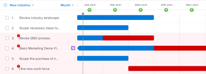
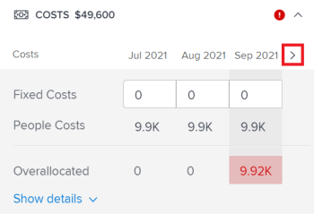

# Beheben von Initiativkonflikten im [!DNL Scenario Planner]

Wenn Initiativen miteinander in Konflikt geraten, konkurrieren sie um die gleichen Ressourcen. Die Ressourcen, die Sie für ein Szenario zur Verfügung haben, reichen nicht aus, um alle Ressourcen abzudecken, die für alle Initiativen im Szenario erforderlich sind.

Dies kann in einem der folgenden Fälle passieren:

* Die Anzahl der für die Initiative erforderlichen Arbeitsplatzrollen übersteigt die für den Plan vorgesehene Anzahl der Rollen.
* Die Kosten der Initiative übersteigen den für den Plan verfügbaren Haushaltsbetrag.

## Zugriffsanforderungen

+++ Erweitern Sie , um die Zugriffsanforderungen für die Funktionalität in diesem Artikel anzuzeigen.

<table style="table-layout:auto"> 
 <col> 
 <col> 
 <tbody> 
  <tr> 
   <td> 
[!DNL Adobe Workfront] plan*
 </td> 
   <td> <ul></li>
   <li>
Neu: Ultimate 
</li>
   
Der Szenario-Planer ist für die neuen Workfront Select- oder Workfront Prime-Pläne nicht verfügbar. 

   <li>
Aktuell: [!UICONTROL Business] oder höher
</ul>
   </td> 
  </tr> 
  <tr> 
   <td> 
[!DNL Adobe Workfront] license*
 </td> 
   <td> 
Neu: Licht oder höher
 
   
Aktuell: [!UICONTROL Review] oder höher
 </td> 
  </tr> 
  <tr> 
   <td>Produkt* </td> 
   <td> <ul><li>
Für die neuen Workfront-Pläne:

 Adobe Workfront</li>

   <li>
Für die aktuellen Workfront-Pläne: 

   
Adobe Workfront
 
Adobe Workfront-Szenario-Planer
</li></ul>

Weitere Informationen finden Sie unter <a href="../scenario-planner/access-needed-to-use-sp.md" class="MCXref xref">Für die Verwendung des [!DNL Scenario Planner]</a> erforderlichen Zugriff. 
 </td> 
  </tr> 
  <tr data-mc-conditions=""> 
   <td>Zugriffsebene </td> 
   <td> 
Zugriff auf [!UICONTROL Bearbeiten] [!DNL Scenario Planner]
 </td> 
  </tr> 
  <tr data-mc-conditions=""> 
   <td> 
Objektberechtigungen 
 </td> 
   <td> 
[!UICONTROL Berechtigungen für einen Plan verwalten
 
Informationen zum Anfordern von zusätzlichem Zugriff auf einen Plan finden Sie unter <a href="../scenario-planner/request-access-to-plan.md" class="MCXref xref">Anfordern des Zugriffs auf einen Plan in der [!DNL Scenario Planner]</a>.
 </td> 
  </tr> 
 </tbody> 
</table>

*Weitere Informationen finden Sie unter [Zugriffsanforderungen für die Workfront-Dokumentation](/help/quicksilver/administration-and-setup/add-users/access-levels-and-object-permissions/access-level-requirements-in-documentation.md).

+++

## Übersicht über die Konfliktlösung

* Ein Konflikt wird auch als eine Überzuweisung der Arbeitsplatzrollen oder des Budgets eines Szenarios verstanden.
* Wenn [!DNL Workfront] einen Konflikt erkennt, wird der Balken, der dem Monat entspricht, in dem der Konflikt auftritt, während der Dauer der Initiative rot angezeigt. Dies kann in einem der folgenden Fälle passieren:

   * Die monatlich für eine Initiative erforderliche Anzahl von Stellenrollen übersteigt die für den Plan vorgesehene Anzahl der Rollen, nachdem alle früheren Initiativen die für den Plan vorgesehenen Mittel genutzt haben.
   * Die monatlichen Kosten der Initiative sind höher als das für den Plan verfügbare Budget, nachdem alle früheren Initiativen das Budget des Plans zur Deckung ihrer Kosten verwendet haben.

>[!TIP]
>
>Standardmäßig geht der [!DNL Scenario Planner] davon aus, dass Sie für ein Szenario einen Haushaltsplan für 0 Jobrollen und für ein Szenario einen Betrag von 0 USD bzw. den Gegenwert von 0 USD in der Währung Ihres Systems aufgestellt haben, sofern nicht anders angegeben. Die Anzahl der Arbeitsplätze gibt die Anzahl der FTEs (Vollzeitäquivalente) oder Stunden an, die für die Stellenfunktion vorgesehen sind.
>
>Für alle Berechnungen im Szenario-Planer verwendet Workfront den folgenden Wert: 1 FTE = 8 Stunden.
>
>Informationen zum Aktualisieren der verfügbaren Rollen für einen Plan und ein Budget finden Sie unter [Erstellen und Bearbeiten von Plänen im  [!DNL Scenario Planner]](../scenario-planner/create-and-edit-plans.md).

* Sie können einen Konflikt lösen, indem Sie einen der folgenden Schritte ausführen:

   * Das automatische Hinzufügen der fehlenden erforderlichen Ressourcen aus den Initiativen im Szenario. In diesem Artikel wird beschrieben, wie Sie Konflikte mit dieser Option lösen.
   * Anpassen der Auftrags- und Budgetressourcen für das Szenario durch Bearbeiten des Plans. Weitere Informationen finden Sie unter [Erstellen und Bearbeiten von Plänen in der [!DNL Scenario Planner]](../scenario-planner/create-and-edit-plans.md).

## Konflikten zwischen Initiativen beilegen

1. Gehen Sie zu einem Plan, für den Sie Konflikte lösen möchten.

   Informationen zum Erstellen von Plänen finden Sie unter [Erstellen und Bearbeiten von Plänen in der [!DNL Scenario Planner]](../scenario-planner/create-and-edit-plans.md).

   Informationen zum Erstellen von Initiativen finden Sie unter [Erstellen und Bearbeiten von Initiativen in der [!DNL Scenario Planner]](../scenario-planner/create-and-edit-initiatives.md).

1. (Optional) Wählen Sie aus dem Dropdownmenü **[!DNL Initial scenario]** das Szenario aus, das Sie überprüfen möchten.

   >[!TIP]
   >
   >Ein Plan kann mehrere Szenarien haben. Bei der Betrachtung der Konflikte des Plans bezieht sich [!DNL Workfront] auf die Ressourcen, die derzeit für das ausgewählte Szenario verfügbar sind, sowie auf die Ressourcen, die für die Initiativen dieses Szenarios erforderlich sind. Weitere Informationen zu Szenarien finden Sie unter [Erstellen und Vergleichen von Planszenarien in der  [!DNL Scenario Planner]](../scenario-planner/create-and-compare-scenarios-for-a-plan.md).

1. Stellen Sie sicher, dass **[!UICONTROL Konflikte anzeigen]** aktiviert ist. Sie ist standardmäßig aktiviert.

   

   Die erste in Konflikt stehende Initiative zeigt die Monate an, in denen Konflikte aufgetreten sind, in Rot und neben dem Namen der Initiative wird ein Warnsymbol angezeigt.

   Der Hintergrund aller Initiativen, die mit der ersten widersprüchlichen Initiative beginnen, wird in der Planung rot dargestellt.

   Wenn eine Initiative einen Konflikt anzeigt, bedeutet dies, dass die Anzahl der Arbeitsplätze für mindestens eine bestimmte Rolle, die entstandenen Kosten oder beide die Anzahl der Arbeitsplatzrollen oder das für den Plan für einen bestimmten Monat festgelegte Budget überschreiten.

   

1. Führen Sie einen der folgenden Schritte aus, um mehr über mögliche Konflikte zu erfahren:

   * Bewegen Sie den Mauszeiger über das Warnsymbol neben dem Namen der Initiative, um zu verstehen, ob Sie eine Job-Rolle oder einen Budgetkonflikt haben.

     

     Je nachdem, ob Sie die zugewiesenen Jobrollen oder die zu hohen Kosten für Ihre Initiative überschritten haben, wird möglicherweise eine der folgenden Optionen angezeigt, wenn Sie den Mauszeiger über das Warnsymbol bewegen:

      * Aufgabengebiet-Konfliktdetails anzeigen
      * Budget-Konfliktdetails anzeigen
      * Auftrags- und Budgetdetails anzeigen

   * Wenn Sie sich den Plan nach Monat ansehen, bewegen Sie den Mauszeiger über einen Monat in der Zeitleiste des Plans, um die erforderlichen Ressourcen für diesen Monat anzuzeigen und zu sehen, ob die Konflikte für den Monat Personen oder kostenbezogen sind.

     

     Überprüfen Sie die folgenden monatlichen Informationen auf Planebene:

      * Die Anzahl der verfügbaren, erforderlichen und überverteilten Jobrollen für den Monat für alle für diesen Monat geplanten Initiativen.
      * Verfügbare, erforderliche und überverteilte Kosten für den Monat für alle für diesen Monat geplanten Initiativen

        >[!TIP]
        >
        >Die Kosten [!UICONTROL Verfügbar] sind das Budget des Szenarios für diesen Monat.

   * Bewegen Sie den Mauszeiger über den roten Balken einer Initiative für einen Monat, um das Feld mit zusätzlichen Informationen zum Konflikt anzuzeigen, der in diesem Monat auftritt.

     

     Überprüfen Sie die folgenden Felder im Feld für zusätzliche Informationen auf der Ebene der Initiative:

     <table style="table-layout:auto"> 
      <col> 
      <col> 
      <tbody> 
       <tr> 
        <td role="rowheader">Monat, in dem der Konflikt auftritt</td> 
        <td>Wird im Titel des Felds mit den zusätzlichen Informationen angezeigt.</td> 
       </tr> 
       <tr> 
        <td role="rowheader">Der Name der Initiative</td> 
        <td>Wird im Titel des Felds mit den zusätzlichen Informationen angezeigt.</td> 
       </tr> 
       <tr> 
        <td role="rowheader">[!UICONTROL Vorgangsrollen]</td> 
        <td> 
Die mit dieser Initiative verbundenen Arbeitsplatzrollen, die für den ausgewählten Monat überverteilt werden. In den folgenden Spalten werden Informationen zu den einzelnen für den ausgewählten Monat erforderlichen Auftragsrollen angezeigt, die in Konflikt mit der Anzahl der für diesen Monat verfügbaren Jobrollen stehen:
 
         <ul> 
          <li> 
<strong>[!UICONTROL Verfügbar]</strong>: Die Anzahl der einzelnen Jobrollen, die im Szenario für den ausgewählten Monat verfügbar sind.
 </li> 
          <li> 
<strong>[!UICONTROL Erforderlich]</strong>: Die Anzahl der einzelnen Arbeitsplatzrollen, die für die Initiative für den ausgewählten Monat erforderlich sind.
 </li> 
          <li> 
<strong>[!UICONTROL Overassigned]:</strong> Die Differenz zwischen der für die Initiative erforderlichen Zahl und der für das Szenario verfügbaren Zahl. 
 </li> 
         </ul> 
Tipp: Manchmal stimmt die Anzahl der [!UICONTROL Verfügbaren] Rollen mit der Anzahl der [!UICONTROL Erforderlichen] Rollen überein oder ist höher, aber die [!DNL Scenario Planner] zeigt trotzdem eine Überzuweisung an. Dies bedeutet, dass es Initiativen mit höherem Rang gibt, die bereits die im Plan für den gleichen Monat verfügbaren Arbeitsplatzrollen genutzt haben. 
 </td> 
       </tr> 
       <tr> 
        <td role="rowheader">Kosten</td> 
        <td> 
Die Kosten der Initiative für den ausgewählten Monat. Die folgenden Spalten enthalten Informationen zu den benötigten Kosten und dem für den ausgewählten Monat verfügbaren Budget:
 
         <ul> 
          <li> 
<strong>[!UICONTROL Verfügbar]</strong>: Das im Plan für den ausgewählten Monat verfügbare Budget.
 </li> 
          <li> 
<strong>[!UICONTROL Erforderlich]</strong>: Die mit dieser Initiative verbundenen Kosten für den ausgewählten Monat.
 </li> 
          <li> 
<strong>[!UICONTROL Überzugewiesen]:</strong> Differenz zwischen den Kosten der Initiative und dem im Plan verfügbaren Budget. 
 </li> 
         </ul> 
Tipp: Manchmal stimmen die [!UICONTROL Verfügbaren] Kosten für den ausgewählten Monat überein oder sind höher als die [!UICONTROL Erforderlichen] Kosten der Initiative, und die [!DNL Scenario Planner] zeigen immer noch eine Überzuweisung der Kosten an. Das bedeutet, dass es Initiativen mit höherem Rang gibt, die bereits das für den gleichen Monat verfügbare Budget des Plans verwenden. 
 </td> 
       </tr> 
      </tbody> 
     </table>

1. Führen Sie einen der folgenden Schritte aus, um das Bedienfeld mit den Details zur Initiative zu öffnen und weitere Informationen darüber anzuzeigen, wo die Konflikte auftreten, und um sie zu beheben:

   * Klicken Sie auf das Warnsymbol neben dem Namen der Initiative.
   * Klicken Sie auf die Leiste einer Initiative.
   * Klicken Sie auf das Symbol **[!UICONTROL Mehr]**  rechts neben dem Namen der Initiative und klicken Sie dann auf **[!UICONTROL Bearbeiten]**.

     Das Bedienfeld für Details der Initiative wird rechts angezeigt.

     Wenn nicht genügend Personen oder Budget für Ihre Initiative zur Verfügung stehen, wird neben den folgenden Abschnitten ein rotes Warnsymbol angezeigt:

   * [!UICONTROL  Erforderliche Vorgangsrollen]
   * [!UICONTROL Kosten]

1. (Bedingt) Für Initiativen mit Konflikten in der Rolle &quot;Arbeitsplatz&quot;gehen Sie zum Abschnitt **[!UICONTROL Erforderliche Vorgangsrollen]** , um alle für Ihre Initiative erforderlichen Arbeitsplatzrollen anzuzeigen. Ermitteln Sie, welche Auftragsrollen möglicherweise übergeordnet sind. Überprüfen Sie die Anzahl der erforderlichen FTEs oder Stunden für jede Stellenaufgabe für jeden Monat der Initiative. Das Feld mit der FTE-Nummer oder der Stundenzahl für Monate mit Überallokationen wird in einer roten Umrisslinie angezeigt.

   

1. (Optional) Klicken Sie auf den Pfeil nach rechts neben den Monaten in der Zeitleiste der Initiative, um zu sehen, welche weiteren Monate Konflikte mit Stellenangeboten aufweisen.

   

1. (Optional) Klicken Sie unter der Auftragsrolle, die einen Konflikt anzeigt, auf **[!UICONTROL Details anzeigen]** , um zu sehen, wo die Konflikte auftreten, und um die Konfliktmonate im Diagrammbereich des Plans hervorzuheben. Für jede Auftragsrolle werden zusätzliche Informationen angezeigt.

   Die folgenden Felder werden für jede Auftragsrolle angezeigt:

   <table style="table-layout:auto"> 
    <col> 
    <col> 
    <tbody> 
     <tr> 
      <td role="rowheader">[!UICONTROL Verfügbar]</td> 
      <td> 
Die Anzahl der im Plan für jeden Monat verfügbaren Jobrollen. 
 </td> 
     </tr> 
     <tr> 
      <td role="rowheader">[!UICONTROL Zuvor zugewiesen]</td> 
      <td>Die Anzahl der Stellenbesetzungen, die bereits für einen bestimmten Monat aus dem Budget des Plans für Initiativen mit höherem Rang zugewiesen wurden. </td> 
     </tr> 
     <tr> 
      <td role="rowheader">[!UICONTROL Überzugewiesen]</td> 
      <td> 
Der Unterschied zwischen der Anzahl der erforderlichen Arbeitsplatzrollen auf der Initiative und der Anzahl, die nach Initiativen mit höherem Rang im Plan verfügbar ist, hat auch einige der Rollen genutzt. Workfront berechnet die Anzahl der [!UICONTROL Überverteilten] Stellenrollen anhand der folgenden Formel:
 
<code>Overallocated roles = (Roles Previously Allocated to higher initiatives + Required roles for current initiative) - Monthly available roles from the plan</code> 
 </td> 
     </tr> 
    </tbody> 
   </table>

   >[!TIP]
   >
   >In der Übersicht des Plans werden in den Monaten, in denen die Aufgaben zugewiesen werden, der Name und die Anzahl der Rollen angezeigt, die für jede Initiative benötigt werden, wo sie benötigt wird. Sie müssen die Ansicht &quot;[!UICONTROL Monat]&quot;auswählen, um den Namen der Auftragsrollen anzuzeigen

   

1. Führen Sie einen der folgenden Schritte aus, um Konflikte mit Auftragsrollen zu lösen:

   * Passen Sie die Anzahl der Rollen für jeden Monat der Initiative manuell auf eine niedrigere Zahl an.
   * Bewegen Sie den Mauszeiger über den Namen der Auftragsrolle und klicken Sie auf das Symbol **[!UICONTROL Löschen]**  , um die Auftragsrolle aus der Initiative zu entfernen.
   * Wählen Sie **[!UICONTROL Rollen zu den verfügbaren Ressourcen des Szenarios hinzufügen]** und klicken Sie dann auf **[!UICONTROL Anwenden]**.

     Dadurch wird die fehlende Anzahl von FTEs für die Auftragsrolle oder Stunden zum Feld [!UICONTROL Verfügbar] des Szenarios hinzugefügt.

     >[!NOTE]
     >
     >Die Rollen, die Sie zum Beheben der Konflikte hinzufügen, ändern die [!UICONTROL Verfügbare] -Auftragsrollen für das ausgewählte Szenario und nicht für alle Szenarien im Plan.

     Ein nach oben zeigender grüner Pfeil  wird für den Monat in der Zeitleiste des Plans angezeigt, um anzugeben, dass dem Plan in diesem Monat weitere Ressourcen hinzugefügt wurden. Sie müssen die Ansicht [!UICONTROL Monat] auswählen, um diesen Indikator anzuzeigen.

   * (Bedingt) Schließen Sie das Detailbedienfeld und geben Sie der Initiative eine höhere Priorität, um nach Möglichkeit zunächst Haushaltsmittel aus dem Plan zu erhalten. Informationen zur Aktualisierung der Priorität der Initiative finden Sie unter [Aktualisieren der Prioritäten der Initiative im Szenario-Planer](../scenario-planner/prioritize-initiatives.md).

1. (Optional) Klicken Sie auf **[!UICONTROL Details ausblenden]** , um das Feld mit den zusätzlichen Details zu schließen, und klicken Sie dann auf **[!UICONTROL Anwenden]** , um die Änderungen zu den Auftragsrollen zu speichern.

1. (Bedingt) Für Initiativen mit Kostenkonflikten gehen Sie zum Abschnitt **[!UICONTROL Kosten]** im Bereich &quot;Details der Initiative&quot;, um die Kosten für jeden Monat der Dauer der Initiative zu überprüfen. Finden Sie heraus, in welchen Monaten im Budget des Plans möglicherweise nicht genügend Geld zur Verfügung steht, um die Kosten für die ausgewählte Initiative zu decken. Das Feld mit dem nicht ausreichenden verfügbaren Budget wird in einer roten Umrisslinie angezeigt.
1. (Optional) Klicken Sie auf den nach rechts zeigenden Pfeil neben den Monaten in der Zeitleiste der Initiative, um zusätzliche Monate anzuzeigen, die nicht über genügend Budget zur Deckung der Kosten verfügen.

   

1. (Optional) Klicken Sie unter den Kosteninformationen auf **[!UICONTROL Details anzeigen]** , um zu sehen, wo der Konflikt auftritt, und um die Monate zu markieren, die in Konflikt stehen, auf der Karte des Plans. Für jeden Kostentyp werden die folgenden zusätzlichen Felder angezeigt:

   <table style="table-layout:auto"> 
    <col> 
    <col> 
    <tbody> 
     <tr> 
      <td role="rowheader">[!UICONTROL Verfügbar]</td> 
      <td> 
Die im Budget des Plans für jeden Monat verfügbaren Kosten. 
 </td> 
     </tr> 
     <tr> 
      <td role="rowheader">[!UICONTROL Zuvor zugewiesen]</td> 
      <td>Der Betrag, der bereits aus dem Budget des Plans für Initiativen mit höherem Rang bereitgestellt wurde. </td> 
     </tr> 
     <tr> 
      <td role="rowheader">[!UICONTROL Überzugewiesen]</td> 
      <td> 
Die monatliche Differenz zwischen den für die Initiative erforderlichen Kosten und dem Betrag, der aus dem Budget des Plans nach Initiativen mit höherem Rang zur Verfügung steht, nutzte auch einen Teil des verfügbaren Budgets. [!DNL Workfront] berechnet die Anzahl der überverteilten Kosten mithilfe der folgenden Formel:
 
<code>Overallocated costs = (Costs Previously Allocated to higher initiatives + Required costs for the current initiative) - Monthly available budget from the plan</code> 
 
[!DNL Workfront] berechnet die erforderlichen Kosten für die laufende Initiative für jeden Monat anhand der folgenden Formel:
 
<code>Required initiative costs = Initiative Fixed Costs + Initiative People Costs</code> 
 </td> 
     </tr> 
    </tbody> 
   </table>

   >[!TIP]
   >
   >Auf der Programmübersicht werden die Monate, in denen die Kosten nicht ausreichen, mit dem Namen und der Anzahl der Rollen angezeigt, die für die Initiative noch benötigt werden. Sie müssen die Ansicht Monat auswählen, um die Kostenbeträge anzuzeigen.

   

   >[!NOTE]
   >
   >Wenn Sie die Einstellung [!UICONTROL Personen einbeziehen, die kosten] für das Feld [!UICONTROL Budget] des Plans deaktiviert haben, als Sie den Plan erstellt haben, wird die Zeile [!UICONTROL Personenkosten] in keinem Szenario für eine Initiative angezeigt. In diesem Fall berücksichtigt Workfront keine Personenkosten in Berechnungen, um Kostenkonflikte zu ermitteln. Weitere Informationen zum Erstellen eines Plans finden Sie unter [Erstellen und Bearbeiten von Plänen im  [!DNL Scenario Planner]](../scenario-planner/create-and-edit-plans.md).

1. Führen Sie einen der folgenden Schritte aus, um Kostenkonflikte zu lösen:

   * Passen Sie die Anzahl der [!UICONTROL Festkosten] für jeden Monat der Initiative manuell auf eine niedrigere Zahl an.
   * Passen Sie im Abschnitt **[!UICONTROL Erforderliche Vorgangsrollen]** nach Möglichkeit die Anzahl der Vorgangsrollen für den Monat manuell mit einem Budget für People-Kosten an. Dadurch wird die Anzahl der Personenkosten reduziert.

     >[!TIP]
     >
     >Sie können die Kosten für Personen nicht manuell anpassen.

   * Wählen Sie **[!UICONTROL Betrag zum Budget des Szenarios hinzufügen]** und klicken Sie dann auf **[!UICONTROL Anwenden]**.

     Dadurch wird der unzureichende Betrag zum Budget des Szenarios für die Monate hinzugefügt, in denen es fehlte, was auch das Gesamtbudget des Szenarios aktualisiert.

     >[!NOTE]
     >
     >Der Betrag, den Sie zur Lösung der Kostenkonflikte hinzufügen, ändert das Budget für das ausgewählte Szenario und nicht für alle Szenarien im Plan.

   * (Bedingt) Schließen Sie das Detailbedienfeld und geben Sie der Initiative eine höhere Priorität, um nach Möglichkeit zunächst Haushaltsmittel aus dem Plan zu erhalten. Informationen zur Aktualisierung der Priorität der Initiative finden Sie unter [Aktualisieren der Prioritäten der Initiative in der  [!DNL Scenario Planner]](../scenario-planner/prioritize-initiatives.md).

1. Klicken Sie auf **[!UICONTROL Anwenden]** , wenn Sie Änderungen am Kostenabschnitt vornehmen.
1. Klicken Sie auf **[!UICONTROL Plan speichern]** , um Ihre Änderungen zu speichern.

