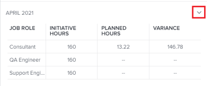

# Rollenzuweisung für Projekte und Initiativen im [!UICONTROL Arbeitslastausgleich] anzeigen

<!--Audited: 07/2024-->

Nachdem Sie Projekte und Initiativen miteinander verbunden haben, können Sie die Ressourcenzuordnung nebeneinander verwalten, um sicherzustellen, dass sie übereinstimmen. Dadurch wird verhindert, dass sie überverteilt oder nicht verwendet werden.

In diesem Artikel wird beschrieben, wie Sie Ressourcen mithilfe des Bedienfelds [!UICONTROL Rollenzuweisung] in [!UICONTROL Arbeitslast-Ausgleich] eines Projekts abstimmen können.

Allgemeine Informationen zur Abstimmung von Ressourcen zwischen Projekten und Initiativen, einschließlich Voraussetzungen, finden Sie unter [Überblick über die Abstimmung von Ressourcenzuweisungen zwischen Projekten und Initiativen](../scenario-planner/overview-reconcile-allocations-between-projects-initiatives.md).

## Zugriffsanforderungen

+++ Erweitern Sie , um die Zugriffsanforderungen für die Funktionalität in diesem Artikel anzuzeigen.

<table style="table-layout:auto"> 
 <col> 
 <col> 
 <tbody> 
  <tr> 
   <td> 
[!DNL Adobe Workfront] plan*
 </td> 
   <td> <ul></li>
   <li>
Neu: Ultimate 
</li>
   
Der Szenario-Planer ist für den neuen Workfront Select- oder Workfront-Plan nicht verfügbar. 

   <li>
Aktuell: [!UICONTROL Business] oder höher
</ul>
   </td> 
  </tr> 
  <tr> 
   <td> 
[!DNL Adobe Workfront] license*
 </td> 
   <td> 
Neu: Licht oder höher
 
   
Aktuell: [!UICONTROL Review] oder höher
 </td> 
  </tr> 
  <tr> 
   <td>Produkt* </td> 
   <td> <ul><li>
Für die neuen Workfront-Pläne:

 Adobe Workfront</li>

   <li>
Für die aktuellen Workfront-Pläne: 

   
Adobe Workfront
 
Adobe Workfront-Szenario-Planer
</li></ul>

Weitere Informationen finden Sie unter <a href="../scenario-planner/access-needed-to-use-sp.md" class="MCXref xref">Für die Verwendung des [!DNL Scenario Planner]</a> erforderlichen Zugriff. 
 </td> 
  </tr> 
  <tr data-mc-conditions=""> 
   <td>Zugriffsebene </td> 
   <td> 
Anzeigen oder höherer Zugriff auf Projekte.
 </td> 
  </tr> 
  <tr data-mc-conditions=""> 
   <td> 
Objektberechtigungen 
 </td> 
   <td> 
 Anzeigen oder höherer Berechtigungen für ein Projekt.
 </td> 
  </tr> 
 </tbody> 
</table>

*Weitere Informationen finden Sie unter [Zugriffsanforderungen für die Workfront-Dokumentation](/help/quicksilver/administration-and-setup/add-users/access-levels-and-object-permissions/access-level-requirements-in-documentation.md).

+++

## Rollenzuweisung für Projekte und Initiativen im [!UICONTROL Arbeitslastausgleich] anzeigen

Wenn Ihr Unternehmen eine [!DNL Workfront Scenario Planner] -Lizenz erworben hat, können Sie die Ressourcenzuweisungen zwischen der Initiative und dem mit ihr verknüpften Projekt auf Projektebene abstimmen [!UICONTROL Lastenausgleich].

1. (Bedingt) Verbinden Sie ein Projekt mit einer Initiative mit einer der in den folgenden Artikeln beschriebenen Methoden:

   * [Importieren Sie Projekte in Pläne in den  [!DNL Adobe Workfront Scenario Planner]](import-projects-to-plans.md).
   * [Aktualisieren oder erstellen Sie Projekte durch Veröffentlichen von Initiativen im  [!DNL Adobe Workfront Scenario Planner]](publish-scenarios-update-projects.md).

   >[!IMPORTANT]
   >
   >Wenn Sie Änderungen an den Ressourcen der Initiative vornehmen, müssen Sie das Szenario, zu dem die Initiative gehört, erneut veröffentlichen, damit die neuesten Ressourceninformationen aus der Initiative über das Projekt aktualisiert werden.

1. Wechseln Sie zu dem Projekt, in dem Sie die Zuordnung von Stellenrollen für das Projekt und die damit verbundene Initiative überprüfen möchten.
1. Klicken Sie im linken Bereich auf [!UICONTROL Lastenausgleich] .

   Möglicherweise müssen Sie auf **[!UICONTROL Planung]** und dann auf **[!UICONTROL Auf den Lastenausgleich wechseln]** klicken.

1. Führen Sie einen der folgenden Schritte aus:

   * Klicken Sie auf **[!UICONTROL Monat]** , um den Lastenausgleich nach Monat anzuzeigen, klicken Sie auf das Dropdown-Menü neben einem Monat in der Timeline  und dann auf **[!UICONTROL Mehr]**.
   * Klicken Sie oben rechts in der Symbolleiste auf das Symbol **[!UICONTROL Rollenzuweisung anzeigen]**  .

   Das Bedienfeld [!UICONTROL Rollenzuweisung] wird angezeigt.

   

   >[!CAUTION]
   >
   >Sie können zwar das Bedienfeld [!UICONTROL Rollenzuweisung] anzeigen, selbst wenn Ihr Unternehmen keine [!DNL Workfront Scenario Planner] -Lizenz erworben hat, können jedoch keine Informationen zu den Jobrollen von Initiativen angezeigt werden.

   <!--
   
(NOTE: ensure this step stays 5 to match the mention of it in the section below)

   -->

1. Überprüfen Sie die folgenden Informationen im Bereich **[!UICONTROL Projektsummen]** im Bereich &quot;Rollenzuweisung&quot;:

   <table style="table-layout:auto"> 
    <col> 
    <col> 
    <tbody> 
     <tr> 
      <td role="rowheader">[!UICONTROL Auftragsrolle]</td> 
      <td> 
Die Namen der Auftragsrollen, die mit einem der folgenden Elemente verknüpft sind:
 
       <ul> 
        <li> 
Aufgaben im Projekt
 </li> 
        <li> 
Projektprobleme
 </li> 
        <li> 
mit dem Projekt in Zusammenhang stehende Initiative
 </li> 
       </ul> </td> 
     </tr> 
     <tr> 
      <td role="rowheader">[!UICONTROL Initiative Hours]</td> 
      <td>Die Anzahl der erforderlichen Stunden, die mit jeder Rolle in der Initiative für die gesamte Dauer der Initiative verbunden sind. </td> 
     </tr> 
     <tr> 
      <td role="rowheader">[!UICONTROL Geplante Stunden]</td> 
      <td>Die Anzahl der geplanten Stunden, die mit jeder Rolle im Auftrag verknüpft sind, während der Gesamtdauer des Projekts in den Aufgaben oder Problemen im Projekt. </td> 
     </tr> 
     <tr> 
      <td role="rowheader">[!UICONTROL Abweichung]</td> 
      <td> 
Differenz zwischen den für die Initiative erforderlichen Stunden und den geplanten Arbeitszeiten für die Arbeit am Projekt. [!DNL Workfront] berechnet die [!UICONTROL Varianz] anhand dieser Formel:
 
<code>Role Allocation Variance = Initiative Hours - Planned Hours</code> 
 
Wenn Ressourcen für mehr Stunden geplant sind als für die Initiative erforderlich, ist die [!UICONTROL Varianz] negativ und wird rot angezeigt. Das bedeutet, dass Ihre Ressourcen überzugewiesen werden. 
 </td> 
     </tr> 
    </tbody> 
   </table>

   >[!TIP]
   >
   >Geplante Stunden aus dem Projekt werden in den folgenden Szenarien nicht angezeigt:
   >
   >   
   >   
   >   * Wenn Aufgaben oder Probleme nicht Auftragsrollen oder Benutzern mit einer ihnen zugeordneten Auftragsrolle zugewiesen sind.
   >   * Wenn Aufgaben oder Probleme eine [!UICONTROL Dauer] von null haben.
   >   
   >

1. (Optional) Wenn die Spalte [!UICONTROL Varianz] anzeigt, dass Ihre Ressourcen überverteilt sind, passen Sie eine der folgenden Aktionen an:

   * Reduzieren Sie die Anzahl der geplanten Stunden für eine Auftragsrolle, die überzugeordnet ist, oder fügen Sie mehr Ressourcen zu den Aufgaben hinzu und verteilen Sie mehr geplante Stunden an die neuen Ressourcen. Sie können Zuweisungen oder die Anzahl der geplanten Stunden für Aufgaben oder Probleme bei der Bearbeitung aktualisieren. Weitere Informationen finden Sie in den folgenden Artikeln:

      * [Aufgaben bearbeiten](../manage-work/tasks/manage-tasks/edit-tasks.md)
      * [Probleme bearbeiten](../manage-work/issues/manage-issues/edit-issues.md)

     >[!NOTE]
     >
     >Sie benötigen zusätzlichen Zugriff und Berechtigungen, um Aufgaben und Probleme bearbeiten zu können.

   * Erhöhen Sie die Anzahl der erforderlichen Stunden für die Rolle, die die Überzuweisung auf die Initiative anzeigt. Weitere Informationen finden Sie unter [Erstellen und Bearbeiten von Initiativen in der [!DNL Adobe Workfront Scenario Planner]](create-and-edit-initiatives.md).

     >[!NOTE]
     >
     >Sie benötigen zusätzlichen Zugriff und Berechtigungen, um Pläne bearbeiten zu können.

1. (Optional) Klicken Sie auf das Dropdown-Symbol, um einen der Monate im Bedienfeld [!UICONTROL Rollenzuweisung] oder in der Timeline des [!UICONTROL Lastenausgleichs] zu erweitern.

   

   Für jeden Monat wird derselbe Informationstyp angezeigt, der im Bereich [!UICONTROL Gesamtsumme des Projekts] angezeigt wird.

   >[!TIP]
   >
   >Die im Bedienfeld [!UICONTROL Rollenzuweisung] aufgelisteten Monate sind die Monate in der Timeline, die auf dem Bildschirm im [!UICONTROL Arbeitsladeausgleich] angezeigt werden. Scrollen Sie auf der Timeline zurück und weiter, um weitere Monate anzuzeigen.

   <!--
   <li value="8" data-mc-conditions="QuicksilverOrClassic.Draft mode"> 
 
 </li>
   -->

