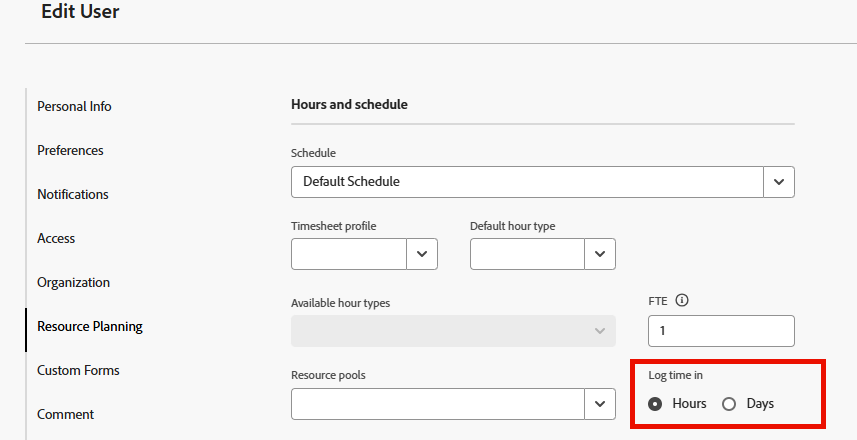

# Konfigurieren, ob die Zeit in Stunden oder Tagen protokolliert wird

Als Anwender mit einer Planerlizenz können Sie konfigurieren, ob Sie die Zeit in Adobe Workfront in Stunden oder Tagen protokollieren. Systemadministratoren können diese Einstellung für einzelne Benutzer oder für mehrere Benutzer in ihrer Organisation konfigurieren. Standardmäßig protokollieren Benutzer die Zeit in Stunden. Informationen zum Protokollieren der Zeit in Workfront finden Sie unter [Zeit protokollieren](../../timesheets/create-and-manage-timesheets/log-time.md).

>[!NOTE]
>
>Es wird empfohlen, die Zeit im gesamten Unternehmen auf die gleiche Weise zu protokollieren, entweder Stunden oder Tage, um die Genauigkeit des Reportings sicherzustellen.

## Zugriffsanforderungen

Sie müssen über folgenden Zugriff verfügen, um die Schritte in diesem Artikel ausführen zu können:

<table style="table-layout:auto"> 
 <col> 
 </col> 
 <col> 
 </col> 
 <tbody> 
  <tr> 
   <td role="rowheader">Adobe Workfront-Plan*</td> 
   <td> 
Beliebig
 </td> 
  </tr> 
  <tr> 
   <td role="rowheader">Adobe Workfront-Lizenz*</td> 
   <td> 
Plan 
 </td> 
  </tr> 
  <tr data-mc-conditions=""> 
   <td role="rowheader">Konfigurationen der Zugriffsebene*</td> 
   <td> 
Planer können Zeit für sich selbst konfigurieren. Nur ein Workfront-Administrator kann Zeit für andere Benutzer konfigurieren.
 </td> 
  </tr> 
 </tbody> 
</table>

&#42;Wenden Sie sich an Ihren Workfront-Administrator, um herauszufinden, über welchen Plan, welchen Lizenztyp oder welchen Zugriff Sie verfügen.

1. Führen Sie je nach Ziel und Zugriffsebene im System einen der folgenden Schritte aus:

   * **Planer-Benutzer, der die Zeitprotokollierung für sich selbst konfiguriert** Klicken Sie auf das **Hauptmenü**-Symbol  in der oberen rechten Ecke von Adobe Workfront und klicken Sie dann auf Ihren Benutzernamen neben Ihrem Profilbild. Klicken Sie dann auf das Symbol **Mehr** neben Ihrem Namen und wählen Sie **Bearbeiten** aus.

   * **Systemadministrator, der die Zeitprotokollierung für andere konfiguriert** Beginnen Sie mit der Bearbeitung eines oder mehrerer Benutzerkonten, wie [Bearbeiten des Benutzerprofils](../../administration-and-setup/add-users/create-and-manage-users/edit-a-users-profile.md) beschrieben.

1. Suchen Sie im daraufhin angezeigten Dialogfeld im Abschnitt **Ressourcenplanung** die Option **Zeit erfassen**.

   

1. (Bedingt) Wenn Sie Systemadministrator sind und mehrere Benutzer gleichzeitig bearbeiten, wählen Sie **Zeit erfassen** aus.
1. Wählen Sie aus den folgenden Optionen für die Zeitprotokollierung aus:

   | Option | Beschreibung |
   |---|---|
   | **Stunden** | Benutzende geben Stunden zum Protokollieren der Zeit in Workfront an. |
   | **Tage** | Benutzende geben Tage für die Zeitprotokollierung in Workfront an. |

1. (Bedingt) Wenn Sie die Zeit in Tagen protokollieren möchten, geben Sie in das Feld **Äquivalente Stunden für vollständige Workday** die Anzahl der Stunden ein, die einem ganzen Tag entsprechen. Ein Tag auf der Arbeitszeittabelle eines Benutzers entspricht der Anzahl der Stunden, die Sie hier eingeben.

   Beachten Sie beim Konfigurieren dieser Einstellung Folgendes:

   * Diese Option ist beim Konfigurieren von für die Zeiterfassung in Stunden nicht verfügbar.
   * Diese Option wird nur zum Protokollieren der Zeit verwendet. Diese Option bezieht sich nicht auf die Option **Zeitplan**, die auch beim Bearbeiten eines Benutzers verfügbar ist. Die **Zeitplan**-Option wird bei der Berechnung von Timelines und in anderen Bereichen von Workfront verwendet. (Weitere Informationen zur Verwendung der Option **Zeitplan** finden Sie unter [Erstellen eines Zeitplans](../../administration-and-setup/set-up-workfront/configure-timesheets-schedules/create-schedules.md).) 

1. Klicken Sie auf **Änderungen speichern**.
