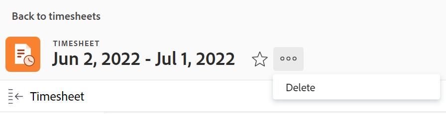

# Arbeitszeittabellen in Adobe Workfront löschen

Die Änderungen, die Sie an einem Arbeitszeittabellen-Profil vornehmen, sind nicht sofort für die derzeit vorhandenen Arbeitszeittabellen wirksam, wie unter [Erstellen, Bearbeiten und Zuweisen von Arbeitszeittabellen-Profilen](../../timesheets/create-and-manage-timesheets/create-timesheet-profiles.md) beschrieben. Um die Änderungen in vorhandenen Arbeitszeittabellen sichtbar zu machen, müssen Sie die generierten Arbeitszeittabellen löschen und neue generieren. Dies gilt nur für Arbeitszeittabellen, die durch Verknüpfen von Arbeitszeittabellen-Profilen mit Benutzern generiert wurden.

>[!NOTE]
>
>Arbeitszeittabellen, die manuell erstellt wurden, können nicht durch erneute Generierung von Arbeitszeittabellen neu erstellt werden, es sei denn, die Benutzer wurden seit der manuellen Erstellung der Arbeitszeittabelle einem Arbeitszeittabellen-Profil zugeordnet. Das Löschen einer manuell erstellten Arbeitszeittabelle kann zu Datenverlust führen. Informationen zum Erstellen einzelner Arbeitszeittabellen finden Sie unter [Erstellen einer Einzelnutzungs-Arbeitszeittabelle](../../timesheets/create-and-manage-timesheets/create-tmshts.md).

Adobe Workfront- oder Gruppenadministratoren können Arbeitszeittabellen für alle Personen im System generieren. Weitere Informationen zum manuellen Generieren von Arbeitszeittabellen finden Sie unter:

* [Arbeitszeittabellen manuell generieren](../../timesheets/create-and-manage-timesheets/manually-generate-timesheets.md)
* [Erstellen und Verwalten der Arbeitszeittabellen-Profile einer Gruppe](../../administration-and-setup/manage-groups/work-with-group-objects/create-and-modify-a-groups-timesheet-profiles.md)

>[!IMPORTANT]
>
>* Eine gelöschte Arbeitszeittabelle kann nicht wiederhergestellt werden.
>* Es wird empfohlen, vergangene Arbeitszeittabellen nicht zu löschen, da sie nicht automatisch auf der Grundlage von Arbeitszeittabellen-Profilen generiert werden. Sie können die aktuellen und zukünftigen Arbeitszeittabellen löschen und manuell generieren, wenn die Änderungen an Ihren Arbeitszeittabellen-Profilen in den neuen Arbeitszeittabellen sofort sichtbar sein sollen.
>* Wenn Sie Arbeitszeittabellen löschen, werden die Stunden, die für Aufgaben, Probleme und Projekte protokolliert wurden, nicht gelöscht. Nur die allgemeinen Stunden werden mit der Arbeitszeittabelle gelöscht. Notieren Sie sich in einem separaten Texteditor, welche allgemeinen Stunden mit der Arbeitszeittabelle verknüpft sind. Nachdem die Arbeitszeittabelle gelöscht wurde, können Sie sie in der neuen Arbeitszeittabelle protokollieren.
>

## Zugriffsanforderungen

+++ Erweitern Sie , um die Zugriffsanforderungen für die -Funktion in diesem Artikel anzuzeigen.

<table style="table-layout:auto">
 <col> 
 <col>
 <tbody> 
  <tr> 
   <td>Adobe Workfront-Paket</td> 
   <td>
Beliebig
</td> 
  </tr> 
  <tr> 
   <td>Adobe Workfront-Lizenz</td> 
   <td>
   
Standard

   
Plan
</td>
  </tr> 
  <tr> 
   <td>Konfigurationen der Zugriffsebene</td> 
   <td>
Administrativer Zugriff auf Arbeitszeittabellen
 </td> 
  </tr> 
 </tbody> 
</table>

Weitere Informationen finden Sie unter [Zugriffsanforderungen in der Dokumentation zu Workfront](/help/quicksilver/administration-and-setup/add-users/access-levels-and-object-permissions/access-level-requirements-in-documentation.md).

+++

## Arbeitszeittabellen in einer Liste löschen

1. Klicken Sie auf **Hauptmenü** Symbol  in der rechten oberen Ecke von Adobe Workfront.

1. Klicken Sie **Arbeitszeittabellen**. Der **Alle**-Filter ist standardmäßig ausgewählt und zeigt alle Arbeitszeittabellen an, auf die Sie Zugriff haben.

   

1. (Optional) Führen Sie einen der folgenden Schritte aus, um den Filter in der Liste der Arbeitszeittabellen zu aktualisieren:

   * Wählen Sie **Meine Arbeitszeittabellen-Genehmigungen** in der rechten oberen Ecke der Seite aus, um nur die von Ihnen genehmigten Arbeitszeittabellen anzuzeigen

     Oder

     Wählen Sie **Meine Arbeitszeittabellen** aus, um nur Ihre Arbeitszeittabellen anzuzeigen.

     Dadurch werden die Filter Meine Arbeitszeittabellen-Genehmigungen oder Meine Arbeitszeittabellen auf die Liste der Arbeitszeittabellen angewendet.

     

   * Klicken Sie auf das Filtersymbol  , um einen anderen Filter anzuwenden, oder erstellen Sie einen neuen. Informationen zum Erstellen oder Aktualisieren von Filtern finden Sie unter [Erstellen oder Bearbeiten von Filtern in Adobe Workfront](../../reports-and-dashboards/reports/reporting-elements/create-filters.md).

   >[!NOTE]
   >
   >Die Optionen Meine Arbeitszeittabellen-Genehmigungen und Meine Arbeitszeittabellen werden nicht oben in der Arbeitszeittabellen-Liste oder in der Filterliste angezeigt, wenn Workfront-Admins oder Gruppenadmins die Filter Meine Arbeitszeittabellen und Meine Arbeitszeittabellen entweder aus den Listensteuerelementen im Setup-Bereich oder aus Ihrer Layoutvorlage entfernt haben. Weitere Informationen finden Sie in den folgenden Artikeln:
   >
   >   
   >   
   >   * [Anpassen von Filtern, Ansichten und Gruppierungen mithilfe einer Layout-Vorlage](../../administration-and-setup/customize-workfront/use-layout-templates/customize-fvg-list-controls-layout-template.md)
   >   
   >

1. (Optional) Klicken Sie auf **Ansicht**  oder **Gruppierung** , um eine andere Ansicht oder Gruppierung anzuwenden oder eine neue zu erstellen.

   Informationen zum Erstellen von Filtern, Ansichten oder Gruppierungen finden Sie in den folgenden Artikeln:

   * [Erstellen oder Bearbeiten von Filtern in Adobe Workfront](../../reports-and-dashboards/reports/reporting-elements/create-filters.md)
   * [Erstellen oder Bearbeiten von Ansichten in Adobe Workfront](../../reports-and-dashboards/reports/reporting-elements/create-edit-views.md)
   * [Erstellen von Gruppierungen in Adobe Workfront](../../reports-and-dashboards/reports/reporting-elements/create-groupings.md)

1. Wählen Sie eine oder mehrere zu löschende Arbeitszeittabellen aus und klicken Sie oben in der Liste der Arbeitszeittabellen **das Symbol** Löschen.

1. Klicken Sie auf **Löschen**.

   Die ausgewählten Arbeitszeittabellen werden gelöscht und können nicht wiederhergestellt werden.

   Um neue Arbeitszeittabellen zu erstellen, stellen Sie sicher, dass die Benutzenden mit einem Arbeitszeittabellenprofil verknüpft sind, und bitten Sie den Workfront-Administrator oder einen Gruppenadministrator, neue Arbeitszeittabellen zu erstellen.

   Weitere Informationen finden Sie hier:

   * [Erstellen, Bearbeiten und Zuweisen von Arbeitszeittabellen-Profilen](../../timesheets/create-and-manage-timesheets/create-timesheet-profiles.md)
   * [Arbeitszeittabellen manuell generieren](../../timesheets/create-and-manage-timesheets/manually-generate-timesheets.md)
   * [Erstellen und Verwalten der Arbeitszeittabellen-Profile einer Gruppe](../../administration-and-setup/manage-groups/work-with-group-objects/create-and-modify-a-groups-timesheet-profiles.md)

## Löschen einer Arbeitszeittabelle von der Arbeitszeittabellen-Seite

1. Klicken Sie auf [!UICONTROL **Hauptmenü**] Symbol  in der rechten oberen Ecke von Adobe Workfront.
1. Klicken Sie auf die Arbeitszeittabelle, die Sie löschen möchten, um sie zu öffnen.
1. Klicken Sie auf das [!UICONTROL **Mehr**]-Symbol  rechts neben dem Namen der Arbeitszeittabelle und klicken Sie dann auf **Löschen**.

   
1. Klicken Sie [!UICONTROL **Löschen**] zur Bestätigung.

   Die Arbeitszeittabelle wird gelöscht und kann nicht wiederhergestellt werden.
