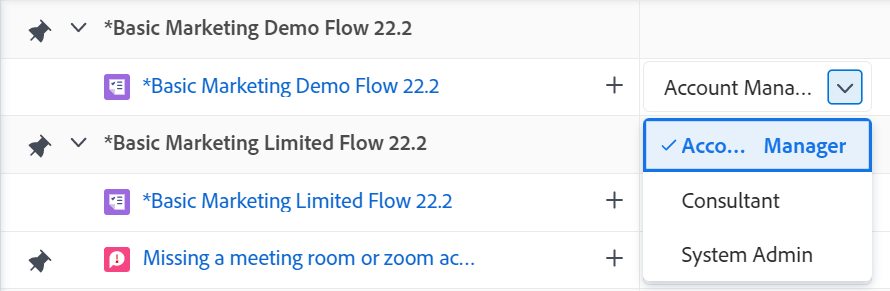
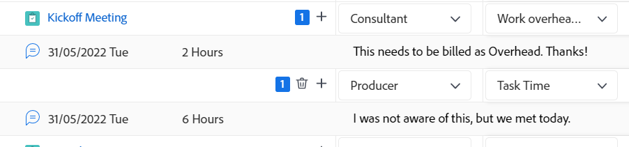
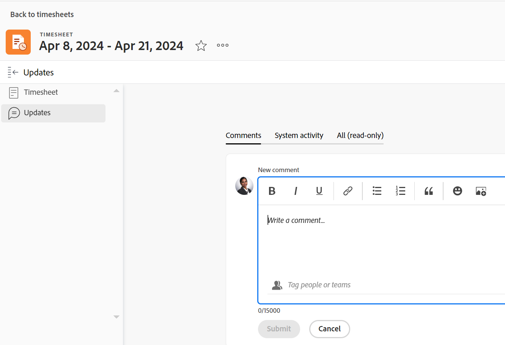

# Zeit erfassen

<!--Audited: 5/2025-->

<!--remove all preview and production references if any-->
<!--update screen shots for the general hour entries and the mixed selection of hours at production, if they fixed the bugs -->

<!--

The highlighted information on this page refers to functionality not yet generally available. It is available only in the Preview environment for all customers. The same features will also be available in the Production environment for all customers after a week from the Preview release.     

For more information, see [Interface modernization](/help/quicksilver/product-announcements/product-releases/interface-modernization/interface-modernization.md). 

-->

Sie können die Zeit für Arbeitselemente in Adobe Workfront protokollieren, um die Anzahl der Stunden anzugeben, die Sie mit deren Bearbeitung verbringen. Sie können auch Zeit erfassen, die nicht mit der Arbeit zusammenhängt, z. B. Urlaub, Krankenstand oder Zeit, die Sie in Meetings verbringen. Die Zeit, die Sie protokollieren, wird in Ihrer Arbeitszeittabelle angezeigt.

Weitere Informationen zum Stundentyp, den Sie in Workfront anmelden können, finden Sie unter [Verwalten von Stundentypen](../../administration-and-setup/set-up-workfront/configure-timesheets-schedules/hour-types.md).

## Zugriffsanforderungen

+++ Erweitern Sie , um die Zugriffsanforderungen für die -Funktion in diesem Artikel anzuzeigen.

<table style="table-layout:auto"> 
 <col> 
 <col> 
 <tbody> 
  <tr> 
   <td>Adobe Workfront-Paket</td> 
   <td> 
Beliebig
 </td> 
  </tr> 
  <tr> 
   <td role="rowheader">Adobe Workfront-Lizenz</td> 
   <td> 
   <ul><li>
Light oder höher für die Protokollierung von Stunden für eine Aufgabe, ein Problem oder allgemeine Stunden auf einer Arbeitszeittabelle
</li>
   <li>
Standardmäßige Protokollierung von Stunden für Projekte
</li></ul>

Oder: 

<ul><li>
Überprüfen oder höher, um allgemeine Stunden in einer Arbeitszeittabelle zu erfassen
</li>
   <li>
Arbeit oder höher zum Protokollieren von Stunden für ein Projekt, eine Aufgabe oder ein Problem
</li></ul> </td> 
  </tr> 
  <tr> 
   <td>Konfigurationen der Zugriffsebene</td> 
   <td> 
Bearbeitungszugriff auf den Typ des Arbeitselements, für das Sie die Zeit protokollieren 
 
Sie benötigen beispielsweise Bearbeitungszugriff auf Anfragen, um die Zeit für Probleme zu protokollieren
 </td>
  </tr> 
  <tr> 
   <td>Objektberechtigungen</td>
   <td> 
Tragen Sie zu oder höhere Berechtigungen für das Arbeitselement bei, für das Sie die Zeit protokollieren, die Berechtigungen zum Protokollieren von Stunden enthält
 </td>
  </tr> 
 </tbody> 
</table>

Weitere Informationen finden Sie unter [Zugriffsanforderungen in der Dokumentation zu Workfront](/help/quicksilver/administration-and-setup/add-users/access-levels-and-object-permissions/access-level-requirements-in-documentation.md).

+++

## Überlegungen beim Protokollieren der Zeit in Workfront

* Sie können Zeit für Projekte, Aufgaben oder Probleme protokollieren oder die Zeit direkt in Ihrer Arbeitszeittabelle protokollieren.

  Informationen zum Erstellen von Arbeitszeittabellen finden [ unter „Erstellen einer Arbeitszeittabelle für den einmaligen Gebrauch](../../timesheets/create-and-manage-timesheets/create-tmshts.md).

* Alle Zeiteinträge, die über andere Tools als die Arbeitszeittabelle erfasst werden, werden für den entsprechenden Zeitraum in der Arbeitszeittabelle angezeigt.
* Aufgaben und Probleme in einem Projekt, das nicht aktuell ist, werden nicht vorab in einer Arbeitszeittabelle ausgefüllt.
* Die in der Arbeitszeittabelle protokollierte Zeit wird sofort auf die Aufgabe, das Problem oder das Projekt angewendet.
* Arbeitszeittabellen enthalten die Gesamtzeit für alle protokollierten Daten. Wochenenden sind immer eingeschlossen, auch wenn Zeitleistenberechnungen so konfiguriert wurden, dass sie sie ausschließen (wie unter [Konfigurieren von systemweiten Projektvoreinstellungen](../../administration-and-setup/set-up-workfront/configure-system-defaults/set-project-preferences.md) beschrieben).
* Die maximale Anzahl der in einer Arbeitszeittabelle angezeigten Elemente beträgt 45. Wenn mehr als 45 Elemente vorhanden sind, deren Daten mit dem Arbeitszeittabellen-Zeitrahmen übereinstimmen, werden nur die zuletzt aktualisierten Elemente angezeigt.
* Stundeneinträge, die in den Rechnungsnachweisen enthalten sind, sind abgeblendet und können nicht in der Arbeitszeittabelle bearbeitet werden. Weitere Informationen finden Sie unter [Rechnungsnachweise erstellen](../../manage-work/projects/project-finances/create-billing-records.md).
* Persönliche Aufgaben werden nicht standardmäßig in der Arbeitszeittabelle angezeigt. Persönliche Aufgaben werden nur dann in der Arbeitszeittabelle angezeigt, wenn sie protokolliert wurden. Nachdem Sie die Zeit für eine persönliche Aufgabe protokolliert haben, können Sie die Aufgabe an die Arbeitszeittabelle anheften. Wenn sie angeheftet bleibt, bleibt sie auf der Arbeitszeittabelle. Weitere Informationen finden Sie unter [Erstellen von Arbeitselementen und Projekten im Bereich Startseite](../../workfront-basics/using-home/using-the-home-area/create-work-items-in-home.md).

## Zeit erfassen {#log-time-section}

Sie können die Zeit in den folgenden Bereichen in Workfront protokollieren:

* [Arbeitszeittabelle](#timesheet)
* [Startseite](#home)
* [Projekt, Aufgabe oder Problem](#project-task-or-issue)
* [Bedienfeld „Zusammenfassung“](#summary-panel)
* [Pinnwände](#boards)
* [Mobile App](#mobile-app)

### Arbeitszeittabelle {#timesheet}

#### Zeit in einer Arbeitszeittabelle protokollieren {#log-time-on-a-timesheet}

Sie können Zeit für die folgenden Elemente in der Arbeitszeittabelle protokollieren:

* Vorausgefüllte Aufgaben, Probleme und Projekte, die automatisch angezeigt werden, je nachdem, wie der Workfront-Administrator die Voreinstellungen für die Arbeitszeittabelle festlegt. Informationen dazu, wie Arbeitszeittabellen vorab ausgefüllt werden, finden Sie unter [Konfigurieren von Arbeitszeittabellen und Stundeneinstellungen](../../administration-and-setup/set-up-workfront/configure-timesheets-schedules/timesheet-and-hour-preferences.md).

  Nur die Ihnen zugewiesenen Aufgaben und Probleme werden in Ihrer Arbeitszeittabelle vorab ausgefüllt. Aufgaben und Probleme, die Ihren Teams oder Aufgabengebieten zugewiesen sind, werden nicht automatisch in Ihrer Arbeitszeittabelle ausgefüllt.

  Wenn Sie auf Bearbeiten für ein Element klicken, das Ihren Teams zugewiesen ist, wird das Element Ihnen zugewiesen und das Element wird in Ihrer Arbeitszeittabelle angezeigt.

* Aufgaben, Probleme oder Projekte, die Sie manuell hinzufügen.
* Aufgaben, Probleme oder Projekte, für die Sie bereits an anderer Stelle in Workfront Zeit erfasst haben.
* Allgemeine Zeit (Urlaub, Training, Gemeinkostenzeit).

>[!NOTE]
>
>Überprüfen Sie, ob Benutzende, die einem Arbeitszeittabellen-Profil zugewiesen sind, den Bereich Arbeitszeittabellen sehen und allgemeine Stunden protokollieren können. Sie können jedoch keine Stunden für ihnen zugewiesene Aufgaben oder Probleme protokollieren, die auf der Arbeitszeittabelle angezeigt werden.

So protokollieren Sie die Zeit in einer Arbeitszeittabelle:

{{step1-click-main-menu}}

1. Klicken Sie [!UICONTROL **Arbeitszeittabellen**]. Ihre aktuelle Arbeitszeittabelle wird standardmäßig angezeigt.
   

1. (Optional) Klicken Sie auf das Symbol **Vollbild**,  die Arbeitszeittabelle im Vollbildmodus anzuzeigen, und klicken Sie dann auf das Symbol **exit-full-screen**, um  Arbeitszeittabelle zurückzukehren.

   <!-- drafted for the resize columns in timesheet story: 1. (optional) Click on the separator lines between weeks or between the time frame area and the work item area to resize the columns of the timesheet.-->

1. (Optional) Um ein Projekt, eine Aufgabe oder ein Problem zur Arbeitszeittabelle hinzuzufügen, klicken Sie auf das Dropdown-Menü **Element hinzufügen** in der linken oberen Ecke der Arbeitszeittabelle und klicken dann auf **Projekte hinzufügen**, **Aufgaben hinzufügen** oder **Probleme hinzufügen**.

   Eine Liste von Projekten, Aufgaben oder Problemen wird angezeigt.

   <!--drafted for full screen mode for add projects story - align it with the rest of the steps when you enable this:: 1. (Optional) Click the **full-screen** icon  to display the list of objects in full-screen mode.-->

1. (Optional) Klicken Sie auf das Suchsymbol , um mithilfe eines Keywords, das der Arbeitszeittabelle hinzugefügt werden soll, nach einem bestimmten Element zu suchen.

1. (Optional) Erweitern Sie die Dropdown-Menüs „Filter“, „Ansicht“ oder „Gruppierung“, um eines anzuwenden oder anzupassen und die gewünschten Elementinformationen anzuzeigen.

1. Wählen Sie ein oder mehrere Elemente in der Liste aus und klicken Sie dann auf **Hinzufügen**.

   Wenn Sie weniger als 50 Elemente gleichzeitig hinzugefügt haben, werden die Elemente zur Arbeitszeittabelle hinzugefügt. Aufgaben und Probleme werden unter dem Namen des Projekts aufgelistet.

   >[!NOTE]
   >
   >Wenn Sie Aufgaben oder Probleme zur Arbeitszeittabelle hinzufügen, wird das Projekt ebenfalls hinzugefügt.

1. (Bedingt) Wenn Sie 50 oder mehr Elemente gleichzeitig hinzufügen, wird eine Bestätigungsmeldung mit der Anzahl der zu Ihrer Arbeitszeittabelle hinzugefügten Elemente angezeigt.

   Klicken Sie **Alle hinzufügen**, um alle Elemente hinzuzufügen
oder
Klicken Sie auf **Abbrechen**, um das Hinzufügen der ausgewählten Elemente zu stoppen, und dann auf **Abbrechen**, um die Liste der Elemente zu schließen.

   Aufgaben und Probleme werden unter dem Namen des Projekts aufgelistet.

   >[!NOTE]
   >
   >Die Elemente, die Sie manuell zur Arbeitszeittabelle hinzufügen, werden angeheftet und bleiben in den aktuellen und zukünftigen Arbeitszeittabellen erhalten, bis Sie sie manuell entfernen, um sie zu entfernen. Informationen zum Aufheben der Anheftung von Elementen, um sie aus der Arbeitszeittabelle zu entfernen, finden Sie in Schritt 10.

   <!--(ensure this stays accurate)-->

1. (Optional) Klicken Sie auf **Reduzieren**  oder **** Erweitern neben dem Projektnamen, um die Liste der Aufgaben und Probleme für das Projekt entweder anzuzeigen oder auszublenden.

   >[!TIP]
   >
   >   Wenn Sie eine Standard-QWERTY-Tastatur verwenden und nachdem Sie auf den Namen eines Projekts in der Arbeitszeittabelle geklickt haben, drücken Sie die folgenden Tastensätze, um das Projekt zu reduzieren oder zu erweitern:
   >   * So erweitern Sie das Projekt und zeigen seine Arbeitselemente an:
   >     * Umschalt+Alt+Nach-oben-Taste für Windows-Computer
   >     * Umschalt+Option+Nach-oben-Taste für Mac-Computer
   >   * So reduzieren Sie ein Projekt und blenden seine Arbeitselemente aus:
   >     * Umschalt+Alt+Nach-unten-Taste für Windows-Computer
   >     * Umschalt+Wahltaste+Nach-unten-Taste für Mac-Computer.

1. (Optional) Um ein Element, das automatisch auf der Arbeitszeittabelle angezeigt wird, manuell anzuheften, bewegen Sie den Mauszeiger über den Namen des Elements und klicken Sie dann auf das Symbol **Anheften** .

   >[!TIP]
   >
   >   Wenn Sie eine QWERTY-Standardtastatur verwenden, nachdem Sie auf ein Element in der Arbeitszeittabelle geklickt haben, drücken Sie die folgenden Tasten, um ein Element anzuheften:
   >   * Option + P für Windows- und Mac-Computer.

1. (Optional) Klicken Sie auf das Suchsymbol  und beginnen Sie mit der Eingabe eines Keywords, um ein Projekt, eine Aufgabe oder ein Problem in der Arbeitszeittabelle zu finden.

1. (Bedingt) Wenn Ihr Workfront- oder Gruppenadministrator die Einstellung **Aufgabengebiete manuell Stundeneinträgen zuweisen** aktiviert hat, wählen Sie aus dem Dropdown-Menü ein Aufgabengebiet aus. Die Funktion, die beim Zuweisen zum Arbeitselement angegeben wird, wird standardmäßig angezeigt. Wenn Ihnen im -Objekt keine Rolle zugewiesen ist, wird Ihre Primäre Rolle als Standard angezeigt. Weitere Informationen zu dieser Einstellung finden Sie im Artikel [Konfigurieren von Arbeitszeittabellen- und Stundeneinstellungen](../../administration-and-setup/set-up-workfront/configure-timesheets-schedules/timesheet-and-hour-preferences.md).

   

1. (Optional) Klicken Sie auf das Symbol **+**, um eine weitere Zeile hinzuzufügen, und wählen Sie dann einen neuen Stundentyp aus dem Dropdown-Menü in der Spalte [!UICONTROL Stundentyp], um die Zeit für einen anderen Stundentyp zu erfassen.

   

   >[!TIP]
   >
   >   Drücken Sie je nach Betriebssystem oder Browser und bei Verwendung einer Standard-QWERTY-Tastatur die folgenden Tasten, um eine weitere Zeile hinzuzufügen:
   >   * Strg + Option + + für Windows-Computer
   >   * Befehlstaste + Wahltaste + + für Mac-Computer

   Stundentypen sind je nachdem, was auf System-, Projekt- und Benutzerebene definiert wurde, verfügbar, wie unter [Definieren von Stundentypen und Verfügbarkeit](define-hour-types-and-availability.md) beschrieben.

   Der Stundentyp kann nach dem Schließen einer Arbeitszeittabelle nicht mehr geändert werden.

   >[!TIP]
   >
   >Wenn Sie zuvor die Zeit protokolliert haben und der ausgewählte Stundentyp jetzt deaktiviert ist, wird die gesamte Zeile für die protokollierte Zeit abgeblendet. Wenn Sie einen anderen Stundentyp auswählen und die Seite aktualisieren, wird die Option Deaktivierter Stundentyp aus der Dropdown-Liste entfernt, sodass Sie diesem Stundentyp keine zusätzlichen Stunden hinzufügen können.
   >
   >Erwägen Sie, eine neue Zeile für das Arbeitselement hinzuzufügen, für das Sie zusätzliche Zeit protokollieren möchten, und einen neuen Stundentyp auszuwählen, wenn Sie den deaktivierten Stundentyp weiterhin mit der vergangenen protokollierten Zeit verknüpfen möchten.

1. Klicken Sie auf das **Löschen**-Symbol  neben dem Aufgabengebiet, um es zu entfernen. Die für die Rolle protokollierte Zeit wird ebenfalls entfernt.

   >[!TIP]
   >
   >   Drücken Sie je nach Betriebssystem oder Browser und bei Verwendung einer Standard-QWERTY-Tastatur die folgenden Tasten, um eine Zeile zu löschen:
   >   * Strg + Option + - für Windows-Computer
   >   * Befehlstaste + Wahltaste + - für Mac-Computer

1. Geben Sie im Zeitleistenabschnitt der Arbeitszeittabelle die Zeit an, über die Sie sich an einem bestimmten Tag anmelden möchten, und klicken Sie dann auf eine Stelle außerhalb des Stundenfelds, um den Stundeneintrag zu speichern. Die Stunden werden automatisch gespeichert. Die Zeile, für die Sie die Zeit erfassen, ist hellblau hervorgehoben, und das Stundeneingabefeld ist dunkelblau umrandet.

   

   Die Zeit wird entweder in Stunden oder Tagen protokolliert. Diese Einstellung wird von Benutzenden mit Planlizenz oder vom Systemadministrator konfiguriert, wie unter [Konfigurieren, ob die Zeit in Stunden oder Tagen protokolliert wird](../../timesheets/config-timesheet-prefs/config-time-logged-hrs-days.md) beschrieben.

   >[!IMPORTANT]
   >
   >Sie müssen die Arbeitszeittabelle manuell speichern, wenn eines der folgenden Szenarien eintritt:
   >
   >* Das Aufgabengebiet, das der zuvor erfassten Zeit zugeordnet ist, hat sich geändert und die Einstellung **Aufgabengebiet zu Stundeneinträgen manuell**) wurde deaktiviert. Wenn Sie die Zeit für neue Daten erfassen, wird sie mit einem anderen Aufgabengebiet verknüpft.
   >   
   >   Wenn sich die Rolle geändert hat und die Einstellung **Aufgabengebiet zu Stundeneinträgen manuell hinzufügen** aktiviert ist, können Sie die Zeit protokollieren oder die Rolle aktualisieren. Ihre Änderungen werden automatisch gespeichert.
   >
   >* Das einer Aufgabe oder einem Problem zugewiesene Aufgabengebiet unterscheidet sich von dem Aufgabengebiet, mit dem der Arbeitszeittabellen-Inhaber die Zeit <!--or assigned to them_ this last  piece came from a Support note but but sure what role it's referring to. Leaving it out for now.-->.
   >
   >Die Arbeitszeittabelle speichert erneut automatisch die Zeit, wenn es keine widersprüchlichen Einträge zwischen den beiden Rollen mehr gibt.
   >

1. (Optional) Geben Sie im Feld Überstunden in der Kopfzeile der Arbeitszeittabelle den Betrag der Überstunden an.

   >[!TIP]
   >
   >Sie können keine größere Anzahl von Überstunden als die aktuelle Gesamtstundenzahl in der Arbeitszeittabelle protokollieren. Wenn Sie beispielsweise bisher 7 Stunden auf der Arbeitszeittabelle protokolliert haben, können Sie keine 8 Stunden Überstunden protokollieren.

1. (Optional) Klicken Sie auf **Kommentar**, um einen Kommentar für Ihren Stundeneintrag hinzuzufügen.

   

   >[!TIP]
   >
   >   Wenn Sie eine QWERTY-Standardtastatur verwenden, nachdem Sie auf das Stundeneingabefeld geklickt haben, drücken Sie die folgenden Tasten, um das Kommentarfeld zu öffnen:
   >   * Umschalten + F2 für Windows- und Mac-Computer.

1. Klicken Sie **Fertig**, um den Kommentar zu speichern.

   >[!TIP]
   >
   >   Drücken Sie bei Verwendung einer Standard-QWERTY-Tastatur innerhalb des Kommentarfelds die folgenden Tasten, um den Kommentar zu speichern:
   >   * Strg + Eingabetaste für Windows-Computer.
   >   * Befehlstaste + Rückgabe für Mac-Computer.

1. (Optional) Klicken Sie in **Symbolleiste auf** Kommentare anzeigen“, um Ihre Einstiegskommentare unter dem Arbeitselement anzuzeigen.

   

   >[!TIP]
   >
   >   Alle Änderungen an der Arbeitszeittabelle werden automatisch gespeichert.

1. (Optional) Klicken Sie auf die Zeile einer Aufgabe oder eines Problems und dann auf **Zusammenfassung öffnen** in der rechten oberen Ecke der Arbeitszeittabelle, um eine Aktualisierung hinzuzufügen oder Informationen zur Aufgabe oder zum Problem zu aktualisieren. Das Bedienfeld Zusammenfassung wird auf der rechten Seite geöffnet.

   

   Ihre Aktualisierung wird im Bereich Aktualisierungen des Arbeitselements angezeigt, das der protokollierten Zeit zugeordnet ist.

   >[!TIP]
   >
   >Sie können keine Projekte oder Stundeneinträge für allgemeine Zeiten kommentieren.

1. Klicken Sie [!UICONTROL **Zusammenfassung schließen**], um das Bedienfeld Zusammenfassung zu schließen und zur Arbeitszeittabelle zurückzukehren.

1. (Optional) Klicken Sie [!UICONTROL **linken**] auf „Updates“ und fügen Sie dann eine Aktualisierung zur Arbeitszeittabelle hinzu. Weitere Informationen zu Workfront-Updates finden Sie unter [Update-](../../workfront-basics/updating-work-items-and-viewing-updates/update-work.md).

   

1. (Optional) Kehren Sie zum Bereich **Arbeitszeittabelle** zurück, um Ihre Arbeitszeittabelle zu schließen oder zu übermitteln.

   * **Schließen**: Schließen Sie die Arbeitszeittabelle, wenn Sie mit der Aktualisierung fertig sind. Diese Option ist nur verfügbar, wenn die Arbeitszeittabelle keiner genehmigenden Person zugeordnet ist.

   * **Zur Genehmigung einreichen:** Diese Option ist nur verfügbar, wenn auf der Arbeitszeittabelle eine genehmigende Person vorhanden ist. Speichern Sie Ihre Änderungen und senden Sie sie zur Genehmigung. Sie können die Arbeitszeittabelle nach dem Schließen öffnen, indem Sie auf **Rückruf** klicken, falls noch keine Genehmigung erteilt wurde. Weitere Informationen finden Sie unter [Arbeitszeittabelle zur Genehmigung ](../../timesheets/create-and-manage-timesheets/submit-timesheet-for-approval.md).

   * **Ablehnen**: Diese Option wird angezeigt, wenn Sie eine Arbeitszeittabelle genehmigen und diese zur Genehmigung eingereicht wurde. Wenn Sie darauf klicken, ändert sich der Status der Arbeitszeittabelle in Abgelehnt und die Arbeitszeittabelle bleibt offen.

   * **Genehmigen**: Diese Option wird angezeigt, wenn Sie eine Arbeitszeittabelle genehmigen und diese zur Genehmigung eingereicht wurde. Wenn Sie darauf klicken, ändert sich der Status der Arbeitszeittabelle in Genehmigt und die Arbeitszeittabelle wird geschlossen.

   >[!TIP]
   >
   >Die Optionen Ablehnen und Genehmigen werden auch in Ihrer Arbeitszeittabelle angezeigt, wenn Sie Systemadministrator sind und die Arbeitszeittabelle mit einer genehmigenden Person verknüpft ist.

1. (Bedingt) Wenn Sie Ihre Arbeitszeittabelle geschlossen oder zur Genehmigung eingereicht haben, klicken Sie auf eine der folgenden Optionen:

   * **Erneut öffnen**: Diese Option ist für Arbeitszeittabellen verfügbar, die bereits geschlossen wurden und die keine genehmigenden Personen haben, oder für Arbeitszeittabellen, die bereits genehmigt wurden. Öffnen Sie die Arbeitszeittabelle erneut, um Ihre Einträge zu ändern.
   * **Rückruf**: Diese Option ist für Arbeitszeittabellen verfügbar, die zur Genehmigung eingereicht, aber noch nicht genehmigt oder abgelehnt wurden. Klicken Sie **Rückruf**, um die Arbeitszeittabelle erneut zu öffnen und Stundeneinträge zu ändern.

#### Element aus der Arbeitszeittabelle entfernen

Sie können einen Stundeneintrag oder ein Element (Projekt, Aufgabe oder Problem) aus einer Arbeitszeittabelle entfernen.

So entfernen Sie einen Stundeneintrag aus einer Arbeitszeittabelle:

1. Navigieren Sie zur Arbeitszeittabelle und suchen Sie den Stundeneintrag, den Sie entfernen möchten.
1. Ersetzen Sie die eingegebenen Stunden durch 0
oder
Entfernen Sie die Stunden, ersetzen Sie sie durch 0 und drücken Sie dann die Eingabetaste.

   Die Stunden werden entfernt und die Arbeitszeittabelle wird automatisch gespeichert.

Sie können ein Element (Projekt, Aufgabe oder Problem) aus der Arbeitszeittabelle entfernen, indem Sie die Anheftung aufheben, wenn Sie die Zeit dafür noch nicht protokolliert haben und das Element manuell hinzugefügt haben (wie in den Schritten 4-8 im Abschnitt [Zeit in einer Arbeitszeittabelle ](#log-time-on-a-timesheet)). <!--ensure this stays accurate-->

Sie können Elemente, die in der Arbeitszeittabelle enthalten sind, nicht automatisch gemäß den Arbeitszeittabellen-Voreinstellungen in Ihrem Workfront-System oder Ihrer Gruppe entfernen, die so konfiguriert sind, dass die Arbeitszeittabellen vorab ausgefüllt werden (wie in [Konfigurieren von Arbeitszeittabellen- und ](../../administration-and-setup/set-up-workfront/configure-timesheets-schedules/timesheet-and-hour-preferences.md)). Die Elemente werden nicht mehr vorab in der Arbeitszeittabelle ausgefüllt, wenn die Daten der Elemente außerhalb des Zeitrahmens der Arbeitszeittabelle liegen.

So entfernen Sie ein Element aus der Arbeitszeittabelle, das manuell hinzugefügt wurde:

1. Stellen Sie sicher, dass für das Element keine Zeit protokolliert wird.
1. Klicken Sie auf das **Loslösen**-Symbol  neben dem Element, um das angeheftete Element aus der Arbeitszeittabelle zu entfernen.

   >[!TIP]
   >
   >   Wenn Sie eine QWERTY-Standardtastatur verwenden, nachdem Sie auf ein Element in der Arbeitszeittabelle geklickt haben, drücken Sie die folgenden Tasten, um das angeheftete Element zu entfernen:
   > * Option + P für Windows- und Mac-Computer.

   Das Element wird nach dem Aktualisieren der Seite aus der Arbeitszeittabelle entfernt.

### Startseite {#home}

Sie können die projektspezifische Zeit auf der Startseite protokollieren.

Allgemeine Informationen zur Verwendung des Bereichs „Startseite“ finden Sie [Verwenden des Bereichs „Startseite](../../workfront-basics/using-home/using-the-home-area/use-the-home-area.md).

<!--#### Log time on a work item from the new Home area-->

Sie können Zeit für Aufgaben und Probleme in jedem Widget mithilfe des Bedienfelds Zusammenfassung im Bereich Startseite protokollieren. Weitere Informationen finden Sie im [Bedienfeld Zusammenfassung](#summary-panel) in diesem Artikel.

Um die Zeit für ein Element im Widget „Meine Arbeit“ zu protokollieren, gehen Sie außerdem wie folgt vor:

1. Navigieren Sie zum Bereich **Startseite**.
1. Fügen Sie das Widget **Meine Arbeit** zu Ihrer Startseite hinzu.
1. (Optional) Wählen Sie eine Aufgabe, ein Problem oder eine Anfrage in einer Liste aus und klicken Sie dann **Bearbeiten**.
1. Bewegen Sie den Mauszeiger über die Aufgabe oder das Problem, für die bzw. das Sie die Zeit protokollieren möchten **und klicken Sie dann auf das Symbol** Zeit protokollieren rechts neben den Aufgabeninformationen.

   Das **Zeit erfassen** wird angezeigt.

   

1. Geben Sie die folgenden Informationen an:

   * **Stundentyp**: Wählen Sie einen Stundentyp aus dem Dropdown-Menü aus, wenn er sich von dem standardmäßig angezeigten unterscheidet.

     Je nachdem, welche Stundentypen in Ihrem System konfiguriert sind, können die Optionen hier variieren. Weitere Informationen zur Konfiguration von Stundentypen finden Sie unter [Festlegen von Stundentypen und Verfügbarkeit](../../timesheets/create-and-manage-timesheets/define-hour-types-and-availability.md).

   * **Aufgabengebiet**: (Bedingt) Wenn Ihr Workfront- oder Gruppenadministrator die Einstellung **Aufgabengebiet zu Stundeneinträgen manuell hinzufügen** aktiviert hat, wählen Sie aus dem Dropdown-Menü ein **Aufgabengebiet** aus. Die beim Zuweisen zum -Objekt angegebene Rolle wird standardmäßig angezeigt. Wenn Ihnen für das Objekt keine Rolle zugewiesen wurde, wird Ihre Primäre Rolle als Standard angezeigt. Weitere Informationen zu dieser Einstellung finden Sie im Artikel [Konfigurieren von Arbeitszeittabellen- und Stundeneinstellungen](../../administration-and-setup/set-up-workfront/configure-timesheets-schedules/timesheet-and-hour-preferences.md).

   * Geben Sie im wöchentlichen Kalender die Anzahl der Stunden für das Projekt, die Aufgabe oder das Problem ein.

1. Klicken Sie **Zeit protokollieren**.

   Die protokollierte Zeit wird im Abschnitt Stunden des Objekts und in Ihrer Arbeitszeittabelle angezeigt.

   Im Feld **Gesamtstunden** im Feld Zeit protokollieren werden alle Stunden angezeigt, die von allen Benutzern für das Projekt, die Aufgabe oder das Problem protokolliert wurden.

<!--#### Log time on a work item from the legacy Home area

1. In the **Work List** area, select the item where you want to log time.
1. In the right panel, click **Log Time**.  
  
     

1. In the **Enter Hours** drop-down menu, select the appropriate hour type.  
   Hour types are available depending on what has been defined at the system, project, and user levels, as described in [Define hour types and availability](../../timesheets/create-and-manage-timesheets/define-hour-types-and-availability.md).
1. (Conditional) If your Workfront or group administrator has enabled the **Assign job roles to hour entries manually** setting, select a job role from the drop-down menu. The role specified when you are assigned to the work item displays by default. If you are not assigned a role on the object, your Primary Role displays as the default. For more information on this setting, see the article [Configure timesheet and hour preferences](../../administration-and-setup/set-up-workfront/configure-timesheets-schedules/timesheet-and-hour-preferences.md).
1. Specify the time you want to log, then click **Log Time**.

   The logged time displays in the object's Hours section, nad in your timesheet. -->

### Projekt, Aufgabe oder Problem {#project-task-or-issue}

Sie können in den folgenden Abschnitten projektspezifische Zeit für ein Projekt, eine Aufgabe oder ein Problem protokollieren:

* [Abschnitt „Aktualisierungen“](#updates-section)
* [Abschnitt „Stunden“](#hours-section)

#### Abschnitt „Aktualisierungen“{#updates-section}

Um Zeit im Abschnitt Aktualisierungen eines Projekts, einer Aufgabe oder eines Problems zu erfassen, benötigen Sie Folgendes:

* Der richtige Zugriff und die richtigen Berechtigungen, wie [ Abschnitt &quot;](#access-requirements)&quot; in diesem Artikel beschrieben.

* Ihr Workfront-Administrator muss die Einstellung Zeit direkt in Projekten protokollieren unter [!UICONTROL **Arbeitszeittabelle und Stunden**]> [!UICONTROL **Voreinstellungen**] im Systembereich aktivieren, wenn Sie die Zeit direkt in einem Projekt protokollieren möchten.

  Weitere Informationen dazu, wie Benutzenden ermöglicht wird, Stunden direkt in Projekten zu protokollieren, finden Sie [Konfigurieren von Arbeitszeittabellen- und Stundeneinstellungen](../../administration-and-setup/set-up-workfront/configure-timesheets-schedules/timesheet-and-hour-preferences.md).

So protokollieren Sie die Zeit im Abschnitt „Aktualisierungen“ eines Projekts, einer Aufgabe oder eines Problems:

1. Zu einem Projekt, einer Aufgabe oder einem Problem wechseln.
1. Wählen Sie im linken Bedienfeld die Option **Updates** aus.
1. Klicken Sie **Zeit protokollieren**. <!-- did Anna B change the casing for this button? If yes and if she changed it for the other areas, update screen shot too-->

   Das Dialogfeld Zeit protokollieren wird angezeigt.

   >[!TIP]
   >
   >   Wenn die Einstellung Ihres Profils auf Zeit in Tagen protokollieren eingestellt ist, wird das Feld Tage eingeben angezeigt.
   >   
   >   In der rechten oberen Ecke des Felds Tage eingeben wird angegeben, wie viele Stunden in einem Tag enthalten sind.

   

1. Geben Sie die folgenden Informationen an:

   * **Stundentyp**: Wählen Sie einen Stundentyp aus dem Dropdown-Menü aus, wenn er sich von dem standardmäßig angezeigten unterscheidet.

     Je nachdem, welche Stundentypen in Ihrem System konfiguriert sind, können die Optionen hier variieren. Weitere Informationen zur Konfiguration von Stundentypen finden Sie unter [Festlegen von Stundentypen und Verfügbarkeit](../../timesheets/create-and-manage-timesheets/define-hour-types-and-availability.md).

   * **Aufgabengebiet**: (Bedingt) Wenn Ihr Workfront- oder Gruppenadministrator die Einstellung **Aufgabengebiet zu Stundeneinträgen manuell hinzufügen** aktiviert hat, wählen Sie aus dem Dropdown-Menü ein **Aufgabengebiet** aus. Die beim Zuweisen zum -Objekt angegebene Rolle wird standardmäßig angezeigt. Wenn Ihnen für das Objekt keine Rolle zugewiesen wurde, wird Ihre Primäre Rolle als Standard angezeigt. Weitere Informationen zu dieser Einstellung finden Sie im Artikel [Konfigurieren von Arbeitszeittabellen- und Stundeneinstellungen](../../administration-and-setup/set-up-workfront/configure-timesheets-schedules/timesheet-and-hour-preferences.md).

   * Geben Sie im wöchentlichen Kalender die Anzahl der Stunden für das Projekt, die Aufgabe oder das Problem ein.

1. Klicken Sie **Zeit protokollieren**.

   Die protokollierte Zeit wird im Abschnitt Stunden des Objekts und in Ihrer Arbeitszeittabelle angezeigt.

   Im Feld **Gesamtstunden** im Feld Zeit protokollieren werden alle Stunden angezeigt, die von allen Benutzern für das Projekt, die Aufgabe oder das Problem protokolliert wurden.

#### Abschnitt „Stunden“{#hours-section}

Sie müssen ein Workfront-Administrator sein, um Zeit für Projekte, Aufgaben und Probleme im Abschnitt Stunden protokollieren zu können.

Oder

Sie müssen über alle folgenden verfügen:

* Eine Planlizenz mit administrativem Zugriff auf Arbeitszeittabellen und Stunden. Weitere Informationen zum Gewähren von administrativem Zugriff auf Arbeitszeittabellen und Stunden finden Sie unter [Gewähren von administrativem Zugriff für Benutzer auf bestimmte Bereiche](../../administration-and-setup/add-users/configure-and-grant-access/grant-users-admin-access-certain-areas.md).
* Tragen Sie mit Zugriff auf „Stunden protokollieren“ Berechtigungen oder höhere Berechtigungen zum Projekt bei. Weitere Informationen zum Gewähren von Berechtigungen für Projekte finden Sie unter [Freigeben eines Projekts in Adobe Workfront](../../workfront-basics/grant-and-request-access-to-objects/share-a-project.md).
* Ihr Workfront-Administrator muss die Einstellung Zeit direkt in Projekten protokollieren im Abschnitt **Arbeitszeittabelle und Stunden > Voreinstellungen** des Bereichs Setup aktivieren, wenn Sie die Zeit direkt in einem Projekt protokollieren möchten. Weitere Informationen dazu, wie Benutzenden ermöglicht wird, Stunden direkt in Projekten zu protokollieren, finden Sie [Konfigurieren von Arbeitszeittabellen- und Stundeneinstellungen](../../administration-and-setup/set-up-workfront/configure-timesheets-schedules/timesheet-and-hour-preferences.md).

So protokollieren Sie die Zeit im Abschnitt Stunden eines Projekts, einer Aufgabe oder eines Problems:

1. Zu einem Projekt, einer Aufgabe oder einem Problem wechseln.
1. Klicken Sie im linken Bedienfeld auf **Stunden**.
1. Klicken Sie **Zeit protokollieren**.

   Das **Zeit erfassen** wird angezeigt.

   

1. Geben Sie die folgenden Informationen an:

   * **Inhaber** Ihr Name wird standardmäßig in diesem Feld angezeigt.\
     Wenn Sie die Stunden für einen anderen Benutzer protokollieren, geben Sie dessen Namen an.

   * **Stundentyp**: Wählen Sie einen Stundentyp aus dem Dropdown-Menü aus, wenn er sich von dem standardmäßig angezeigten unterscheidet.

     Je nachdem, welche Stundentypen in Ihrem System konfiguriert sind, können die Optionen hier variieren.

     Weitere Informationen zur Konfiguration von Stundentypen finden Sie unter [Festlegen von Stundentypen und Verfügbarkeit](../../timesheets/create-and-manage-timesheets/define-hour-types-and-availability.md).

   * **Aufgabengebiet**: (Bedingt) Wenn Ihr Workfront- oder Gruppenadministrator die Einstellung **Aufgabengebiet zu Stundeneinträgen manuell hinzufügen** aktiviert hat, wählen Sie aus dem Dropdown-Menü ein **Aufgabengebiet** aus. Die beim Zuweisen zum -Objekt angegebene Rolle wird standardmäßig angezeigt. Wenn Ihnen für das Objekt keine Rolle zugewiesen wurde, wird Ihre Primäre Rolle als Standard angezeigt. Weitere Informationen zu dieser Einstellung finden Sie im Artikel [Konfigurieren von Arbeitszeittabellen- und Stundeneinstellungen](../../administration-and-setup/set-up-workfront/configure-timesheets-schedules/timesheet-and-hour-preferences.md).
   * **Der wöchentliche Kalender**: Geben Sie die Anzahl der Stunden für das Projekt, die Aufgabe oder das Problem ein.
   * **Hinweis**: Fügen Sie einen Hinweis hinzu, um zu erklären, wozu die Stunden dienen. Dies wird als **Stundennotiz“** &quot;**&quot;**.

1. Klicken Sie **Zeit protokollieren**.

   Die protokollierte Zeit wird im Abschnitt Stunden des Objekts und in Ihrer Arbeitszeittabelle angezeigt.

   Im Feld **Gesamtstunden** im Feld Zeit protokollieren werden alle Stunden angezeigt, die von allen Benutzern für das Projekt, die Aufgabe oder das Problem protokolliert wurden.

### Bedienfeld „Zusammenfassung“

Sie können Zeit für Aufgaben und Probleme im Bedienfeld Zusammenfassung protokollieren.
Weitere Informationen finden Sie unter [Übersicht](../../workfront-basics/the-new-workfront-experience/summary-overview.md).

### Pinnwände {#boards}

Auf einer Workfront-Pinnwand kann die Zeit auf verbundenen Karten protokolliert werden. Dies ist der gleiche Prozess wie das Protokollieren der Zeit für eine Aufgabe oder ein Problem. Die auf der Karte protokollierten Stunden werden für die verbundene Aufgabe oder das damit verbundene Problem gespeichert.
Weitere Informationen finden Sie unter [Verwenden von Karten auf Pinnwänden](/help/quicksilver/agile/get-started-with-boards/connected-cards.md).

### Mobile App {#mobile-app}

Sie können die Zeit in der Mobile App von Workfront protokollieren.
Weitere Informationen finden Sie unter [Adobe Workfront für Android](/help/quicksilver/workfront-basics/mobile-apps/using-the-workfront-mobile-app/workfront-for-android.md) oder [Adobe Workfront für iOS](/help/quicksilver/workfront-basics/mobile-apps/using-the-workfront-mobile-app/workfront-for-ios.md).

## Protokollierte Stunden in Listen und Berichten bearbeiten

>[!CAUTION]
>
>* Sie können keine Stundeneinträge ändern, die zu einer geschlossenen Arbeitszeittabelle gehören. Öffnen Sie zuerst die Arbeitszeittabelle erneut und ändern Sie dann die Informationen zum Stundeneintrag.
>* Wenn Sie den Stundentyp von einem Typ, der nicht als Umsatz zählt, in einen anderen Typ ändern, der als Umsatz zählt, ändern sich auch die Finanzen des Projekts. Das Ändern von Stundentypen von einem Typ, der als Umsatz zählt, zu einem Typ, der nicht als Umsatz zählt, aktualisiert auch die Finanzen des Projekts.
>
>Weitere Informationen finden Sie unter [Verwalten von Stundentypen](/help/quicksilver/administration-and-setup/set-up-workfront/configure-timesheets-schedules/hour-types.md).
>

Sie können protokollierte Stunden in den folgenden Bereichen bearbeiten:

* Alle Bereiche, in denen Sie die Stunden hinzugefügt haben, einschließlich offener Arbeitszeittabellen
* Stundenlisten und Berichte

Sie können die folgenden Elemente eines Stundeneintrags bearbeiten, wenn Sie einen Stundeneintrag in einer Liste oder einem Bericht bearbeiten:

* Anzahl der Stunden
* Stundentyp
* Mit dem Stundeneintrag verknüpftes Aufgabengebiet
* Beschreibung des Stundeneintrags

Je nachdem, welchen Typ von Stundeneinträgen Sie bearbeiten, stehen die folgenden Felder zur Bearbeitung in einer Stundenliste oder einem Bericht zur Verfügung:

* Wenn Sie projektspezifische Stunden bearbeiten:

   * Die Anzahl der Stunden
   * Der Stundentyp Sie können den Stundentyp nur in projektspezifische Typen ändern.
   * Zuweisung des Aufgabengebiets. Sie können die Aufgabenrollenzuweisung nur ändern, wenn sie in „Setup“ aktiviert wurde. Weitere Informationen finden Sie unter [Konfigurieren von Arbeitszeittabellen- und Stundenvoreinstellungen](/help/quicksilver/administration-and-setup/set-up-workfront/configure-timesheets-schedules/timesheet-and-hour-preferences.md)
   * Die Beschreibung des Stundeneintrags.

  

* Wenn Sie allgemeine Stunden bearbeiten:

   * Die Anzahl der Stunden.
   * Der Stundentyp Sie können den Stundentyp nur in „Allgemeine Typen“ ändern.
   * Die Beschreibung des Stundeneintrags.

>[!TIP]
>
> Sie können die Zuordnung des Stundenauftrags nicht ändern, da allgemeine Stunden nicht mit Funktionen verknüpft werden können.

<!--update the screen shot at production - we should not see the job role field for general hours-->

* Beim Massenbearbeiten einer Mischung aus allgemeinen und projektspezifischen Stunden:

   * Die Anzahl der Stunden.
   * Die Beschreibung des Stundeneintrags.

>[!TIP]
>
>* Der Stundentyp kann nicht geändert werden, da allgemeine Stundentypen nicht in projektspezifische Typen und projektspezifische Stundentypen nicht in allgemeine Typen geändert werden können.
>* Sie können die Aufgabengebiet-Zuweisung nicht ändern, da allgemeine Stunden nicht mit Aufgabengebieten verknüpft werden können.

<!--update the screen shot at production - we should not see the job role and the hour type fields for mixed hour types-->

So bearbeiten Sie Stundentypen in einem Stundenbericht oder einer Stundenliste:

1. Zu einer Stundenliste oder einem Bericht gehen.
1. Klicken Sie links neben einem oder mehreren Stundeneinträgen auf das Kästchen, um sie auszuwählen.
1. Klicken Sie auf **Bearbeiten** oben in der Liste .

   Das **Stunde bearbeiten** oder **Stunden bearbeiten** wird geöffnet.
1. Aktualisieren Sie eines der folgenden verfügbaren Felder:

   * Stunden. Dies ist ein Pflichtfeld.
   * Stundentyp Dies ist ein Pflichtfeld.
   * Aufgabengebiet
   * Beschreibung

   >[!TIP]
   >
   >   Je nachdem, welcher Stundentyp mit den ausgewählten Stundeneinträgen verknüpft ist, stehen nicht alle Felder zur Verfügung.

1. Klicken Sie **Änderungen speichern**.

   Die Stundeneintragsinformationen werden aktualisiert.
Wenn Sie mehr als einen Stundeneintrag ausgewählt und das Feld Stunden geändert haben, wird allen ausgewählten Stundeneinträgen dieselbe Anzahl von Stunden zugewiesen. Die ursprünglichen Stunden werden durch den neuen Wert für alle ausgewählten Stundeneinträge ersetzt.

