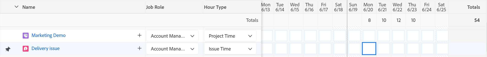
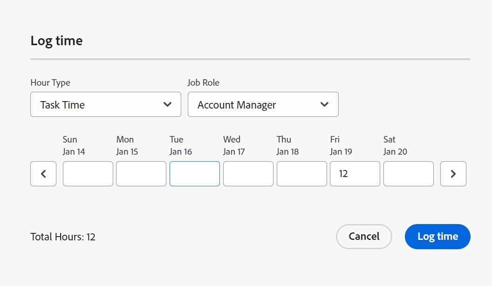
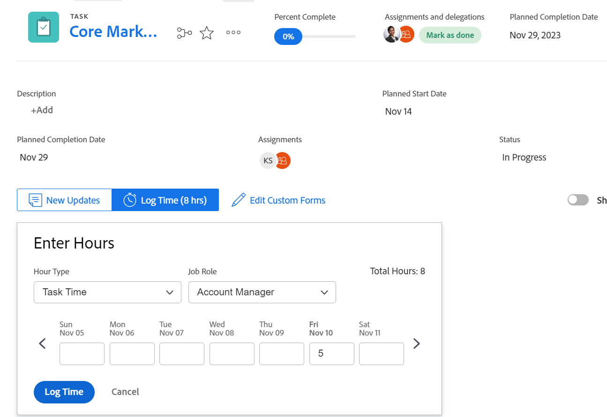

# Zeit erfassen

<!--Audited: 12/2023-->

<!--remove all preview and production references from this article with 23.3 release-->

<!--
The highlighted information on this page refers to functionality not yet generally available. It is available only in the Preview environment for all customers. After the monthly releases to Production, the same features are also available in the Production environment for customers who enabled fast releases.   
For information about fast releases, see [Enable or disable fast releases for your organization](../../administration-and-setup/set-up-workfront/configure-system-defaults/enable-fast-release-process.md). 

For information about the current release schedule, see [Fourth Quarter 2023 release overview](../../product-announcements/product-releases/23-q4-release-activity/23-q4-release-overview.md) 
-->

Sie können die Arbeitszeit für Arbeitselemente in Adobe Workfront protokollieren, um die Anzahl der Arbeitsstunden anzugeben, die Sie damit verbringen. Sie können auch Zeit protokollieren, die nicht mit der Arbeit in Zusammenhang steht, wie Urlaub, Krankheitszeit oder Zeit, die Sie in Meetings verbringen. Die Login-Zeit wird in Ihrem Timesheet angezeigt.

Weitere Informationen zu den Stunden, die Sie in Workfront anmelden können, finden Sie unter [Verwalten von Stundentypen](../../administration-and-setup/set-up-workfront/configure-timesheets-schedules/hour-types.md).

## Zugriffsanforderungen

+++ Erweitern Sie , um die Zugriffsanforderungen für die Funktionalität in diesem Artikel anzuzeigen.

Sie müssen über folgenden Zugriff verfügen, um die Schritte in diesem Artikel auszuführen und projektspezifische Stunden zu protokollieren:

<table style="table-layout:auto"> 
 <col> 
 <col> 
 <tbody> 
  <tr> 
   <td role="rowheader">Adobe Workfront-Abo</td> 
   <td> 
Alle
 </td> 
  </tr> 
  <tr> 
   <td role="rowheader">Adobe Workfront-Lizenz</td> 
   <td> 
Neu: 

   
Leicht oder höher, um Stunden für ein Projekt, eine Aufgabe, ein Problem oder allgemeine Stunden auf einem Zeitblatt zu protokollieren

   
Aktuell: 
   <ul><li>Überprüfen oder höher zur Protokollierung der allgemeinen Stunden in einem Zeitblatt</li>
   <li>Arbeiten oder höher zur Protokollierung von Stunden in einem Projekt, einer Aufgabe oder einem Problem</li></ul> </td> 
  </tr> 
  <tr> 
   <td role="rowheader">Konfigurationen auf Zugriffsebene</td> 
   <td> 
Bearbeiten Sie den Zugriff auf den Typ des Arbeitselements, für den Sie die Zeit protokollieren 
 
Beispielsweise benötigen Sie Zugriff auf Probleme bearbeiten, um die Zeit für Probleme zu protokollieren.
 </td> 
  </tr> 
  <tr> 
   <td role="rowheader">Objektberechtigungen</td> 
   <td> 
Contribute oder höhere Berechtigungen für das Arbeitselement, für das Sie die Zeit protokollieren, einschließlich Berechtigungen für Protokollzeiten
 </td> 
  </tr> 
 </tbody> 
</table>

Weitere Informationen zu den Informationen in dieser Tabelle finden Sie unter [Zugriffsanforderungen in der Workfront-Dokumentation](/help/quicksilver/administration-and-setup/add-users/access-levels-and-object-permissions/access-level-requirements-in-documentation.md).

+++

## Überlegungen zur Protokollierung in Workfront

* Sie können die Zeit für Projekte, Aufgaben oder Probleme protokollieren oder die Zeit direkt in Ihrem Timesheet protokollieren.

  Weitere Informationen zum Erstellen von Timesheets finden Sie unter [Erstellen eines Zeitplans für die einmalige Verwendung](../../timesheets/create-and-manage-timesheets/create-tmshts.md).

* Alle Zeitangaben, die mit anderen Werkzeugen als dem Timesheet protokolliert werden, werden im Zeitblatt für den entsprechenden Zeitraum angezeigt.
* Aufgaben und Probleme in einem nicht aktuellen Projekt werden nicht vorab in ein Timesheet eingefügt.
* Die im Timesheet protokollierte Zeit wird sofort auf die Aufgabe, das Problem oder das Projekt angewendet.
* Timesheets enthalten die Gesamtdauer für alle protokollierten Daten. Wochenenden werden immer eingeschlossen, auch wenn Timeline-Berechnungen so konfiguriert wurden, dass sie ausgeschlossen werden (wie unter [Systemweite Projekteigenschaften konfigurieren](../../administration-and-setup/set-up-workfront/configure-system-defaults/set-project-preferences.md) beschrieben).
* Die maximale Anzahl der in einem Zeitblatt angezeigten Elemente beträgt 45. Wenn mehr als 45 Elemente vorhanden sind, deren Daten mit dem Zeitrahmen des Zeitblatts übereinstimmen, werden nur die zuletzt aktualisierten Elemente angezeigt.
* Stündliche Einträge, die in abgerechneten Rechnungsdatensätzen enthalten sind, werden abgeblendet dargestellt und können nicht im Timesheet bearbeitet werden. Weitere Informationen finden Sie unter [Erstellen von Rechnungsdatensätzen](../../manage-work/projects/project-finances/create-billing-records.md).
* Persönliche Aufgaben werden nicht standardmäßig im Timesheet angezeigt. Persönliche Aufgaben werden nur dann im Timesheet angezeigt, wenn sie über eine längere Zeit protokolliert wurden. Nachdem Sie die Zeit für eine persönliche Aufgabe protokolliert haben, können Sie die Aufgabe in das Timesheet einbinden und es bleibt auf dem Timesheet, wenn es fixiert bleibt. Weitere Informationen finden Sie unter [Erstellen von Arbeitselementen aus dem Startbereich](../../workfront-basics/using-home/using-the-home-area/create-work-items-in-home.md).

## Zeit erfassen {#log-time-section}

Sie können die Zeit in den folgenden Bereichen in Workfront protokollieren:

* [Zeitblatt](#timesheet)
* [Startseite](#home)
* [Projekt, Aufgabe oder Problem](#project-task-or-issue)
* [Bedienfeld „Zusammenfassung“](#summary-panel)
* [Pinnwände](#boards)
* [Mobile App](#mobile-app)

### Arbeitszeittabelle {#timesheet}

#### Login-Zeit auf einem Zeitblatt {#log-time-on-a-timesheet}

Sie können die Zeit auf die folgenden Elemente im Timesheet protokollieren:

* Vorausgefüllte Aufgaben, Probleme und Projekte, die automatisch angezeigt werden, je nachdem, wie Ihr Workfront-Administrator die Timesheet-Voreinstellungen festlegt. Informationen dazu, wie Timesheets vorausgefüllt werden, finden Sie unter [Konfigurieren von Voreinstellungen für Zeitblätter und Stunden](../../administration-and-setup/set-up-workfront/configure-timesheets-schedules/timesheet-and-hour-preferences.md).

  Nur die Ihnen zugewiesenen Aufgaben und Probleme werden vorab in Ihr Timesheet eingefügt. Aufgaben und Probleme, die Ihren Teams oder Auftragsrollen zugewiesen sind, werden nicht automatisch in Ihr Arbeitsblatt eingefügt.

  Wenn Sie auf Bearbeiten für ein Ihrer Teams zugewiesenes Element klicken, wird das Element Ihnen zugewiesen und das Element wird in Ihrem Zeitblatt angezeigt.

* Aufgaben, Probleme oder Projekte, die Sie manuell hinzufügen.
* Aufgaben, Probleme oder Projekte, für die Sie bereits an anderer Stelle in Workfront angemeldet haben.
* Allgemeine Zeit (Urlaub, Schulung, Betriebszeit).

>[!NOTE]
>
>Überprüfungsbenutzer, die einem Timesheet-Profil zugewiesen sind, können den Bereich &quot;Timesheets&quot;anzeigen und allgemeine Stunden protokollieren. Sie können jedoch keine Stunden für Aufgaben oder Probleme protokollieren, die ihnen auf dem Timesheet zugewiesen werden.

So protokollieren Sie die Zeit auf einem Timesheet:

{{step1-click-main-menu}}

1. Klicken Sie auf [!UICONTROL **Timesheets**]. Ihr aktuelles Timesheet wird standardmäßig angezeigt.
   

1. (Optional) Klicken Sie auf das Symbol **Vollbild** , um das Timesheet im Vollbildmodus anzuzeigen, und klicken Sie dann auf das Symbol **Vollbild verlassen**  , um zum Timesheet zurückzukehren.

   <!-- drafted for the resize columns in timesheet story: 1. (optional) Click on the separator lines between weeks or between the time frame area and the work item area to resize the columns of the timesheet.-->

1. (Optional) Um ein Projekt, eine Aufgabe oder ein Problem zum Timesheet hinzuzufügen, klicken Sie auf das Dropdown-Menü **Element hinzufügen** in der oberen linken Ecke des Zeitblatts und klicken Sie dann auf **Projekte hinzufügen**, **Aufgaben hinzufügen** oder **Probleme hinzufügen**.

   Eine Liste mit Projekten, Aufgaben oder Problemen wird angezeigt.

   <!--drafted for full screen mode for add projects story - align it with the rest of the steps when you enable this:: 1. (Optional) Click the **full-screen** icon  to display the list of objects in full-screen mode.-->

1. (Optional) Klicken Sie auf das Suchsymbol  , um mithilfe eines Suchbegriffs, der zum Zeitblatt hinzugefügt werden soll, nach einem bestimmten Element zu suchen.

1. (Optional) Erweitern Sie die Dropdown-Menüs Filter, Ansicht oder Gruppierung, um sie anzuwenden oder anzupassen und um die gewünschten Elementinformationen anzuzeigen.

1. Wählen Sie ein oder mehrere Elemente in der Liste aus und klicken Sie dann auf **Hinzufügen**.

   Wenn Sie weniger als 50 Elemente gleichzeitig hinzugefügt haben, werden die Elemente zum Timesheet hinzugefügt. Aufgaben und Probleme werden unter dem Namen des Projekts aufgelistet.

   >[!NOTE]
   >
   >Wenn Sie Aufgaben oder Probleme zum Timesheet hinzufügen, wird das Projekt ebenfalls hinzugefügt.

1. (Bedingt) Wenn Sie 50 oder mehr Elemente gleichzeitig hinzufügen, wird eine Bestätigungsmeldung angezeigt, die die Anzahl der zu Ihrem Zeitblatt hinzugefügten Elemente anzeigt.

   Klicken Sie auf **Alle hinzufügen** , um alle Elemente hinzuzufügen.
Oder
Klicken Sie auf **Abbrechen** , um das Hinzufügen der ausgewählten Elemente abzubrechen, und dann auf **Abbrechen** , um die Liste der Elemente zu schließen.

   Aufgaben und Probleme werden unter dem Namen des Projekts aufgelistet.

   >[!NOTE]
   >
   >Die Elemente, die Sie manuell zum Timesheet hinzufügen, werden fixiert und bleiben auf den aktuellen und zukünftigen Timesheets erhalten, bis Sie sie manuell entschlüsseln, um sie zu entfernen. Informationen zum Entschlüsseln von Elementen, um sie aus dem Timesheet zu entfernen, erhalten Sie, wenn Sie mit Schritt 10 fortfahren.

   <!--(ensure this stays accurate)-->

1. (Optional) Klicken Sie auf die Symbole **Reduzieren**  oder **Erweitern**  neben dem Projektnamen, um die Liste der Aufgaben und Probleme für das Projekt ein- oder auszublenden.

   >[!TIP]
   >
   >   Drücken Sie bei Verwendung einer standardmäßigen QWERTY-Tastatur und nach dem Klicken auf den Namen eines Projekts im Timesheet die folgenden Tasten, um das Projekt zu reduzieren oder zu erweitern:
   >   * So erweitern Sie das Projekt und zeigen seine Arbeitselemente an:
   >     * Umschalttaste + Alt + Nach-oben-Taste für Windows-Computer
   >     * Umschalttaste + Wahltaste + Nach-oben-Taste für Mac-Computer
   >   * So reduzieren Sie das Projekt und blenden seine Arbeitselemente aus:
   >     * Umschalt + Alt + Abwärtspfeil für Windows-Computer
   >     * Umschalttaste + Wahltaste + Abwärtspfeil für Mac-Computer.

1. (Optional) Wenn Sie ein Element, das automatisch auf dem Timesheet angezeigt wird, manuell veröffentlichen möchten, halten Sie den Mauszeiger über den Namen des Elements und klicken Sie dann auf das Symbol **pin** .

   >[!TIP]
   >
   >   Drücken Sie bei Verwendung einer standardmäßigen QWERTY-Tastatur nach dem Klicken auf ein Element im Zeitblatt den folgenden Tastensatz, um ein Element anzuheften:
   >   * Option + P für Windows- und Mac-Computer.

1. (Optional) Klicken Sie auf das Suchsymbol  und beginnen Sie mit der Eingabe eines Suchbegriffs, um ein Projekt, eine Aufgabe oder ein Problem auf dem Zeitblatt zu finden.

1. (Bedingt) Wenn Ihr Workfront- oder Gruppenadministrator die Einstellung **Manuelles Zuweisen von Vorgangsrollen zu Stundeneinträgen** aktiviert hat, wählen Sie im Dropdownmenü eine Auftragsrolle aus. Die Rolle, die beim Zuweisen zum Arbeitselement angegeben wird, wird standardmäßig angezeigt. Wenn Ihnen keine Rolle für das Objekt zugewiesen wurde, wird Ihre Primäre Rolle als Standard angezeigt. Weitere Informationen zu dieser Einstellung finden Sie im Artikel [Konfigurieren von Voreinstellungen für das Zeitblatt und die Stunde](../../administration-and-setup/set-up-workfront/configure-timesheets-schedules/timesheet-and-hour-preferences.md).

   

1. (Optional) Klicken Sie auf das Symbol &quot;**+**&quot;, um eine weitere Zeile hinzuzufügen, und wählen Sie dann aus dem Dropdown-Menü in der Spalte [!UICONTROL Stündentyp] einen neuen Stundentyp aus, um die Zeit für einen anderen Stundentyp zu protokollieren.

   

   >[!TIP]
   >
   >   Drücken Sie je nach Betriebssystem oder Browser und bei Verwendung einer standardmäßigen QWERTY-Tastatur den folgenden Tastensatz, um eine weitere Zeile hinzuzufügen:
   >   * Strg + Wahltaste + + + für Windows-Computer
   >   * Befehl + Wahltaste + + für Mac-Computer

   Stündungstypen sind verfügbar, je nachdem, was auf System-, Projekt- und Benutzerebene definiert wurde, wie in [Definieren Sie die Stündentypen und -verfügbarkeit](define-hour-types-and-availability.md) beschrieben.

   Der Stundentyp kann nach dem Schließen eines Zeitblatts nicht mehr geändert werden.

   >[!TIP]
   >
   >Wenn Sie zuvor die Zeit protokolliert haben und der von Ihnen ausgewählte Stundentyp jetzt deaktiviert ist, wird die gesamte Zeile für die protokollierte Zeit abgeblendet angezeigt. Wenn Sie einen anderen Stundentyp auswählen und die Seite aktualisieren, wird die Option für den deaktivierten Stundentyp aus der Dropdownliste entfernt, sodass Sie diesem Stundentyp keine zusätzlichen Stunden hinzufügen können.
   >
   >Erwägen Sie, eine neue Zeile für das Arbeitselement hinzuzufügen, für das Sie zusätzliche Zeit protokollieren möchten, und einen neuen Stundentyp auszuwählen, wenn Sie den deaktivierten Stundentyp beibehalten möchten, der mit der letzten protokollierten Zeit verknüpft ist.

1. Klicken Sie auf das Symbol **Löschen**  neben der Auftragsrolle, um sie zu entfernen. Jede für die Rolle protokollierte Zeit wird ebenfalls entfernt.

   >[!TIP]
   >
   >   Drücken Sie je nach Betriebssystem oder Browser und bei Verwendung einer standardmäßigen QWERTY-Tastatur den folgenden Tastensatz, um eine Zeile zu löschen:
   >   * Strg + Wahltaste + - für Windows-Computer
   >   * Befehl + Wahltaste + - für Mac-Computer

1. Geben Sie im Zeitleistensegment-Bereich des Zeitplans an, wie lange Sie sich an einem bestimmten Tag anmelden möchten, und klicken Sie dann außerhalb des Stundenfelds, um den Stundeneintrag zu speichern. Die Stunden werden automatisch gespeichert. Die Zeile, für die Sie die Protokollzeit festlegen, wird hellblau hervorgehoben und das Feld für die Stundeneingabe ist dunkelblau dargestellt.

   

   Sie melden die Zeit entweder in Stunden oder Tagen an. Diese Einstellung wird von Benutzern mit einer Planungslizenz oder vom Systemadministrator konfiguriert, wie unter [Konfigurieren, ob die Zeit in Stunden oder Tagen protokolliert wird](../../timesheets/config-timesheet-prefs/config-time-logged-hrs-days.md) beschrieben.

   >[!IMPORTANT]
   >
   >Wenn eines der folgenden Szenarien eintritt, müssen Sie das Timesheet manuell speichern:
   >
   >* Die Auftragsrolle, die mit der Zeit verknüpft ist, die Sie zuvor angemeldet haben, hat sich geändert und die Einstellung **Manuelles Zuweisen von Auftragsrollen zu Stundeneinträgen** wurde deaktiviert. Die Protokollierungszeit für neue Datumswerte ordnet sie einer anderen Auftragsrolle zu.
   >   
   >   Wenn die Rolle geändert wurde und die Einstellung **Auftragsrollen manuell zu Stundeneinträgen zuweisen** aktiviert ist, können Sie die Zeit protokollieren oder die Rolle aktualisieren. Ihre Änderungen werden automatisch gespeichert.
   >
   >* Die einer Aufgabe oder einem Problem zugewiesene Auftragsrolle unterscheidet sich von der Auftragsrolle, die der Timesheet-Eigentümer bei der Protokollierung der Zeit mit <!--or assigned to them_ this last  piece came from a Support note but but sure what role it's referring to. Leaving it out for now.--> verwendet.
   >
   >Das Timesheet speichert die Zeit automatisch, wenn zwischen den beiden Rollen keine Einträge mehr in Konflikt stehen.
   >

1. (Optional) Geben Sie die Zeitdauer im Feld Überstunden in der Kopfzeile des Zeitblatts an.

   >[!TIP]
   >
   >Es ist nicht möglich, eine größere Anzahl von Überstunden als die aktuellen Gesamtstunden auf dem Zeitblatt zu protokollieren. Wenn Sie beispielsweise bisher 7 Stunden auf dem Timesheet angemeldet haben, können Sie keine 8 Stunden Überstunden protokollieren.

1. (Optional) Klicken Sie auf **Kommentar** , um einen Kommentar für Ihren Stundeneintrag hinzuzufügen.

   

   >[!TIP]
   >
   >   Wenn Sie eine standardmäßige QWERTY-Tastatur verwenden, nachdem Sie auf das Stundeneingabefeld geklickt haben, drücken Sie die folgenden Tasten, um das Kommentarfeld zu öffnen:
   >   * Umschalt + F2 für Windows- und Mac-Computer.

1. Klicken Sie auf **Fertig** , um den Kommentar zu speichern.

   >[!TIP]
   >
   >   Wenn Sie eine standardmäßige QWERTY-Tastatur verwenden, drücken Sie innerhalb des Kommentarfelds die folgenden Tasten, um den Kommentar zu speichern:
   >   * Strg + Eingabetaste für Windows-Computer.
   >   * Befehl + Rückgabe für Mac-Computer.

1. (Optional) Klicken Sie in der Symbolleiste auf **Kommentare anzeigen** , um Kommentare zu Stundeneinträgen unter dem Arbeitselement anzuzeigen.

   

   >[!TIP]
   >
   >   Alle Änderungen, die Sie am Timesheet vornehmen, werden automatisch gespeichert.

1. (Optional) Klicken Sie auf die Zeile einer Aufgabe oder eines Problems und klicken Sie dann oben rechts im Arbeitsblatt auf **Zusammenfassung öffnen** , um eine Aktualisierung hinzuzufügen oder Informationen über die Aufgabe oder das Problem zu aktualisieren. Das Bedienfeld &quot;Zusammenfassung&quot;wird rechts geöffnet.

   

   Ihre Aktualisierung wird im Bereich Updates des Arbeitselements angezeigt, das der protokollierten Zeit zugeordnet ist.

   >[!TIP]
   >
   >Sie können keine Kommentare zu Projekten oder Einträgen zur allgemeinen Zeit erstellen.

1. Klicken Sie auf [!UICONTROL **Zusammenfassung schließen**] , um das Bedienfeld &quot;Zusammenfassung&quot;zu schließen und zum Timesheet zurückzukehren.

1. (Optional) Klicken Sie im linken Bereich auf [!UICONTROL **Aktualisierungen**] und fügen Sie dann eine Aktualisierung zum Timesheet hinzu. Weitere Informationen zu Workfront-Aktualisierungen finden Sie unter [Funktionsweise aktualisieren](../../workfront-basics/updating-work-items-and-viewing-updates/update-work.md).

   

1. (Optional) Kehren Sie zum Bereich **Timesheet** zurück, um Ihr Timesheet zu schließen oder zu senden.

   * **Schließen**: Schließen Sie das Timesheet, wenn Sie es aktualisiert haben. Diese Option ist nur verfügbar, wenn Ihr Timesheet keinem Genehmiger zugeordnet ist.

   * **Zur Genehmigung übermitteln:** Diese Option ist nur verfügbar, wenn ein Genehmiger auf dem Timesheet vorhanden ist. Speichern Sie Ihre Änderungen und übermitteln Sie sie zur Genehmigung. Wenn noch keine Genehmigung erteilt wurde, können Sie das Timesheet öffnen, nachdem Sie es geschlossen haben, indem Sie auf **Erinnern** klicken. Weitere Informationen finden Sie unter [Zeitblatt zur Genehmigung einreichen](../../timesheets/create-and-manage-timesheets/submit-timesheet-for-approval.md).

   * **Ablehnen**: Diese Option wird angezeigt, wenn Sie Timesheet-Genehmiger sind und das Timesheet zur Genehmigung übermittelt wurde. Wenn Sie darauf klicken, wird der Status des Zeitblatts in Abgelehnt geändert und das Zeitblatt bleibt geöffnet.

   * **Genehmigen**: Diese Option wird angezeigt, wenn Sie Timesheet-Genehmiger sind und das Timesheet zur Genehmigung übermittelt wurde. Wenn Sie darauf klicken, ändert sich der Status des Timesheets in Genehmigt und das Timesheet wird geschlossen.

   >[!TIP]
   >
   >Die Optionen Ablehnen und Genehmigen werden auch dann auf Ihrem Timesheet angezeigt, wenn Sie Systemadministrator sind und das Timesheet mit einem Genehmiger verknüpft ist.

1. (Bedingt) Wenn Sie das Datenblatt geschlossen oder zur Genehmigung eingereicht haben, wählen Sie eine der folgenden Optionen aus:

   * **Erneut öffnen**: Diese Option ist für Timesheets verfügbar, die Sie bereits geschlossen haben und die keine Genehmiger oder Timesheets haben, die bereits genehmigt wurden. Öffnen Sie das Timesheet erneut, um die Stundeneinträge zu ändern.
   * **Erinnerung**: Diese Option ist für Zeitpläne verfügbar, die zur Genehmigung eingereicht, aber noch nicht genehmigt oder abgelehnt wurden. Klicken Sie auf **Recall** , um das Zeitblatt erneut zu öffnen und die Stundeneinträge zu ändern.

#### Entfernen eines Elements aus dem Timesheet

Sie können einen Stundeneintrag oder ein Element (Projekt, Aufgabe oder Problem) aus einem Timesheet entfernen.

So entfernen Sie einen Stundeneintrag aus einem Timesheet:

1. Gehen Sie zum Timesheet und suchen Sie nach dem Stundeneintrag, den Sie entfernen möchten.
1. Ersetzen Sie die eingegebenen Stunden durch 0.
Oder
Entfernen Sie die Stunden, ersetzen Sie sie durch 0 und drücken Sie dann die Eingabetaste.

   Die Stunden werden entfernt und das Timesheet wird automatisch gespeichert.

Sie können ein Element (Projekt, Aufgabe oder Problem) aus dem Timesheet entfernen, indem Sie es wieder aufheben, wenn Sie noch keine Zeit dafür protokolliert haben und wenn Sie das Element manuell hinzugefügt haben (wie in den Schritten 4 bis 8 im Abschnitt [Protokollzeit auf einem Timesheet](#log-time-on-a-timesheet) in diesem Artikel beschrieben). <!--ensure this stays accurate-->

Sie können keine Elemente entfernen, die gemäß den Timesheet-Voreinstellungen in Ihrem Workfront-System oder Ihrer-Gruppe automatisch im Timesheet enthalten sind und so konfiguriert sind, dass die Timesheets vorbelegt werden (wie unter [Zeitblatt- und Stundeneinstellungen konfigurieren](../../administration-and-setup/set-up-workfront/configure-timesheets-schedules/timesheet-and-hour-preferences.md) beschrieben). Die Elemente werden nicht mehr vorausgefüllt, wenn die Daten der Elemente außerhalb des Zeitrahmens des Zeitblatts liegen.

So entfernen Sie ein manuell hinzugefügtes Element aus dem Timesheet:

1. Stellen Sie sicher, dass keine Zeit für das Element protokolliert wird.
1. Klicken Sie auf das Symbol **Entpolieren**  neben dem Element, um die Bindung des Elements aus dem Zeitblatt aufzuheben.

   >[!TIP]
   >
   >   Drücken Sie bei Verwendung einer standardmäßigen QWERTY-Tastatur nach dem Klicken auf ein Element im Timesheet die folgenden Tasten, um die Bindung eines Elements aufzuheben:
   > * Option + P für Windows- und Mac-Computer.

   Das Element wird aus dem Timesheet entfernt, nachdem Sie die Seite aktualisiert haben.

### Startseite {#home}

Sie können projektspezifische Zeit auf der Startseite protokollieren.

Allgemeine Informationen zur Verwendung des Startbereichs finden Sie in den folgenden Abschnitten:

* Weitere Informationen zur Verwendung des veralteten Home-Bereichs finden Sie unter [Verwenden des Home-Bereichs](../../workfront-basics/using-home/using-the-home-area/use-the-home-area.md).
* Informationen zur Verwendung des neuen Startbereichs finden Sie unter [Erste Schritte mit der neuen Startseite](../../workfront-basics/using-home/new-home/get-started-with-new-home.md).

#### Protokollierung der Zeit eines Arbeitselements aus dem neuen Startbereich

Sie können die Zeit für Aufgaben und Probleme in einem der Widgets über das Bedienfeld &quot;Zusammenfassung&quot;im Bereich &quot;Startseite&quot;protokollieren. Weitere Informationen finden Sie im Abschnitt [Zusammenfassungsbereich](#summary-panel) in diesem Artikel.

Außerdem, um die Zeit für ein Element im Widget Meine Arbeit zu protokollieren:

1. Wechseln Sie zum Bereich **Home** .
1. Fügen Sie das Widget **Meine Arbeit** zu Ihrer Startseite hinzu.
1. (Optional) Wählen Sie eine Aufgabe, ein Problem oder eine Anforderung in einer Liste aus und klicken Sie dann auf **Bearbeiten**
1. Bewegen Sie den Mauszeiger über die Aufgabe oder das Problem, für die Sie die Zeit protokollieren möchten, und klicken Sie dann rechts neben den Aufgabeninformationen auf das Symbol **Protokollzeit**  .

   

1. Klicken Sie auf **Protokollzeit**.

   Die protokollierte Zeit wird im Bereich Stunden des Objekts und in Ihrem Zeitblatt angezeigt.

#### Protokollieren der Zeit für ein Arbeitselement aus dem alten Startbereich

1. Wählen Sie im Bereich **Arbeitsliste** das Element aus, in dem Sie die Zeit protokollieren möchten.
1. Klicken Sie im rechten Bereich auf **Protokollzeit**.

   

1. Wählen Sie im Dropdownmenü **Stunden eingeben** den entsprechenden Stundentyp aus.\
   Stündungstypen sind verfügbar, je nachdem, was auf System-, Projekt- und Benutzerebene definiert wurde, wie in [Definieren Sie die Stündentypen und -verfügbarkeit](../../timesheets/create-and-manage-timesheets/define-hour-types-and-availability.md) beschrieben.
1. (Bedingt) Wenn Ihr Workfront- oder Gruppenadministrator die Einstellung **Manuelles Zuweisen von Vorgangsrollen zu Stundeneinträgen** aktiviert hat, wählen Sie im Dropdownmenü eine Auftragsrolle aus. Die Rolle, die beim Zuweisen zum Arbeitselement angegeben wird, wird standardmäßig angezeigt. Wenn Ihnen keine Rolle für das Objekt zugewiesen wurde, wird Ihre Primäre Rolle als Standard angezeigt. Weitere Informationen zu dieser Einstellung finden Sie im Artikel [Konfigurieren von Voreinstellungen für das Zeitblatt und die Stunde](../../administration-and-setup/set-up-workfront/configure-timesheets-schedules/timesheet-and-hour-preferences.md).
1. Geben Sie die Zeit für die Protokollierung an und klicken Sie dann auf **Protokollzeit**.

   Die protokollierte Zeit wird im Bereich Stunden des Objekts und in Ihrem Zeitblatt angezeigt.

### Projekt, Aufgabe oder Problem {#project-task-or-issue}

Sie können projektspezifische Zeit für ein Projekt, eine Aufgabe oder ein Problem in den folgenden Abschnitten protokollieren:

* [Aktualisierungsabschnitt](#updates-section)
* [Stundenabschnitt](#hours-section)

#### Abschnitt „Aktualisierungen“{#updates-section}

Um die Zeit im Abschnitt Updates eines Projekts, einer Aufgabe oder eines Problems zu protokollieren, müssen Sie über Folgendes verfügen:

* Die richtigen Zugriffs- und Berechtigungen, wie im Abschnitt [Zugriffsanforderungen](#access-requirements) in diesem Artikel beschrieben.

* Der Workfront-Administrator muss die Einstellung Protokollzeit direkt für Projekte unter [!UICONTROL **Timesheet &amp; Hours**]> [!UICONTROL **Voreinstellungen**] im Systembereich aktivieren, wenn Sie die Zeit direkt in einem Projekt protokollieren möchten.

  Weitere Informationen dazu, wie Sie Benutzern erlauben, Stunden direkt in Projekten zu protokollieren, finden Sie unter [Konfigurieren von Voreinstellungen für Zeitblätter und Stunden](../../administration-and-setup/set-up-workfront/configure-timesheets-schedules/timesheet-and-hour-preferences.md).

So protokollieren Sie die Zeit im Abschnitt &quot;Aktualisierungen&quot;eines Projekts, einer Aufgabe oder eines Problems:

1. Wechseln Sie zu einem Projekt, einer Aufgabe oder einem Problem.
1. Wählen Sie im linken Bereich **Aktualisierungen** aus.
1. Klicken Sie auf **Protokollzeit**. <!-- did Anna B change the casing for this button? If yes and if she changed it for the other areas, update screen shot too-->

   Das Dialogfeld Protokollzeit wird angezeigt.

   >[!TIP]
   >
   >   Wenn die Voreinstellung Ihres Profils auf die Protokollzeit in Tagen festgelegt ist, wird das Feld Tage eingeben angezeigt.
   >   
   >   Oben rechts im Feld Tage eingeben gibt es einen Hinweis darauf, wie viele Stunden ein Tag beinhaltet.

   

1. Geben Sie die folgenden Informationen an:

   * **Stündentyp**: Wählen Sie aus dem Dropdown-Menü einen Stündentyp aus, wenn dieser sich von dem standardmäßig angezeigten unterscheidet.

     Je nachdem, welche Stundentypen in Ihrem System konfiguriert sind, können die Optionen hier variieren. Weitere Informationen zum Konfigurieren von Stundentypen finden Sie unter [Festlegen von Stundentypen und Verfügbarkeit](../../timesheets/create-and-manage-timesheets/define-hour-types-and-availability.md).

   * **Auftragsrolle**: (Bedingt) Wenn Ihr Workfront- oder Gruppenadministrator die Einstellung **Auftragsrollen manuell zu Stundeneinträgen zuweisen** aktiviert hat, wählen Sie eine **Auftragsrolle** aus dem Dropdownmenü aus. Die Rolle, die beim Zuweisen zum Objekt angegeben wird, wird standardmäßig angezeigt. Wenn Ihnen keine Rolle für das Objekt zugewiesen wurde, wird Ihre Primäre Rolle als Standard angezeigt. Weitere Informationen zu dieser Einstellung finden Sie im Artikel [Konfigurieren von Voreinstellungen für das Zeitblatt und die Stunde](../../administration-and-setup/set-up-workfront/configure-timesheets-schedules/timesheet-and-hour-preferences.md).

   * **Stunden**: Geben Sie die Anzahl der Stunden für das Projekt, die Aufgabe oder das Problem ein.

1. Klicken Sie auf **Protokollzeit**.

   Die protokollierte Zeit wird im Bereich Stunden des Objekts und in Ihrem Zeitblatt angezeigt.

#### Stundenabschnitt{#hours-section}

Sie müssen ein Workfront-Administrator sein, um die Zeit für Projekte, Aufgaben und Probleme im Abschnitt Stunden zu protokollieren.

Oder

Sie müssen über Folgendes verfügen:

* Eine Planungslizenz mit administrativem Zugriff auf Timesheets und Stunden. Weitere Informationen zum Gewähren des administrativen Zugriffs auf Timesheets und Stunden finden Sie unter [Gewähren des administrativen Zugriffs von Benutzern auf bestimmte Bereiche](../../administration-and-setup/add-users/configure-and-grant-access/grant-users-admin-access-certain-areas.md).
* Contribute oder höhere Berechtigungen für das Projekt mit Zugriff auf Protokollzeiten. Weitere Informationen zum Gewähren von Berechtigungen für Projekte finden Sie unter [Freigeben eines Projekts in Adobe Workfront](../../workfront-basics/grant-and-request-access-to-objects/share-a-project.md).
* Wenn Sie die Zeit direkt in einem Projekt protokollieren möchten, muss Ihr Workfront-Administrator die Einstellung &quot;Log time on projects&quot;im Bereich **Timesheet &amp; Hours > Voreinstellungen** des Einrichtungsbereichs aktivieren. Weitere Informationen dazu, wie Sie Benutzern erlauben, Stunden direkt in Projekten zu protokollieren, finden Sie unter [Konfigurieren von Voreinstellungen für Zeitblätter und Stunden](../../administration-and-setup/set-up-workfront/configure-timesheets-schedules/timesheet-and-hour-preferences.md).

So melden Sie die Zeit im Abschnitt Stunden eines Projekts, einer Aufgabe oder eines Problems an:

1. Wechseln Sie zu einem Projekt, einer Aufgabe oder einem Problem.
1. Klicken Sie im linken Bereich auf **Stunden**.
1. Klicken Sie auf **Protokollzeit**.

   Das Dialogfeld Protokollzeiten wird angezeigt.

1. Geben Sie die folgenden Informationen an:

   * **Inhaber:** Ihr Name wird standardmäßig in diesem Feld angezeigt.\
     Wenn Sie die Stunden für einen anderen Benutzer protokollieren, geben Sie dessen Namen an.

   * **Stündentyp**: Wählen Sie aus dem Dropdown-Menü einen Stündentyp aus, wenn dieser sich von dem standardmäßig angezeigten unterscheidet.

     Je nachdem, welche Stundentypen in Ihrem System konfiguriert sind, können die Optionen hier variieren. Weitere Informationen zum Konfigurieren von Stundentypen finden Sie unter [Festlegen von Stundentypen und Verfügbarkeit](../../timesheets/create-and-manage-timesheets/define-hour-types-and-availability.md).

   * **Auftragsrolle**: (Bedingt) Wenn Ihr Workfront- oder Gruppenadministrator die Einstellung **Auftragsrollen manuell zu Stundeneinträgen zuweisen** aktiviert hat, wählen Sie eine **Auftragsrolle** aus dem Dropdownmenü aus. Die Rolle, die beim Zuweisen zum Objekt angegeben wird, wird standardmäßig angezeigt. Wenn Ihnen keine Rolle für das Objekt zugewiesen wurde, wird Ihre Primäre Rolle als Standard angezeigt. Weitere Informationen zu dieser Einstellung finden Sie im Artikel [Konfigurieren von Voreinstellungen für das Zeitblatt und die Stunde](../../administration-and-setup/set-up-workfront/configure-timesheets-schedules/timesheet-and-hour-preferences.md).

     
   * **Stunden**: Geben Sie die Anzahl der Stunden für das Projekt, die Aufgabe oder das Problem ein.

1. Klicken Sie auf **Protokollzeit**.

### Bedienfeld „Zusammenfassung“

Sie können die Zeit für Aufgaben und Probleme im Bereich &quot;Zusammenfassung&quot;protokollieren.
Weitere Informationen finden Sie unter [Übersicht der Zusammenfassung](../../workfront-basics/the-new-workfront-experience/summary-overview.md).

### Pinnwände {#boards}

Sie können die Zeit auf verbundenen Karten auf einer Workfront-Pinnwand protokollieren. Dies entspricht dem Protokollierungszeitpunkt für eine Aufgabe oder ein Problem und die auf der Karte protokollierten Stunden werden für die verbundene Aufgabe oder das Problem gespeichert.
Weitere Informationen finden Sie unter [Verwenden Sie verbundene Karten auf Pinnwänden](/help/quicksilver/agile/get-started-with-boards/connected-cards.md).

### Mobile App {#mobile-app}

Sie können die Zeit über die mobile Workfront-App protokollieren.
Weitere Informationen finden Sie unter [Adobe Workfront für Android](/help/quicksilver/workfront-basics/mobile-apps/using-the-workfront-mobile-app/workfront-for-android.md) oder [Adobe Workfront für iOS](/help/quicksilver/workfront-basics/mobile-apps/using-the-workfront-mobile-app/workfront-for-ios.md).

## Protokollstunden in Listen und Berichten bearbeiten

>[!CAUTION]
>
>* Sie können keine Stundeneinträge ändern, die zu einem geschlossenen Zeitblatt gehören. Sie müssen zunächst das Timesheet erneut öffnen und dann die Informationen zur Stundeneingabe ändern.
>* Wenn Sie den Typ Stunde von einem Typ ändern, der nicht als Umsatz gezählt wird, in einen anderen Typ, der als Umsatz zählt, treten auch Änderungen an den Finanzen des Projekts auf. Wenn Sie die Stündentypen von einem Typ ändern, der als Umsatz zählt, in einen Typ, der nicht als Umsatz gezählt wird, werden auch die Finanzen des Projekts aktualisiert.
>
>Weitere Informationen finden Sie unter [Verwalten von Stundentypen](/help/quicksilver/administration-and-setup/set-up-workfront/configure-timesheets-schedules/hour-types.md).
>

Sie können die protokollierten Stunden in den folgenden Bereichen bearbeiten:

* Alle Bereiche, in denen Sie die Stunden hinzugefügt haben, einschließlich geöffneter Zeitpläne
* Stündliche Listen und Berichte.

Sie können die folgenden Elemente eines Stundeneintrags bearbeiten, wenn Sie einen Stundeneintrag in einer Liste oder einem Bericht bearbeiten:

* Anzahl Stunden
* Stundentyp
* Mit dem Stundeneintrag verknüpfte Auftragsrolle

Je nachdem, welchen Typ von Stundeneinträgen Sie bearbeiten, stehen die folgenden Felder zur Bearbeitung zur Verfügung:

* Wenn Sie projektspezifische Stunden bearbeiten:

   * Sie können die Anzahl der Stunden bearbeiten.
   * Sie können den Stundentyp nur in projektspezifische Typen ändern.
   * Sie können die Zuweisung der Stundenrolle &quot;Auftrag&quot;nur ändern, wenn sie im Setup aktiviert war. Weitere Informationen finden Sie unter [Konfigurieren der Voreinstellungen für das Zeitblatt und die Stunde](/help/quicksilver/administration-and-setup/set-up-workfront/configure-timesheets-schedules/timesheet-and-hour-preferences.md)

* Wenn Sie die allgemeinen Stunden bearbeiten:

   * Sie können die Anzahl der Stunden bearbeiten.
   * Sie können den Typ Stunde nur in allgemeine Typen ändern.
   * Sie können die Zuweisung der Stundenrolle &quot;Auftrag&quot;nicht ändern, da allgemeine Stunden nicht mit Rollen verknüpft werden können.

* Wenn Sie eine Mischung aus allgemeinen und projektspezifischen Stunden in großen Mengen bearbeiten:

   * Sie können die Anzahl der Stunden bearbeiten.
   * Sie können den Stundentyp nicht ändern, da allgemeine Stundentypen nicht in projektspezifische Typen geändert werden können und projektspezifische Stundentypen nicht in allgemeine Typen geändert werden können.
   * Sie können die Aufgabenrollenzuweisung nicht ändern, da allgemeine Stunden nicht mit Rollen verknüpft werden können.
