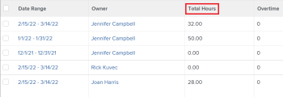

# Anzeigen der Gesamtstunden in einer Arbeitszeittabelle

<!--Audited: 8/2024-->

Sie können die Gesamtzahl der Stunden auf Ihrer Arbeitszeittabelle anzeigen. Die Gesamtzahl der Arbeitszeittabellen-Stunden umfasst die für Projekte, Aufgaben, Probleme protokollierten Stunden sowie alle allgemeinen Stunden.

Die Gesamtstunden spiegeln die Stunden wider, die über die Arbeitszeittabelle, den Bereich „Aktualisierungen“ oder für Projekte, Aufgaben oder Probleme im Bereich „Stunden“ eingereicht wurden.

## Zugriffsanforderungen

+++ Erweitern, um die Zugriffsanforderungen für die in diesem Artikel beschriebene Funktionalität anzuzeigen. 

<table style="table-layout:auto"> 
 <col> 
 <col> 
 <tbody> 
  <tr> 
   <td>Adobe Workfront-Paket</td> 
   <td> 
Beliebig
 </td> 
  </tr> 
  <tr> 
   <td>Adobe Workfront-Lizenz</td> 
   <td> 
Licht oder höher 

   
Überprüfen oder höher
 </td> 
  </tr> 
  <tr> 
   <td>Konfiguration der Zugriffsebene</td> 
   <td> 
Zugriff auf Aufgaben und Probleme anzeigen oder erhöhen
 </td> 
  </tr> 
  <tr> 
   <td>Objektberechtigungen</td> 
   <td> 
Anzeigen oder Erweitern von Berechtigungen für Aufgaben und Probleme
 </td> 
  </tr> 
 </tbody> 
</table>

Weitere Informationen finden Sie unter [Zugriffsanforderungen](/help/quicksilver/administration-and-setup/add-users/access-levels-and-object-permissions/access-level-requirements-in-documentation.md) in der Dokumentation zu Workfront.

+++

## Die Gesamtstunden einer Arbeitszeittabelle in der Kopfzeile der Arbeitszeittabelle anzeigen

Die Gesamtstunden einer Arbeitszeittabelle können Sie in der Kopfzeile der Arbeitszeittabelle einsehen.

## Zeigen Sie die Gesamtstunden auf Ihrer Arbeitszeittabelle in einer Liste von Arbeitszeittabellen an

{{step1-to-timesheets}}

Der Bereich **Arbeitszeittabellen** wird geöffnet.

1. (Optional) Führen Sie einen der folgenden Schritte aus, um den Filter in der Liste der Arbeitszeittabellen zu aktualisieren:

   * Wählen Sie **Meine Arbeitszeittabellen-Genehmigungen** in der rechten oberen Ecke der Seite aus, um nur die von Ihnen genehmigten Arbeitszeittabellen anzuzeigen

     ODER

     Wählen Sie **Meine Arbeitszeittabellen** aus, um nur Ihre Arbeitszeittabellen anzuzeigen.

     Dadurch werden die Filter Meine Arbeitszeittabellen-Genehmigungen oder Meine Arbeitszeittabellen auf die Liste der Arbeitszeittabellen angewendet.

     

   * Klicken Sie auf das Filtersymbol  , um einen anderen Filter anzuwenden, oder erstellen Sie einen neuen. Informationen zum Erstellen oder Aktualisieren von Filtern finden Sie unter [Erstellen oder Bearbeiten von Filtern in Adobe Workfront](../../reports-and-dashboards/reports/reporting-elements/create-filters.md).

   >[!NOTE]
   >
   >Die Optionen Meine Arbeitszeittabellen-Genehmigungen und Meine Arbeitszeittabellen werden nicht oben in der Arbeitszeittabellen-Liste oder in der Filterliste angezeigt, wenn Workfront-Admins oder Gruppenadmins die Filter Meine Arbeitszeittabellen und Meine Arbeitszeittabellen entweder aus den Listensteuerelementen im Setup-Bereich oder aus Ihrer Layoutvorlage entfernt haben. Weitere Informationen finden Sie in den folgenden Artikeln:
   >
   >   
   >   
   >   * [Anpassen von Filtern, Ansichten und Gruppierungen mithilfe einer Layout-Vorlage](../../administration-and-setup/customize-workfront/use-layout-templates/customize-fvg-list-controls-layout-template.md)
   >   
   >

1. (Optional) Klicken Sie auf **Ansicht**  oder **Gruppierung** , um eine andere Ansicht oder Gruppierung anzuwenden oder eine neue zu erstellen.

   Informationen zum Erstellen von Filtern, Ansichten oder Gruppierungen finden Sie in den folgenden Artikeln:

   * [Erstellen oder Bearbeiten von Filtern in Adobe Workfront](../../reports-and-dashboards/reports/reporting-elements/create-filters.md)
   * [Erstellen oder Bearbeiten von Ansichten in Adobe Workfront](../../reports-and-dashboards/reports/reporting-elements/create-edit-views.md)
   * [Erstellen von Gruppierungen in Adobe Workfront](../../reports-and-dashboards/reports/reporting-elements/create-groupings.md)

1. Die Gesamtstundenzahl für jede Arbeitszeittabelle wird in der Spalte **Gesamtstunden** angezeigt.

   

   >[!TIP]
   >
   >Bei Verwendung der Standardansicht für eine Liste von Arbeitszeittabellen wird die Spalte Gesamtstunden rot angezeigt, wenn die für die Elemente in der Arbeitszeittabelle protokollierte Zeit die Anzahl der Stunden im Zeitrahmen der Arbeitszeittabelle überschreitet. Weitere Informationen finden Sie im Feld „Gesamtstunden“ im [Glossar der Adobe Workfront-](../../workfront-basics/navigate-workfront/workfront-navigation/workfront-terminology-glossary.md).
