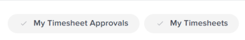

# Gesamtstunden auf dem Timesheet anzeigen

Sie können die Gesamtanzahl der Stunden auf Ihrem Timesheet anzeigen. Die Gesamtanzahl der Timesheet-Stunden umfasst die protokollierten Stunden für Projekte, Aufgaben, Probleme und alle allgemeinen Stunden.

Die Gesamtstunden beziehen sich auf Stunden, die über das Timesheet, den Bereich Updates oder im Bereich Stunden für Projekte, Aufgaben oder Probleme gesendet wurden.

## Zugriffsanforderungen

Sie müssen über folgenden Zugriff verfügen, um die Schritte in diesem Artikel ausführen zu können:

<table style="table-layout:auto"> 
 <col> 
 <col> 
 <tbody> 
  <tr> 
   <td role="rowheader">Adobe Workfront-Plan*</td> 
   <td> 
Alle
 </td> 
  </tr> 
  <tr> 
   <td role="rowheader">Adobe Workfront-Lizenz*</td> 
   <td> 
Überprüfung 
 </td> 
  </tr> 
  <tr> 
   <td role="rowheader">Konfigurationen auf Zugriffsebene*</td> 
   <td> 
Zugriff oder höher auf Aufgaben und Probleme anzeigen
 
Wenn Sie immer noch keinen Zugriff haben, fragen Sie Ihren Workfront-Administrator, ob er zusätzliche Zugriffsbeschränkungen für Ihre Zugriffsebene festlegt. Informationen dazu, wie ein Workfront-Administrator Ihre Zugriffsebene ändern kann, finden Sie unter <a href="../../administration-and-setup/add-users/configure-and-grant-access/create-modify-access-levels.md" class="MCXref xref">Benutzerdefinierte Zugriffsebenen erstellen oder ändern</a>.
 </td> 
  </tr> 
  <tr> 
   <td role="rowheader">Objektberechtigungen</td> 
   <td> 
Anzeigen oder Höhere Berechtigungen für Aufgaben und Probleme
 
Weitere Informationen zum Anfordern von zusätzlichem Zugriff finden Sie unter <a href="../../workfront-basics/grant-and-request-access-to-objects/request-access.md" class="MCXref xref">Anfordern des Zugriffs auf Objekte </a>.
 </td> 
  </tr> 
 </tbody> 
</table>

*Wenden Sie sich an Ihren Workfront-Administrator, um zu erfahren, welchen Plan oder welchen Lizenztyp Sie haben.

## Gesamtstunden eines Zeitblatts in der Kopfzeile des Zeitblatts anzeigen

Sie können die Gesamtstunden eines Zeitblatts in der Kopfzeile des Zeitblatts anzeigen.

## Anzeigen der Gesamtstunden auf Ihrem Timesheet in einer Liste von Timesheets

1. Klicken Sie auf das Symbol **Hauptmenü** oben rechts in Adobe Workfront und klicken Sie dann auf **Timesheets**.  Der Filter &quot;**Alle**&quot; ist standardmäßig ausgewählt und zeigt alle Timesheets an, auf die Sie Zugriff haben.

   

1. (Optional) Führen Sie einen der folgenden Schritte aus, um den Filter in der Liste der Timesheets zu aktualisieren:

   * Wählen Sie oben rechts auf der Seite die Option **My Timesheet Approvals** aus, um nur die von Ihnen genehmigten Zeitpläne anzuzeigen

     Oder

     Wählen Sie **Meine Timesheets** aus, um nur Ihre Timesheets anzuzeigen.

     Dadurch wird die Liste der Timesheets mit den Filtern My Timesheet Approvals oder My Timesheet aktualisiert.

     

   * Klicken Sie auf das Filtersymbol  , um einen anderen Filter anzuwenden, oder erstellen Sie einen neuen. Informationen zum Erstellen oder Aktualisieren von Filtern finden Sie unter [Erstellen oder Bearbeiten von Filtern in Adobe Workfront](../../reports-and-dashboards/reports/reporting-elements/create-filters.md).

   >[!NOTE]
   >
   >Die Optionen Meine Timesheet-Genehmigungen und Meine Timesheets werden nicht oben in der Timesheet-Liste oder in der Filterliste angezeigt, wenn Ihr Workfront-Administrator oder ein Gruppenadministrator die Filter Meine Timesheet-Genehmigungen und Meine Timesheets entweder aus den Listen-Steuerelementen im Bereich Einrichtung oder aus Ihrer Layout-Vorlage entfernt hat. Weitere Informationen finden Sie in den folgenden Artikeln:
   >
   >   
   >   
   >   * [Anpassen von Filtern, Ansichten und Gruppierungen mithilfe einer Layoutvorlage](../../administration-and-setup/customize-workfront/use-layout-templates/customize-fvg-list-controls-layout-template.md)
   >   
   >

1. (Optional) Klicken Sie auf die Symbole **Ansicht**  oder **Gruppierung**  , um eine andere Ansicht oder Gruppierung anzuwenden oder eine neue zu erstellen.

   Informationen zum Erstellen von Filtern, Ansichten oder Gruppierungen finden Sie in den folgenden Artikeln:

   * [Erstellen oder Bearbeiten von Filtern in Adobe Workfront](../../reports-and-dashboards/reports/reporting-elements/create-filters.md)
   * [Erstellen oder Bearbeiten von Ansichten in Adobe Workfront](../../reports-and-dashboards/reports/reporting-elements/create-edit-views.md)
   * [Erstellen von Gruppierungen in Adobe Workfront](../../reports-and-dashboards/reports/reporting-elements/create-groupings.md)

1. Die Gesamtstundenzahl für jedes Zeitblatt wird in der Spalte **Gesamtstunden** angezeigt.

   

   >[!TIP]
   >
   >Bei Verwendung der Standardansicht für eine Liste von Timesheets wird die Spalte Gesamtstunden in Rot angezeigt, wenn die für die Elemente auf dem Timesheet protokollierte Zeit die Anzahl der Stunden im Zeitrahmen des Zeitblatts überschreitet. Weitere Informationen finden Sie im Feld &quot;Gesamtstunden&quot;im [Glossar der Adobe Workfront-Terminologie](../../workfront-basics/navigate-workfront/workfront-navigation/workfront-terminology-glossary.md).
