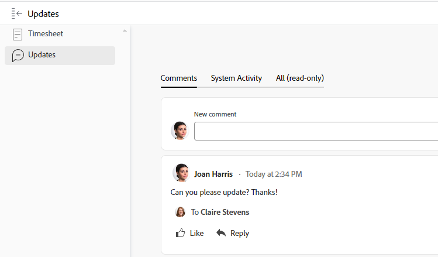
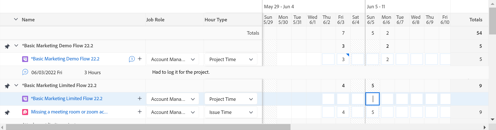

# Übersicht über das Datenblatt

<!-- Audited: 12/2023 -->

<!--The highlighted information on this page refers to functionality not yet generally available. It is available only in the Preview environment for all customers or in Production for customers who enabled fast releases. 

For information about fast releases, see [Enable or disable fast releases for your organization](/help/quicksilver/administration-and-setup/set-up-workfront/configure-system-defaults/enable-fast-release-process.md).

For information about the current release schedule, see [Second Quarter 2024 release overview](/help/quicksilver/product-announcements/product-releases/24-q2-release-activity/24-q2-release-overview.md).-->

In diesem Artikel wird das Layout von Timesheets in Adobe Workfront beschrieben, sodass Sie besser verstehen können, wie Sie Timesheets zur Aufzeichnung der Zeit anpassen und nutzen können.

Die Voreinstellungen für Zeitblätter und Stunden steuern, was auf einem Zeitblatt angezeigt wird. Dieser Artikel bietet einen Überblick über alle verfügbaren Optionen. Informationen zur Auswahl der Optionen finden Sie unter [Konfigurieren der Voreinstellungen für das Zeitblatt und die Stunde](../../administration-and-setup/set-up-workfront/configure-timesheets-schedules/timesheet-and-hour-preferences.md).

Informationen zum Protokollieren der Zeit in einem Zeitblatt finden Sie unter [Protokollzeit](../../timesheets/create-and-manage-timesheets/log-time.md).

Im Folgenden finden Sie die Bereiche eines Zeitplans:

* [Header des Datenblatts](#timesheet-header)
* [Das linke Bedienfeld](#the-left-panel)
* [Arbeitselemente](#work-items)
* [Symbolleiste](#toolbar)
* [Fußzeile des Datenblatts](#timesheet-footer)
* [Auftragsrolle](#job-role)
* [Stundentyp](#hour-type)
* [Aktualisierungsbereich im linken Bereich](#updates-area-in-the-left-panel)
* [Bedienfeld „Zusammenfassung“](#summary-panel)
* [Zeitrahmen und Einstiegsbereich (Stunde)](#time-frame-and-hour-entry-area)
* [Kommentare zu stündlichen Einträgen](#hour-entry-comments)
* [Stunden](#hours)
* [Gesamtwerte](#totals)

## Header des Datenblatts

Der Header des Zeitplans enthält die folgenden Informationen:

* Der Zeitrahmen des Zeitplans.
* Der Bereich Aktionen , der Folgendes umfasst:
   * Ein Sternsymbol, mit dem Sie die Timesheets zu Ihrer Favoritenliste hinzufügen können.
   * Klicken Sie auf das Symbol Mehr mit der Option Löschen , um das Datenblatt zu löschen.
* Der Name des Eigentümers des Zeitblatts.
* Die Gesamtzahl der Stunden für die protokollierten Elemente, die im Timesheet angezeigt werden.
* Die Anzahl der Überstunden. Dies ist ein manueller Eintrag, der nur sichtbar ist, wenn die Einstellung **Overtime** auf einem Zeitblatt aktiviert ist. Weitere Informationen finden Sie unter [Informationen zum Timesheet bearbeiten](../create-and-manage-timesheets/edit-timesheets.md).

>[!TIP]
>
>Es ist nicht möglich, eine größere Anzahl von Überstunden als die aktuellen Gesamtstunden auf dem Zeitblatt zu protokollieren. Wenn Sie beispielsweise bisher 7 Stunden auf dem Timesheet angemeldet haben, können Sie keine 8 Stunden Überstunden protokollieren.

* Der Status des Zeitplans.

## Das linke Bedienfeld

Sie können auf die folgenden Abschnitte im linken Bereich zugreifen:

* **Timesheet**: Zeigt das tatsächliche Timesheet an.
* **Aktualisierungen**: Zeigt Kommentare und Systemaktualisierungen für das Timesheet an. Weitere Informationen finden Sie im Abschnitt [Updates im linken Bereich](#updates-area-in-the-left-panel) in diesem Artikel.

## Arbeitselemente

Die Arbeitselemente sind die Projekte, Aufgaben und Probleme, für die Sie die Zeit protokollieren möchten. Durch Klicken auf den nach unten zeigenden Pfeil in der Kopfzeile werden die Projekte sowie die darunter aufgeführten Aufgaben und Probleme ausgeblendet. Durch Klicken auf den nach unten zeigenden Pfeil neben dem Namen eines Projekts werden die Arbeitselemente für dieses Projekt ausgeblendet.

Aufgaben, Probleme und Projekte, bei denen die Zeit außerhalb des Zeitplans aufgezeichnet wird, oder im Zeitrahmen des Zeitplans geplante Elemente werden hier automatisch angezeigt.

## Symbolleiste

Die Symbolleiste enthält die folgenden Optionen:

* Die Schaltfläche **Element hinzufügen** , mit der Sie Projekte, Aufgaben oder Probleme hinzufügen können.
* Über das Schnellfiltersymbol können Sie nach Aufgaben oder Problemen im Timesheet suchen.
* Mit der Einstellung **Kommentare anzeigen** können Sie Stundenkommentare anzeigen oder ausblenden, die für Projekt-, Aufgaben- oder Problemstundeneinträge protokolliert werden.
* Das Symbol für den Vollbildmodus, um das Timesheet im Vollbildmodus anzuzeigen.
* Über die Schaltfläche **Zusammenfassung öffnen** (oder **Zusammenfassung schließen**) können Sie das Bedienfeld &quot;Zusammenfassung&quot;öffnen oder schließen, um zusätzliche Informationen zu Aufgaben oder Problemen anzuzeigen. Diese Schaltfläche steht nicht für Projekte zur Verfügung.

Weitere Informationen finden Sie unter [Protokollzeit](../create-and-manage-timesheets/log-time.md).

## Fußzeile des Datenblatts

Sie können in diesem Bereich auf die Schaltflächen &quot;**Zur Genehmigung übermitteln**&quot;, &quot;**Schließen**&quot;, &quot;**Genehmigen**&quot;und &quot;**Ablehnen**&quot;klicken, um eine Timesheet-Genehmigung zu schließen oder abzulehnen.

Dieser Bereich enthält auch Informationen darüber, wann das Timesheet zuletzt gespeichert wurde. Alle Änderungen, die Sie an den Informationen im Timesheet vornehmen, werden automatisch gespeichert.

## Aufgabengebiet

Sie können eine andere Auftragsrolle auswählen, um sie den Stundeneinträgen zuzuordnen. Ihr Workfront-Administrator muss die Einstellung **Auftragsrollen den Stundeneinträgen zuweisen** manuell aktivieren. Die bei der Zuweisung zur Aufgabe angegebene Auftragrolle bzw. das Problem wird standardmäßig angezeigt. Wenn Ihnen für die Aufgabe oder das Problem keine Rolle zugewiesen wurde, wird Ihre Primäre Rolle als Standard angezeigt. Weitere Informationen finden Sie unter [Konfigurieren der Voreinstellungen für das Zeitblatt und die Stunde](../../administration-and-setup/set-up-workfront/configure-timesheets-schedules/timesheet-and-hour-preferences.md).

Sie können mehrere Stundeneinträge für dasselbe Arbeitselement für verschiedene Rollen protokollieren. Weitere Informationen finden Sie unter [Protokollzeit](../create-and-manage-timesheets/log-time.md).

## Stundentyp

Sie können für jedes Element verschiedene Stundentypen auswählen, die mit Ihren Stundeneinträgen verknüpft werden sollen. Dieses Feld wird nur angezeigt, wenn der Workfront-Administrator es für Ihre Umgebung aktiviert hat. Weitere Informationen finden Sie unter [Konfigurieren der Voreinstellungen für das Zeitblatt und die Stunde](../../administration-and-setup/set-up-workfront/configure-timesheets-schedules/timesheet-and-hour-preferences.md).

Sie können mehrere Stundeneinträge für dasselbe Arbeitselement für verschiedene Stundentypen protokollieren. Weitere Informationen finden Sie unter [Protokollzeit](../create-and-manage-timesheets/log-time.md).

## Aktualisierungsbereich im linken Bereich

Im Bereich Updates im linken Bereich des Timesheets können Sie Kommentare zu einem Timesheet abgeben, um mit Ihren Timesheet-Genehmigern oder anderen Benutzern zu kommunizieren.

Alle auf dem Zeitblatt abgegebenen Kommentare werden in diesem Bereich angezeigt.

## Bedienfeld „Zusammenfassung“

Sie können auf das Bedienfeld Zusammenfassung für Aufgaben oder Probleme zugreifen, die in einem Zeitblatt angezeigt werden. Hier können Sie sich zu Aufgaben und Problemen äußern oder deren Informationen aktualisieren. Weitere Informationen finden Sie unter [Übersicht der Zusammenfassung](../../workfront-basics/the-new-workfront-experience/summary-overview.md).

Die Kommentare, die Sie für Arbeitselemente im Bereich &quot;Zeitblatt-Zusammenfassung&quot;eingeben, werden im Bereich &quot;Updates&quot;der Aufgabe oder des Problems angezeigt. Das Bedienfeld Zusammenfassung ist nicht für Projekte verfügbar.

## Zeitrahmen und Einstiegsbereich (Stunde)

Der Zeitrahmen des Zeitplans wird rechts neben den Arbeitselementen angezeigt.

Sie können Timesheets für eine, zwei oder vier Wochen erstellen.

Der Zeitrahmen wird in vollen Wochenschritten angezeigt. Tage außerhalb des angegebenen Zeitrahmens werden abgeblendet angezeigt. Sie können die Zeit nicht für Tage protokollieren, die außerhalb des Zeitrahmens des Zeitblatts liegen.

Weitere Informationen finden Sie unter [Erstellen eines Einzelverwendungs-Timesheets](../create-and-manage-timesheets/create-tmshts.md) oder [Erstellen, Bearbeiten und Zuweisen von Timesheet-Profilen](../create-and-manage-timesheets/create-timesheet-profiles.md).

<!--drafted for the resize columns in timesheets story - make this blurb a TIP when the story is released: 
You can resize the columns that display different weeks, the time frame, or the work item areas by dragging and dropping the vertical lines that separate them.-->

## Kommentare zu stündlichen Einträgen

Sie können einen Kommentar für jeden Stundeneintrag hinzufügen, den Sie zu Ihrem Timesheet hinzufügen.

Die Kommentare, die Sie in das Kommentarfeld für die Stundeneingabe eingeben, werden im Timesheet unter jedem Arbeitselement angezeigt, bei dem Sie protokolliert haben, wann die Einstellung **Kommentare anzeigen** in der Symbolleiste aktiviert ist.

## Stunden

Das Timesheet enthält Eingabefelder für jedes Arbeitselement und jeden Tag des Zeitblattes, um die mit der Bearbeitung des Artikels verbrachte Zeit aufzuzeichnen. Während Sie die Zeit protokollieren, wird das Element, das Sie die Zeit für Highlights in hellblau protokollieren, und das Stundenfeld in dunkelblau dargestellt.

## Gesamtwerte

Überprüfen Sie die Summe aller Stunden, die auf dem Timesheet eingegeben wurden, zusammengefasst nach Tag (in der Kopfzeile des Timesheets) sowie nach Objekt (in der letzten Spalte).
