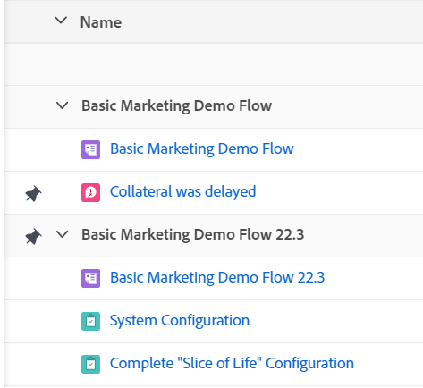
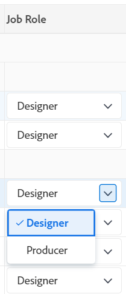

# Arbeitszeittabellen-Layout - Übersicht

<!-- Audited: 12/2023 -->

<!--The highlighted information on this page refers to functionality not yet generally available. It is available only in the Preview environment for all customers or in Production for customers who enabled fast releases. 

For information about fast releases, see [Enable or disable fast releases for your organization](/help/quicksilver/administration-and-setup/set-up-workfront/configure-system-defaults/enable-fast-release-process.md).

For information about the current release schedule, see [Second Quarter 2024 release overview](/help/quicksilver/product-announcements/product-releases/24-q2-release-activity/24-q2-release-overview.md).-->

In diesem Artikel wird das Layout von Arbeitszeittabellen in Adobe Workfront beschrieben, sodass Sie besser verstehen können, wie Sie Arbeitszeittabellen anpassen und verwenden können, um die Zeit aufzuzeichnen.

Arbeitszeittabelle und Stundeneinstellungen steuern, was auf einer Arbeitszeittabelle angezeigt wird. Dieser Artikel bietet einen Überblick über alle verfügbaren Optionen. Informationen zur Auswahl der Optionen finden Sie unter [Konfigurieren von Arbeitszeittabellen- und Stundeneinstellungen](../../administration-and-setup/set-up-workfront/configure-timesheets-schedules/timesheet-and-hour-preferences.md).

Informationen zum Protokollieren der Zeit auf einer Arbeitszeittabelle finden Sie unter [Zeit protokollieren](../../timesheets/create-and-manage-timesheets/log-time.md).

Im Folgenden finden Sie die Bereiche einer Arbeitszeittabelle:

* [Arbeitszeittabellen-Kopfzeile](#timesheet-header)
* [Das linke Bedienfeld](#the-left-panel)
* [Arbeitselemente](#work-items)
* [Symbolleiste](#toolbar)
* [Fußzeile für Arbeitszeittabelle](#timesheet-footer)
* [Aufgabengebiet](#job-role)
* [Stundentyp](#hour-type)
* [Bereich „Aktualisierungen“ im linken Bereich](#updates-area-in-the-left-panel)
* [Bedienfeld „Zusammenfassung“](#summary-panel)
* [Zeitrahmen und Stundeneingabebereich](#time-frame-and-hour-entry-area)
* [Kommentare zu Stundeneinträgen](#hour-entry-comments)
* [Stunden](#hours)
* [Gesamt](#totals)

## Arbeitszeittabellen-Kopfzeile

Die Arbeitszeittabellen-Kopfzeile enthält die folgenden Informationen:

* Der Zeitrahmen der Arbeitszeittabelle.
* Der Bereich Aktionen , der Folgendes umfasst:
   * Ein Sternsymbol zum Hinzufügen der Arbeitszeittabellen zur Favoritenliste.
   * Das Symbol Mehr mit der Option Löschen , mit der Sie die Arbeitszeittabelle löschen können.
* Der Name des Besitzers der Arbeitszeittabelle.
* Die Gesamtstundenzahl für die protokollierten Stunden für Elemente, die in der Arbeitszeittabelle angezeigt werden.
* Die Anzahl der Überstunden. Dies ist ein manueller Eintrag und er ist nur sichtbar, wenn die Einstellung **Überstunden** in einer Arbeitszeittabelle aktiviert ist. Weitere Informationen finden Sie unter [Arbeitszeittabellen-Informationen bearbeiten](../create-and-manage-timesheets/edit-timesheets.md).

>[!TIP]
>
>Sie können keine größere Anzahl von Überstunden als die aktuelle Gesamtstundenzahl in der Arbeitszeittabelle protokollieren. Wenn Sie beispielsweise bisher 7 Stunden auf der Arbeitszeittabelle protokolliert haben, können Sie keine 8 Stunden Überstunden protokollieren.

* Der Status der Arbeitszeittabelle.

## Das linke Bedienfeld

Im linken Bereich stehen die folgenden Abschnitte zur Verfügung:

* **Arbeitszeittabelle**: Zeigt die tatsächliche Arbeitszeittabelle an.
* **Updates**: Zeigt Kommentare und Systemaktualisierungen für die Arbeitszeittabelle an. Weitere Informationen finden Sie [&#x200B; Abschnitt „Aktualisierungen“ im linken &#x200B;](#updates-area-in-the-left-panel) in diesem Artikel.

## Arbeitselemente

Die Arbeitselemente sind die Projekte, Aufgaben und Probleme, für die Sie Zeit protokollieren möchten. Durch Klicken auf den nach unten zeigenden Pfeil in der Kopfzeile werden die Projekte und die darunter aufgeführten Aufgaben und Probleme reduziert. Durch Klicken auf den nach unten zeigenden Pfeil neben dem Namen eines Projekts werden die Arbeitselemente für dieses Projekt reduziert.

Hier werden automatisch Aufgaben, Probleme und Projekte angezeigt, bei denen die Zeit außerhalb der Arbeitszeittabelle aufgezeichnet wird oder bei denen Elemente, die im Zeitrahmen der Arbeitszeittabelle geplant sind, automatisch angezeigt werden.

## Symbolleiste

Die Symbolleiste umfasst die folgenden Optionen:

* Die Schaltfläche **Element hinzufügen** mit der Sie Projekte, Aufgaben oder Probleme hinzufügen können.
* Über das Schnellfiltersymbol können Sie in der Arbeitszeittabelle nach Aufgaben oder Problemen suchen.
* Die Einstellung **Kommentare anzeigen** mit der Sie Stundenkommentare anzeigen oder ausblenden können, die für Projekt-, Aufgaben- oder Problemstundeneinträge protokolliert wurden.
* Das Vollbildsymbol zur Anzeige der Arbeitszeittabelle im Vollbildmodus.
* Mit **Schaltfläche „Zusammenfassung öffnen** (oder **Zusammenfassung schließen**) können Sie den Zusammenfassungsbereich öffnen oder schließen, um zusätzliche Informationen zu Aufgaben oder Problemen anzuzeigen. Diese Schaltfläche ist nicht für Projekte verfügbar.

Weitere Informationen finden Sie unter [Zeit erfassen](../create-and-manage-timesheets/log-time.md).

## Fußzeile für Arbeitszeittabelle

Sie können auf die **Zur Genehmigung einreichen**, **Schließen**, **Genehmigen** und **Ablehnen** klicken, um eine Arbeitszeittabellen-Genehmigung zu schließen oder abzulehnen.

Dieser Bereich enthält auch Informationen darüber, wann die Arbeitszeittabelle zuletzt gespeichert wurde. Alle Änderungen, die Sie an Informationen in der Arbeitszeittabelle vornehmen, werden automatisch gespeichert.

## Aufgabengebiet

Sie können ein anderes Aufgabengebiet auswählen, das mit den Stundeneinträgen verknüpft werden soll. Ihr Workfront-Administrator muss die Einstellung **Aufgabengebiete Stundeneinträgen zuweisen** manuell aktivieren. Das Aufgabengebiet, das für Sie beim Zuweisen zu der Aufgabe oder dem Problem angegeben wurde, wird standardmäßig angezeigt. Wenn Ihnen für die Aufgabe oder das Problem kein Aufgabengebiet zugewiesen wurde, wird standardmäßig das Primäre Aufgabengebiet angezeigt. Weitere Informationen finden Sie unter [Arbeitszeittabelle und Stundenvoreinstellungen konfigurieren](../../administration-and-setup/set-up-workfront/configure-timesheets-schedules/timesheet-and-hour-preferences.md).

Sie können mehrere Stundeneinträge für dasselbe Arbeitselement für verschiedene Rollen protokollieren. Weitere Informationen finden Sie unter [Zeit erfassen](../create-and-manage-timesheets/log-time.md).

## Stundentyp

Sie können verschiedene Stundentypen auswählen, um sie Ihren Stundeneinträgen für jedes Element zuzuordnen. Dieses Feld wird nur angezeigt, wenn es der Workfront-Administrator für Ihre Umgebung aktiviert hat. Weitere Informationen finden Sie unter [Konfigurieren von Arbeitszeittabellen- und Stundeneinstellungen](../../administration-and-setup/set-up-workfront/configure-timesheets-schedules/timesheet-and-hour-preferences.md).

Sie können mehrere Stundeneinträge für dasselbe Arbeitselement für verschiedene Stundentypen protokollieren. Weitere Informationen finden Sie unter [Zeit erfassen](../create-and-manage-timesheets/log-time.md).

## Bereich „Aktualisierungen“ im linken Bereich

Im Abschnitt Aktualisierungen im linken Bereich der Arbeitszeittabelle können Sie Kommentare zu einer Arbeitszeittabelle abgeben, um mit den genehmigenden Personen oder anderen Benutzern zu kommunizieren.

In diesem Bereich werden alle Kommentare angezeigt, die auf der Arbeitszeittabelle vorgenommen wurden.

## Bedienfeld „Zusammenfassung“

Sie können auf das Bedienfeld Zusammenfassung für Aufgaben oder Probleme zugreifen, die in einer Arbeitszeittabelle angezeigt werden. Hier können Sie Aufgaben und Probleme kommentieren oder ihre Informationen aktualisieren. Weitere Informationen finden Sie unter [Übersicht](../../workfront-basics/the-new-workfront-experience/summary-overview.md).

Die Kommentare, die Sie für Arbeitselemente im Zusammenfassungsbereich der Arbeitszeittabelle eingeben, werden im Bereich Aktualisierungen der Aufgabe oder des Problems angezeigt. Das Bedienfeld Zusammenfassung ist für Projekte nicht verfügbar.

## Zeitrahmen und Stundeneingabebereich

Der Zeitrahmen der Arbeitszeittabelle wird rechts neben den Arbeitselementen angezeigt.

Sie können Arbeitszeittabellen für eine, zwei oder vier Wochen erstellen.

Der Zeitrahmen wird in Schritten von ganzen Wochen angezeigt. Tage außerhalb des angegebenen Arbeitszeittabellen-Zeitrahmens werden abgeblendet. Die Zeit kann nicht für Tage protokolliert werden, die außerhalb des Zeitrahmens der Arbeitszeittabelle liegen.

Weitere Informationen finden [&#x200B; unter „Erstellen einer Arbeitszeittabelle für den einmaligen &#x200B;](../create-and-manage-timesheets/create-tmshts.md)&quot; oder [Erstellen, Bearbeiten und Zuweisen von Arbeitszeittabellen-Profilen](../create-and-manage-timesheets/create-timesheet-profiles.md).

<!--drafted for the resize columns in timesheets story - make this blurb a TIP when the story is released: 
You can resize the columns that display different weeks, the time frame, or the work item areas by dragging and dropping the vertical lines that separate them.-->

## Kommentare zu Stundeneinträgen

Sie können für jeden Stundeneintrag, den Sie Ihrer Arbeitszeittabelle hinzufügen, einen Kommentar hinzufügen.

Die Kommentare, die Sie im Kommentarfeld für Stundeneinträge eingeben, werden in der Arbeitszeittabelle unter jedem Arbeitselement angezeigt, bei dem Sie die Zeit erfasst haben, zu der die Einstellung **Kommentare anzeigen** in der Symbolleiste aktiviert ist.

## Stunden

Die Arbeitszeittabelle stellt Eingabefelder für jedes Arbeitselement und jeden Tag des Arbeitszeittabellenbereichs bereit, um die mit der Arbeit am Element verbrachte Zeit aufzuzeichnen. Während Sie die Zeit erfassen, wird das Element, das Sie für die Zeit für Hervorhebungen in hellblau und das Stundenfeld erfassen, in dunkelblau umrandet.

## Gesamt

Überprüfen Sie die Summe aller auf der Arbeitszeittabelle eingegebenen Stunden, zusammengefasst nach Tag (in der Kopfzeile der Arbeitszeittabelle) sowie nach Objekt (in der letzten Spalte).
