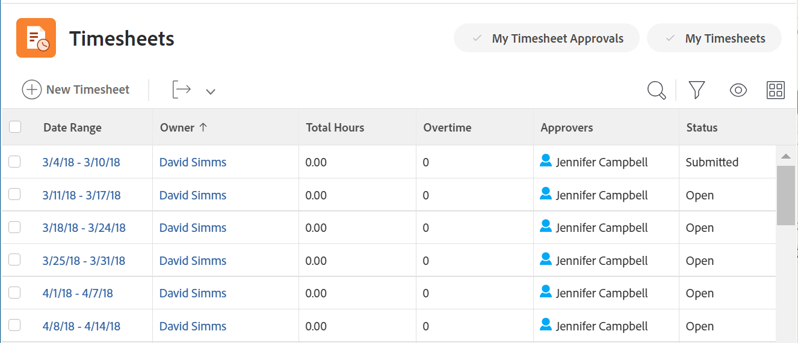

# Arbeitszeittabellen - Übersicht

<!-- Audited: 12/2023 -->

Sie können Arbeitszeittabellen verwenden, um die Zeit zu verfolgen, die Sie innerhalb und außerhalb von Adobe Workfront mit der Arbeit verbringen.

Sie können Projektzeit in Arbeitselementen wie Projekten, Aufgaben und Problemen protokollieren. Die für Aufgaben, Probleme und Projekte aufgezeichnete Zeit wird automatisch in Ihrer Arbeitszeittabelle angezeigt.

Sie können auch projektfremde Zeit für nicht arbeitsbezogene Elemente wie Meetings, Schulungen oder Zeit außerhalb des Büros direkt auf Ihrer Arbeitszeittabelle unter „Allgemeine Stunden“ protokollieren.

Weitere Informationen zum Protokollieren der Zeit in Workfront finden Sie unter [Zeit protokollieren](../../timesheets/create-and-manage-timesheets/log-time.md).

>[!TIP]
>
>Wenn Sie Workfront- oder Gruppenadministrator sind, können Sie Arbeitszeittabellen erstellen und sie mit Ihren Benutzenden verknüpfen. Informationen zum Erstellen von Arbeitszeittabellen finden Sie [Arbeitszeittabellen erstellen und verwalten: Artikelindex](../create-and-manage-timesheets/create-and-manage-timesheets.md).

## Verstehen der Projektzeit im Vergleich zur Nicht-Projektzeit

Arbeitszeittabellen bieten Benutzenden eine einfache Möglichkeit, die Zeit für projektbezogene und nicht projektbezogene Arbeit zu verfolgen:

* **Projektzeit:** direkt von der Aufgabe oder dem Projekt, in dem Sie die Zeit verfolgen möchten.

  Die über eine Arbeitszeittabelle aufgezeichneten Stunden für Aufgaben, Probleme und Projekte werden den jeweiligen Arbeitselementen zugeordnet, um den für Projekte und Aufgaben aufgewendeten Aufwand präzise darzustellen. Ohne genaue Zeiteingabe sind Ihre Daten möglicherweise nicht korrekt, wenn sie für Abrechnungszwecke vorgesehen sind.

  Wenn eine Ressource Stunden direkt für Aufgaben aufzeichnet, werden Probleme und Projekte außerdem automatisch angezeigt, wenn der Benutzer auf die Arbeitszeittabelle zugreift. Dabei wird davon ausgegangen, dass der Datumsbereich der Arbeitszeittabelle die Daten umfasst, an denen die Stunden aufgezeichnet wurden.

* **Zeit ohne Projekt:** Direkt auf der Arbeitszeittabelle des Benutzers. Weitere Informationen zum Tracking der Zeit in Workfront finden Sie unter   [Zeit erfassen](../../timesheets/create-and-manage-timesheets/log-time.md).

  Sie können auf einer Arbeitszeittabelle Urlaubszeiten, Krankenstunden, Stunden auf der Durchreise, Stunden mit der Reparatur oder Wartung von Geräten oder andere allgemeine Arbeitsstundentypen, die Sie erstellen möchten, aufzeichnen.

## Zugriff auf Arbeitszeittabellen im Bereich Arbeitszeittabellen

Der Bereich Arbeitszeittabellen ist standardmäßig für alle Benutzer verfügbar. Workfront-Admins können dies in der Layout-Vorlage nach Bedarf ändern. Weitere Informationen finden Sie unter [Anpassen des Hauptmenüs mithilfe einer Layout-Vorlage](/help/quicksilver/administration-and-setup/customize-workfront/use-layout-templates/customize-main-menu.md).

So greifen Sie auf eine Arbeitszeittabelle zu:

{{step1-to-timesheets}}

Alle Arbeitszeittabellen sowie Arbeitszeittabellen, auf die Sie standardmäßig zugreifen können, werden angezeigt. Weitere Informationen zum Arbeitszeittabellen-Layout in Adobe Workfront finden Sie unter [Arbeitszeittabellen-Layout - Übersicht](../../timesheets/timesheets/timesheet-layout.md).

1. Klicken Sie auf eine der folgenden Optionen oben rechts, um Ihre Arbeitszeittabellen anzuzeigen:

   * **Meine Arbeitszeittabellen**, um nur Ihre Arbeitszeittabellen anzuzeigen.

   

   * **Meine Arbeitszeittabellen-Genehmigungen**, um nur von Ihnen genehmigte Arbeitszeittabellen anzuzeigen.

     

1. (Optional) Aktualisieren Sie Ansicht, Filter und Gruppierung oben in der Liste der Arbeitszeittabellen. Weitere Informationen finden Sie unter [Berichterstellungselemente: Filter, Ansichten und Gruppierungen](../../reports-and-dashboards/reports/reporting-elements/reporting-elements-overview.md).

1. Klicken Sie auf **Datumsbereich** einer Arbeitszeittabelle, um sie zu öffnen.

   Jede Arbeitszeittabelle zeigt alle Aufgaben, Probleme und Projekte an, für die Sie Zeit protokolliert haben. In einer Arbeitszeittabelle werden auch bis zu 45 Aufgaben und Probleme angezeigt, die Ihnen zugewiesen sind und im Zeitrahmen der Arbeitszeittabelle Datumsangaben enthalten, für die Sie jedoch möglicherweise noch keine Zeit erfasst haben. Die 45 zuletzt aktualisierten Elemente werden für die Anzeige in der Arbeitszeittabelle ausgewählt.

   Weitere Informationen finden Sie unter [Arbeitszeittabelle und Stundenvoreinstellungen konfigurieren](../../administration-and-setup/set-up-workfront/configure-timesheets-schedules/timesheet-and-hour-preferences.md).
