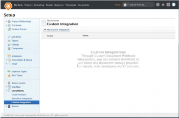

# Registrieren einer Webhook-Integration

Adobe Workfront-Administratoren können eine benutzerdefinierte Webhook-Integration für ihr Unternehmen hinzufügen, indem sie in Workfront zu Einrichtung > Dokumente > Benutzerdefinierte Integrationen navigieren. Auf der Seite „Benutzerdefinierte Integration“ im Setup können Admins eine Liste der vorhandenen Dokument-Webhook-Integrationen anzeigen. Auf dieser Seite können Integrationen hinzugefügt, bearbeitet, aktiviert und deaktiviert werden.

Um eine Integration hinzuzufügen, klicken Sie auf **Benutzerdefinierte Integration hinzufügen**.

## Verfügbare Felder

Beim Hinzufügen einer Integration gibt der Administrator Werte für die folgenden Felder ein.

<table style="table-layout:auto"> 
 <col> 
 <col> 
 <thead> 
  <tr> 
   <th>Feldname</th> 
   <th>Beschreibung</th> 
  </tr> 
 </thead> 
 <tbody> 
  <tr> 
   <td>Name</td> 
   <td>Der Name dieser Integration.</td> 
  </tr> 
  <tr> 
   <td>Basis-API-URL</td> 
   <td> 
Der Speicherort der Callback-API. Wenn Sie das externe System aufrufen, hängt Workfront einfach den Endpunktnamen an diese Adresse an. Wenn der Administrator beispielsweise die Basis-API-URL https://www.mycompany.com/api/v1 eingegeben hat, ruft Workfront die Metadaten eines Dokuments über die folgende URL ab: https://www.mycompany.com/api/v1/metadata?id=1234.
 </td> 
  </tr> 
  <tr> 
   <td>Anfrageparameter</td> 
   <td> 
Optionale Werte, die an die Abfragezeichenfolge eines jeden API-Aufrufs anzuhängen sind. Beispiel: access_type=offline. 
 </td> 
  </tr> 
  <tr> 
   <td>Authentifizierungstyp</td> 
   <td>OAuth2 oder API-Schlüssel</td> 
  </tr> 
  <tr> 
   <td>Authentifizierungs-URL</td> 
   <td> 
(Nur OAuth2) Die vollständige URL, die für die Benutzerauthentifizierung verwendet wird. Workfront führt Benutzer im Rahmen des OAuth-Bereitstellungsprozesses zu dieser Adresse. Hinweis: Workfront hängt einen „state“-Parameter an die Abfragezeichenfolge an. Der Anbieter muss dies zurück an Workfront übergeben, indem er es an den Workfront-Umleitungs-URI anhängt.
 </td> 
  </tr> 
  <tr> 
   <td>Token Endpoint URL</td> 
   <td> 
(Nur OAuth2) Die vollständige API-URL, die zum Abrufen von OAuth2-Token verwendet wird. Dies wird vom Webhook-Anbieter oder externen Dokumentanbieter gehostet
 </td> 
  </tr> 
  <tr> 
   <td>Client-ID</td> 
   <td>(Nur OAuth2) Die OAuth2-Client-ID für diese Integration</td> 
  </tr> 
  <tr> 
   <td>Geheimer Client-Schlüssel</td> 
   <td> 
(Nur OAuth2) Der geheime OAuth2-Client-Schlüssel für diese Integration
 </td> 
  </tr> 
  <tr> 
   <td>Workfront Redirect-URI</td> 
   <td>(Nur OAuth2) Dies ist ein schreibgeschütztes Feld, das von Workfront generiert wird. Dieser Wert wird verwendet, um diese Integration beim externen Dokumentanbieter zu registrieren. Hinweis: Wie oben für die Authentifizierungs-URL beschrieben, muss der Anbieter den Parameter „state“ und dessen Wert an die Abfragezeichenfolge anhängen, wenn er die Umleitung durchführt.</td> 
  </tr> 
  <tr> 
   <td>ApiKey</td> 
   <td> 
(Nur API-Schlüssel) Wird verwendet, um autorisierte API-Aufrufe an den Webhook-Anbieter durchzuführen. Der vom Webhook-Anbieter ausgegebene API-Schlüssel.
 </td> 
  </tr> 
 </tbody> 
</table>
