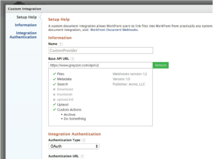

# Überblick über Webhooks

Adobe Workfront Document Webhooks definiert einen Satz von API-Endpunkten, über die Workfront autorisierte API-Aufrufe an einen externen Dokumentanbieter sendet. Dadurch kann jeder ein Middleware-Plug-in für einen beliebigen Dokumentspeicheranbieter erstellen.

Das Benutzererlebnis bei Webhook-basierten Integrationen ähnelt dem von vorhandenen Dokumentenintegrationen, z. B. Google Drive, Box und Dropbox. Beispielsweise kann ein Workfront-Benutzer die folgenden Aktionen ausführen:

* Navigieren in der Ordnerstruktur des externen Dokumentanbieters
* Dateien durchsuchen
* Verknüpfen von Dateien mit Workfront
* Hochladen von Dateien in den externen Dokumentanbieter
* Anzeigen einer Miniaturansicht für das Dokument

**-Referenzimplementierung**

Um die Entwicklung einer neuen Webhooks-Implementierung zu beschleunigen, bietet Workfront Beispiele für eine Referenzimplementierung. Diese Beispiele finden Sie unter [https://github.com/Workfront/webhooks-app](https://github.com/Workfront/webhooks-app). Die Beispiele sind Java-basiert und ermöglichen es Workfront, Dokumente in einem Netzwerk-Dateisystem zu verbinden. 

>[!NOTE]
>
>Die Ressourcen auf GitHub sind nur Beispiele und können keine Implementierung ausführen.

## Versionen

* Version 1.0 (Veröffentlichungsdatum - Mai 2015): Erste Spezifikation

* Version 1.1 (Veröffentlichungsdatum - Juni 2015). /uploadInit - Dokument-ID und Dokument-Version-ID hinzugefügt

* Version 1.2 (Veröffentlichungsdatum - Oktober 2015): hinzugefügt /createFolder

* Anstehende Versionen (Veröffentlichungsdatum - wird noch bekannt gegeben):

   * Hinzugefügt/löschen
   * hinzugefügt/umbenennen
   * Hinzugefügt /serviceInfo
   * Hinzugefügt /customAction
   * Hinzufügen von Paginierung und parentId zu /search
