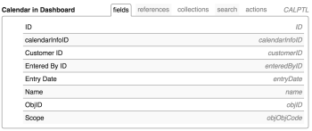

# API Explorer verwenden

Bei der Verwendung der Adobe Workfront Core API ist der API Explorer ein veraltetes Referenztool, das die Beziehungen zwischen unterstützten Ressourcen, Parametern und Variablen katalogisiert.

## Zugriff auf den API Explorer:

1. Navigieren Sie mithilfe eines Webbrowsers zum [API-Explorer](https://developer.adobe.com/workfront/api-explorer/)\
   

1. Wählen Sie oben rechts im API Explorer die gewünschteWorkfront aus. **API-Version**, standardmäßig wird die neueste Version automatisch ausgewählt.
1. Die **Filter** kann verwendet werden, um die Objekte nach Namen zu filtern und die Liste der Objekte entsprechend zu kürzen:

   

   * **Felder**: Verfügbare Felder innerhalb des angegebenen Objekts.
   * **Verweise**: Verfügbare Referenzvariablen für das angegebene Objekt. Ein Verweis ist ein Alias für eine Variable. Nach der Initialisierung kann eine Referenz synonym mit dem Variablennamen verwendet werden. Ein Verweis verwendet einen initialisierten Speicher.
   * **Sammlungen**: Verfügbare Sammlungen für das Objekt. Sammlungen sind Variablen, die eine Eins-zu-viele-Beziehung zwischen dem Objekt und der Ressource darstellen.
   * **Suche**: Verfügbare Suchressourcen für das Objekt. Die Suchergebnisse basieren auf den Abfrageparametern, die von der Suchressource in der API-Anfrage angegeben werden.
   * **Aktionen**: Unterstützte Aktionen für das -Objekt. Bei Aktionen kann es sich um einfache oder komplexe Verfahren handeln, die für eine Ressource oder einen Satz von Ressourcen ausgeführt werden. Eine bestimmte Aktion kann sich auch auf verwandte Ressourcen auswirken.

1. Öffnen Sie eine Registerkarte und klicken Sie dann auf die Objekt-ID , um die entsprechenden Variablen anzuzeigen.\
   \
   Je nach ausgewähltem Objekt können die folgenden Variablen angewendet werden:

   | Variable | Definition |
   |---|---|
   | Feldname | Der Name eines Felds, das in einem Vorgang innerhalb der Workfront-API verwendet wird. |
   | Feldtyp | Die Art von Werten, die in ein bestimmtes Feld in einer Datentabelle eingegeben werden können. Mögliche Feldtypwerte sind string, double, int, dateTime. |
   | Aufzählungstyp | Die Art von Werten, die zur Identifizierung eines Datentyps verwendet werden können. |
   | Mögliche Werte | Zulässige Werte für das Objekt. |
   | Attributtyp ObjCode | Attribute, die zum Ändern der Objektklasse verwendet werden können. |
   | URL | Der Einstiegspfad, über den Ihre App mit der Workfront-API kommunizieren kann. |
   | Argumente | Die Variablen des Objekts, die zwischen Ihrer Anwendung und Workfront übergeben werden können. |
   | Ergebnistyp | Zulässige Datentypen, die von einer Methode zurückgegeben werden können. |
